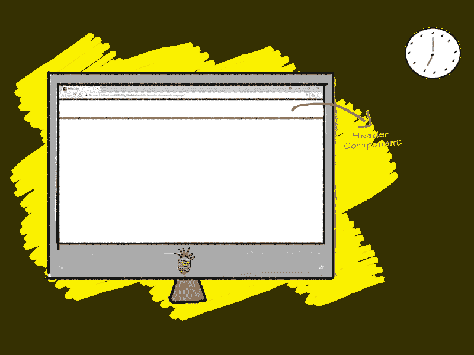
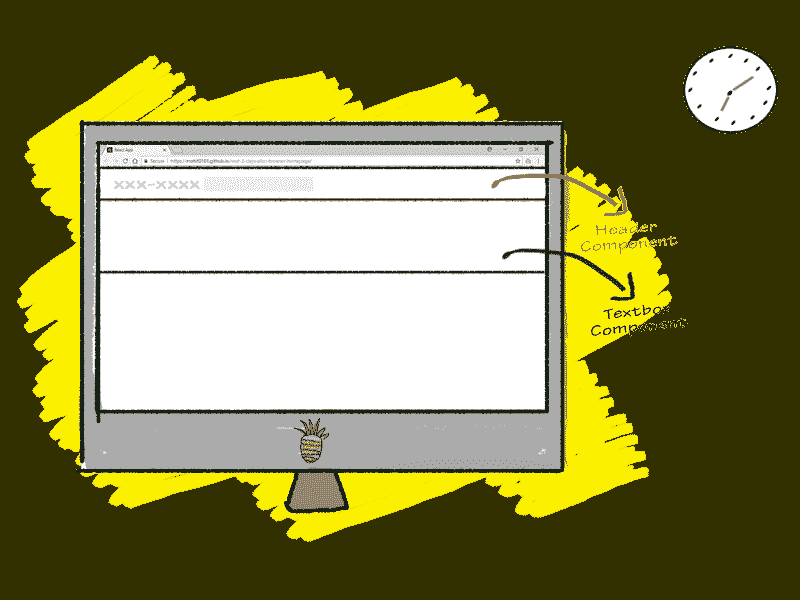
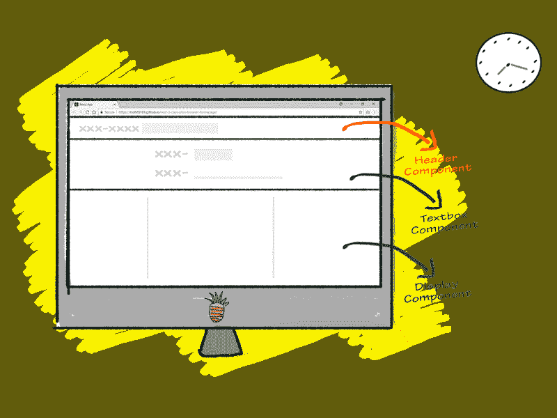

# 如何使用 React 提前三天计划

> 原文：<https://www.freecodecamp.org/news/how-you-can-plan-three-days-ahead-with-react-99ca0f8eb0f6/>

莫希特·贾恩

# 如何使用 React 提前三天计划


今天，我们将制作一个“待办事项”网站…有一些不同的功能。

你可以在这里查看我们将制作的现场演示。

对于前端，我们将使用 React.js. React.js 是一个基于组件的库，用于开发交互式用户界面(ui)。

对于后端和存储，我们将使用浏览器的本地存储。这让我们保存数据，以便下次打开我们的网站时，我们可以访问我们之前保存的数据。

#### 创建-反应-应用

我们开始吧。首先需要设置 Node(一个跨平台的 JavaScript 运行时环境)和 React。

你可以从 [node.js 网站](https://nodejs.org/en/)下载安装 Node。之后，打开终端和`cd`到你想要保存项目的目录。接下来，运行这两个命令:

```
npm install -g create-react-app
```

```
create-react-app next-3-days-planner
```

`npm install`是安装 npm 软件包的命令，`-g`标志有助于在我们的系统中全局安装软件包。

`create-react-app`将建立一个新的项目目录。它还负责 React 所需的所有东西，如 webpack、babel 和 JSX，这样初学者就不必为设置他们的初始项目而烦恼。

我将这个项目命名为`next-3-day-planner`，但是你可以随意命名。

在您喜欢的代码编辑器中打开项目目录。

#### 父组件

现在让我们制作我们的父组件。打开`App.js`文件并删除所有内容。添加以下代码片段:

在前两行中，我们导入了`React` 类，这有助于我们制作组件。我们还导入了`ReactDOM` ，这有助于将组件呈现到 DOM(文档对象模型)。

我们还导入了`Header`组件，它将用于显示网站的标题栏。

`Textbox`组件将包含输入部分，用户将在其中键入他们的“todo”项。

然后我们导入更多的子组件。这些是`DisplayToday`、`DisplayTomorrow`、`DisplayDayAfterTomorrow.`这三个组件帮助我们显示待办事项列表。

如果您看到一个错误，不要担心。我们还没有定义这些组件！

然后我们定义我们的`App`组件，这是我们的父组件。

该组件有一个将用于存储数据的状态。`‘Today’`键将用于存储今天应该完成的待办事项列表。这同样适用于`‘Tomorrow’`和`‘Day_After_Tomorrow’`键。

`updateEntry()`、`deleteEntry()`是用于向列表中添加项目和从列表中删除项目的两个功能。我们现在将定义它们。

#### 更新列表条目

`updateEntry()` 函数有两个参数。

`term` 是我们需要保存的新待办事项，`day` 是我们要添加待办事项的‘日子’。

我们有一个 if-else 块，它检查`day`的值并将该 todo 项添加到该特定数组中。

`this.state.Today`前的三个点`...`帮助我们用新值连接数组。

#### 删除条目

让我们编写删除函数的代码:

每当用户点击页面上的“删除项目”按钮时，就会触发`deleteEntry()`功能

`deleteEntry()`函数有两个参数。

`index`是数组中要删除的元素的索引位置。第二个参数是`day`、**、**，这是我们想要删除条目的日期。

为了实现从数组中删除条目的逻辑，我们将使用 JavaScript 的`filter()` 函数。

该函数遍历数组的每个元素，如果我们定义的逻辑符合 true，则返回该元素。

然后我们使用`setState()`方法更新`state`的值，默认情况下会重新呈现 DOM。

#### 渲染功能

让我们编写`App`组件的`render`函数。

这里我们提到了我们所有的子组件 *(* ，我们将在后面编码…)并给每个标签传递了一些属性。

`Header`得到一个属性`nam`，该属性指向`this.state.username`。这是我们在状态中定义的用户名。

`Textbox`获取属性`updateEntry`，该属性引用了我们上面定义的`this.updateEntry`函数。

不要忘记在`App.js`的末尾添加这一行，这样我们可以在浏览器屏幕上看到我们的输出:

```
export default App;
```

### 子组件

在`src`中创建一个新目录，并将其命名为`Components`。

接下来，在`Components`目录下创建三个名为`Display.js`、`Header.js`和`Textbox.js`的新文件。



### 标题组件

让我们从`src/Components/Header.js` 文件开始:

我们的标题很简单。它只显示我们作为属性传入的用户名。它使用`this.props.nam`访问属性。

你看到的怪异的`className`属性不过是 HTML 类属性。`className`是 JSX 特有的 HTML 类关键字。这些类名将帮助我们在 CSS 的帮助下设计我们的网站。



### 文本框组件

现在让我们编写`Textbox`组件的代码。这将显示一个表单，用户可以从下拉菜单中选择一天，并使用 HTML 输入字段将一个项目添加到当天的 todo 列表中。

打开`src/Component/Textbox.js`并编写以下代码:

`Textbox`组件类有一个状态对象。`term`将用于存储用户输入的条目，`day` 默认初始化为今天。但是，如果用户选择其他日期，如`Tomorrow`或`Day After Tomorrow`，其值可能会改变。

`render`函数呈现了一个有两个字段集的简单表单。

一个有 HTML `<sele` ct >标签，这样用户可以选择日期。

这个选择标签有一个与之相关联的`onChange`事件。每当选择新选项时，都会触发此事件。将调用`handleSelect`函数，它将更新组件状态中`day`的值。

我们还有另一个输入标签，用户可以输入他们想要完成的“待办事项”。这也有一个调用`handleChange`函数的`onChange`事件。这个函数将更新组件状态中`term`的值。

包装表单标签有一个`onSubmit`事件，当表单被提交时将被触发，它将调用`handleSubmit`函数。

`handleSubmit`函数调用`updateEntry`函数并传递`term`和`day`的值。现在`updateEntry`函数将在父组件的状态中添加`term`和`day`，并保存在那里。

`handleSubmit`函数还将`term`的值设置为空，以便保存下一个值。

注意:这里我们讨论的是两种状态。一个是 App 组件的`state`,我们将它视为我们的主状态。即使在我们关闭网站和服务器后，它的数据也将被永久保存。我们提到的另一个状态是特定组件的`state`。这是用来临时存储数据的。例如，这里文本框组件的`state`是一个临时状态。



### 显示组件

让我们编写显示组件的代码。

我们将显示逻辑分为三个组件，显示`Today`、`Tomorrow`和`Day_After_Tomorrow`状态对象的待办事项列表。

打开`src/Components/Display.js`并粘贴以下代码:

Display.js 文件包含三个具有相同代码的类。

让我们考虑一下`class DisplayToday`的解释:

请记住，在`render`函数内的`App`组件类中，当我们调用:

```
/* App.js file */
```

```
<DisplayToday items={this.state.Today} deleteItem={this.deleteEntry} />
```

…我们指的是 Display.js 文件的这个`DisplayToday`类。

我们传入了两个属性。`item`指向`App.js`文件状态中定义的`Today`数组，`deleteItem`指我们在`App.js`文件中写的`deleteEntry`函数。

文件`Display.js`中的`DisplayToday`类呈现了`DisplayToday`组件，并遍历我们在属性中传递的条目列表。

这一行执行遍历每个项目的任务:

```
this.props.items.map((item, index)=> return ( /* item here */ )) 
```

这里`item`是数组中的每一项，而`index`是该项在数组中的索引位置。

我们也有一个`<butt` on >标签，它有一个`as an o`click 事件监听器链接到一个本地的娱乐`ction remo` veThis。

当用户点击按钮时，触发`onClick` 事件，调用`removeThis`函数。这个函数接收数组中项的索引值作为参数，它调用`deleteEntry`函数，并将数组索引和数组名称作为参数传递。

```
removeThis(e){        this.props.deleteEntry(e, 'Today');  }
```

然后,`deleteEntry`函数将从数组中移除那个特定的索引位置。

你可以去上面看看我们在 App.js 文件中编码的`deleteEntry`函数。

`DisplayTomorrow`级和`DisplayDayAfterTomorrow`级的工作与`DisplayToday`级相同。

我们差不多完成了——现在让我们添加一些最后的润色。

#### CSS

对于 CSS，我决定使用 CSS 框架，而不是编码整个东西。

稍微搜索了一下，找到了 [Hack.css](https://github.com/egoist/hack) 。我真的很喜欢它的等宽字体和经典的“黑客”主题。

用项目设置 CSS 是一项非常简单的任务。只需运行以下命令:

```
npm install --save hack
```

在 App.js 文件的顶部添加这一行以及其他导入语句:

```
import 'hack';
```

如果你想添加一些自定义的 CSS 样式，创建一个名为`src/style.css`的新文件

在这个文件中编写您的 CSS，并将其与其他导入语句一起导入到顶部的`App.js`。

#### 储存；储备

我们来布置仓库。

我们将使用浏览器的本地存储作为我们网站的主要存储。

我们接下来要做的就是变魔术。

如果没有 [React Simple Storage](https://github.com/ryanjyost/react-simple-storage) ，将我们的网站与浏览器存储整合将不会如此容易。

只需在终端中运行以下命令:

```
npm install --save react-simple-storage
```

打开 App.js 文件，在文件顶部添加以下行:

```
import SimpleStorage from 'react-simple-storage'
```

现在，在您的应用程序组件类中，向下滚动到 render 函数，并在第一个`<d` iv >标记后添加这一行:

```
<SimpleStorage parent={this} />
```

瞧！现在，我们的数据将保存在浏览器中，当我们重新打开我们的网站时，将从浏览器中获取这些数据。

### 结果！

要查看我们完成了什么，请打开您的终端并键入:

```
npm start
```

现在在浏览器中，导航到`localhost:3000`。

我希望你喜欢这个！

几样东西作为作业给你补充…

*   代码验证功能。现在甚至一个空白条目也被更新，但我们的应用程序应该抛出一个错误，用户需要先写一些东西。
*   显示日期和时间
*   添加编辑用户名的选项

如果你在任何地方被卡住了，你可以去我的 [GitHub 页面](https://github.com/mohit23x)，在那里你会找到完整的代码。

如果你想每天使用这个网站来提高你的工作效率，你可以将[这个页面](https://mohit0101.github.io/next-3-days-plan-browser-homepage/)设置为你的浏览器主页(它增加了一些功能)。

…下次再见，伙计，编码快乐！