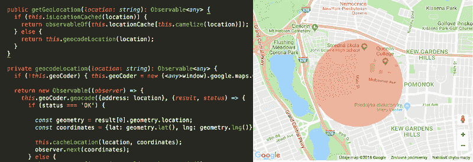
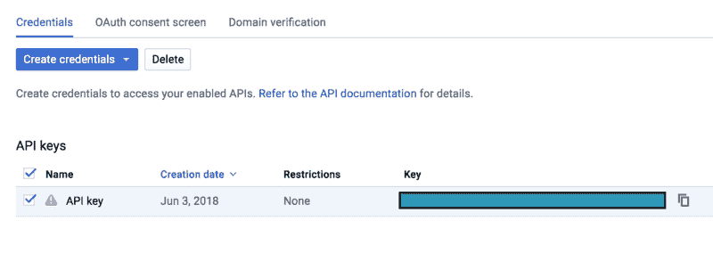
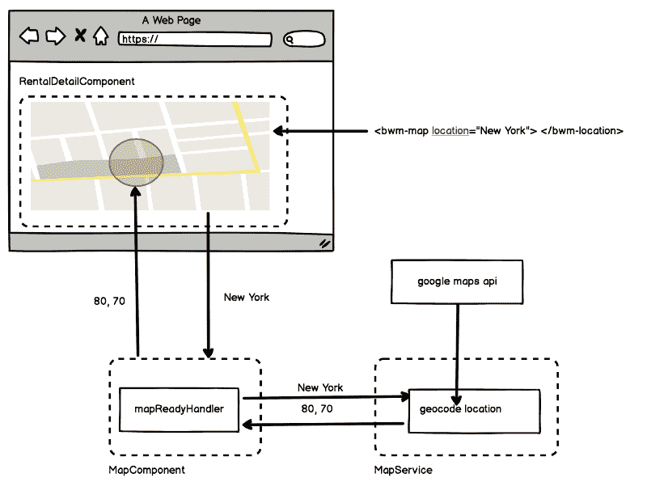

# 如何在 Angular 中使用地理编码复制 Airbnb 的位置区域显示

> 原文：<https://www.freecodecamp.org/news/how-you-can-replicate-airbnbs-location-area-display-using-geocoding-in-angular-2001794f86a9/>

菲利普·耶尔加

# 如何在 Angular 中使用地理编码复制 Airbnb 的位置区域显示

你想过将谷歌地图整合到你的项目中吗？你知道如何对一个地点进行地理编码吗？没那么难。只需要 20 分钟，几行代码，以及基本的编程知识。所以让我们来看看是怎么做的。

### 让我们从依赖项和 API 键开始

我们只需要安装[角度谷歌地图(AGM)](https://angular-maps.com/) 。互联网上有很多软件包为你提供“开箱即用”的谷歌地图组件。你选择哪一个取决于你的喜好。**我决定使用 AGM，因为它有很好的 API 文档和广泛的组件。**

现在是时候设置我们的 API 密钥了。没有 API 密匙的地图一点都不好玩！谷歌最近提出了一个有趣的想法。您需要提供您的帐单细节，以便设置您的项目并获得您的 API 密钥。别担心！你需要达到一定数量的请求，才能收取服务费。

**我们需要启用地图 JavaScript API (25，000 个免费每日请求)和地理编码 API (2，500 个免费每日请求)。**你也可以选择设定每日限额，这样你就不会超过限额。

**要获得您的 API 密钥，请遵循以下步骤:**

1.  进入[谷歌开发者控制台](https://console.developers.google.com/projectselector/apis/dashboard)。
2.  创建新项目
3.  转到库部分并启用**地图 JavaScript API** 和**地理编码 API**
4.  获取您的凭据(API 密钥)。然后庆祝:)

Let’s keep this open for little while. We need our API key in Angular.

### 开始编码吧！

预热您的机器，并在您选择的代码编辑器中打开您的项目，因为现在事情会变得严重。

让我们创建一个地图模块，这样我们就可以把所有的东西放在一起了。我们需要一个服务来处理显示地图的所有逻辑和组件。非常简单——只需在终端中键入: **ng g 组件图。**你也可以在我的 [GitHub 项目](https://github.com/Jerga99/bwm-ng)中查看我的文件夹结构和地图组件。

在与地图组件文件夹相同的文件夹中，创建 **map.module.ts** 。我们需要导入 **AgmCoreModule** ，并给它我们从谷歌得到的 API 密匙。**不要忘记在主 AppModule(或者任何你想显示地图的模块)中引用你的 MapModule！**

AGM 模块将为我们提供显示谷歌地图所需的所有组件和指令。它将处理谷歌地图 API 的负载，所以我们只需要专注于地理编码的位置。

### 我们需要服务

为了不让地理编码逻辑污染我们的地图组件，使用服务总是一种好的做法。在与地图相关的逻辑相同的文件夹中创建地图服务，并实现以下功能:

让我们来分解一下:

1.  我们从窗口对象中获取地理编码器，因为我在 AGM 包中没有找到抽象。地理编码器公开了对位置进行地理编码所需的功能。
2.  接下来我们将返回一个可观测值，因为为什么不呢？地理编码是异步的，在 Angular 中使用异步编码的最佳方式肯定是 observables。
3.  使用位置调用地理编码。过一会儿，当函数被解析时，我们的回调函数被调用，并带有一个结果和一个状态。
4.  检查状态，如果是 **OK** 我们就可以开始了。**地理编码成功，我们可以通过调用几何对象上的 lat 和 lng 函数来获得我们位置的坐标。**
5.  如果状态不好，就发出一个错误，掉一滴眼泪:(

这应该是我们的服务。没那么难，对吧？

### 继续租赁地图组件

让我们回到地图组件，用 AGM 地图填充模板。

以下是从年度股东大会官方文件中摘录的一些代码。我们指的是 agm-map 组件。这会在页面上显示谷歌地图，**但是别忘了设置 agm-map 的高度**，否则不会显示！去你的 SCSS 或者 CSS 文件写: **agm-map {height: 400px}** 。

为了在地图上显示一个位置，**我们需要向 agm-circle** (将在地图上显示该位置的圆形区域的组件)提供纬度和经度输入属性。**zoom 属性只会在地图上放大，所以位置更明显。您可以看到，只有当我们有纬度和经度时，我们才显示 agm-circle。其他要考虑的属性是圆的半径、颜色和不透明度。**

**agm-map 上最重要的是 mapReady eventEmitter。当加载了 Google Maps API 并且地图准备好显示位置时，该函数将发出一个事件。**这是我们调用地图服务和地理编码定位的最佳时机！**所以我们不要浪费时间，让我们在地图组件. ts 文件中创建 mapReadyHandler 函数。**

**在这里。 **MapReadyHandler 会调用 getGeoLocation，负责用位置的值调用我们的服务。**当位置被地理定位并从服务发出时，我们将在回调函数 subscribe 中获取坐标。**

**我们差不多完成了。现在，我们只需要设置一个 lat 和一个 lng，并调用 detectChanges，以确保我们的地图会根据显示的区域进行更新。**

### **拼图的最后一块**

**我们的地图组件完成了。现在我们只需要把它显示在屏幕上。您可以选择想要显示地图的父组件。在我的例子中，我想显示我的租赁位置的地图。参见下面的代码:**

****我正在租赁详情页面**中引用我的地图组件，并在其中提供位置输入属性。例如，它可能是:纽约，主要街道。**瞧！当我们导航到租赁的详细信息页面时，会显示带有位置的地图。****

### **概述**

**为了确保现在一切都很清楚，让我们从更大的角度来看:**

****

**我希望你现在明白这是如何工作的！如果您有任何问题，请随时联系我或发表评论。**

**现在你知道如何在 Angular 应用程序中集成谷歌地图了。这是它的一个非常简单的版本。如果你对更难的东西感兴趣，可以查看一下[我的 GitHub 项目库](https://github.com/Jerga99/bwm-ng/tree/master/src/app/common/map)。**

**关于已完成项目的全貌，可以在 Udemy 上看到我的课程:[完整的 Angular，React & Node | Airbnb 风格应用](http://bit.ly/2vs8jKM)。**

**编码快乐！**

**菲利普·耶尔加**