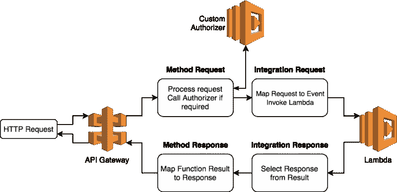
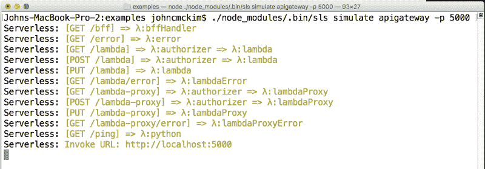
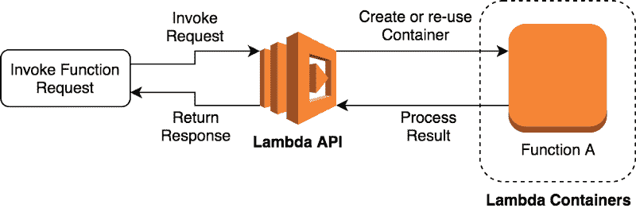
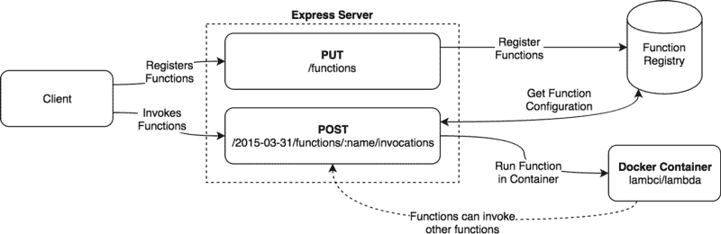
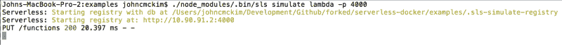
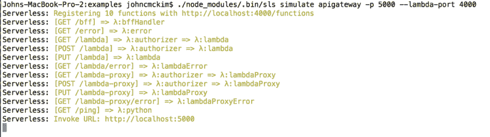

# 如何通过本地模拟 AWS Lambda 来加速无服务器开发

> 原文：<https://www.freecodecamp.org/news/how-you-can-speed-up-serverless-development-by-simulating-aws-lambda-locally-41c61a60fbae/>

作者约翰·麦克金

# 如何通过本地模拟 AWS Lambda 来加速无服务器开发


设计 AWS Lambda 函数可能是一次令人沮丧的经历。每次进行更改时，都必须先将代码部署到 AWS，然后才能进行测试。嗯，[我和我的朋友](https://twitter.com/gertjvr81)最终决定为此做点什么。

最终的结果是[无服务器模拟插件](https://github.com/gertjvr/serverless-plugin-simulate)。这个插件是一个用于无服务器框架的 AWS Lambda 和 API 网关模拟器。

我将向您介绍我们是如何构建它的，以及当您开发无服务器应用程序时，如何开始使用它。


### 模拟 API 网关

API Gateway 提供了 HTTP 端点，这些端点调用 Lambda 函数来响应请求。

API Gateway 将传入的 HTTP 请求映射到 Lambda 的事件有效负载。当 Lambda 函数返回一个结果时，该结果被映射到一个 HTTP 响应。



虽然 API Gateway 有很多特性，但大多数开发人员只使用了其中的一部分。我们选择只实现无服务器开发人员常用的特性。

#### HTTP 服务器

为了模拟 API 网关，插件创建了一个带有 [express](http://expressjs.com/) 的 HTTP 服务器。插件读取[无服务器配置文件](https://serverless.com/framework/docs/providers/aws/guide/serverless.yml/)，并从 [HTTP 事件](https://serverless.com/framework/docs/providers/aws/events/apigateway/)创建端点。

如果端点启用了 CORS，插件会将 [CORS 中间件](https://github.com/expressjs/cors)添加到端点。

#### 自定义授权人

API 网关可以以几种不同的方式授权端点。一种常见的方法是使用[定制授权者](https://aws.amazon.com/blogs/compute/introducing-custom-authorizers-in-amazon-api-gateway/)。

为了模拟定制授权者，我们创建了一个 express js 中间件函数。中间件使用来自请求的授权信息创建 Lambda 事件。然后在本地调用授权功能。

定制授权者基于[策略文档](http://docs.aws.amazon.com/apigateway/latest/developerguide/use-custom-authorizer.html)允许或拒绝请求。中间件读取授权者返回的策略文档。如果请求不被允许访问端点，中间件将返回一个未授权的响应。

#### λ积分

API Gateway 与 AWS Lambda 有两个集成。原来的[λ集成](http://docs.aws.amazon.com/apigateway/latest/developerguide/getting-started.html)和更新的[λ代理](https://aws.amazon.com/blogs/aws/api-gateway-update-new-features-simplify-api-development/)。

两种集成都将 HTTP 请求映射到 Lambda 事件。当 Lambda 返回结果时，集成会将结果映射到 HTTP 响应。

我们开发了两个模拟 Lambda 和 Lambda 代理的映射函数。服务器根据`[serverless.yml](https://serverless.com/framework/docs/providers/aws/guide/serverless.yml/)`中的 HTTP 事件配置选择集成。

当接收到请求时，服务器执行与 API 网关相同的映射过程。下面是代码的简化版本。

```
function(req, res) {  integration.event(req)    .then(event => lambda.invoke(context, event))    .then(result => integration.response(req, result))    .then(response => respond(res, response))}
```

最终结果是一个表现得像 API 网关的 express 服务器。


#### 使用 API 网关模拟器

要使用 API 网关模拟器，您需要将插件安装到您的无服务器项目中。请[阅读文档](https://github.com/gertjvr/serverless-docker)获取说明。

要启动 API 网关模拟器，请运行以下命令:

`sls simulate apigateway -p 5000`

这将启动一个 HTTP 服务器，您可以使用它在本地测试您的端点和功能。



Running the simulator on our example project

API 网关模拟类似于无服务器框架的其他离线插件。与[无服务器模拟](https://github.com/gertjvr/serverless-plugin-simulate)的真正区别在于我们如何本地模拟 Lambda。

### 模拟 AWS Lambda

AWS Lambda 由 HTTP API 提供支持。通过对 Lambda API 的 HTTP 请求来调用函数。

当调用 Invoke API 时，Lambda 服务在容器内运行您的代码。更多详情见[文档](http://docs.aws.amazon.com/lambda/latest/dg/lambda-introduction.html)。



虽然 AWS Lambda 是一个复杂的服务，但其核心元素相当容易模拟。为了在本地模拟它，我们实现了三个服务，函数运行时、函数注册表和 HTTP API。

#### 函数运行时

我们使用由[迈克尔·哈特](https://www.freecodecamp.org/news/how-you-can-speed-up-serverless-development-by-simulating-aws-lambda-locally-41c61a60fbae/undefined)创建的 [Docker 映像](https://hub.docker.com/r/lambci/lambda/~/dockerfile/)来创建函数运行时。使用 Docker 允许我们控制环境，并强制实施内存限制和超时。

#### 功能注册表

函数 Registry 是一个本地 JSON 数据库，由 [lowdb](https://github.com/typicode/lowdb) 提供支持。注册表存储关于函数配置和位置的信息。

这允许服务器在 API 收到请求时查找函数的细节。

#### HTTP API

HTTP API 为客户端提供了一个注册端点。插件使用注册端点来注册函数。

HTTP API 还提供了一个端点来调用函数。invoke 端点模仿 AWS Lambda API。这允许客户端使用 AWS SDK 来调用函数。



#### 为什么要使用 Lambda 模拟器

Lambda 模拟器允许您从其他服务本地调用 Lambda 函数。这可能在不同的无服务器服务中包含另一个 Lambda 函数。或者它可以包括完全不同的应用程序。

如果您正在链接 Lambda 函数或将现有应用程序迁移到 AWS Lambda，这将非常有用。

例如，这个函数在本地调用另一个 Lambda 函数。如果没有 Lambda 模拟器，第二个函数将在 AWS 中调用。

```
// If offline use the local registryconst endpoint = process.env.SERVERLESS_SIMULATE ?  process.env.SERVERLESS_SIMULATE_LAMBDA_ENDPOINT :  undefined
```

```
// configure the AWS SDK to use the local endpointconst lambda = new AWS.Lambda({ endpoint })
```

```
const handler = (event, context, callback) => {  const params = {    FunctionName: 'my-other-function',    Payload: JSON.stringify({ foo: 'bar' })  }
```

```
lambda.invoke(params, (err, result) => {    if (err) {      return callback(err)    }        callback(null, {      statusCode: 200,      body: result.Payload    })    })}
```

#### 使用 Lambda 模拟器

要使用 Lambda 模拟器，你需要将插件安装到你的无服务器项目中。请[阅读文档](https://github.com/gertjvr/serverless-docker)获取说明。

要启动 Lambda 模拟器，请运行以下命令:

`sls simulate lambda -p 4000`



Start the Lambda Simulator

要将 Lambda 模拟器与 API Gateway 一起使用，请运行带有`--lambda-port`参数的 API Gateway 命令。

`sls simulate apigateway -p 5000 --lambda-port`

当使用`--lambda-port`参数时，API 网关模拟器通过 HTTP API 调用函数。



Registered 10 functions with the Lambda Simulator

这允许您在部署到云之前在本地模拟复杂的架构。

### 与其他插件的比较

[无服务器离线](https://github.com/dherault/serverless-offline)是无服务器框架最流行的插件。不幸的是，无服务器离线的设计限制了模拟的质量。

这个插件模拟 API 网关，在插件过程中执行函数。这一决定的不利之处包括:

*   不支持 Python
*   它使用您正在运行的任何 NodeJS 版本，这可能与 AWS Lambda 的 NodeJS 版本不同
*   它不强制内存限制或超时
*   没有办法链接 Lambda 函数调用

我们设计了无服务器模拟来解决这些问题。

### 向前去建造

这个插件将帮助我和我的团队解决一个大问题。单元测试和本地执行减少了我们等待部署到云的时间。

无服务器框架和无服务器模拟都是开源项目。如果您想参与其中，您可以通过创建问题或提交拉动请求来提供帮助。

我希望它能帮助你在本地测试 Lambda 函数时节省时间。

如果你有任何关于这个项目或一般无服务器的问题，你可以联系我的媒体或 [Twitter](https://twitter.com/johncmckim) 。如果你想见我本人，我会在[的 ServerlessConf Austin](http://austin.serverlessconf.io/) 主持一个研讨会。