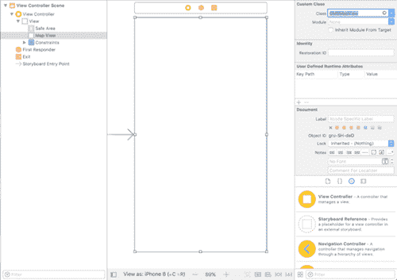
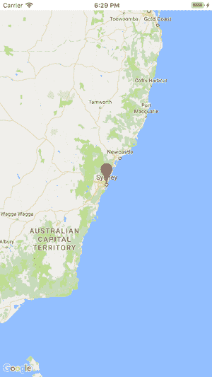
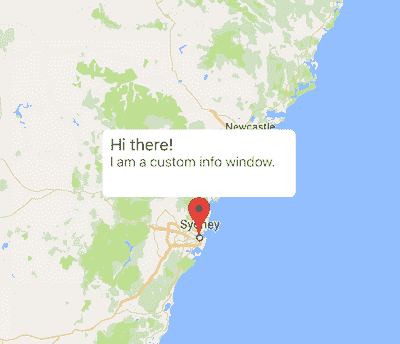
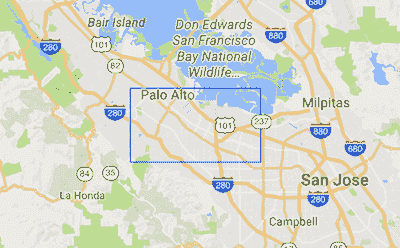
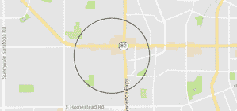
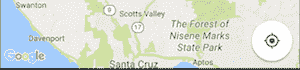

# 使用 Swift 4 在 iOS 上使用 Google Maps SDK 的终极指南

> 原文：<https://www.freecodecamp.org/news/how-you-can-use-the-google-maps-sdk-with-ios-using-swift-4-a9bba26d9c4d/>

作者德扬·阿塔纳索夫

# 使用 Swift 4 在 iOS 上使用 Google Maps SDK 的终极指南


Originally posted on [**theappspace.com**](http://theappspace.com/google-maps-sdk-ios-using-swift-4/)

许多 iOS 应用程序使用谷歌地图。这是一个非常常见的功能，所以我决定在 iOS 版谷歌地图 SDK 上准备一个终极指南。本教程涵盖了你可能需要知道的一切。

我希望我的读者会要求这些特性，这样我就可以扩展这篇文章。一切都将记录在这个帖子里！？

### 装置

在开始编码之前，我们必须先安装谷歌地图 iOS SDK。您可能更喜欢其他的依赖管理器，但是我会推荐 [CocoaPods](https://cocoapods.org/) 。

在项目根目录中创建一个 Podfile，并复制以下代码:

```
source 'https://github.com/CocoaPods/Specs.git'target 'YOUR_TARGET_NAME' do  pod 'GoogleMaps'end
```

你所需要做的就是用一个真实的值来改变你的目标名称字符串。保存文件并关闭它。打开终端，cd 到项目的根目录，然后键入`pod install`。你完了！？

### 获取 API 密钥

要使用谷歌地图 iOS SDK，您需要一个 API 密钥。要生成密钥，您需要访问 [Google API 控制台](https://console.developers.google.com/flows/enableapi?apiid=maps_ios_backend&reusekey=true)。
创建一个项目，并导航到“凭证”。

然后，点击“生成凭证”并选择 API 密钥。您需要提供您的项目包 id。密钥是由唯一的捆绑包 id 生成的，所以如果它被更改，谷歌地图服务**将无法工作**！

转到您的项目，在您的`AppDelegate.swift`类中添加`import GoogleMaps`。然后，将下面的代码复制到`application(_:didFinishLaunchingWithOptions:)`

```
GMSServices.provideAPIKey("YOUR_API_KEY")
```

### `Step 1 — Add a map`

我将开始向你展示如何设置地图和一个基本的标记。您将在这里看到的代码是在我写的时候并行测试的。

开始吧！？

访问您的 UIViewController(您需要在其中添加地图)。根据您需要的大小创建自定义 UIView。将`GMSMapView`类作为**自定义类**分配给 UIView(见下面的截图)。此外，不要忘记连接代表。



#### 最后，一些代码！

让我们回到 UIViewController 并编写一些代码。⌨️
️In 下面的片段，我已经添加了整个班级，这样你可以更好地了解正在发生的事情。

`GMSCameraPosition`告诉地图将哪个坐标作为中心点。要在地图上显示一个简单的标记，使用`showMarker()`功能。

在文件的末尾，添加一个扩展，它将“存储”我们需要的`GMSMapViewDelegate`方法。



### 步骤 2 —委托方法

我现在将向你介绍一些`GMSMapViewDelegate`方法和它们的威力。✊

#### GMSMarker 信息窗口

在 Google Maps 中，InfoWindow 是一个弹出窗口，提供给定位置的额外信息。当用户点击我们上面添加的标记时，它就会显示出来。

我们的信息窗口是可定制的。您可以将您自己的 UIView 附加上您需要的任何组件。

我写了一个示例实现。这假设在大多数情况下人们会使用自定义的信息窗口，

*   `didTapInfoWindowOf()`检测用户何时点击信息窗口。
*   将我们想要显示的自定义 UIView 添加到标记中。
*   `didLongPressInfoWindowOf()`检测长按信息窗口的时间。



#### 拖动 GMSMarker

GMSMapViewDelegate 中另一个有趣的特性是拖动标记的能力。这可以用最少的代码实现。

你所要做的就是打开“开关”，在上面创建的标记上调用`marker.isDragabble=true`。

要拖动标记，您需要长按。如果您需要在用户开始和结束拖动时得到通知，您可以实现这三个委托方法:

*   `didBeginDragging`通知一次——拖动开始时。
*   `didDrag`拖动标记时发出通知。
*   `didEndDragging`通知一次——拖动结束时。

#### GMS 标记位置

如果用户在地图上轻点的时候需要改变`GMSMarker`位置怎么办？嗯，`GMSMapViewDelegate`也提供了一个解决方案。单个委托方法可以截取点击区域的坐标(纬度和经度)。然后将它们的值赋给标记。

*   `didTapAt()`返回地图上点击区域的坐标

### 步骤 3-添加形状

谷歌地图 iOS SDK 使绘制形状变得简单。我将讲述如何用折线、多边形和圆形来绘画。

#### 多叉线

可以使用线条来构建形状。我们可以用‘折线’在谷歌地图上画线。帮助我们绘图的物体叫做`GMSPolyline`。

要创建一条折线，你需要使用`GMSMutablePath`创建一条路径。它需要两个或更多的点来开始创建路径。



如果你使用了上面的例子，你会得到一个矩形的形状，如图所示。

**其他一些有用的提示:**

*   要从地图中删除折线，调用`mapView.clear()`。
*   您可以使用`polyline.strokeColor=.black`改变线条的颜色。
*   通过调用`polyline.strokeWidth=3`改变线条的宽度。

#### 多边形

多边形几乎与折线相同。它使用相同的方法工作，只有一些小的不同。

例如，`GMSPolygon`会画一个形状。然后，您可以使用`fillColor`来填充绘制区域。下面是这种情况的一个例子。


#### 半径(圆)

我们要看的最后一个形状是一个圆形。这可能是最简单的形状，因为它总是一样的！

为了实现这一点，我们需要使用`GMSCircle`类。在这里，我们不是在走一条路。相反，我们使用一个坐标来指定圆的中心。我们还定义了一个半径(以米为单位)。



`GMSCircle`类包含与多边形相同的属性，包括`fillColor`、`strokeColor`和`strokeWidth`。

### 步骤 4 —属性和设置

这一部分将介绍一些在应用程序中使用谷歌地图时经常用到的属性和设置。让我们来看看它们。

#### 更改标记图标

`GMSMarker`包含两个不同的属性，用于改变标记图标。

*   在这种方法中，您传递一个图像文件名。这将替换默认设置。
*   您也可以添加自定义视图，而不是图像。这可用于更复杂的标记。例如，您可能想要添加一些动画或多个组件(而不是单个图像)。注意当调用`iconView`时,`icon`属性被覆盖。

#### 添加“我的位置”按钮

“我的位置”按钮出现在右下角。点击该按钮将使地图显示用户的当前位置。

要添加此功能，请设置`mapView.settings.myLocationButton = true`。按钮将会出现。



#### 缩放控件

iOS 版谷歌地图 SDK 不提供内置缩放控件(但 Android SDK 提供)。相反，您需要编写自己的逻辑。

你所需要做的就是添加两个带有“+”和“-”图标的按钮。当点击时，这些将调用`mapView.animate(toZoom: zoom)`。

#### 控制手势

您可以打开或关闭在地图上看到的任何手势。例如，您可能想要禁用缩放，或者关闭滚动。

您总共可以使用四种手势:

```
mapView.settings.scrollGestures = falsemapView.settings.zoomGestures   = falsemapView.settings.tiltGestures   = falsemapView.settings.rotateGestures = false
```

我希望你喜欢这个教程。如果你想了解更多关于 iOS 版谷歌地图 SDK 的内容，请给我写个评论。我很乐意根据您的要求扩展本教程。

#### 这就是本教程的内容，如果对你有帮助的话，可以吗？或者分享这个故事，让其他像你一样的人也能找到它。感谢您的关注！？


#### 查看我的最新项目:

[**⊙1 x2 投注-足球小贴士&赔率**](https://apple.co/2EIiDpI)
[*热门赔率每天，我们都会生成一份全球最热门赔率的榜单。这些是下降最多的赔率…*apple.co](https://apple.co/2EIiDpI)

#### 阅读更多我在媒体上的作品:

[**引入干净迅捷的架构(VIP)**](https://hackernoon.com/introducing-clean-swift-architecture-vip-770a639ad7bf)
[*忘记 MVC，现在！*hackernoon.com](https://hackernoon.com/introducing-clean-swift-architecture-vip-770a639ad7bf)[**你在 iOS 上使用谷歌地图 SDK 的终极指南，使用 Swift 4**](https://medium.freecodecamp.org/how-you-can-use-the-google-maps-sdk-with-ios-using-swift-4-a9bba26d9c4d)
[*很多 iOS 应用都使用谷歌地图。这是一个很常见的特性，所以我决定在…*medium.freecodecamp.org](https://medium.freecodecamp.org/how-you-can-use-the-google-maps-sdk-with-ios-using-swift-4-a9bba26d9c4d)[**SWIFT 上准备一个终极指南——用 XIB 文件**](https://medium.com/theappspace/swift-custom-uiview-with-xib-file-211bb8bbd6eb)
[*自定义 UIView 用 XIB 文件是 iOS 开发中很常见的做法。自定义 UIView 类不包含 XIB 文件…*medium.com](https://medium.com/theappspace/swift-custom-uiview-with-xib-file-211bb8bbd6eb)[**如何为您的 iOS 应用程序添加 Spotlight 支持**](https://hackernoon.com/how-to-add-spotlight-support-to-your-ios-app-4a89054aff89)
[*一个 Swift 教程，将使您的应用程序在 Spotlight 搜索中可用*hackernoon.com](https://hackernoon.com/how-to-add-spotlight-support-to-your-ios-app-4a89054aff89)[**核心数据关系**](https://hackernoon.com/core-data-relationships-d813ed66ba8c)
[*了解一对一和一对多关系*hackernoon.com](https://hackernoon.com/core-data-relationships-d813ed66ba8c)[**了解**](https://hackernoon.com/understanding-auto-layout-in-xcode-9-2719710f0706)

#### 订阅我的时事通讯: