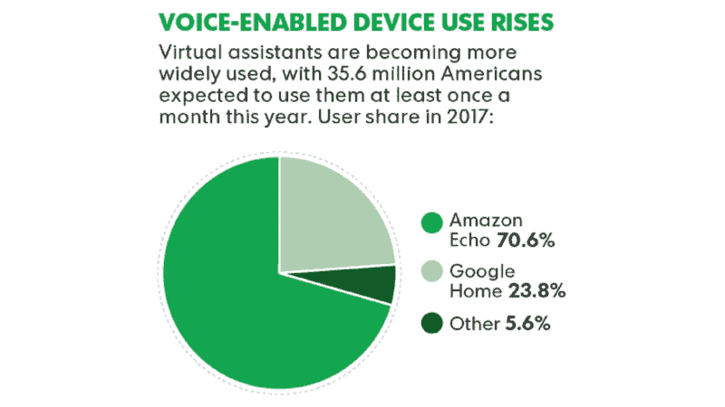
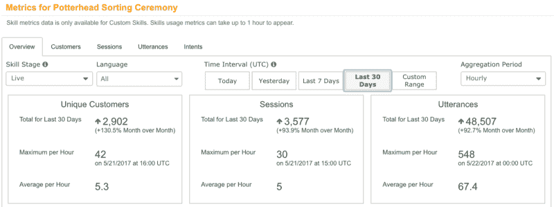

# 你的代码如何成为 3500 万家庭的社会公益之声

> 原文：<https://www.freecodecamp.org/news/how-your-code-can-be-the-voice-of-social-good-in-the-homes-of-35-million-people-a373a1e5c8ed/>

为社会公益编码是一个受欢迎的运动。它将技术进步转化为各地人民的社会进步。

> “技术让你以我和我的朋友们从未见过的方式看待问题，它让你以我们从未见过的方式给予帮助。你可以更快地开始反对不平等，无论是在你自己的社区还是在地球另一端的国家。”——比尔·盖茨，致 2017 届毕业生的信

像 [freeCodeCamp](https://www.freecodecamp.org/news/how-your-code-can-be-the-voice-of-social-good-in-the-homes-of-35-million-people-a373a1e5c8ed/undefined) 这样的组织正处于这场运动的前沿。该社区汇集了有抱负的软件开发人员来构建开源项目。他们对项目的编码贡献帮助非营利组织更有效地执行他们的任务。

每天，世界各地的程序员都在为解决社会问题和支持非营利组织、人权、全球扫盲、环境、教育工作者或有需要的个人做出重大贡献。

#### 大声说！

为了帮助技术专家和努力应对艰难挑战的社会组织走到一起，[一位云专家](https://www.freecodecamp.org/news/how-your-code-can-be-the-voice-of-social-good-in-the-homes-of-35-million-people-a373a1e5c8ed/undefined)发起了 [Alexa“大声说出来！”挑战](https://read.acloud.guru/build-an-alexa-skill-to-speak-up-for-a-social-cause-and-win-a-lifetime-subscription-59bf9fe58f05)。

“说出来的前提！”很简单——学习编写 Alexa 技能代码，影响更大的利益，激发变化。

Publish a skill by August 18th and enter the Alexa “Speak Up!” Challenge

#### 成为社会公益的代言人

这个挑战的灵感来自于我密友的女儿卡梅隆·加拉格尔。卡梅伦的梦想是在我们的社区创建一个 5 公里比赛，以提高对青少年抑郁症的认识。

她计划将她的比赛命名为 SpeakUp5k，让其他像她一样的青少年知道，说出他们的个人奋斗是可以的。

Cameron’s dream was to create a 5k race in her community to raise awareness of teenage depression

在她的 SpeakUp5k 发布之前，16 岁的卡梅伦在穿过半程马拉松的终点线后突然因未确诊的心脏病去世。

在她的最后一场比赛中，她看着挣扎在痉挛中的朋友说:“让我们结束这一切吧。“[CKG 基金会](http://www.ckgfoundation.org/camerons-story/)以她的名义传递了这一信息——这次挑战也是如此。

### 为什么是 Alexa？

语音辅助设备的用户群已经非常庞大，而且还在快速增长。到 2017 年，将有超过 3500 万美国人每月至少使用一次语音扬声器。凭借超过 70%的美国市场份额，亚马逊目前主导着语音扬声器市场。

Individuals of any age who use a voice-enabled speaker. Source: eMarketer, April 2017

到 2020 年底，高德纳公司预计 75%的美国家庭将拥有语音智能音箱。届时，Alexa 设备的安装基数预计将达到*1.28 亿用户。*

凭借庞大的用户群和针对编码人员的简单的 Alexa 技能工具包(ASK )( T1 ), Amazon Echo 为软件开发人员提供了一个强大的平台，用于将您的社会公益信息放大到全球数百万用户的家中。

### 让我们开始吧— Hello Word

设计、开发和发布一个 Alexa 技能真的非常容易——一个基本技能可以在一个小时内完成。

1.  一位云计算专家提供了一门免费的 Alexa 课程，将带你经历整个开发过程——从创建账户到发布技能。
2.  探索亚马逊的 [Alexa Github 模板库](https://github.com/alexa),寻找解释技能发展的基本构建模块和概念的简单指南。
3.  没有回音？没问题。EchoSim.io 是一个基于浏览器的界面，允许开发者测试他们的开发技能。

需要一些灵感…就说*“Alexa，给我灵感吧！”*

### 如何衡量你的代码是否成功？

对于任何处于早期开发阶段的产品，通过选择一个度量标准来衡量进展来保持关注是很重要的。*精益创业*运动提倡创业公司使用一个重要指标(OMTM)来跟踪客户影响。

> OMTM 的目的是跟踪对产品所做的改变对你的客户行为的可测量的影响。

对于参与“畅所欲言！”挑战，OMTM 是被你的社会公益活动所感动的客户数量。一旦你发布了一个 Alexa 技能，亚马逊开发者的控制台就会提供一个简单的界面来跟踪这个指标。

Metrics from my youngest daughter’s Harry Potter Alexa skill — Potterhead Sorting Ceremony

随着数百万家庭的倾听，你的每一次技能调用都有可能激发灵感，创造意识，并大规模地促进社会公益。

现在[亚马逊正在为顶级游戏技能的开发者提供激励](https://developer.amazon.com/public/solutions/alexa/rewards-for-skill-developers)，为社会公益创造一个有趣和有吸引力的 Alexa 技能也可以带来经济回报，为你的事业做出贡献。至少，你发表的技能会为你赢得一些[免费的 Alexa 奖品](https://developer.amazon.com/alexa-skills-kit/alexa-developer-skill-promotion)！

> "你必须成为你希望在这个世界上看到的变化."圣雄甘地

考虑参加 Alexa 畅所欲言！挑战——学习编写 Alexa 技能代码，影响更大的利益，并激发变化。

“让我们结束这一切吧！”

*感谢阅读！如果你喜欢你所读的，按住下面的**鼓掌按钮**，这样其他人也能发现。你可以在推特上关注我。*