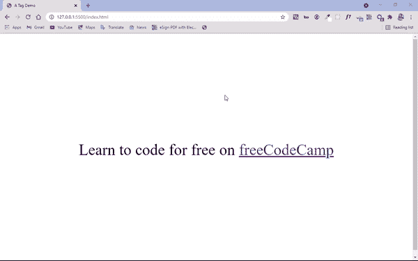
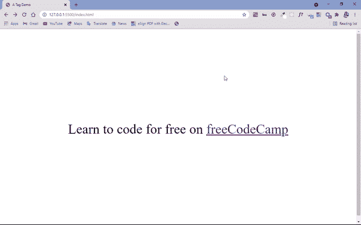
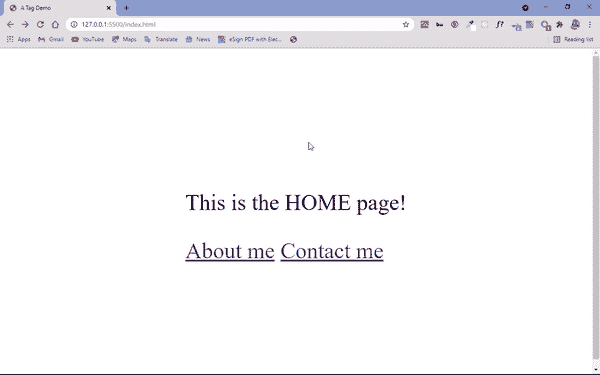
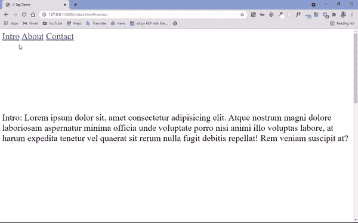
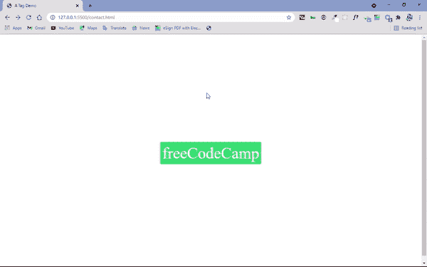

# HTML 

> 原文：<https://www.freecodecamp.org/news/html-a-tag-anchor-link-href-example/>

你可以使用 HTML 的`<a>`标签链接到一个网站的不同部分，另一个网页，或者一个完全独立的网站。

默认情况下，它带有下划线并带有蓝色，但是您可以用 CSS 覆盖这些样式默认值(很多人都这么做)。

不过，最重要的是，这个标签采用了`href`属性，在该属性中，您可以指定要链接到哪个网站、网页或同一网页的哪个部分。

除了 href 属性之外，`<a>`标签还带有目标属性。这会让您链接的页面或网站在另一个浏览器标签中打开。您只需要将目标属性的值设置为空。

## 基本 a href 标记语法

下面是`<a>`标签的基本语法:

```
<a href="https://www.freecodecamp.org/">freeCodeCamp</a> 
```

在本教程中，我们将研究如何链接到另一个网站，链接到同一网站上的另一个页面，以及链接到同一网页的特定部分——所有这些都使用`<a>`标签。

## 如何链接到另一个网站(外部链接)

我们已经简单地提到了`href`属性。这个属性的值告诉我们要链接到哪个网站。该值必须是绝对 URL，这意味着您必须指定网站的完整网址，例如`https://www.freeCodeCamp.org`。

```
<p>
   Learn to code for free on
   <a href="https://www.freecodecamp.org/">freeCodeCamp</a>
</p> 
```

```
 body {
     display: flex;
     align-items: center;
     justify-content: center;
     height: 100vh;
     font-size: 3rem;
     } 
```



如果你正在处理外部链接，最好在一个单独的标签页中打开它们，这样用户就不必来回点击来浏览原始站点中的链接。这有助于提供更愉快的用户体验。

```
 <p>
      Learn to code for free on
      <a href="https://www.freecodecamp.org/" target="_blank">freeCodeCamp</a>
 </p> 
```



## 如何链接到同一网站上的页面

当你链接到同一个网站上的一个页面时，分配给`href`属性的值就是区别所在。

因此，您将使用相对 URL，而不是指定绝对 URL。例如，您将使用`contact.html`而不是`https://www.freeCodeCamp.org`。

您可以在下面看到如何链接到同一网站上的页面:



执行此操作的代码如下所示:

要链接到主页:

```
<div>
   <p>This is the HOME page!</p>
   <a href="about.html">About me</a>
   <a href="contact.html">Contact me</a>
</div> 
```

```
body {
     display: flex;
     align-items: center;
     justify-content: center;
     height: 100vh;
     font-size: 3rem;
     } 
```

要链接到联系人页面:

```
<div>
  <p>This is the CONTACT page!</p>
</div> 
```

```
body {
     display: flex;
     align-items: center;
     justify-content: center;
     height: 100vh;
     font-size: 3rem;
     } 
```

要链接到“关于”页面:

```
<div>
      <p>This is the ABOUT page!</p>
</div> 
```

```
body {
    display: flex;
    align-items: center;
    justify-content: center;
    height: 100vh;
    font-size: 3rem;
    } 
```

## 如何链接到网页的特定部分

您可以使用`<a>`标签及其`href`属性，结合`id`属性链接到同一网页上的特定部分。

几乎每个 HTML 元素都有 id 属性。因此，当您确定想要链接的网页部分时，为其分配一个 id，然后将其作为一个值传递给`href`属性，前面带有数字符号(#)。

下面的代码片段演示了如何链接到同一网页上的特定部分:

```
<a href="#intro">Intro</a>
<a href="#about">About</a>
<a href="#contact">Contact</a>
<p id="intro">
      Intro: Lorem ipsum dolor sit, amet consectetur adipisicing elit. Atque
      nostrum magni dolore laboriosam aspernatur minima officia unde voluptate
      porro nisi animi illo voluptas labore, at harum expedita tenetur vel
      quaerat sit rerum nulla fugit debitis repellat! Rem veniam suscipit at?
</p>

<p id="about">
      About me: Lorem ipsum dolor sit amet consectetur adipisicing elit. Debitis
      quos nesciunt nemo dignissimos quisquam quasi harum, vero illum, ducimus
      similique placeat ut rerum hic non aliquid itaque dolores expedita libero
      consequuntur sit rem quod officia? Fugiat explicabo natus optio dolorem?
</p>

<p id="contact">
      Contact me: Lorem ipsum dolor sit amet consectetur adipisicing elit.
      Debitis quos nesciunt nemo dignissimos quisquam quasi harum, vero illum,
      ducimus similique placeat ut rerum hic non aliquid itaque dolores expedita
      libero consequuntur sit rem quod officia? Fugiat explicabo natus optio
      dolorem?
 </p> 
```



## 如何制作带有`<a>`标签的按钮

使用`<a>`标签来制作按钮，然后用 CSS 来设计它们的样式，这是很常见的。

通常使用按钮的输入类型(`<input type=”button”>`)和按钮元素`<button>…</button>`来完成这项工作。但是您可能需要添加一些 JavaScript 来让它们做您想让它们做的事情。

使用`<a>`标签，您可以简单地指定您想要链接到哪里作为`href`值。

```
<a class="btn" href="https://www.freecodecamp.org">freeCodeCamp</a> 
```

```
 body {
    display: flex;
    align-items: center;
    justify-content: center;
    height: 100vh;
    font-size: 3rem;
}

.btn {
    background-color: #2ecc71;
    border: 1px solid white;
    border-radius: 5px;
    text-decoration: none;
    color: white;
    padding: 6px;
}

.btn:hover {
      background-color: #0fa84f;
} 
```

上面的代码是做什么的？

我们将`btn`(按钮的)类属性附加到`<a>`标签上，这样我们就可以对它进行样式化。通过指定的类定位标签，我们为它设置绿色背景，1px 宽度的边框，纯色，白色和设置为 5px 的`border-radius`,这样我们可以有一个稍微圆的边框。

为了移除分配给`<a>`标签的默认下划线，我们设置了一个文本装饰器 none。我们还设置了 6px 的填充，以增加文本和边框之间的间距。

使用 CSS 提供的`:hover`伪类，我们能够在用户将鼠标悬停在按钮上时指定背景颜色的轻微变化。

最终，我们有了下面的结果:



## 结论

我希望这篇教程能帮助你搞清楚你能用`<a>`标签做的所有事情，这样你就可以开始在你的网站上好好利用它了。

感谢阅读，继续编码。