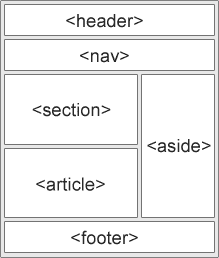

# 最好的 HTML 例子和 HTML5 例子

> 原文：<https://www.freecodecamp.org/news/html-and-html5-example/>

HTML 提供了网站的结构。这里有一些如何使用 HTML 语法来构建网站的例子，包括一些较新的 HTML5 特性的例子。

## **A Href 属性示例**

`<a href>`属性指的是由链接提供的目的地。没有了`<href>`属性，`a`(锚)标签就死了。有时在你的工作流程中，你不想要一个实时链接，或者你还不知道链接的目的地。在这种情况下，将`href`属性设置为`"#"`可以创建一个死链接。`href`属性可用于链接到本地文件或互联网上的文件。

例如:

```
<html>
  <head>
    <title>Href Attribute Example</title>
  </head>
  <body>
    <h1>Href Attribute Example</h1>
    <p>
      <a href="https://www.freecodecamp.org/contribute/">The freeCodeCamp Contribution Page</a> shows you how and where you can contribute to freeCodeCamp's community and growth.
    </p>
  </body>
</html>
```

所有浏览器都支持`<a href>`属性。

#### **更多属性:**

`hreflang`:指定链接资源的语言。`target`:指定将在其中打开链接资源的上下文。`title`:定义链接的标题，作为工具提示显示给用户。

### **例题**

```
<a href="#">This is a dead link</a>
<a href="https://www.freecodecamp.org">This is a live link to freeCodeCamp</a>
<a href="https://html.com/attributes/a-href/">more with a href attribute</a>
```

### **页面内锚点**

也可以在页面的某个地方设置一个锚点。要做到这一点，你应该首先在页面上的位置放置一个标签

```
<a name="top"></a>
```

标签之间不需要任何描述。之后，你可以在同一个页面的任何地方放置一个指向这个锚的链接。要做到这一点，你应该使用带有必要属性“href”的标签，带有符号# (sharp)和锚的关键字描述，就像这样:

```
<a href="#top">Go to Top</a>
```

### ****图片链接****

`<a href="#">`也可以应用于图像和其他 HTML 元素。

### ****例如****

```
<a href="#">
  
</a>
```

### ****例如****


### 目标示例

`<a target>`属性指定在`a`(锚)标签中打开链接文档的位置。

**例子:**

值为“_blank”的目标属性会在新窗口或选项卡中打开链接的文档。

```
<a href="https://www.freecodecamp.org/" target="_blank">freeCodeCamp</a>
```

值为“_self”的目标属性会在单击链接的文档时在同一框架中打开该文档(这是默认设置，通常不需要指定)。

```
<a href="https://www.freecodecamp.org/" target="_self">freeCodeCamp</a>
```

```
<a href="https://www.freecodecamp.org/">freeCodeCamp</a>
```

值为“_parent”的目标属性在父框架中打开链接的文档。

```
<a href="https://www.freecodecamp.org/" target="_parent">freeCodeCamp</a>
```

值为“_top”的目标属性在整个窗口体中打开链接的文档。

```
<a href="https://www.freecodecamp.org/" target="_top">freeCodeCamp</a>
```

值为*“frame name”*的目标属性在指定的命名框架中打开链接的文档。

```
<a href="https://www.freecodecamp.org/" target="framename">freeCodeCamp</a>
```

## **身体背景属性示例**

如果您想添加背景图像而不是颜色，一个解决方案是使用`<body background>`属性。它为 HTML 文档指定了背景图像。

语法:

`<body background="URL">`

属性:

`background - URL for background image`

示例:

```
<html>
  <body background="https://assets.digitalocean.com/blog/static/hacktoberfest-is-back/hero.png">
  </body>
</html>
```

## **身体背景属性贬值**

HTML5 中不赞成使用 body-background 属性。样式化`<body>`标签的正确方法是使用 CSS。

有几个 CSS 属性用于设置元素的背景。这些可以用来设置整个页面的背景。

## **正文 Bgcolor 属性示例**

属性为一个 HTML 文档分配一个背景颜色。

****语法**** :

`<body bgcolor="color">`颜色值可以是颜色名称(如，`purple`)或十六进制值(如，`#af0000`)。

要给网页添加背景色，你可以使用`<body bgcolor="######">`属性。它指定 HTML 文档显示的颜色。

****例如:****

```
<html>
  <head>
    <title>Body bgcolor Attribute example</title>
  </head>
  <body bgcolor="#afafaf">
    <h1>This webpage has colored background.</h1>
  </body>
</html>
```

您可以通过用十六进制值替换######来更改颜色。对于简单的颜色，你也可以使用这个词，如“红色”或“黑色”。

所有主流浏览器都支持`<body bgcolor>`属性。

*注:*

*   HTML 5 不支持`<body bgcolor>`属性。为此使用 CSS。怎么会？通过使用下面的代码:`<body style="background-color: color">`当然，你也可以在一个单独的文档中而不是一个内联方法中完成。
*   不要在`<body bgcolor>`属性中使用 RGB 值，因为`rgb()`仅用于 CSS，也就是说，它在 HTML 中不起作用。

## **Div Align 属性示例**

属性用于将 div 标签中的文本左对齐、右对齐、居中对齐或两端对齐。

例如:

```
<html>
  <head>
    <title>Div Align Attribbute</title>
  </head>
  <body>
    <div align="left">
      Lorem ipsum dolor sit amet, consectetur adipiscing elit, sed do eiusmod tempor incididunt ut
      labore et dolore magna aliqua.
    </div>
    <div align="right">
      Lorem ipsum dolor sit amet, consectetur adipiscing elit, sed do eiusmod tempor incididunt ut
      labore et dolore magna aliqua.
    </div>
    <div align="center">
      Lorem ipsum dolor sit amet, consectetur adipiscing elit, sed do eiusmod tempor incididunt ut
      labore et dolore magna aliqua.
    </div>
    <div align="justify">
      Lorem ipsum dolor sit amet, consectetur adipiscing elit, sed do eiusmod tempor incididunt ut
      labore et dolore magna aliqua.
    </div>
  </body>
</html> 
```

## **重要！**

html5 中不再支持该属性。css 是正确的选择。

Div Align 属性可用于水平对齐 Div 中的内容。在下面的例子中，文本将在 div 中居中。

```
<div align="center">
  This Text Will Be Centered
</div>
```

* * html 5 不支持此属性，应使用 [CSS 文本对齐](https://github.com/freeCodeCamp/guides/blob/f50b7370be514b2a03ee707cd0f0febe2bb713ae/src/pages/css/text-align/index.md)

## **字体颜色属性示例**

该属性用于为包含在`<font>`标签中的文本设置颜色。

### 重要事项:

HTML5 不支持此属性。相反，这篇 [freeCodeCamp 文章](https://guide.freecodecamp.org/css/colors)指定了一个 CSS 方法，可以使用。

### 注意:

也可以使用“十六进制代码”或“rgb 代码”来指定颜色，而不是使用名称。

### 示例:

1.  颜色名称属性

```
<html>
  <body>
    <font color="green">Font color example using color attribute</font>
  </body>
</html> 
```

十六进制代码属性

```
<html>
  <body>
    <font color="#00FF00">Font color example using color attribute</font>
  </body>
</html> 
```

RGB 属性

```
<html>
  <body>
    <font color="rgb(0,255,0)">Font color example using color attribute</font>
  </body>
</html> 
```

## **字体大小属性示例**

该属性将字体大小指定为数值或相对值。数值范围从`1`到`7`，其中`1`最小，`3`为默认值。也可以使用一个相对值来定义它，比如`+2`或`-3`，相对于`<basefont>`元素的 size 属性值来设置它，或者相对于`3`，默认值，如果不存在的话。

语法:

`<font size="number">`

示例:

```
<html>
  <body>
    <font size="6">This is some text!</font>
  </body>
</html>
```

注意:`The size attribute of <font> is not supported in HTML5\. Use CSS instead.`

## **Img Align 属性示例**

图像的 align 属性根据周围的元素指定图像的对齐位置。

属性值:
右对齐图像到右侧左对齐图像到左侧
顶部对齐图像到顶部
底部对齐图像到底部
中间对齐图像到中间

例如:

```
<!DOCTYPE html>
<html lang="en">
  <head>
    <title>Img Align Attribute</title>
  </head>
  <body>
    <p>
      This is an example.  More text right here
      
    </p>
  </body>
</html> 
```

如果我们愿意，我们也可以右对齐:

```
<p>This is another example</p> 
```

****请注意 HTML5 不支持 align 属性，应该使用 CSS 来代替。然而，它仍然受到所有主流浏览器的支持。****

## **Img 宽度属性**

HTML 的“宽度”属性指的是图像的宽度。引用中的值是像素的数量。

例如，如果您已经有一个通过`src`属性设置的图像链接，您可以像这样添加宽度属性:

```
<!DOCTYPE html>
<html lang="en">
  <head>
    <title>Img Width Attribute</title>
  </head>
  <body>
    
  </body>
</html> 
```

在上面的代码片段中，有一个图像标签，图像的宽度设置为 100 像素。`width="100"`

## **Img Src 属性示例**

``属性指的是您想要显示的图像的来源。标签不会显示没有 T2 属性的图像。但是，如果将源设置为图像的位置，则可以显示任何图像。

在`https://avatars0.githubusercontent.com/u/9892522?v=4&s=400`有一个 freeCodeCamp 徽标的图像

您可以使用`src`属性将其设置为图像。

```
<html>
  <head>
    <title>Img Src Attribute Example</title>
  </head>
  <body>
    
  </body>
</html> 
```

上面的代码显示如下:


所有浏览器都支持`src`属性。

您也可以将本地托管的文件作为您的映像。

例如，如果你有一个名为`images`的文件夹，里面有`freeCodeCamp.jpeg`，只要“图像”文件夹和`index.html`文件在同一个位置，``就可以工作。

`../files/index.html`

`..files/images/freeCodeCamp.jpeg`

# **HTML 实体示例**

## **概述**

### **什么是 HTML 实体？**

HTML 实体是用于替换 HTML 中的保留字符或键盘上没有出现的字符的字符。HTML 中保留了一些字符。如果你在文本中使用小于()符号，浏览器可能会将它们与标签混淆。

### 它们是用来做什么的？

如前所述，使用 HTML 实体是为了替换 HTML 保留的保留字符。

### 你如何使用它们？

字符实体看起来像这样:

```
<!-- format &[entity_name]; -->
<!-- example for a less-than sign (<) -->
&lt;
```

或者

```
<!-- &#[entity_number]; -->
<!-- example for a less-than sign (<) -->
&#60;
```

## **参考指南**

这绝不是一个详尽的列表，但如果下面的链接不能满足您的需求，下面的链接将能够为您提供更多的实体。快乐编码:蝴蝶结:

```
Character	Entity Name	Entity Number	Description
&#32;	Space
!		&#33;	Exclamation mark
”		&#34;	Quotation mark
#		&#35;	Number sign
$		&#36;	Dollar sign
¢	&cent;	&#162;	Cent sign
€	&euro;	&#8364;	Euro sign
£	&pound;	&#163;	GBP sign
¥	&yen;	&#165;	Yen sign
%		&#37;	Percent sign
&	&amp;	&#38;	Ampersand
’		&#39;	Apostrophe
(		&#40;	Opening/Left Parenthesis
)		&#41;	Closing/Right Parenthesis
*		&#42;	Asterisk
+		&#43;	Plus sign
,		&#44;	Comma
-		&#45;	Hyphen
.		&#46;	Period
/		&#47;	Slash
©	&copy;	&#169;	Copyright
®	&reg;	&#174;	Registered Trademark
”	&quot;	&#34;	double quotation mark
>	&gt;	&#62;	Greater-than sign
<	&lt;	&#60;	Less-than sign
•	&bull;	&#8226	Bullet point
```

## **HTML 表单示例**

基本上，表单用于收集用户输入的数据，然后将这些数据发送到服务器进行进一步处理。它们可以用于不同类型的用户输入，如姓名、电子邮件等。

表单包含包裹在`<form></form>`标签周围的控制元素，如`input`，它可以有如下类型:

*   `text`
*   `email`
*   `password`
*   `checkbox`
*   `radio`
*   `submit`
*   `range`
*   `search`
*   `date`
*   `time`
*   `week`
*   `color`
*   `datalist`

代码示例:

```
<form>
  <label for="username">Username:</label>
  <input type="text" name="username" id="username" />
  <label for="password">Password:</label>
  <input type="password" name="password" id="password" />
  <input type="radio" name="gender" value="male" />Male<br />
  <input type="radio" name="gender" value="female" />Female<br />
  <input type="radio" name="gender" value="other" />Other
  <input list="Options" />
  <datalist id="Options">
    <option value="Option1"></option>
    <option value="Option2"></option>
    <option value="Option3"></option>
  </datalist>

  <input type="submit" value="Submit" />
  <input type="color" />
  <input type="checkbox" name="correct" value="correct" />Correct
</form> 
```

形成的其他元素可以包含:

*   是一个多行框，最常用于添加一些文本，如注释。textarea 的大小由行数和列数定义。
*   `select` -与`<option></option>`标签一起创建下拉选择菜单。
*   按钮元素可以用来定义一个可点击的按钮。

关于 HTML 表单的更多信息。

当您想从站点访问者那里收集一些数据时，HTML 表单是必需的。例如，在用户注册期间，您希望收集姓名、电子邮件地址、信用卡等信息。

一个表格将从网站访问者的输入，然后将它张贴到后端应用程序，如 CGI，ASP 脚本或 PHP 脚本等。后端应用程序将根据应用程序内部定义的业务逻辑对传递的数据执行所需的处理。

有各种各样的表单元素可用，如文本字段、文本区域字段、下拉菜单、单选按钮、复选框等。

HTML `<form>`标签用于创建一个 HTML 表单，其语法如下

```
<form action="Script URL" method="GET|POST">form elements like input, textarea etc.</form> 
```

如果没有定义表单方法，那么它将默认为“GET”。

表单标签还可以有一个名为“target”的属性，它指定链接将在哪里打开。它可以在浏览器选项卡、框架或当前窗口中打开。

action 属性定义提交表单时要执行的操作。通常，当用户单击提交按钮时，表单数据被发送到脚本 URL 上的网页。如果省略 action 属性，该操作将设置为当前页面。

## **HTML5 音频示例**

在 HTML5 之前，音频文件必须在浏览器中使用像 Adobe Flash 这样的插件来播放。HTML

下面的代码片段添加了一个文件名为`tutorial.ogg`或`tutorial.mp3`的音频文件。元素表示可供浏览器选择的音频文件。浏览器将使用第一个识别的格式。

#### **例 1**

```
<audio controls>
  <source src="tutorial.ogg" type="audio/ogg" />
  <source src="tutorial.mp3" type="audio/mpeg" />
  Your browser does not support the audio element.
</audio> 
```

#### **例 2**

```
<audio src="https://s3.amazonaws.com/freecodecamp/simonSound1.mp3" controls loop autoplay></audio> 
```

`controls`属性包括音频控制，如播放、暂停和音量。如果不使用该属性，则不会显示任何控件。

元素使你能够指出可供浏览器选择的音频文件。浏览器将使用第一种识别格式。标签`<audio>`和`</audio>`之间的文本可能会在不支持 HTML5 `<audio>`元素的浏览器中显示。

自动播放属性将自动在后台播放您的音频文件。让访问者选择播放音频被认为是更好的做法。

preload 属性指示如果播放器没有设置为自动播放，浏览器应该做什么。

如果提到的话，循环属性将连续循环播放你的音频文件

因为这是 html5，一些浏览器不支持它。你可以在[https://caniuse.com/#search=audio](https://caniuse.com/#search=audio)查看

## **HTML5 语义元素示例**

语义 HTML 元素以人类和机器可读的方式清楚地描述了它的含义。像`<header>`、`<footer>`和`<article>`这样的元素都被认为是语义性的，因为它们准确地描述了元素的用途和其中的内容类型。

### **快速历史**

HTML 最初是作为一种标记语言创建的，用来描述早期互联网上的文档。随着互联网的发展和被越来越多的人采用，它的需求也发生了变化。互联网最初是用来分享科学文献的，现在人们也想分享其他东西。很快，人们开始想让网络看起来更漂亮。因为 web 最初并不是为设计而构建的，所以程序员使用不同的技巧以不同的方式来布局。程序员不用`<table></table>`来描述表格信息，而是用它们来定位页面上的其他元素。随着可视化设计布局的使用，程序员开始使用通用的“非语义”标签，如`<div>`。他们通常会给这些元素一个`class`或`id`属性来描述它们的用途。例如，这通常被写成`<div class="header">`，而不是`<header>`。由于 HTML5 仍然相对较新，这种非语义元素的使用在今天的网站上仍然很常见。

#### **新语义元素列表**

HTML5 中添加的语义元素有:

*   `<article>`
*   `<aside>`
*   `<details>`
*   `<figcaption>`
*   `<figure>`
*   `<footer>`
*   `<header>`
*   `<main>`
*   `<mark>`
*   `<nav>`
*   `<section>`
*   `<summary>`
*   `<time>`

诸如`<header>`、`<nav>`、`<section>`、`<article>`、`<aside>`和`<footer>`等元素的行为或多或少类似于`<div>`元素。它们将其他元素组合成页面部分。然而，如果一个`<div>`标签可以包含任何类型的信息，那么很容易识别哪种类型的信息会进入语义`<header>`区域。

****w3schools 的语义元素布局示例****



### **语义元素的好处**

为了了解语义元素的好处，这里有两段 HTML 代码。第一块代码使用了语义元素:

```
<header></header>
<section>
  <article>
    <figure>
      
      <figcaption></figcaption>
    </figure>
  </article>
</section>
<footer></footer> 
```

而第二个代码块使用了非语义元素:

```
<div id="header"></div>
<div class="section">
  <div class="article">
    <div class="figure">
      
      <div class="figcaption"></div>
    </div>
  </div>
</div>
<div id="footer"></div> 
```

首先， ****更容易读成**** 。这可能是您在查看第一个使用语义元素的代码块时注意到的第一件事。这是一个小例子，但是作为一个程序员，你可以阅读成百上千行代码。代码越容易阅读和理解，您的工作就越容易。

它有 ****更大的可达性**** 。你不是唯一一个发现语义元素更容易理解的人。搜索引擎和辅助技术(如为有视力障碍的用户提供的屏幕阅读器)也能够更好地理解网站的上下文和内容，这意味着为用户提供更好的体验。

总体来说，语义元素也导致更多的 ****一致码**** 。当使用非语义元素创建一个头时，不同的程序员可能会把它写成`<div class="header">`、`<div id="header">`、`<div class="head">`，或者简称为`<div>`。创建 header 元素的方法有很多种，它们都取决于程序员的个人偏好。通过创建一个标准的语义元素，它使每个人都更容易。

自 2014 年 10 月以来，HTML4 升级到了 HTML5，并加入了一些新的“语义”元素。直到今天，我们中的一些人可能仍然困惑，为什么这么多不同的元素似乎没有显示出任何重大变化。

#### **`<section>`和`<article>`**

“有什么区别？”，你可能会问。这两个元素都用于对内容进行分段，是的，它们肯定可以互换使用。这是在什么情况下的问题。HTML4 只提供了一种容器元素，那就是`<div>`。虽然这仍然在 HTML5 中使用，但 HTML5 在某种程度上为我们提供了`<section>`和`<article>`来替代`<div>`。

`<section>`和`<article>`元素在概念上是相似的，可以互换。要决定您应该选择哪一个，请注意以下几点:

1.  文章旨在独立分发或可重复使用。
2.  节是内容的主题分组。

```
<section>
  <p>Top Stories</p>
  <section>
    <p>News</p>
    <article>Story 1</article>
    <article>Story 2</article>
    <article>Story 3</article>
  </section>
  <section>
    <p>Sport</p>
    <article>Story 1</article>
    <article>Story 2</article>
    <article>Story 3</article>
  </section>
</section> 
```

#### **`<header>`和`<hgroup>`**

`<header>`元素通常位于文档、章节或文章的顶部，通常包含主标题和一些导航和搜索工具。

```
<header>
  <h1>Company A</h1>
  <ul>
    <li><a href="/home">Home</a></li>
    <li><a href="/about">About</a></li>
    <li><a href="/contact">Contact us</a></li>
  </ul>
  <form target="/search">
    <input name="q" type="search" />
    <input type="submit" />
  </form>
</header> 
```

当你希望一个主标题带有一个或多个子标题时，应该使用`<hgroup>`元素。

```
<hgroup>
  <h1>Heading 1</h1>
  <h2>Subheading 1</h2>
  <h2>Subheading 2</h2>
</hgroup> 
```

请记住，`<header>`元素可以包含任何内容，但`<hgroup>`元素只能包含其他头，即`<h1>`到`<h6>`并包括`<hgroup>`。

#### **T2`<aside>`**

`<aside>`元素用于不属于它出现的文本流的内容，但是仍然以某种方式相关。这是你主要内容的侧边栏。

```
<aside>
  <p>
    This is a sidebar, for example a terminology definition or a short background to a historical
    figure.
  </p>
</aside> 
```

在 HTML5 之前，我们的菜单是用`<ul>`和`<li>`创建的。现在，有了这些，我们可以用`<nav>`分隔菜单项，以便在页面之间导航。一个页面上可以有任意数量的`<nav>`元素，例如，通常在顶部有全局导航(在`<header>`中)，在侧边栏有局部导航(在`<aside>`元素中)。

```
<nav>
  <ul>
    <li><a href="/home">Home</a></li>
    <li><a href="/about">About</a></li>
    <li><a href="/contact">Contact us</a></li>
  </ul>
</nav> 
```

#### **T2`<footer>`**

有`<header>`就一定有`<footer>`。一个`<footer>`通常出现在文件、章节或文章的底部。就像`<header>`一样，内容通常是元信息，比如作者详细信息、法律信息和/或相关信息的链接。在页脚中包含`<section>`元素也是有效的。

```
<footer>&copy;Company A</footer>
```

#### **T2`<small>`**

`<small>`元素经常出现在`<footer>`或`<aside>`元素中，这些元素通常包含版权信息或法律免责声明，以及其他类似的细则。但是，这并不是要缩小文本。它只是描述它的内容，而不是规定呈现方式。

```
<footer><small>&copy;Company A</small> Date</footer>
```

#### **T2`<time>`**

元素允许将明确的 ISO 8601 日期附加到该日期的人类可读版本上。

```
<time datetime="2017-10-31T11:21:00+02:00">Tuesday, 31 October 2017</time>
```

何必纠结于`<time>`？虽然人类可以通过正常方式阅读时间，消除上下文的歧义，但计算机可以阅读 ISO 8601 日期，并看到日期、时间和时区。

#### **`<figure>`和`<figcaption>`**

`<figure>`用于将图像内容环绕在它周围，`<figcaption>`用于为图像添加标题。

```
<figure>
  
  <figcaption>Cover art for Middle-earth: Shadow of Mordor</figcaption>
</figure>
```

## **HTML5 视频示例**

在 HTML5 之前，为了在网页上播放视频，你需要使用一个插件，比如 Adobe Flash Player。随着 HTML5 的引入，您现在可以将它直接放入页面本身。HTML

要将视频文件嵌入到网页中，只需添加此代码片段并更改音频文件的 src。

```
<video controls>
  <source src="tutorial.ogg" type="video /ogg" />
  <source src="tutorial.mp4" type="video /mpeg" />
  Your browser does not support the video element. Kindly,update it to latest version.
</video> 
```

“控制”属性包括视频控制，类似于播放、暂停和音量。

所有现代/更新的浏览器都支持该功能。然而，并不是所有的都支持相同的视频文件格式。对于广泛的兼容性，我推荐 MP4，因为它是最广泛接受的格式。Chrome、Firefox 和 Opera 还支持另外两种格式(WebM 和 Ogg)。

元素使您能够指示可供浏览器选择的可选视频文件。浏览器将使用第一种识别格式。在 HTML5 中，有 3 种支持的视频格式:MP4、WebM 和 Ogg。

标记之间的文本将仅在不支持

视频标签有几个不同的元素，其中许多解释都基于 Mozilla 的网络文档(链接如下)。如果你点击底部的链接，还有更多。

#### **自动播放**

“自动播放”可以设置为真或假。通过将它添加到标记中来将其设置为 true，如果它不在标记中，则将其设置为 false。如果设置为 true，视频将在足够的视频缓冲后开始播放。许多人觉得自动播放视频会造成干扰或令人讨厌，所以少用这个功能。还要注意，一些移动浏览器，比如 iOS 版的 Safari，会忽略这个属性。

```
<video autoplay>
  <source src="video.mp4" type="video/mp4" />
</video> 
```

#### **海报**

“海报”属性是显示在视频上的图像，直到用户点击播放它。

```
<video poster="poster.png">
  <source src="video.mp4" type="video/mp4" />
</video> 
```

#### **控件**

“controls”属性可以设置为 true 或 false，它将处理是否出现播放/暂停按钮或音量滑块等控件。通过将它添加到标记中来将其设置为 true，如果它不在标记中，则将其设置为 false。

```
<video controls>
  <source src="video.mp4" type="video/mp4" />
</video> 
```

还可以添加更多可选属性来定制页面中的视频播放器。要了解更多信息，请点击下面的链接。

## **HTML5 网络存储示例**

Web 存储允许 web 应用程序在每个源(每个域和协议)的浏览器存储中存储高达 5MB 的信息。

### **网络存储的类型**

有两个对象用于在客户端存储数据:

`window.localStorage`:存储没有截止日期的数据，直到被删除。

```
// Store Item
localStorage.setItem("foo", "bar");

// Get Item
localStorage.getItem("foo"); //returns "bar"
```

`window.sessionStorage`:存储一个会话的数据，当浏览器/浏览器标签关闭时数据丢失。

```
// Store Item
sessionStorage.setItem("foo", "bar");

// Get Item
sessionStorage.getItem("foo"); //returns "bar"
```

因为当前的实现只支持字符串到字符串的映射，所以您需要序列化和反序列化其他数据结构。

您可以使用 JSON.stringify()和 JSON.parse()来实现这一点。

例如对于给定的 JSON

```
var jsonObject = { 'one': 1, 'two': 2, 'three': 3 };
```

我们首先将 JSON 对象转换为字符串并保存在本地存储中:

```
localStorage.setItem('jsonObjectString', JSON.stringify(jsonObject));
```

要从存储在本地存储中的字符串中获取 JSON 对象:

```
var jsonObject = JSON.parse(localStorage.getItem('jsonObjectString'));
```

## Mailto 链接示例

mailto 链接是一种带有特殊参数的超链接(`<a href=""></a>`)，允许您指定附加收件人、主题行和/或正文。

### **收件人的基本语法是:**

```
<a href="mailto:friend@something.com">Some text</a>
```

### **更多定制！**

#### **向该邮件添加主题:**

如果你想给邮件添加一个特定的主题，注意在主题行的任何地方添加`%20`或`+`。确保它被正确格式化的一个简单方法是使用一个 [URL 解码器/编码器](https://meyerweb.com/eric/tools/dencoder/)。

#### **添加正文:**

类似地，您可以在电子邮件的正文部分添加特定的消息:同样，空格必须由`%20`或`+`替换。在主题参数之后，任何附加参数必须以`&`开头

例如:假设您希望用户向他们的朋友发送电子邮件，告知他们在自由代码营的进展:

地址:空

主题:好消息

正文:我正在成为一名开发人员

您现在的 html 链接:

```
<a href="mailto:?subject=Great%20news&body=I%20am%20becoming%20a%20developer">Send mail!</a>
```

这里，我们让 mailto 为空(`mailto:?`)。这将打开用户的电子邮件客户端，用户将自己添加收件人地址。

#### **添加更多收件人:**

同样，您可以添加 CC 和 bcc 参数。用逗号分隔每个地址！

附加参数必须以`&`开头。

```
<a href="mailto:firstfriend@something.com?subject=Great%20news&cc=secondfriend@something.com,thirdfriend@something.com&bcc=fourthfriend@something.com">Send mail!</a>
```

## 感谢您使用这个 HTML 参考。编码快乐！