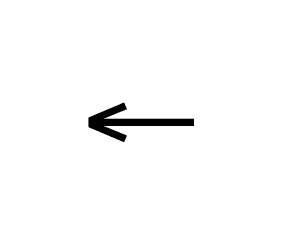
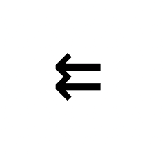
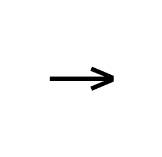
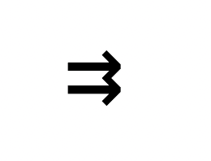

# HTML 箭头–单箭头和双箭头、左箭头和右箭头的符号 Unicode

> 原文：<https://www.freecodecamp.org/news/html-arrow-symbol-unicode-for-single-and-double-arrows-left-and-right-arrows/>

## 什么是 Unicodes？

Unicodes 是代表不同事物的通用字符。这些可以是符号、字符、脚本以及更多形式的字符组合。

许多平台(移动平台和网络平台)都采用 Unicodes，以使字符随处可用。

## 为什么 Unicodes 有用？

Unicodes 很有用，因为它们为跨不同系统和语言的字符表示提供了标准。

Unicode 还表示在 [ASCII](https://en.wikipedia.org/wiki/ASCII) 中不可用的特殊字符，并帮助我们在各种平台上创建一致的字符显示。

您也可以像处理其他字符一样应用样式(颜色、大小)。

## 如何在 html 中使用 unicode

您可以用两种方式编写大多数 Unicode 符号:使用十六进制引用或使用实体名称。

十六进制引用通常很难阅读，但是实体名称通常描述了您想要编写的 Unicode 符号。

对于十六进制数，您可以将它们写在`&#`(一个&符号和一个数字符号)和`;`(一个分号)之间，如下所示:

```
&#[NUMBER]; 
```

对于实体名称，您可以将它们写在`&`和`;`之间，如下所示:

```
&[ENTITY]; 
```

这种语法是必要的，以便 HTML 理解您所写的字符不仅仅是文本，而是 Unicode 符号表示。

## 单箭头和双左右箭头的 Unicode

现在我们已经简要地了解了什么是 Unicode 以及如何在 HTML 中使用它，让我们来看一些例子。

有许多 Unicode 表示的符号可以在 HTML 中使用。在这篇文章中，我将分享四个箭头符号的例子。

它们有不同的箭头符号和 Unicode 值。这里使用的箭头只是示例。

### 向左箭头

对于单个左箭头:

十六进制引用是 **8592** ，实体名是 **larr** 。在 HTML 中，它可以写成这样:

```
&#8592;
<!-- or -->
&larr; 
```

这段代码将把它打印在一页上:



对于双左箭头:

十六进制引用是 **8647** 并且实体名称是 **llarr** 写为:

```
&#8647;
<!-- or -->
#llarr 
```

这将导致:



### 向右箭头

对于单个右箭头:

十六进制引用是 **8594** ，实体名称是 **rarr** ，写法如下:

```
&#8594;
<!-- or -->
&rarr; 
```

结果是:



对于双右箭头:

十六进制引用是 **8649** ，实体名是 **rrarr** 写作:

```
&#8649;;
<!-- or -->
#rrarr 
```

这将导致:



您可以使用 Unicode 表示来打印 HTML 中的许多其他符号。您可以使用符号的十六进制引用或实体名称，正如我在本文中向您展示的那样。