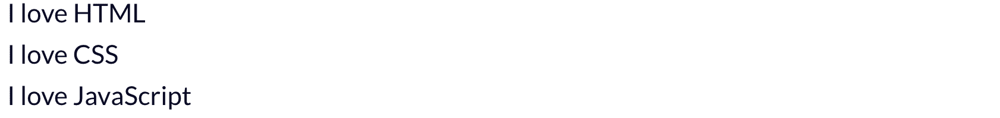
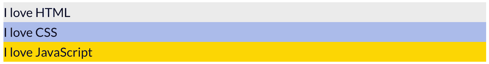
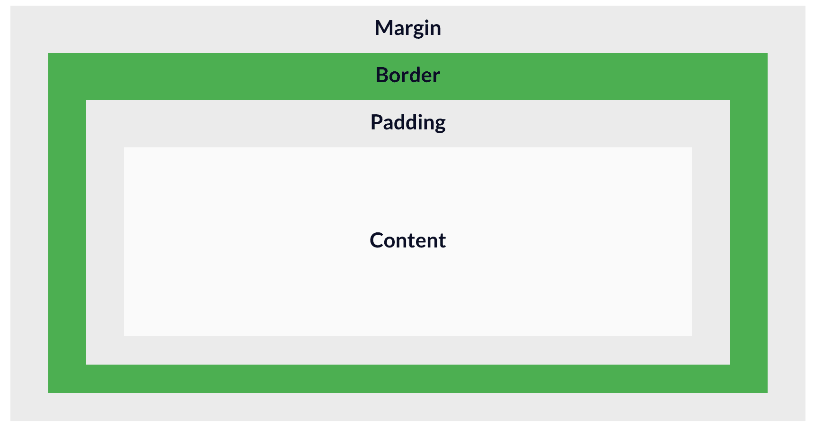
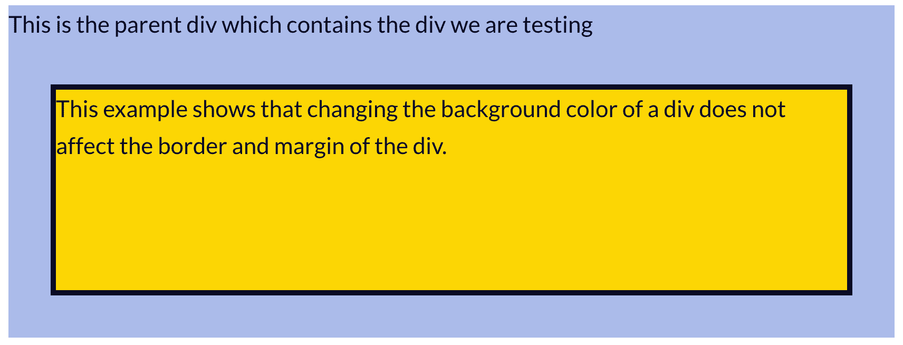
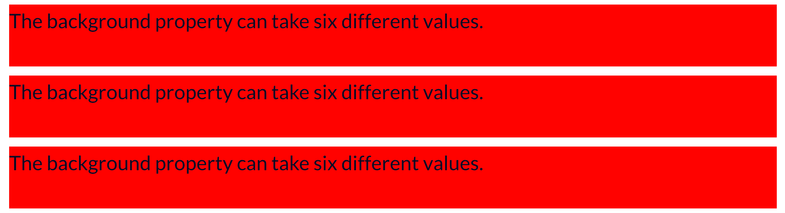
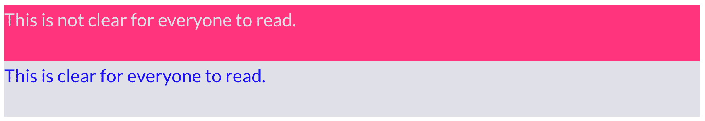

# HTML 背景色教程——如何改变一个 Div 背景色，用代码例子解释

> 原文：<https://www.freecodecamp.org/news/html-background-color-tutorial-how-to-change-a-div-background-color-explained-with-code-examples/>

作为一名 web 开发人员，最常见的事情之一就是改变 HTML 元素的背景颜色。但是如果你不知道如何使用 CSS `background-color`属性，这可能会令人困惑。

在文章中，我们讨论了

*   HTML 元素的默认背景颜色值
*   如何改变一个 div 的背景颜色，这是一个非常常见的元素
*   CSS 盒子模型的哪些部分受到了`background-color`属性的影响，以及
*   该属性可以采用的不同值。

### 元素的默认背景色

div 的默认背景色是`transparent`。因此，如果您不指定 div 的背景色，它将显示其父元素的背景色。

### 更改 Div 的背景颜色

在本例中，我们将更改以下 div 的背景颜色。

```
<div class="div-1"> I love HTML </div>
<div class="div-2"> I love CSS </div>
<div class="div-3"> I love JavaScript </div> 
```

没有任何样式，这将转化为以下视觉。



让我们通过向类中添加样式来改变 div 的背景颜色。您可以通过尝试 HTML 文件中的示例来跟进。

```
<style>
    .div-1 {
        background-color: #EBEBEB;
    }

    .div-2 {
    	background-color: #ABBAEA;
    }

    .div-3 {
    	background-color: #FBD603;
    }
</style>

<body>
    <div class="div-1"> I love HTML </div>
    <div class="div-2"> I love CSS </div>
    <div class="div-3"> I love JavaScript </div>
</body> 
```

这将导致以下结果:



酷！我们已经成功地改变了这个 div 的背景色。接下来，我们来深入了解一下这个楼盘。让我们看看背景色属性如何影响 CSS-box 模型的各个部分。

### 背景颜色和 CSS 框模型

根据 CSS 盒子模型，所有的 HTML 元素都可以建模为矩形框。每个盒子由 4 部分组成，如下图所示。



The CSS Box Model

如果你不熟悉盒子模型，你可以仔细阅读。问题是，当您更改一个 div 的背景色时，盒子模型的哪一部分会受到影响？简单的回答就是填充区域和内容区域。让我们用一个例子来证实这一点。

```
 <style>
    body {
        background-color: #ABBAEA;
    }
    div {
        height: 200px;
        margin: 20px;
        border: 5px solid;
        background-color: #FBD603;
    }
</style>
<body>
    <div>
        <p>This is the parent div which contains the div we are testing</p>

        <div>
            <p>This example shows that changing the background color of a div does not affect the border and margin of the div.</p>
        </div>
    </div>
</body> 
```

这将导致:



从上面的例子中，我们可以看到，空白区域和边界区域不受背景颜色变化的影响。我们可以使用 border-color 属性改变边框的颜色。空白区域保持透明，并反映父容器的背景色。

最后，让我们讨论背景色属性可以取的值。

### 背景颜色值

就像 color 属性一样，background-color 属性可以有六个不同的值。让我们用一个例子来考虑三个最常见的值。在这个例子中，我们用不同的值将 div 的背景色设置为红色。

```
<style>
    /* Keyword value/name of color */
    .div-1 {
        background-color: red;
    }

    /* Hexadecimal value */
    .div-2 {
       background-color: #FF0000;	 
    }

    /* RGB value */
    .div-3 {
    	background-color: rgb(255,0,0);
    }

</style>

<body>
    <div class="div-1">
        <p>The background property can take six different values.</p>
    </div>

    <div class="div-2">
        <p>The background property can take six different values.</p>
    </div>

    <div class="div-3">
        <p>The background property can take six different values.</p>
    </div>
</body> 
```

请注意，它们都有相同的背景颜色。



`background-color`属性可以采用的其他值包括 HSL 值、特殊关键字值和全局值。以下是它们中每一个的例子。

```
/* HSL value */
background-color: hsl(0, 100%, 25%;

/* Special keyword values */
background-color: currentcolor;
background-color: transparent;

/* Global values */
background-color: inherit;
background-color: initial;
background-color: unset; 
```

您可以在这里阅读更多关于这些值[的信息。](https://developer.mozilla.org/en-US/docs/Web/HTML/Applying_color)

### 额外注释

当设置元素的背景色时，确保背景色和它所包含的文本颜色的对比度足够高是很重要的。这是为了确保视力低下的人能够轻松阅读文本。

考虑这两个 div。



第一个 div 的背景色和文字颜色的对比度不够高，大家看不出来。所以除非你是唯一一个使用你正在建设的网站的人，并且你有非常好的视力，否则你应该避免这样的颜色组合。

第二个 div 在背景色和文本颜色之间有更好的对比度。因此，人们阅读起来更容易理解，也更清晰。

## 结论

在本文中，我们看到了如何更改 div 的背景色。我们还讨论了 CSS 盒子模型的哪些部分会受到背景颜色变化的影响。最后，我们讨论了背景色属性可以取的值。

我希望这篇文章对你有用。感谢阅读。