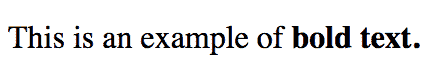
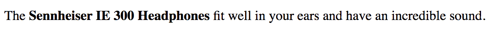
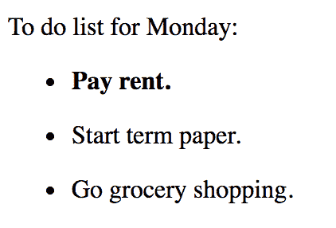
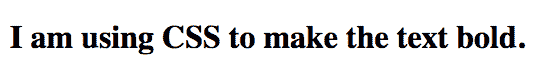

# HTML 粗体文本教程–如何使用 b 标签

> 原文：<https://www.freecodecamp.org/news/html-bold-text-tutorial-how-to-use-the-b-tag/>

在本文中，我们将学习如何使用`<b>`标签，以及它与`<strong>`标签有何不同。

## HTML 中的**(粗体)标签是什么？**

标签用来使文本的一部分加粗，而不带有任何特殊的重要性。下面是一个使用`<b>`标签的例子。

```
<p>This is an example of <b>bold text.</b></p>
```



根据 [HTML 生活标准](https://html.spec.whatwg.org/multipage/text-level-semantics.html#the-b-element),`<b>`标签可用于以下示例:

> 文档摘要中的关键词，评论中的产品名称，交互式文本驱动软件中的可操作词，或者一篇文章。

### 这里有一个在评论中使用**作为产品名称的例子**

```
<p>The <b>Sennheiser IE 300 Headphones</b> fit well in your ears and have an incredible sound.</p>
```



标签意在将用户的注意力吸引到一段文本上。它不应该带有任何重要性或传达一种紧急或严肃的语气。

这是对`<b>`标签的不正确使用。

```
<p><b>WARNING!!</b> This area is dangerous.</p> 
```

这种情况下合适的标签应该是`<strong>`标签，因为它传达了一种严肃感。

## HTML 中的**标签和**标签的区别****

刚开始学 HTML 的时候，我以为`<b>`标签和`<strong>`标签是一回事。混淆的部分原因是它们在大多数浏览器中都有相同的默认粗体样式。

一个关键的区别是，当文本非常重要，或者有紧迫感或严肃感时，应该使用`<strong>`标签。另一方面，标签应该用来在不增加重要性的情况下引起对一段文本的注意。

这个标签的例子告诉用户应该首先阅读哪个列表项，它比其他两个列表项更重要。

```
<p>To do list for Monday:</p>
<ul>
    <li><p><strong>Pay rent.</strong></p></li>
    <li><p>Start term paper.</p></li>
    <li><p>Go grocery shopping.</p></li>
</ul> 
```



另一个关键区别是`<b>`标签不应该用在标题和说明中，而`<strong>`标签可以。

下面是一个使用`<strong>`标签来强调章节标题重要性的例子。

```
<h1>Chapter 5: <strong>The Battle</strong></h1> 
```

## 如何在 HTML 中使用带有**标签的 Class 属性**

通常在`<b>`标签中添加一个 class 属性来增加更多的语义。

如果你有一系列的句子，你可以在第一个`<p>`标签上添加一个类似于`<b class="lead">`的类，这将把它标记为引导句。

```
<article>
    <h2>A young boy reunites with birth mother</h2>
    <p><b class="lead">A six year old boy unexpectedly meets his birth mother at the local grocery store.</b></p>
    <p>A young boy and his grandfather were shopping at the grocery store, when a young woman approached them from behind.</p>
    [...]
</article>
```

## 在 HTML 中应该使用**标签来设计文本样式吗？**

在 HTML 5 中，使用`<b>`标签对文本进行样式化是不合适的。首选的样式方法是使用 CSS `font-weight`属性。

### 使用关键字 bold 的示例

```
 <p class="demo-para">I am using CSS to make the text bold.</p> 
```

```
.demo-para {
  font-weight: bold;
}
```

### 使用数值的示例

```
.demo-para {
  font-weight: 700;
}
```



## 结论

虽然，`<b>`标签和`<strong>`标签在浏览器中可能看起来相似，但它们确实有不同的含义。了解这两者之间的区别很重要，这样你才能恰当地使用它们。

标签被用来引起对一段文字的注意，但并没有特别的重要性。另一方面，如果文本传达了一种重要性、严肃性或紧迫性，就应该使用标签。

我希望你喜欢这篇文章，并了解什么时候使用`<b>`标签。