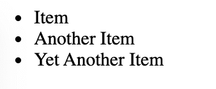
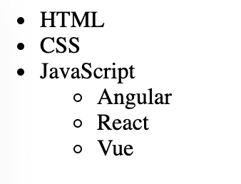
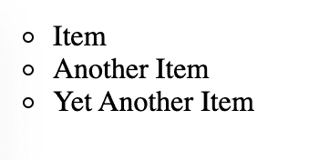
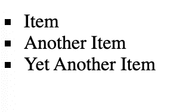
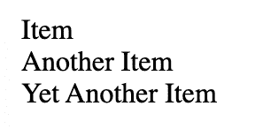
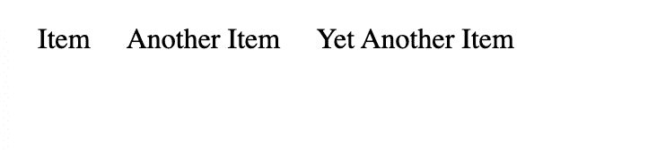
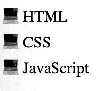
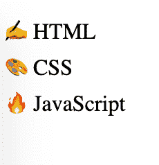

# HTML 要点——如何用

> 原文：<https://www.freecodecamp.org/news/html-bullet-points-how-to-create-an-unordered-list-with-the-ul-tag-example/>

在我们的日常生活中，我们无时无刻不在使用列表。

我们创造它们来组织和安排我们的生活，我们用它们来列任务清单。我们在食谱中使用它们，所以我们不会错过任何步骤。当我们想组装一件家具时，我们会用到它们。

这些只是我们如何使用列表来帮助我们组织事情的几个例子。

因此，它们在前端 web 开发中也是如此频繁使用和有用的特性是有道理的。

HTML 中有三种类型的列表:无序列表、有序列表和描述列表。

在本文中，您将学习如何创建无序列表。您还将看到使用几行 CSS 就可以改变默认样式的一些方法。

我们开始吧！

## 如何在 HTML 中创建无序列表

HTML 中的无序列表是不需要任何特定顺序的项目集合。我们经常使用简单的项目符号来列出这些项目。

使用`ul`标签创建一个无序列表。然后，使用`li`标签列出您希望列表包含的每一个项目。

代表*无序列表*的`ul`标签是`li`
标签的父标签。这意味着`li`标签是`ul`标签的*子标签*。

```
<ul>
    <li>Item</li>
    <li>Another Item</li>
    <li>Yet Another Item</li>
</ul> 
```

输出:



这称为项目符号列表，因为默认样式是每个列表项旁边都有一个项目符号。

需要记住和注意的一点是，`li`是`ul`的*唯一的*直接子节点。

这意味着在为无序列表创建开始(`<ul>`)和结束(`</ul>`)标签后，您包含的第一个标签将是`li`标签。

比如**不要这样**:

```
<ul>
    <a href="#">I am a link to something on the web!</a>
</ul> 
```

如果您希望无序列表中的项目是链接，请这样做:

```
<ul>
    <li>
        <a href="#">I link to somewhere on the web!</a>
    </li>
</ul> 
```

链接标签(`a`)是`li`标签的子标签和孙标签(！)的`ul`标记。

### 如何创建一个嵌套的无序列表

嵌套列表是另一个列表内部的列表。

你可以创建一个嵌套的无序列表，或者一个嵌套的有序列表，甚至是一个嵌套在无序列表中的有序列表。

记住`ul`标签的*唯一的*直接子标签是`li`。

下面是如何创建一个嵌套的无序列表:

```
<ul><!-- start of  main list-->
  <li>HTML</li>
   <li>CSS</li>
    <li>JavaScript
            <ul><!-- start of nested list-->
                <li>Angular</li>
                <li>React</li>
                <li>Vue</li>
            </ul><!--end of nested list-->
     </li>
 </ul><!--end of  main list --> 
```

输出:



您可以在您选择的主列表项下创建嵌套的无序列表。

在上面的例子中，我在开始和结束的`li`之间创建了一个名为‘JavaScript’的嵌套列表。

请确保包含结束标签和开始标签，因为它会很快让人混淆。

避免混淆的一个好方法是注释你的代码。请记住，只有在语义上有意义的时候才应该使用嵌套列表。

## 如何改变无序列表的默认样式

正如您到目前为止所看到的，无序列表的默认样式是每个列表项旁边的项目符号。

但是您可以在一个单独的`.css`文件中使用`list-style-type`属性来改变样式。

该属性的默认值为`disc`。

### 如何使用圆形设置列表项的样式

您可以创建以圆形而不是实心项目符号作为样式的列表项目:

```
<ul>
    <li>Item</li>
    <li>Another Item</li>
    <li>Yet Another Item</li>
</ul> 
```

```
ul {
    list-style-type: circle;
} 
```

输出:



### 如何用正方形设置列表项的样式

您也可以创建以方形为样式的列表项目:

```
<ul>
    <li>Item</li>
    <li>Another Item</li>
    <li>Yet Another Item</li>
</ul> 
```

```
ul {
    list-style-type: square;
} 
```

输出:



### 如何从列表项中移除样式

您甚至可以完全移除样式:

```
<ul>
    <li>Item</li>
    <li>Another Item</li>
    <li>Yet Another Item</li>
</ul> 
```

```
ul {
    list-style-type: none;
} 
```

输出:



当您想要水平设置列表项的样式并创建导航栏时，这尤其有用。这将需要一些额外的造型。

列表是**块的**元素。通过将列表项目更改为`inline`并使用 Flexbox 规则，您可以将项目堆叠在一起。

同样的 HTML:

```
<ul>
        <li>Item</li>
        <li>Another Item</li>
        <li>Yet Another Item</li>
    </ul> 
```

通过添加一些新的 CSS 规则:

```
ul {
    list-style-type: square;
    display:flex;
}

li{
    display:block;
    margin:10px;
} 
```

您可以水平设置列表项的样式:



### 如何使用表情符号设计列表项目

对于无序列表中的项目，您没有太多的样式选择。

为了让列表更有趣，你可以添加表情符号，使用 CSS `::before`伪元素。

以下是 HTML:

```
<ul>
    <li>HTML</li>
    <li>CSS</li>
    <li>JavaScript</li>
</ul> 
```

第一步是将`list-style-type:none;`规则添加到父`ul`标签中，并从标签中移除默认的`padding`和`margin`。

使用`::before`伪元素将表情符号添加到`li`标签中。你可以从[这篇文章](https://www.freecodecamp.org/news/all-emojis-emoji-list-for-copy-and-paste/)中的表情符号列表中挑选。

```
ul {
    list-style-type: none;
    padding:0;
    margin:0;
}

li::before{
    content: "💻";
} 
```

输出:



要给每个列表项一个不同的表情符号，使用列表项*上的`:nth-child()`选择器，在*和`::before`伪元素之前:

```
ul {
    list-style-type: none;
    padding:0;
    margin:0;
}

/*first list item*/
li:nth-child(1)::before{
    content: "✍️";
}

/*second list item*/
li:nth-child(2)::before{
    content: "🎨";
}

/*third list item*/
li:nth-child(3)::before{
    content: "🔥";
} 
```

输出:



## 结论

现在你知道了！您现在知道了如何在 HTML 中创建无序列表，并且已经看到了一些样式化它们的方法。

要继续您的 HTML 学习之旅，请在 freeCodeCamp 的 YouTube 频道上观看以下视频:

*   [HTML 教程-网站初学者速成班](https://www.youtube.com/watch?v=916GWv2Qs08)
*   [HTML 全教程——搭建网站教程](https://www.youtube.com/watch?v=pQN-pnXPaVg)

freeCodeCamp 还提供免费的基于项目的认证，认证内容是关于[响应式网页设计](https://www.freecodecamp.org/learn/responsive-web-design/)。

这是完全初学者的理想选择，不需要任何先前的知识。你将从绝对必要的基础开始，并随着你的进步建立你的技能。最后，你将完成五个项目。

感谢阅读，快乐学习:)