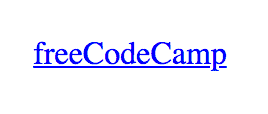
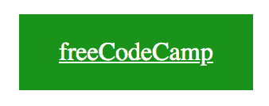
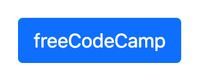
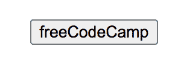
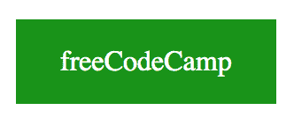
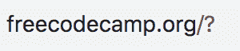

# HTML 按钮链接代码示例——如何使用标签上的 HREF 属性制作 HTML 超链接

> 原文：<https://www.freecodecamp.org/news/html-button-link-code-examples-how-to-make-html-hyperlinks-using-the-href-attribute-on-tags/>

在这篇文章中，我们将探索三种不同的方法来让一个 HTML 按钮表现得像一个链接。

这些是我们要复习的方法:

1.  将链接设计成按钮的样子
2.  在表单中使用动作和格式属性
3.  使用 JavaScript onclick 事件

但首先，让我们来看看错误的做法。

## 为什么这种使用`a`元素的方法不起作用？

下面的代码片段在点击时会导向 freeCodeCamp 网站。

```
 <a href="https://www.freecodecamp.org/">
    <button>freeCodeCamp</button>
  </a> 
```

但是，这不是有效的 HTML。

> `[a](https://html.spec.whatwg.org/multipage/text-level-semantics.html#the-a-element)`元素可以围绕整个段落、列表、表格等等，甚至整个部分，只要其中没有交互内容(例如，按钮或其他链接)。-(来源:[网络超文本应用技术工作组](https://html.spec.whatwg.org/multipage/text-level-semantics.html#the-a-element))

这被认为是不好的做法，因为它使用户的意图变得不清楚。

链接应该将用户导航到网页的另一部分或外部网站。按钮应该执行特定的操作，比如提交表单。

当您将一个嵌套在另一个中时，您会对想要执行的操作感到困惑。这就是为什么最好不要将按钮嵌套在锚标记中。

## 如何用 CSS 将一个链接设计成一个按钮

第一种方法根本不使用按钮。我们可以使用 CSS 将锚标签设计成按钮的样式。

这是锚标记的默认 HTML 样式。



我们可以向锚标记添加一个类，然后使用该类选择器来设计元素的样式。

```
 <a class="fcc-btn" href="https://www.freecodecamp.org/">freeCodeCamp</a> 
```

如果您希望链接打开一个新页面，您可以像这样添加`target="_blank"`属性:

```
 <a target="_blank" class="fcc-btn" href="https://www.freecodecamp.org/">freeCodeCamp</a> 
```

然后，我们可以添加一个背景颜色并改变字体颜色，如下所示:

```
.fcc-btn {
  background-color: #199319;
  color: white;
}
```


下一步是在文本周围添加一些填充:

```
.fcc-btn {
  background-color: #199319;
  color: white;
  padding: 15px 25px;
}
```



最后，我们可以使用 text-decoration 属性来删除文本中的下划线:

```
.fcc-btn {
  background-color: #199319;
  color: white;
  padding: 15px 25px;
  text-decoration: none;
}
```


现在我们有了一个看起来像按钮的锚标记。

我们还可以根据链接的状态改变背景颜色，使这个“按钮”更具交互性。

```
.fcc-btn:hover {
  background-color: #223094;
}
```

[https://codepen.io/jessica-wilkins/embed/preview/XWNyGBR?height=300&slug-hash=XWNyGBR&default-tabs=css,result&host=https://codepen.io](https://codepen.io/jessica-wilkins/embed/preview/XWNyGBR?height=300&slug-hash=XWNyGBR&default-tabs=css,result&host=https://codepen.io)

我们可以让设计变得更复杂，但这只是向你展示像按钮一样设计链接的基础。

你也可以选择使用 CSS 库，比如 [Bootstrap](https://getbootstrap.com/) 。

```
 <a class="btn btn-primary" href="https://www.freecodecamp.org/">freeCodeCamp</a> 
```



如果您的项目已经包含 Bootstrap，那么您可以使用内置的按钮样式。但是我不会仅仅为了设计一个链接而导入 Bootstrap。

### 这种方法有什么问题？

将链接设计成按钮的样式是否是一种好的做法，这是有争议的。有些人会说链接应该总是看起来像链接，按钮应该看起来像按钮。

在名为[弹性网页设计](https://resilientwebdesign.com/)的网络书中，杰里米·基思指出

> 一种材料不应作为另一种材料的替代品，否则最终结果是欺骗性的。

我为什么要费神提起这场辩论呢？

我的目标不是让你选择辩论的一方而不是另一方。我只是想让你知道这个正在进行的讨论。

## 如何使用`action`和`formaction`属性制作表单中的按钮

### 如何使用`action`属性

另一种方法是将按钮嵌套在表单中，并使用 action 属性。

输入示例:

```
 <form action="https://www.freecodecamp.org/">
    <input type="submit" value="freeCodeCamp">
  </form>
```

按钮示例:

```
 <form action="https://www.freecodecamp.org/">
    <button type="submit">freeCodeCamp</button>
  </form>
```

这将是默认的按钮样式。



我们可以使用与前面相同的样式，但是我们必须添加光标指针并将边框设置为无，如下所示:

```
.fcc-btn {
  background-color: #199319;
  color: white;
  padding: 15px 25px;
  text-decoration: none;
  cursor: pointer;
  border: none;
} 
```



### 如何使用`formaction`属性

与前面的方法类似，我们可以创建一个表单并使用 formaction 属性。

输入示例:

```
 <form>
    <input type="submit" formaction="https://www.freecodecamp.org/" value="freeCodeCamp">
  </form>
```

按钮示例:

```
 <form>
    <button type="submit" formaction="https://www.freecodecamp.org/">freeCodeCamp</button>
  </form>
```

您只能对带有`type="image"`或`type="submit"`的输入和按钮使用 formaction 属性。

### 这在语义上正确吗？

虽然这似乎是一个可行的解决方案，但这在语义上是否正确还存在疑问。

我们使用了表单标签，但是它的功能不像一个真正的表单。表单的目的是收集和提交用户数据。

但是我们使用提交按钮将用户导航到另一个页面。

说到语义，这不是使用表单标签的好方法。

### 使用 action 和 formaction 属性的副作用

当您单击按钮时，URL 会发生一些有趣的事情。现在 URL 的末尾有一个问号。



发生这种变化的原因是因为表单使用了 GET 方法。您可以切换到 POST 方法，但是在有些情况下这也不理想。

```
 <form method="POST" action="https://www.freecodecamp.org/">
    <button type="submit">freeCodeCamp</button>
  </form>
```

虽然这种方法是有效的 HTML，但它也带来了意想不到的副作用。

## 如何使用 JavaScript onclick 事件制作按钮

在前面的方法中，我们已经研究了 HTML 和 CSS 解决方案。但是我们也可以使用 JavaScript 来达到同样的效果。

输入示例:

```
 <form>
    <input type="button" onclick="window.location.href='https://www.freecodecamp.org/';" value="freeCodeCamp" />
 </form>
```

按钮示例:

```
<button onclick="window.location.href='https://www.freecodecamp.org/';">freeCodeCamp</button> 
```

`location.href`表示特定 URL 的位置。在这种情况下，`Window.location.href`将返回 https://www.freecodecamp.org/的[。](https://www.freecodecamp.org/)

### 这种方法的缺点

虽然这种解决方案确实可行，但也有一些潜在的问题需要考虑。

如果用户决定在浏览器中禁用 JavaScript，那么这个解决方案显然是行不通的。不幸的是，这可能会导致糟糕的用户体验。

## 结论

这篇文章的目的是向你展示三种不同的方法，你可以使按钮像链接一样。

第一种方法是设计一个看起来像按钮的链接。我们还研究了将链接的外观改变成另一个元素是否是一个好主意的争论。

第二种方法使用 form 和 formaction 属性。但是我们也了解到这种方法对 URL 有一些副作用，并且在语义上是不正确的。

第三种方法使用 JavaScript onclick 事件和 Window.location.href。但是我们也了解到，如果用户决定在浏览器中禁用 JavaScript，这种方法可能不起作用。

作为一名开发人员，在将一种特定的方法整合到您的项目中之前，了解它的优缺点是非常重要的。

我希望你喜欢这篇文章，并在此过程中学到了一些东西。

编码快乐！