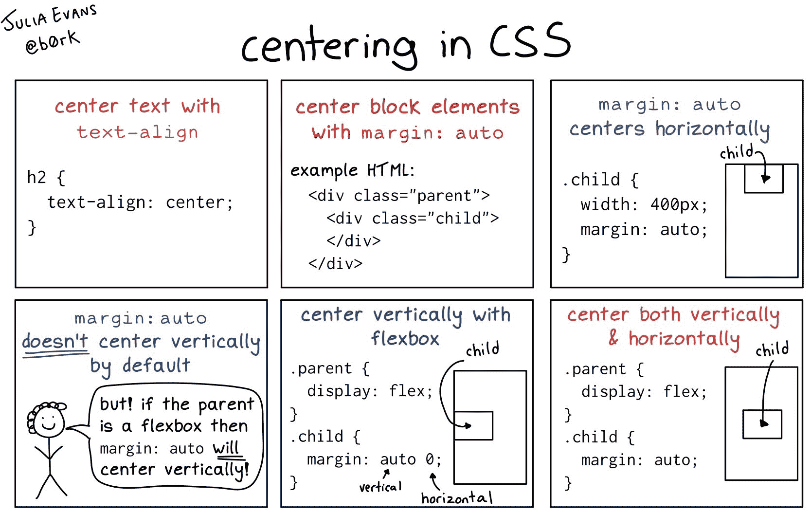

# 如何 CSS 垂直对齐一个 Div

> 原文：<https://www.freecodecamp.org/news/html-center-text-how-to-css-vertical-align-a-div/>

在 HTML 和 CSS 的世界里，一切都是关于布局结构和元素的分布。我们通常使用 HTML 来定义标记和结构，而 CSS 帮助我们处理元素的样式和对齐。

在这篇文章中，我们将学习一些不同的方法来使 HTML 元素居中，并用 CSS 处理垂直对齐。

首先我们要学习如何用 CSS 对齐文本。

接下来，我们将介绍如何对齐一个 div 和任何其他元素。

最后，我们将学习如何将文本和一个`div`放在一个容器中。

## 如何居中文本

使用 CSS 将文本居中有很多方法。

### 使用 Float 属性

浮动是对齐文本的一种简单方法。

为了将文本放置在布局的右侧，我们可以简单地使用`right`作为`float`的值。

为了将文本放在左侧，我们使用`left`，就像`float:left`一样。请看下面的例子:

```
 .right {
        float: right;
      }

      .left {
        float: left;
      }
// HTML

    <span class="right">Right</span>
    <span class="left">Left</span>
```

[https://codesandbox.io/embed/center-html-elements-dlhfu?file=/index.html](https://codesandbox.io/embed/center-html-elements-dlhfu?file=/index.html)

要使用浮动使文本居中，我们可以使用`margin-left`或`margin-right`并使其成为`50%`，如下所示。

```
 .center {
    float: left;
    margin-left: 50%;
    }

/* HTML*/
<span class="center">Center</span>
```

点击可以了解更多关于`Float` [的用法。](https://developer.mozilla.org/en-US/docs/Web/CSS/float)

### 使用文本对齐

`text-align`是一种更方便、更具体的文本对齐方式。它允许我们将文本放置在`center`或`left`或`right`侧，如下例所示:

```
.right {
text-align: right;
}

.left {
text-align: left;
}
.center {
text-align: center;
}
/* HTML */

<p class="right">Right</p>
<p class="center">Center</p>
<p class="left">Left</p>
```

[https://codesandbox.io/embed/text-align-71d6q?file=/index.html](https://codesandbox.io/embed/text-align-71d6q?file=/index.html)

了解更多关于`[text-align](https://developer.mozilla.org/en-US/docs/Web/CSS/text-align)`的信息。

## 如何对齐一个`div`

有很多方法可以做到这一点。

与我们使用`Float`对齐文本的方式相同，我们也可以使用它来对齐`div`元素。

[https://codesandbox.io/embed/align-a-div-pn8yw?file=/index.html](https://codesandbox.io/embed/align-a-div-pn8yw?file=/index.html)

做了这项工作，但是 CSS 给了我们更好的选择，更加方便和优雅。听说过`Flexbox`吗？还是 [css-grid](https://developer.mozilla.org/en-US/docs/Web/CSS/CSS_Grid_Layout) ？

嗯，这两种方法提供了非常现代的方式来调整和使用 CSS 中的布局。让我们更详细地看看 Flexbox。

## [柔性盒](https://developer.mozilla.org/en-US/docs/Web/CSS/CSS_Flexible_Box_Layout/Basic_Concepts_of_Flexbox)

Flexbox 提供了一种简单直接的方法来对齐一个`div`——这是我目前为止最喜欢的处理 CSS 布局的方法(我每天都在使用)。

让我们看看我们会用`Flexbox`做什么，通过重新创建与上面相同的例子来看看它是如何工作的。

示例:

[https://codesandbox.io/embed/align-dev-with-flexbox-2pp1m](https://codesandbox.io/embed/align-dev-with-flexbox-2pp1m)

代码:

```
<!DOCTYPE html>
<html lang="en">
  <head>
    <meta charset="UTF-8" />
    <meta name="viewport" content="width=device-width, initial-scale=1.0" />
    <meta http-equiv="X-UA-Compatible" content="ie=edge" />
    <title>Flexbox</title>
    <style>
      .container {
        display: flex;
      }
      .container div {
        width: 33%;
        height: 60px;
      }

      .left {
        background: yellow;
      }
      .right {
        background: red;
      }
      .center {
        background: lightblue;
      }
    </style>
  </head>
  <body>
    <div class="container">
      <div class="left">Left div</div>
      <div class="center">centered div</div>
      <div class="right">right div</div>
    </div>
  </body>
</html> 
```

我们来分解一下

*   我们总是使用`display:flex`定义一个`div`父节点来应用`Flexbox`。所以我们让父节点`div`中的所有子节点都可以使用`Flexbox`属性来处理。
*   默认情况下，`flex-direction`使用`row`方向，这意味着元素将垂直放置在容器中。
*   使用`justify-content`属性，我们可以在不同的方向对齐`div`的子节点，如下例所示:

```
.container{
 display: flex:
 justify-content:center /* flex-start, flex-end, space-between, space-evenly, space-around etc */

}
```

*   `justify-content:center`将元素放在容器的中心。
*   `justify-content:flex-start`将元素放在容器左边的开头。
*   `justify-content:flex-end`将元素放在容器右侧的末端。
*   `justify-content:space-around`使元素适合容器，并在所有元素之间放置相等的间隙。
*   `justify-content:space-evenly`以相同的间距和宽度平均分布父容器中的元素。

上面的例子适用于所有元素的子元素组。

想象一下，如果我们想在容器内对齐一个单独的`div`。我们总是可以使用`[align-self](https://developer.mozilla.org/en-US/docs/Web/CSS/align-self)`来对齐单个元素。

```
.container div{
 align-self:center /* can have: flex-start, or flex-end*/
}
```

我们可以对带有`Flexbox`的文本应用同样的东西，如下例所示:

```
 <style>
.right{
    display: flex;
    align-items: flex-end;
    flex-direction: column;
}

</style>
<div class="right">
<span>right div</span>
</div>
```

这是 Julia Evans 的一条很棒的推文，说明了 CSS 的中心化:



[Original Tweet here ](https://twitter.com/b0rk/status/1291417463507374097)

## 包裹

有很多方法可以使 CSS 中元素居中。随着时间的推移，随着你练习越来越多，你总会学到新的东西。

因此，我建议你从今天学到的内容中找出一些例子，以便记住。

*   你应该关注我 [Twitter](https://twitter.com/SaidHYN) ？
*   查看我的 Github
*   访问我的[博客](https://saidhayani.com/)