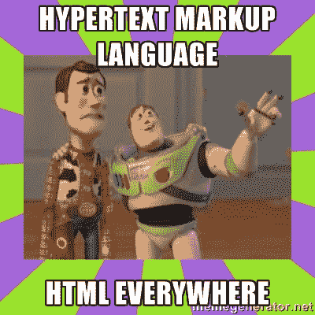

# 面向初学者的 HTML

> 原文：<https://www.freecodecamp.org/news/html-crash-course/>

HTML 用于创建网页。

这篇文章将教你 HTML 的基础知识。我还在 freeCodeCamp.org YouTube 频道上创建了一个 45 分钟的视频课程[，在创建一个真实网页的背景下教你 HTML。](https://youtu.be/916GWv2Qs08)

如果你是刚学 HTML，我推荐你既看这篇文章，也看视频课程。

HTML 代表超文本标记语言。互联网上的每个网站都使用 HTML & CSS。大多数也使用 JavaScript。

HTML everywhere!

在一个网站中，HTML 是结构，CSS 是风格，JavaScript 是功能。

这是一张来自 codeanalagies.com 的互动图。前后移动滑块。

[https://blog.codeanalogies.com/wp-admin/admin-ajax.php?action=h5p_embed&id=1](https://blog.codeanalogies.com/wp-admin/admin-ajax.php?action=h5p_embed&id=1)