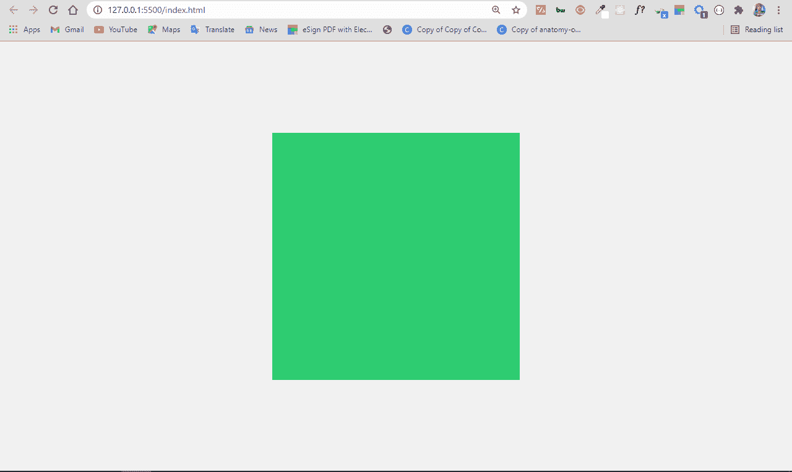
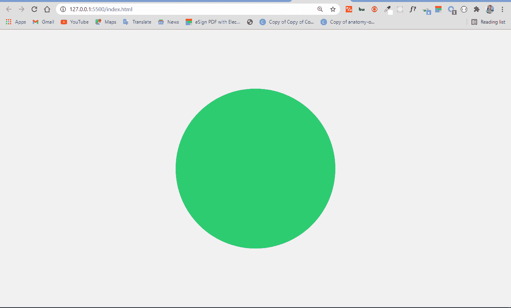
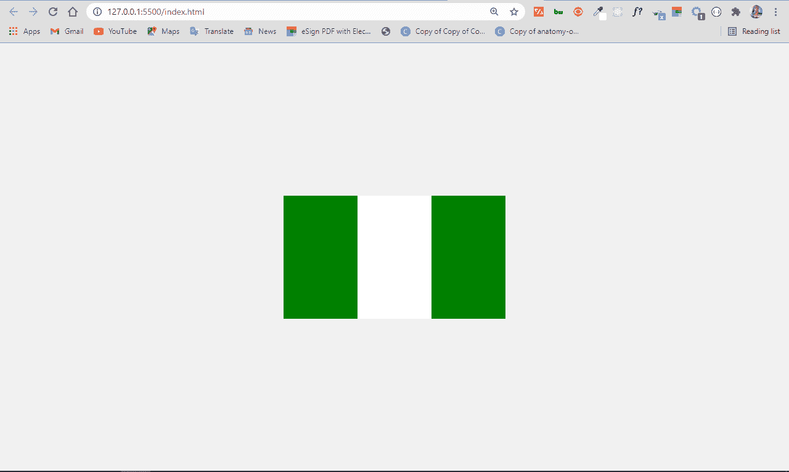
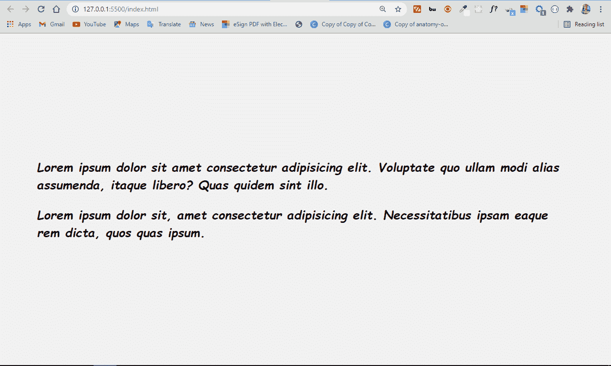
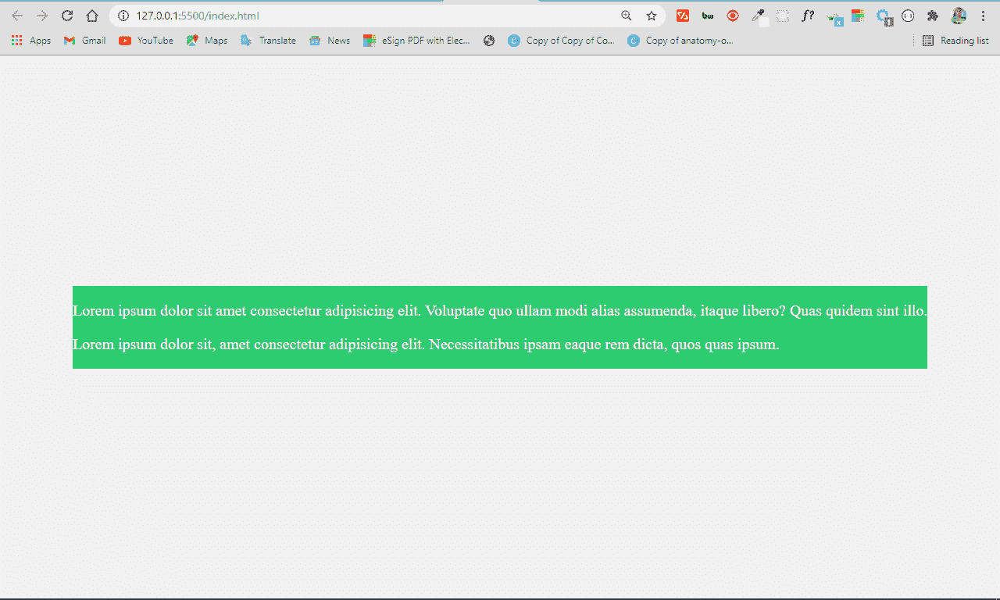
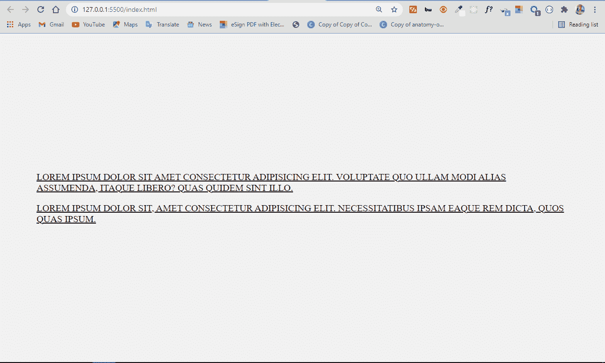
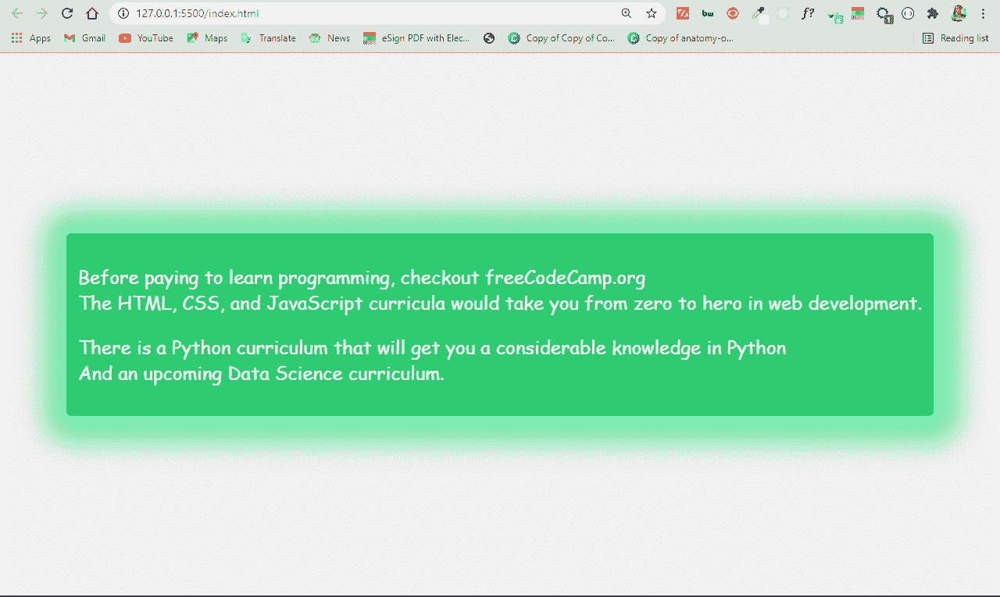
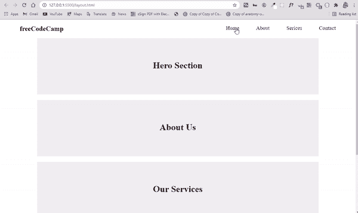

# HTML Div——什么是 Div 标签，如何用 CSS 设计它的样式

> 原文：<https://www.freecodecamp.org/news/html-div-what-is-a-div-tag-and-how-to-style-it-with-css/>

HTML division 标签，简称为“div ”,是一个特殊的元素，它允许您将网页上相似的内容集合在一起。您可以将它用作关联相似内容的通用容器。

`div`标签是最常用的标签之一，尽管引入了语义元素(这些元素允许您将几个标签作为一个容器使用)，但它似乎并没有走向任何地方。

在本教程中，我将向您展示使用`div`标签可以做的各种事情，如何在不混淆的情况下在同一个 HTML 文件中使用多个 div，以及如何对其进行样式化。

## 何时使用`div`标签

标签是多用途的——你可以用它在网页上做几件事。您将主要在网页布局和 CSS 艺术中使用它，但它非常灵活。

最终，您几乎总是会用它来设计它所包含的任何内容，或者用 JavaScript 来操作这些内容。

### 1.在网页布局中使用`div`

您将主要使用`div`标签将相似的内容分组在一起，这样您就可以轻松地对其进行样式化。一个很好的例子就是使用 div 将网页的不同部分组合在一起。您可以将页面的页眉、nav、节和页脚放在一个单独的 div 标签中，这样就可以一起设计它们的样式。

在本教程的后面，我将带你了解如何制作一个带有多个`div`标签的网页布局，而不会感到困惑。

Div 本身对内容的表示没有直接影响，除非您对它进行样式化。

### 2.在 CSS 艺术中使用`div`

使用 div 标签，您可以制作各种形状和绘制任何东西，因为它很容易设置样式。

*   如何用`div`标签制作正方形

要用`div`标记制作一个正方形，首先需要定义一个空的 div 标记，并在 HTML 中给它附加一个 class 属性。在 CSS 中，选择具有 class 属性的 div，然后为它设置相等的高度和宽度。

```
<div class="square"></div> 
```

```
 body {
      display: flex;
      align-items: center;
      justify-content: center;
      margin: 0 auto;
      height: 100vh;
      background-color: #f1f1f1;
    }
.square {
      background-color: #2ecc71;
      width: 200px;
      height: 200px;
    } 
```



*   如何用`div`标签做一个圆

您可以通过在 HTML 中编写一个空 div，在 CSS 中为其设置相等的高度和宽度，然后将`border-radius`设置为 50%,来用`div`标记制作一个圆。

```
<div class="circle"></div> 
```

```
 body {
      display: flex;
      align-items: center;
      justify-content: center;
      margin: 0 auto;
      height: 100vh;
      background-color: #f1f1f1;
    }

    .circle {
      background-color: #2ecc71;
      width: 200px;
      height: 200px;
      border-radius: 50%;
    } 
```



*   如何用 CSS 制作尼日利亚国旗

制作带有`div`标签的尼日利亚国旗并不难。国旗是长方形的，颜色有绿色、白色和绿色。

为此，定义 3 个`div`标签并附加不同的类，然后在 CSS 中适当地设置它们的样式。

```
<div class="naija-flag">
    <div class="first-green"></div>
    <div class="white"></div>
    <div class="second-green"></div>
</div> 
```

```
.naija-flag {
  display: flex;
}
.first-green {
  height: 100px;
  width: 60px;
  background-color: green;
}
.white {
  height: 100px;
  width: 60px;
  background-color: white;
}
.second-green {
  height: 100px;
  width: 60px;
  background-color: green;
} 
```



## 如何设计`div`标签的样式

正如我们上面讨论的，div 标签非常容易设计。这也是很多开发者用它来分组相似内容的原因之一。

div 标签可以毫无问题地接受几乎所有的 CSS 属性。现在让我们来看几个例子。

### 1.如何用`div`应用字体属性

您可以对与`div`标签组合在一起的内容应用 CSS 属性，如`font-size`、`font-family`、`font-weight`和`font-style`:

```
<div class="font-properties">
      <p>
        Lorem ipsum dolor sit amet consectetur adipisicing elit. Voluptate quo
        ullam modi alias assumenda, itaque libero? Quas quidem sint illo.
      </p>
      <p>
        Lorem ipsum dolor sit, amet consectetur adipisicing elit. Necessitatibus
        ipsam eaque rem dicta, quos quas ipsum.
      </p>
</div> 
```

```
body {
      max-width: 900px;
      display: flex;
      align-items: center;
      justify-content: center;
      margin: 0 auto;
      height: 100vh;
      background-color: #f1f1f1;
    }

.font-properties {
      font-family: cursive, sans-serif;
      font-size: 1.3rem;
      font-weight: bolder;
      font-style: italic;
    } 
```



### 2.如何用 Div 标签应用颜色

您可以对与`div`标签组合在一起的内容应用 CSS `color`和`background-color`属性:

```
<div class="color-properties">
  <p>
    Lorem ipsum dolor sit amet consectetur adipisicing elit. Voluptate quo
    ullam modi alias assumenda, itaque libero? Quas quidem sint illo.
  </p>
  <p>
    Lorem ipsum dolor sit, amet consectetur adipisicing elit. Necessitatibus
    ipsam eaque rem dicta, quos quas ipsum.
  </p>
</div> 
```

```
.color-properties {
  color: white;
  background-color: #2ecc71;
} 
```



### 3.如何使用 Div 标签设置文本样式

你可以像这样在一个`div`标签上应用 CSS `text-transform`和`text-decoration`属性:

```
<div class="text-properties">
  <p>
    Lorem ipsum dolor sit amet consectetur adipisicing elit. Voluptate quo
    ullam modi alias assumenda, itaque libero? Quas quidem sint illo.
  </p>
  <p>
    Lorem ipsum dolor sit, amet consectetur adipisicing elit. Necessitatibus
    ipsam eaque rem dicta, quos quas ipsum.
   </p>
</div> 
```

```
.text-properties {
    text-transform: uppercase;
    text-decoration: underline;
  } 
```



### 4.如何用 Div 标签创建阴影效果

您可以使用带有 box-shadow 属性的`div`标签创建阴影效果:

```
<div class="box-shadow">
      <p>
        Before paying to learn programming, checkout freeCodeCamp.org
        <br />
        The HTML, CSS, and JavaScript curricula would take you from zero to hero
        in web development.
      </p>
      <p>
        There is a Python curriculum that will get you a considerable knowledge
        in Python <br />
        And an upcoming Data Science curriculum.
      </p>
</div> 
```

```
.box-shadow {
      font-family: cursive, sans-serif;
      background-color: #2ecc71;
      color: white;
      padding: 10px;
      border-radius: 4px;
      box-shadow: 2px 2px 20px 23px #7fecad;
    } 
```

上面的 CSS 中发生了什么？

我可以用 CSS box-shadow 属性创建阴影效果。

*   第一个值(2px)表示 x 轴上的偏移量(offset-x)
*   第二个(另一个 2px)代表 y 轴上的偏移量(offset-y)
*   下一个 20px 是模糊半径，也就是你想要的阴影的模糊程度。
*   23px 值是扩散半径(你希望阴影扩散多远)
*   最后一个值是阴影颜色，在本例中为#7fecad。

输出是这样的:


## 如何使用多个 Div 元素而不会混淆

Div 标签通常用于将相似的内容组合在一起。在旧的甚至一些新的网页中，你会发现 div 无处不在，尽管事实上语义标签被推荐用于可访问性和更好的 SEO。

由于`div`标签仍然很常见，我建议对它们应用 class 和 id 属性，这样您就可以用这些属性操作单个 div 元素。

我将带你通过制作一个基本的网页布局来实践这一点。

您要制作的第一个部分是标题，包含徽标和导航栏:

```
 <div class="header">
      <h2 class="logo">freeCodeCamp</h2>

      <ul class="nav">
        <li><a href="">Home</a></li>
        <li><a href="">About</a></li>
        <li><a href="">Serices</a></li>
        <li><a href="">Contact</a></li>
      </ul>
</div> 
```

在设计 navbar 样式之前，我做了一些 CSS 重置，以使内容正确对齐并很好地显示:

```
* {
   margin: 0;
   padding: 0;
   box-sizing: border-box;
 }

.hero,
.about,
.services,
.contact {
  max-width: 1000px;
  margin: 0 auto;
  margin-bottom: 20px;
} 
```

在上面的代码片段中:

*   我删除了默认的空白和填充
*   我设置了主要部分的最大宽度，这样它们就不会为了更好的 UX 而全部穿过去
*   我在每个部分的底部设置了一个空白，给他们一些空间
*   我在顶部和底部设置了边距 0，在左侧和右侧设置了自动边距以使它们居中。

为了恰当地设计 navbar 的样式，我将使用容器的类属性`header`来获取容器的`div`标签。我会给它一个`flex`的展示，以及一些其他的属性来很好地展示它。我还将通过它的类抓取包裹在导航条(`ul`元素)周围的`div`，并用 Flexbox 对其进行布局。

```
.header {
      padding: 0 70px;
      display: flex;
      align-content: center;
      justify-content: space-between;
      margin-top: 20px;
      margin-bottom: 20px;
    }

.nav {
      display: flex;
      align-content: center;
      justify-content: center;
      gap: 60px;
      list-style-type: none;
    }

.nav li a {
      text-decoration: none;
      color: black;
      font-size: 1.2rem;
    } 
```

对于除页脚之外的其余部分，HTML 和样式是通用的:

```
<div class="hero">
      <h1>Hero Section</h1>
</div>
<div class="about">
      <h1>About Us</h1>
</div>
<div class="services">
      <h1>Our Services</h1>
</div>
<div class="contact">
      <h1>Contact Us</h1>
</div>
<div class="footer">
      <p>&copy; 2021 All Rights Reserved</p>
</div> 
```

```
.hero {
      background-color: #eee;
      height: 200px;
    }

.hero h1 {
      display: flex;
      align-items: center;
      justify-content: center;
      line-height: 6;
    }

.about {
      background-color: #eee;
      height: 200px;
    }

.about h1 {
      display: flex;
      align-items: center;
      justify-content: center;
      line-height: 6;
    }

.services {
      background-color: #eee;
      height: 200px;
    }

.services h1 {
      display: flex;
      align-items: center;
      justify-content: center;
      line-height: 6;
    }

.contact {
      background-color: #eee;
      height: 200px;
    }

.contact h1 {
      display: flex;
      align-items: center;
      justify-content: center;
      line-height: 6;
    }

.footer {
      background-color: #777;
      height: 40px;
    }

.footer p {
      margin: 0 auto;
      line-height: 1.7;
    } 
```

我给每个部分设置了灰色的背景色和 200 像素的高度。我用 Flexbox 将 h1 标签放置在它们的中心，并对它们每个应用 1.5 的`line height`。

最后，我给页脚加了一个更深的灰色背景色，使其与众不同，并用 1.7 的`line height`将内容居中。

最终的布局如下所示:

## 结论

HTML div 标签在世界各地的 web 开发人员中普遍使用。

请记住，您通常应该使用语义 HTML 来代替 div 标签，除非它们(语义标签)都不真正匹配要分组的内容。这是因为语义标签对可访问性和 SEO 更好。

简而言之，div 标记仍然有用，而且不会很快消失，所以在必要时可以随意使用它。

感谢您的阅读，祝您愉快。