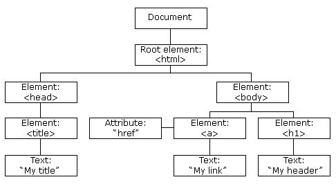

# HTML DOM 方法

> 原文：<https://www.freecodecamp.org/news/html-dom-methods/>

## 查询选择器()

文档方法`querySelector()`返回文档中与指定选择器或选择器组匹配的`first`元素。如果没有找到匹配项，则返回 null。

### HTML 内容:

```
<div id="id-example"></div>
<div class="class-example"></div>
<a>element-example</a> 
```

### JavaScript 内容:

```
document.querySelector("#id-example"); // Returns the element with id "id-example"
document.querySelector(".class-example"); // Returns the element with class "class-example"
document.querySelector("a"); // Returns the "a" element 
```

注意`querySelector()`返回第一个匹配的元素，要返回所有的匹配，使用 querySelectorAll()方法代替。

```
<div id="example">First</div>
<div id="example">Second</div>
```

```
document.querySelector("#example"); // Returns only the element containing 'First'
```

## **innerHTML**

属性返回所选元素中的 HTML 内容，并允许您定义新的 HTML 内容。

### 获取元素内容

```
<div id="demo">
  <p>Demo</p>
</div>
```

```
var element = document.getElementById("demo");
console.log(element.innerHTML) //logs <p>Demo</p>
```

### 设置元素内容

```
<div id="demo"></div>
```

```
var element = document.getElementById("demo");
element.innerHTML = "<div>Demo</div>";
```

现在的 HTML 会是这样的

```
<div id="demo">
  <div>Demo</div>
</div>
```

### 安全考虑

设置为`innerHTML`的值应该来自可信的来源，因为 Javascript 会将任何内容放入该元素中，并作为普通的 HTML 运行。

示例:

设置“`<script>alert();</script>`”值将导致 Javascript“alert()”函数被触发:

```
var element = document.getElementById("demo");

element.innerHTML = "<script>alert();</script>";
```

这种类型的攻击被称为[跨站脚本，简称为](https://en.wikipedia.org/wiki/Cross-site_scripting)。

这是 XSS 袭击最常见的方式之一。如果你想了解更多一点，并学会防御它，[查看这个资源](https://xss-game.appspot.com/)。

## getElementById()

`getElementById()`方法返回具有指定值的 id 属性的元素。它接受一个参数，这是您想要的元素的 id 的区分大小写的字符串。

该方法是 HTML DOM 中最常见的方法之一，几乎每次您想要操作文档中的元素或从中获取信息时都会用到。下面是一个简单的语法示例:

****HTML 内容:****

```
<div id="demo"></div>
```

****JavaScript 内容:****

```
document.getElementById("demo"); // Returns the element with id "demo"
```

如果你有多个元素有相同的值`id`(不好的做法！)，`getElementById`将返回找到的第一个元素:

```
<div id="demo">First</div>
<div id="demo">Second</div>
```

```
document.getElementById("demo"); // Returns the element with id "demo" containing 'First'
```

#### **更多信息:**

[文件. getElementById()](https://developer.mozilla.org/en-US/docs/Web/API/Document/getElementById)

#### **备选方案:**

一个常用的替代`document.getElementById`的方法是使用 jQuery 选择器，你可以在这里读到更多的[。](https://github.com/freeCodeCamp/guides/tree/master/src/pages/jquery)

## 关于 HTML DOM 的更多信息

使用 HTML DOM，JavaScript 可以访问和更改 HTML 文档的所有元素。

当一个网页被加载时，浏览器创建该网页的一个**文档 ****O**** 对象 ****M**** 模型。**

**HTML DOM 模型被构造为对象树:**

**DOM 中的每个元素也称为一个节点。**

```
`<html>
<head>
  <title> My title </title>
</head>
<body>
  <a href="#">My Link</a>
  <h1> My header </h1>
</body>
</html>`
```

**上述 HTML 的 DOM 如下所示:**

****

**有了对象模型，JavaScript 获得了创建动态 HTML 所需的全部能力:**

*   **JavaScript 可以改变页面中的所有 HTML 元素**
*   **JavaScript 可以改变页面中的所有 HTML 属性**
*   **JavaScript 可以改变页面中所有的 CSS 样式**
*   **JavaScript 可以删除现有的 HTML 元素和属性**
*   **JavaScript 可以添加新的 HTML 元素和属性**
*   **JavaScript 可以对页面中所有现有的 HTML 事件做出反应**
*   **JavaScript 可以在页面中创建新的 HTML 事件**