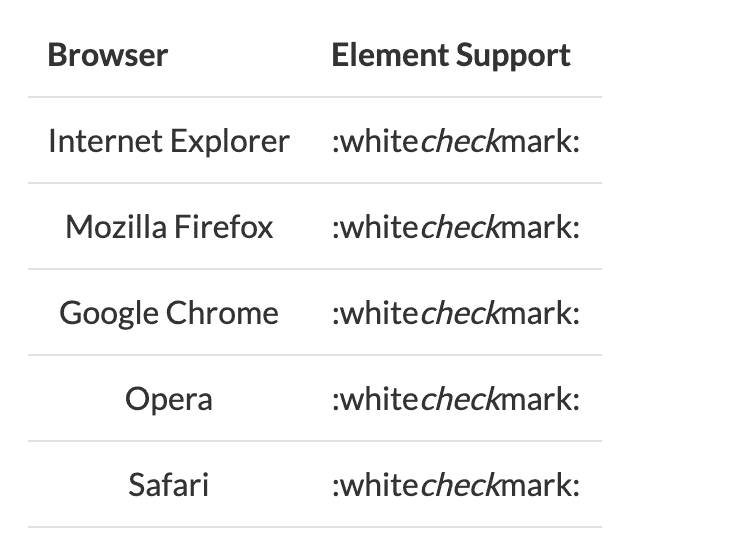
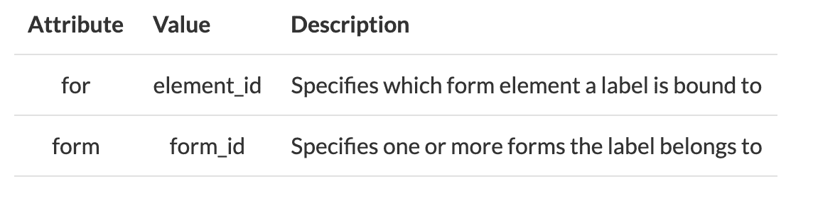
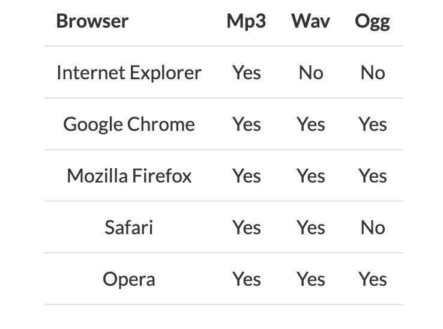
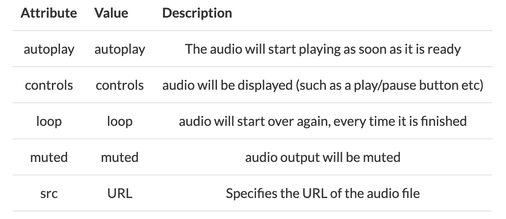
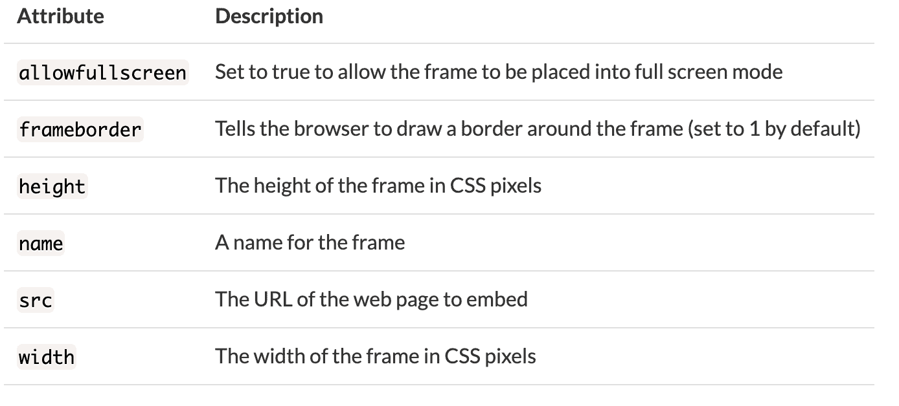

# HTML 元素讲解:什么是 HTML 标签，如何使用？

> 原文：<https://www.freecodecamp.org/news/html-elements-explained-what-are-html-tags/>

## 什么是 HTML 元素？

元素是 HTML 的构建块，描述网页的结构和内容。它们是超文本标记语言(HTML)的“标记”部分。

HTML 语法使用尖括号(“”)来保存 HTML 元素的名称。元素通常有一个开始标签和一个结束标签，并给出关于它们包含的内容的信息。两者的区别在于结束标记有一个正斜杠。

让我们看一些 HTML 标签的具体例子。

## p 元素

标签代表段落，这是在 HTML 文档中创建文本行最常用的标签。

使用`<p>`与其他标签兼容，允许添加超链接(`<a>`)和粗体(`<strong>`)文本等。

### 例子

```
<html>
  <head>
    <title>Paragraph example</title>
  </head>
  <body>
    <p>
      This is a paragraph. It is the first of many.
    </p>
    <p>
      This is another paragraph. It will appear on a separate line.
    </p>
  </body>
</html> 
```

您也可以在段落中嵌套锚元素`<a>`。

### 例子

```
<p>Here's a <a href="https://freecodecamp.org">link to freeCodeCamp</a>.</p>
```

## 标题元素

有六个标题元素— `<h1>`、`<h2>`、`<h3>`、`<h4>`、`<h5>`、`<h6>`。

标题元素用于表示其下方内容的重要性。标题编号越低，重要性越高。

例如，`<h1>`元素代表页面的主标题，每页应该只有一个。这有助于搜索引擎理解页面的主题。`<h2>`元素的重要性较低，应低于较高级别的`<h1>`元素。

### 例子

```
<h1>This is main heading.</h1>
<h2>This is subheading h2.</h2>
<h3>This is subheading h3.</h3>
<h4>This is subheading h4.</h4>
<h5>This is subheading h5.</h5>
<h6>This is subheading h6.</h6> 
```

## 一种元素

anchor ( `<a>`)元素创建一个到另一个页面或文件的超链接。为了链接到不同的页面或文件，`<a>`标签还必须包含一个`href`属性，该属性指示链接的目的地。

开始和结束标签`<a>`之间的文本成为链接。该文本应该是对链接目的地的有意义的描述，而不是“单击此处”这样的普通短语。这更好地使拥有屏幕阅读器的用户能够在页面上的各种链接中导航，并了解每个链接将链接到什么内容。

默认情况下，链接页面显示在当前浏览器窗口中，除非指定了另一个目标。默认链接样式如下:

*   未访问的链接带有下划线且为蓝色
*   已访问的链接带有下划线并且是紫色的
*   活动链接带有红色下划线

### 例子

```
 <a href= "https://guide.freecodecamp.org/">freeCodeCamp</a> 
```

您也可以创建指向同一页面上另一部分的链接:

```
 <h1 id="top"></h1>
  <a href= "#top">Go to top</a> 
```

通过将``标签包含在`<a>`标签中，图像也可以变成链接:

```
 <a href= "https://guide.freecodecamp.org/"></a> 
```

## 列表元素

HTML 中的列表主要有两种类型:有序的(`<ol>`)和无序的(`<ul>`)。所有列表必须包含一个或多个列表元素(`<li>`)。

### 无序列表

无序列表以`<ul>`标签开始，列表项以`<li>`标签开始。在无序列表中，默认情况下所有列表项都标有项目符号。

```
<ul>
  <li>Item</li>
  <li>Item</li>
  <li>Item</li>
</ul> 
```

输出:

*   项目
*   项目
*   项目

### 有序列表

有序列表以`<ol>`标签开始，列表项以`<li>`标签开始。在有序列表中，所有列表项都标有数字。

```
<ol>
  <li>First Item</li>
  <li>Second Item</li>
  <li>Third Item</li>
</ol> 
```

输出:

1.  第一次
2.  第二项
3.  第三项

## em 元素

元素用于在 HTML 文档中用*强调*文本。这可以通过将你想要强调的文本分别包装在一个`<em>`标签和一个`</em>`标签中来实现。大多数浏览器会将包裹在`<em>`标签中的文本显示为斜体。

注意:`<em>`标签不应该被用来使文本在风格上倾斜。标签用于强调文本。通常，CSS 格式用于文本的斜体样式。

### 例子

```
<body>
  <p>
    Text that requires emphasis should go <em>here</em>.
  </p>
</body> 
```

## I 元素

`<i>`元素用于表示以某种方式与其周围文本分开的文本。默认情况下，`<i>`标签包围的文本将以斜体显示。

在以前的 HTML 规范中，`<i>`标签仅用于表示要斜体显示的文本。然而，在现代语义 HTML 中，应该在适当的地方使用像`<em>`和`<strong>`这样的标签。

您可以使用`<i>`元素的`class`属性来说明为什么标签中的文本不同于周围的文本。您可能想要显示文本或短语来自不同的语言:

```
<p>The French phrase <i class="french">esprit de corps</i> is often 
used to describe a feeling of group cohesion and fellowship.</p> 
```

## 强元素

元素用于表示非常重要或紧急的文本。大多数浏览器会将包裹在`<strong>`标签中的文本显示为粗体。

注意:`<strong>`标签不应该用来将文本设为粗体。使用 CSS 来做到这一点。

### 示例:

```
<body>
  <p>
    <strong>This</strong> is really important.
  </p>
</body> 
```

## img 元素

一个简单的 HTML ``元素可以包含在一个 HTML 文档中，如下所示:

```
 
```

注意``元素是自结束的，不需要结束标签。

标签为图像提供替代文本。标签的一个用途是为有视觉障碍的人使用屏幕阅读器；他们可以通过阅读图像的`alt`标签来理解图像的含义。

`title`属性是可选的，它将提供关于图像的附加信息。当用户悬停在工具提示上时，大多数浏览器会在工具提示中显示这些信息。

请注意，图像文件的路径可以是相对的，也可以是绝对的。另外，记住`img`元素是自结束的，这意味着它不会以`</img>`标签结束，而是以一个`>`结束。

### 例子

```
 
```

(这是假设 HTML 文件在[https://example.com/index.html](https://example.com/index.html)，所以它和图像文件在同一个文件夹中)

与以下内容相同:

```
 
```

有时一个``元素也会使用另外两个属性来指定它的大小，`height`和`width`，如下所示:

```
 
```

值是以像素为单位指定的，但是大小通常是用 CSS 而不是 HTML 来指定的。

## **导航元素**

`<nav>`元素用于导航链接的主要部分。不是文档的所有链接都应该在一个`<nav>`元素中。

浏览器(如针对残障用户的屏幕阅读器)可以使用此元素来确定是否忽略此内容的初始呈现。

### 例子

```
<nav class="menu">
  <ul>
    <li><a href="#">Home</a></li>
    <li><a href="#">About</a></li>
    <li><a href="#">Contact</a></li>
  </ul>
</nav>
```

## **表头元素**

标签是一个用于导航链接或介绍性内容的容器。它可能通常包含标题元素，如`<h1>`、`<h2>`，但也可能包含其他元素，如搜索表单、徽标、作者信息等。

虽然不是必需的，`<header>`标签旨在包含周围的章节标题。它也可以在 HTML 文档中多次使用。需要注意的是,`<header>`标签并没有引入新的部分，它只是一个部分的头。

### 例子

```
<article>
  <header>
    <h1>Heading of Page</h1>
  </header>
    <p>Lorem ipsum dolor sit amet, consectetur adipiscing elit.</p>
</article>
```

## **textarea 元素**

HTML textarea 标签允许您输入一个包含用户反馈或交互文本的框。在大多数情况下，textarea 被用作表单的一部分是很常见的。

程序员使用 textarea 标签为用户输入创建多行字段(特别是在用户应该能够在表单上放置较长文本的情况下)。程序员可以为 textarea 标签指定不同的属性。

### 例子

```
 <form>
      <textarea name="comment" rows="8" cols="80" maxlength="500" placeholder="Enter your comment here..." required></textarea>
    </form>
```

最常见的属性:`row`和`cols`属性决定了文本区的高度和宽度`placeholder`属性指定了用户可见的文本，它帮助用户理解应该在其中键入什么数据`maxlength`属性决定了文本区可以键入的最大文本长度，用户不能提交更多的字符`required`属性意味着该字段必须在表单提交之前填写。

## 标签元素

标签定义了一个元素的标签。

可以通过使用“for”属性或者通过将元素放在**元素中来将标签绑定到元素。**

### 例子

```
<label for="id">Label</label>
<input type="text" name="text" id="id" value="yourvalue"><br>
```

如您所见，**标签的属性的*应该等于相关元素的 id 属性，以便将它们绑定在一起。***

### 平台支持



### 属性



### **全局属性**

`<label>`标签支持 HTML 中的全局属性。

### **事件属性**

`<label>`标签支持 HTML 中的事件属性。

`<label>`元素对用户来说没有任何特殊之处。然而，它为鼠标用户提供了可用性改进，因为如果用户点击**元素中的文本，它就会切换控件。**

## **元标签**

`<meta>`标签提供了关于 HTML 文档的元数据。

该元数据用于指定页面的字符集、描述、关键字、作者和页面的视口。

这些元数据不会出现在网站上，但浏览器和搜索引擎会使用它们来确定页面如何显示内容，并评估搜索引擎优化(SEO)。

### 例子

```
<head>
  <meta charset="UTF-8">
  <meta name="description" content="Short description of website content here">
  <meta name="keywords" content="HTML,CSS,XML,JavaScript">
  <meta name="author" content="Jane Smith">
  <meta name="viewport" content="width=device-width, initial-scale=1.0">
<!-- HTML5 introduced a method to let web designers take control over the viewport, through the <meta> tag. The viewport is the user's visible area of a web page. A <meta> viewport element gives the browser instructions on how to control the page's dimensions and scaling. -->  
</head>
```

## **div 元素**

标签是一个通用的容器，它定义了 HTML 文档中的一个部分。一个`<div>`元素用于将 HTML 元素的各个部分组合在一起，并用 CSS 对它们进行格式化。

一个`<div>`是一个块级元素。这意味着它在屏幕上占据了自己的一行。紧跟在`<div>`之后的元素将被下推到下一行。对于类似的分组和样式，不是块级的，而是内联的，你可以使用`<span>`标签。标签用于对文档中的行内元素进行分组。

### **例子**

以下是如何以相同颜色显示部分的示例:

```
<div style="color:#ff0000">
  <h3>my heading</h3>
  <p>my paragraph</p>
</div>
```

## 截面元素

`<section>`元素定义了一个没有更具体的语义 HTML 元素来表示的部分。通常，`<section>`元素会包含一个标题元素(`<h1>` - `<h6>`)作为子元素。

例如，一个网页可以分成不同的部分，如欢迎、内容和联系部分。

如果需要一个通用容器，那么不应该用一个`<section>`元素来代替一个`<div>`元素。它应该用于定义 HTML 页面中的节。

```
<html>
<head>
  <title>Section Example</title>
</head>
<body>
  <section>
    <h1>Heading</h1>
    <p>Bunch of awesome content</p>
  </section>
</body>
</html> 
```

## **页脚元素**

标签表示一个 HTML 文档或部分的页脚。通常，页脚包含关于作者、版权信息、联系信息和站点地图的信息。标签中的任何联系信息都应该放在标签`<address>`中。

### **例子**

```
<html>
<head>
  <title>Paragraph example</title>
</head>
<body>
  <footer>
    <p>&copy; 2017 Joe Smith</p>
  </footer>
</body>
</html>
```

## **音频元素**

标签定义了一个音频元素，可以用来将音频媒体资源添加到一个 HTML 文档中，该文档将由内置于浏览器中的本地音频播放支持来播放，而不是由浏览器插件来播放。

音频标签目前支持三种文件格式 OGG，MP3 和 WAV，可以添加到您的 html 如下。

### 添加 OGG

```
<audio controls>
  <source src="file.ogg" type="audio/ogg">
</audio>
```

### 添加 MP3

```
<audio controls>
  <source src="file.mp3" type="audio/mpeg">
</audio>
```

### 添加 WAV

```
<audio controls>
  <source src="file.wav" type="audio/wav">
</audio>
```

它可能包含一个或多个音频源，使用 src 属性或 source 元素表示。

### 添加多个音频文件

```
<audio controls>
  <source src="file-1.wav" type="audio/wav">
  <source src="file-2.ogg" type="audio/ogg">
  <source src="file-3.mp3" type="audio/mpeg">
</audio>
```

### 浏览器对不同文件类型的支持如下



### **支持的属性**



## **iframe 元素**

HTML `<iframe>`元素代表一个内嵌框架，它允许你将一个独立的 HTML 文档包含到当前的 HTML 文档中。`<iframe>`通常用于嵌入第三方媒体、您自己的媒体、小部件、代码片段或嵌入第三方小程序，如支付表单。

### **属性**

下面列出了`<iframe>`的一些属性:



Iframe 标签用于将现有的网页或应用程序添加到您的网站的设定空间内。

当使用 iframe 标签时，应该使用 src 属性来指示要在框架中使用的网页或应用程序的位置。

```
<iframe src="framesite/index.html"></iframe>
```

您可以设置宽度和高度属性来限制框架的大小。

```
<iframe src="framesite/index.html" height="500" width="200"></iframe>
```

默认情况下，Iframes 有一个边框，如果您想删除它，可以通过使用 style 属性并将 CSS border 属性设置为 none 来实现。

```
<iframe src="framesite/index.html" height="500" width="200" style="border:none;"></iframe>
```

### **例题**

嵌入带有`<iframe>`的 YouTube 视频:

```
<iframe width="560" height="315" src="https://www.youtube.com/embed/v8kFT4I31es" 
frameborder="0" allowfullscreen></iframe>
```

嵌入带有`<iframe>`的谷歌地图:

```
<iframe src="https://www.google.com/maps/embed?pb=!1m18!1m12!1m3!1d774386.2436462595!2d-74.53874786161381!3d40.69718109704434!2m3!1f0!2f0!3f0!3m2!1i1024!2i768!4f13.1!3m3!1m2!1s0x89c24fa5d33f083b%3A0xc80b8f06e177fe62!2sNew+York%2C+NY%2C+USA!5e0!3m2!1sen!2sau!4v1508405930424" 
width="600" height="450" frameborder="0" style="border:0" allowfullscreen></iframe>
```

### **备选文本**

开始和结束`<iframe>`标记之间的内容用作可选文本，如果查看者的浏览器不支持 iframes，则显示该文本。

```
<iframe width="560" height="315" src="https://www.youtube.com/embed/v8kFT4I31es" frameborder="0">
  <p>Your browser does not support iframes.</p>
</iframe>
```

### **以链接中的 iframe 为目标**

任何锚元素都可以指向`<iframe>`元素的内容。它不会将浏览器窗口重定向到链接的网页，而是会重定向`<iframe>`。为此，`<a>`元素的`target`属性必须匹配`<iframe>`元素的`name`属性。

```
<iframe width="560" height="315" src="about:blank" frameborder="0" name="iframe-redir"></iframe>

<p><a href="https://www.youtube.com/embed/v8kFT4I31es" target="iframe-redir">Redirect the Iframe</a></p>
```

这个例子最初会显示一个空白的`<iframe>`，但是当你点击上面的链接时，它会重定向`<iframe>`来显示一个 YouTube 视频。

### **JavaScript 和 iframe**

嵌入在`<iframe>`中的文档可以正常地在它们自己的上下文中运行 JavaScript(不影响父网页)。

父网页和嵌入的内容`<iframe>`之间的任何脚本交互都受同源策略的约束。这意味着，如果您从不同的域加载`<iframe>`的内容，浏览器将阻止任何使用 JavaScript 访问该内容的尝试。