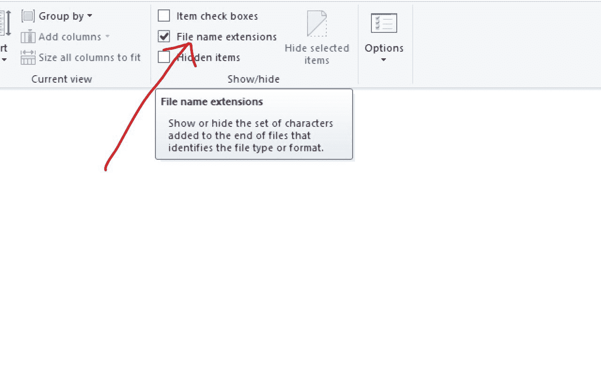
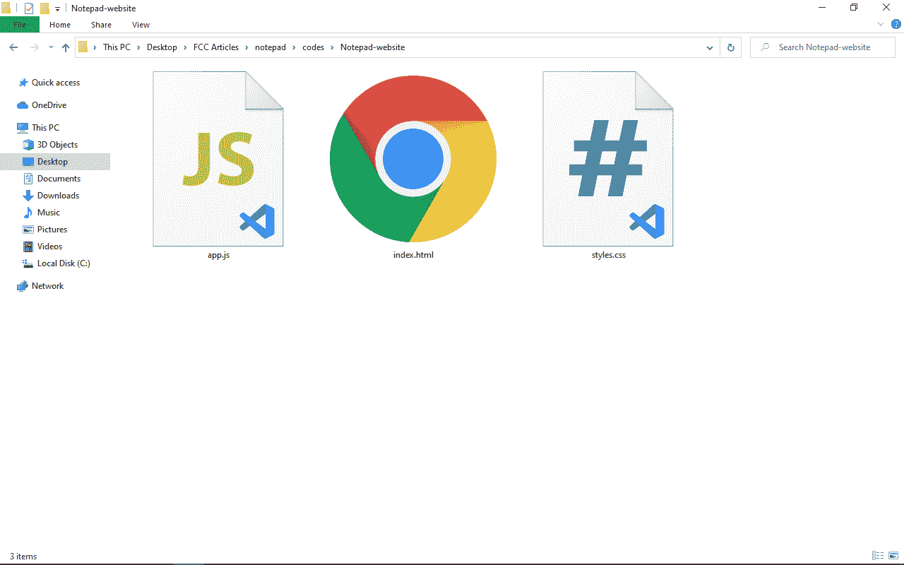
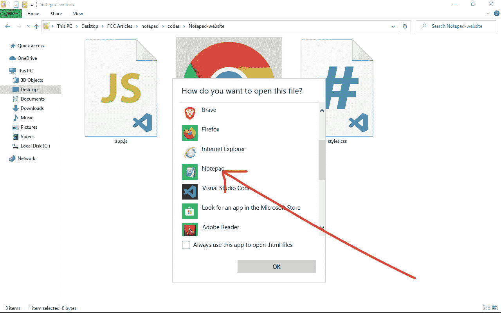
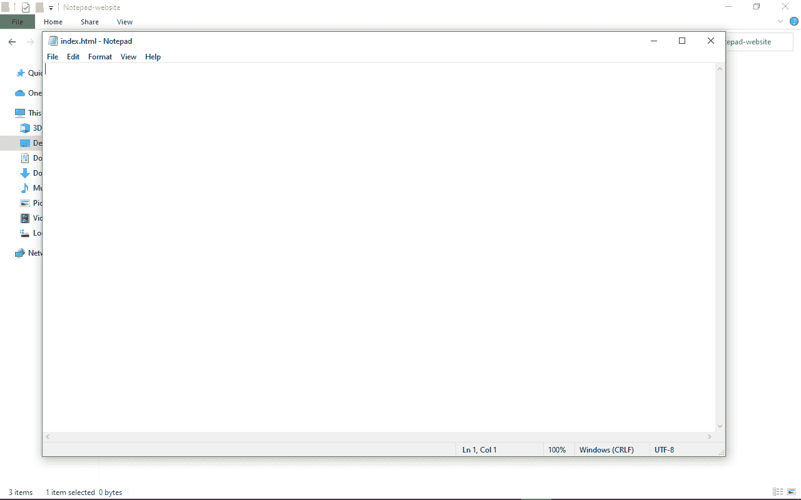
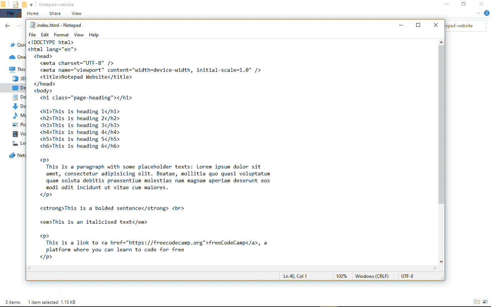
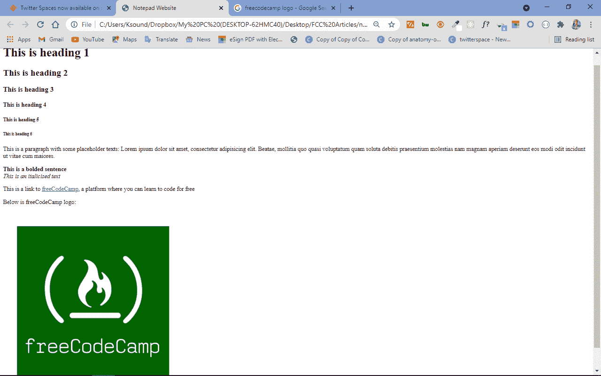
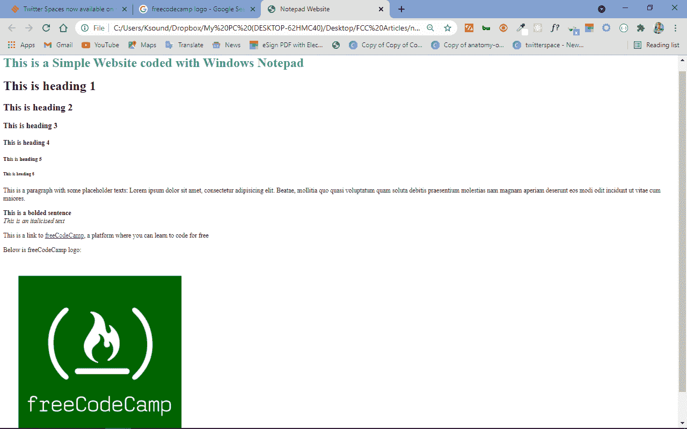

# HTML 文件文本编辑器–如何在 Windows 记事本中打开网页代码

> 原文：<https://www.freecodecamp.org/news/html-file-text-editor-how-to-open-web-page-code-in-windows-notepad/>

记事本是一个内置的文本编辑器，预装在所有版本的 Windows 计算机上，包括 XP、Windows 7、Windows 8、Windows 10 等。

它是默认的 Windows 文本编辑器。你可以把记事本看作是你的 VS 代码或者是你最喜欢的文本编辑器，功能比较少。

用记事本编码对初学者来说非常好，因为您无法使用语法高亮、格式化和其他类似的自动化特性。

如果没有这些助手，在开始使用其他文本编辑器(如 VS Code、Sublime Text 或 Atom)编码之前，您将学会关注细节、毅力、弹性以及如何自己格式化代码。

因此，在本文中，我将带您了解如何使用 Windows 记事本，以及如何使用它通过 HTML、一点 CSS 和 JavaScript 创建一个简单的网站来打开任何网页代码。

## 如何在记事本中编写一个简单的网站

您可以使用记事本以两种方式进行编码:直接从您的 Windows 计算机启动记事本并开始编码，然后稍后保存代码，或者创建文件并用记事本打开它。

在本教程中，我将重点介绍第二种方法，所以我将首先创建文件，然后用记事本打开它们。

**步骤** 1:在你电脑上的任何地方创建一个文件夹
步骤 2 :在文件夹的主菜单部分，点击“查看”标签，确保勾选“文件扩展名”。这将允许您创建文件并指定扩展名。



**第三步**:在文件夹里面，创建一个名为`index.html`的 HTML 文件，一个名为`styles.css`的 CSS 文件，一个名为`app.js`的 JavaScript 文件。



这些名字是按照惯例取的。如果您不想遵循惯例，您可以随意命名这些文件。

**第四步**:右键点击`index.html`，悬停在“打开方式”选项上。这将显示您可以用来打开文件的应用程序。选择记事本。


默认情况下，index.html 文件将由您的默认浏览器打开，因此请确保您没有双击该文件。

如果选项中没有显示记事本，单击“选择另一个应用程序”，在下一个弹出窗口中选择“更多应用程序”，您将在列出的应用程序中看到记事本。



现在，您应该已经用记事本打开了 HTML 文件。您将看到类似这样的内容(如果您做对了):



**步骤 5** :粘贴以下 HTML 代码:

```
<!DOCTYPE html>
<html lang="en">
  <head>
    <meta charset="UTF-8" />
    <meta name="viewport" content="width=device-width, initial-scale=1.0" />
    <title>Notepad Website</title>
  </head>
  <body>
    <h1 class="page-heading"></h1>

    <h1>This is heading 1</h1>
    <h2>This is heading 2</h2>
    <h3>This is heading 3</h3>
    <h4>This is heading 4</h4>
    <h5>This is heading 5</h5>
    <h6>This is heading 6</h6>

    <p>
      This is a paragraph with some placeholder texts: Lorem ipsum dolor sit
      amet, consectetur adipisicing elit. Beatae, mollitia quo quasi voluptatum
      quam soluta debitis praesentium molestias nam magnam aperiam deserunt eos
      modi odit incidunt ut vitae cum maiores.
    </p>

    <strong>This is a bolded sentence</strong> <br>

    <em>This is an italicised text</em>

    <p>
      This is a link to <a href="https://freecodecamp.org">freeCodeCamp</a>, a
      platform where you can learn to code for free
    </p>

    <p>Below is freeCodeCamp logo:</p>

    
  </body>
</html> 
```

你的记事本应用程序现在应该充满代码:


通过按 Ctrl + S 保存文件，或者转到文件并单击“保存”。

如果你的代码不像我的那样缩进，不要担心。记事本不会自动帮你做，你得手动做。

**第六步**:现在 HTML 文件准备好了。返回到您在步骤 3 中创建 HTML、CSS 和 JavaScript 文件的文件夹。双击 HTML 文件，在默认浏览器中打开它。

网站现在应该是这样的:


打开您在**步骤 3** 中创建的 CSS 文件，并粘贴以下代码:

```
.page-heading {
  color: #2ecc71;
} 
```

如果您重新加载页面，您将看到没有任何变化。完全不用担心。这是因为 HTML 文件中带有类`page-heading`的`h1`标签为空。

现在，您可以用 JavaScript 动态地将一些文本插入到`h1`标签中。

打开在**步骤 3** 中创建的 JavaScript 文件，并粘贴以下代码:

```
const pageHeadingText = "This is a Simple Website coded with Windows Notepad";
const pageHeading = document.querySelector(".page-heading");

pageHeading.innerHTML = pageHeadingText; 
```

上面的 JavaScript 代码在做什么？

我声明了一个名为`pageHeadingText`的变量，并将其设置为一个字符串`“This is a Simple Website coded with Windows Notepad”`。

我声明了另一个名为`pageHeading`的变量来选择 HTML 中的空 h1 标签。我用 DOM(文档对象模型)`querySelector`方法做到了这一点。

在 JavaScript 代码的第三行，我使用 DOM 的`innerHTML`方法将`h1`的文本内容设置为`pageHeadingText`变量的值，我将该值设置为`“This is a Simple Website coded with Windows Notepad”`。

现在，回到网站重新加载。还是没有区别。不要再担心了。这是因为你必须链接 CSS 和 JavaScript 文件。

要链接 CSS 文件，请将以下代码粘贴到 HTML 的 head 部分:

```
<link rel="stylesheet" href="styles.css" /> 
```

要链接 JavaScript 文件，请将下面的代码粘贴到 HTML 中的结束 body 标记之前:

```
<script src="app.js"></script> 
```

HTML 文件现在应该具有如下链接的 CSS 和 JavaScript 文件:

```
<!DOCTYPE html>
<html lang="en">
  <head>
    <meta charset="UTF-8" />
    <meta name="viewport" content="width=device-width, initial-scale=1.0" />
    <title>Notepad Website</title>

    <!-- CSS Link -->
    <link rel="stylesheet" href="styles.css" />

  </head>
  <body>
    <h1 class="page-heading"></h1>

    <h1>This is heading 1</h1>
    <h2>This is heading 2</h2>
    <h3>This is heading 3</h3>
    <h4>This is heading 4</h4>
    <h5>This is heading 5</h5>
    <h6>This is heading 6</h6>

    <p>
      This is a paragraph with some placeholder texts: Lorem ipsum dolor sit
      amet, consectetur adipisicing elit. Beatae, mollitia quo quasi voluptatum
      quam soluta debitis praesentium molestias nam magnam aperiam deserunt eos
      modi odit incidunt ut vitae cum maiores.
    </p>

    <strong>This is a bolded sentence</strong>

    <em>This is an italicised text</em>

    <p>
      This is a link to <a href="https://freecodecamp.org">freeCodeCamp</a>, a
      platform where you can learn to code for free
    </p>

    <p>Below is freeCodeCamp logo:</p>

    

    <!-- JavaScript Link -->
    <script src="app.js"></script>

  </body>
</html> 
```

如果您现在重新加载页面，您应该会看到一个不同之处:



CSS 和 JavaScript 文件中的代码现在可以工作了。

## 结论

Windows 记事本是一个文本编辑器，就像 S 代码、Atom、Sublime Text 等等。它只是没有其他更高级的文本编辑器的特性，比如语法高亮、文本格式化、内置终端等等。但是它仍然执行文本编辑器的所有功能，因为你可以用它在任何编程语言中编码。

为了获得更舒适的编码，你可以下载并安装一个像 VS Code 这样功能更丰富的文本编辑器(它是免费的！).它通过 VS 代码市场中丰富的扩展库，为您提供了语法高亮、文本格式化和几乎任何您想要的功能。

除了 VS 代码，其他可以使用的文本编辑器有 Atom、Sublime Text、Vim 和 Notepad++这是 Windows 记事本的混合版本。

感谢您阅读这篇文章。如果你发现它有帮助，请与你的朋友和家人分享。