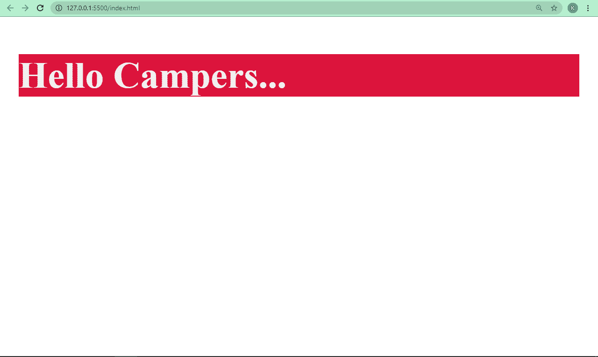
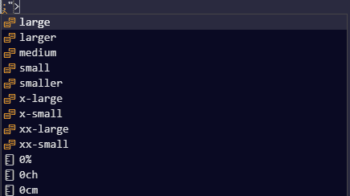
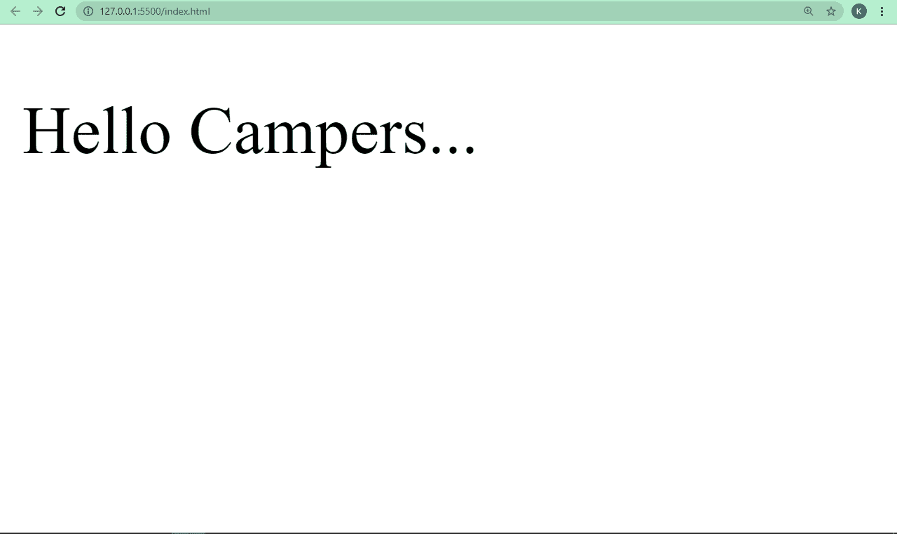
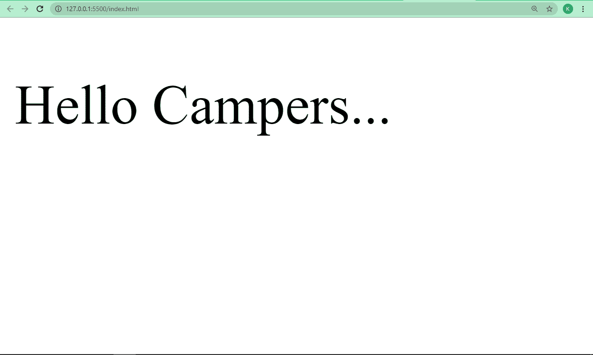

# HTML 字体大小–如何使用内联 CSS 样式改变文本大小

> 原文：<https://www.freecodecamp.org/news/html-font-size-how-to-change-text-size-using-inline-css-style/>

在 HTML 中，你选择的字体将在你的网页的外观和感觉中起主要作用。

你可以选择字体的颜色、粗细、大小等等。所有这些功能让你的网站和应用程序看起来更好，更适合用户。

使用 CSS 中的`font-size`属性，你可以改变网页上文本的大小。您可以在您编写的任何类型的 CSS 中使用该属性——外部的、内部的或内联的。

在本文中，我将向您展示如何在内联 CSS 中使用`font-size`属性来改变文本的大小。

## 什么是内联 CSS？

内联 CSS 是可以用来设计 HTML 元素样式的三种不同方式之一。

您没有使用 class 或 id 属性来定位元素，或者将元素本身作为选择器并使用它进行样式化，而是将所有 CSS 样式放在开始标记中。

此外，您必须确保样式的所有属性和值都在`style`属性中。这个`style`属性是所有 HTML 标签接受的众多属性之一。

在下面的例子中，我用内联 CSS 将文本的背景颜色改为深红色，文本颜色改为`#f1f1f1`(浅灰色)，字体粗细改为`bold`。

```
<p style="background-color: crimson; color: #f1f1f1; font-weight: bold">
      Hello Campers...
</p> 
```



顺便说一下，我的浏览器被放大到 400%的水平，这就是为什么一切都显得那么大。我没有应用任何额外的风格来实现这一点:)

## 如何使用内联 CSS 改变文本大小

要使用内联 CSS 改变文本的大小，必须使用`style`属性。您输入`font-size`属性，然后给它赋值。

有`large`、`larger`、`medium`、`small`、`x-large`等内置值:
、

在下面的代码片段中，我将“Hello Campers…”文本的大小更改为 x-large，这是 font-size 属性的内置值之一。

```
<p style="font-size: x-large">Hello Campers...</p> 
```



您还可以使用任何单位的数字来设置`font-size`属性的值，例如像素(px)、rem 或 em。

最好使用数字值，因为它们给你更多的自由来选择你想要的字体大小。

在下面的代码片段中，我用内联 CSS 将文本的大小更改为`30px`:

```
<p style="font-size: 30px">Hello Campers...</p> 
```



## 结论

在本文中，您了解了如何使用内联 CSS 和 font-size 属性来更改文本大小。您还看到了如何为 font-size 属性赋值。

不过，提醒一下:内联 CSS 非常适合样式化，但是你不应该过分依赖它，因为它会使你的 HTML 难以阅读，尤其是当你在团队中工作的时候。你不想成为唯一能够阅读你自己代码的人。

请注意，它还会覆盖任何具有内部或外部样式的样式集。您应该使用外部样式或内部样式，因为它们使您的 HTML 和 CSS 代码分开，这对于可读性更好。

例如，在给`font-size`属性赋值时，最好是用 rem 单位而不是`px`来赋值。这是因为当你使用`rem`时，浏览器将能够随着用户放大或缩小而调整字体大小，而当你使用`px`时，这种情况不会发生。

感谢阅读，继续编码。