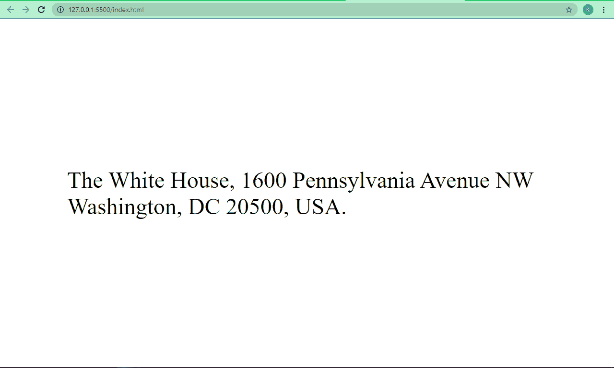
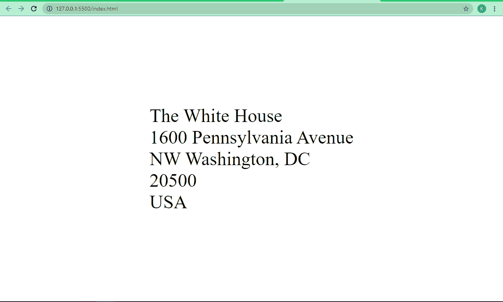
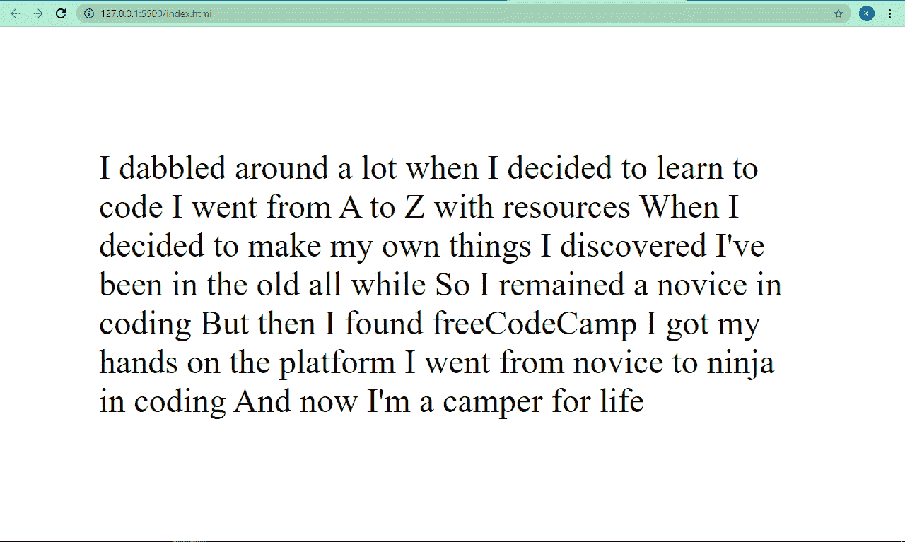
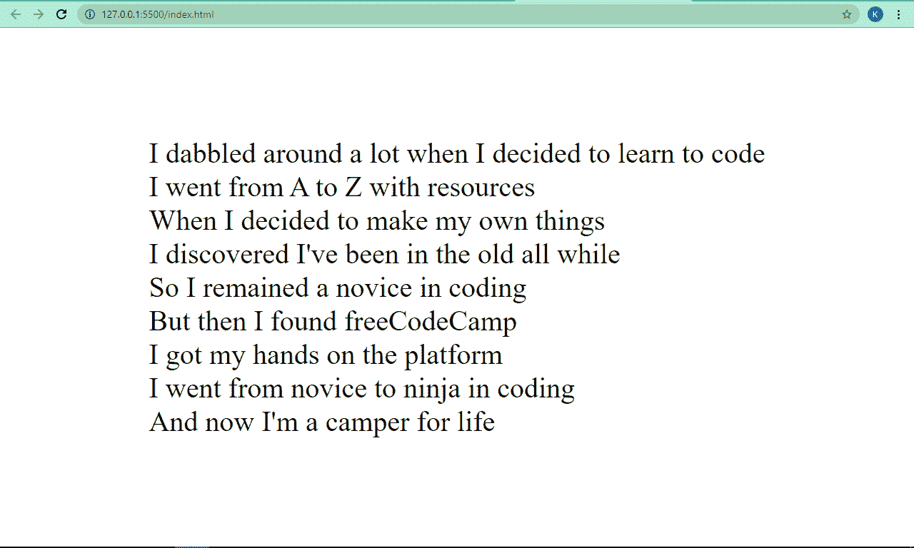

# HTML 换行–如何用 HTML
标签换行

> 原文：<https://www.freecodecamp.org/news/html-line-break-how-to-break-a-line-with-the-html-br-tag/>

当你写 HTML 的时候，你经常需要插入换行符。在地址、诗歌或文本超出可用浏览器宽度时，换行符是必不可少的。如果您没有插入自己的换行符，那么文本会以一种奇怪的方式格式化。

在本教程中，我将通过一些“有和没有”的例子向您展示如何在 HTML 代码中插入换行符，这样您就可以开始正确地使用它，并更好地格式化您的文本。

## 基本 HTML 换行符语法

您可以用`<br>`标签在 HTML 中插入换行符，这相当于键盘上的回车。

请注意，HTML 将忽略键盘回车键的任何换行符。

```
<br /> 
```

如果你想知道为什么上面的`<br>`标签中有一个正斜杠，这个斜杠在 HTML4 仍然被广泛使用的时候是很重要的。有了 HTML5，你再也不需要在里面加斜杠了。但两者都会做同样的事情。

如果你使用的是像 prettier 这样的代码格式器，当你保存或者粘贴的时候，它总是会插入斜线，即使你没有把它放在那里。

## 如何在地址中插入分行符

例如，当你在信中写地址时，换行符是很重要的，以便正确地格式化它。

### 这是一个没有换行符的地址示例

没有换行符(`<br>`标记)的地址如下所示:

```
<p>
     The White House, 1600 Pennsylvania Avenue NW Washington, DC 20500, USA.
</p> 
```

我添加了一些 CSS 代码，使 Flexbox 的所有内容居中，并使文本变大一点:

```
body {
    display: flex;
    align-items: center;
    justify-content: center;
    height: 100vh;
    font-size: 3rem;
    max-width: 1000px;
    margin: 0 auto;
} 
```

这是它在浏览器中的样子:


### 这是一个换行的地址

这就是我们如何添加换行符来正确格式化我们的地址:

```
<p>
    The White House <br />
    1600 Pennsylvania Avenue <br />
    NW Washington, DC <br />
    20500 <br />
    USA
</p> 
```

在浏览器中看起来是这样的:



## 如何给诗歌添加换行符

传统上，诗歌是用简短的断句来写的，目的是创造视觉层次，并很好地格式化它们。

所以，如果你想在你的 HTML 代码中写一首诗，`<br>`标签使格式化过程对你来说更容易。

### 一首没有分行的诗

```
<p>
      I dabbled around a lot when I decided to learn to code 
      I went from A to Z with resources 
      When I decided to make my own things 
      I discovered I've been in the old all while 
      So I remained a novice in coding 
      But then I found freeCodeCamp 
      I got my hands on the platform 
      I went from novice to ninja in coding 
     And now I'm a camper for life
</p> 
```

在浏览器中看起来是这样的:



你可以看到这首诗没有视觉层次，格式不对，所以作为一首诗是不可读的。

### 一首有分行的诗

```
<p>
      I dabbled around a lot when I decided to learn to code <br />
      I went from A to Z with resources <br />
      When I decided to make my own things <br />
      I discovered I've been in the old all while <br />
      So I remained a novice in coding <br />
      But then I found freeCodeCamp <br />
      I got my hands on the platform <br />
      I went from novice to ninja in coding <br />
      And now I'm a camper for life <br />
</p> 
```

我还改变了 CSS 中的字体大小:

```
body {
   display: flex;
   align-items: center;
   justify-content: center;
   height: 100vh;
   font-size: 2.5rem;
   max-width: 1000px;
   margin: 0 auto;
} 
```

浏览器中现在看起来是这样的:



你可以看到这首诗现在可读性更好了，格式也正确了。

**一些有价值的建议:**不要使用`<br>`标签在块级元素(`p`、`h1`、`h2`、`h3`、`div`等)之间强制一个空格。请改用 CSS margin 属性。

您可能想知道——既然`<br>`标签是一个元素，是否可以对它进行样式化？

嗯，有可能。但是没有真正的实际需要来设计它，因为它所做的只是创建一些空白。

## 结论

我希望这篇教程已经给了你使用`<br>`标签所需的背景知识，这样你就可以让你的 HTML 文本看起来更好。

感谢阅读，继续编码。