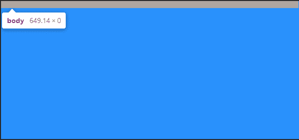

# HTML vs Body:如何设置全页面的宽度和高度

> 原文：<https://www.freecodecamp.org/news/html-page-width-height/>

CSS 很难，但也很宽容。这种宽容允许我们随意地在 CSS 中加入样式。

我们的页面仍然加载。不存在“崩溃”。

说到页面宽度和高度，你知道在 HTML 元素上设置什么吗？身体元素呢？

你是不是把两种风格都融合在一起，然后期待最好的结果？

如果你这样做了，你并不孤单。

这些问题的答案并不直观。

我对过去将样式应用于两个元素而没有准确考虑哪个属性应该应用于哪个元素的做法 100%感到内疚。🤦‍♂️

像这样将 CSS 属性应用于 HTML 和 body 元素的情况并不少见:

```
html, body {
     min-height: 100%;
} 
```

## 有关系吗？

是的，是的，它是。

上述样式定义产生了一个问题:

将两个元素的 min-height 都设置为 100%并不允许 body 元素像您预期的那样填充页面。如果在开发工具中检查计算的样式值，body 元素的高度为零。

同时，HTML 元素的高度等于浏览器中页面的可见部分。

请看下面来自 Chrome Dev Tools 的截图:



The body element has a default 8px margin indicated by the bar on top. The height value is 0.

## 为什么会这样？

使用百分比作为大小值要求元素引用父元素作为百分比的基础。

HTML 元素引用高度值等于可视视口高度的视口。然而，我们只设置了 HTML 元素的最小高度...不是高度属性值。

因此，在决定 100%等于什么时，body 元素没有父高度值可以参考。

## 而且问题可能是隐藏的

如果您开始时有足够的内容来填充页面的主体，您可能不会注意到这个问题。

更难注意到的是，如果您在两个元素上设置了背景色，或者只在其中一个元素上设置了背景色，那么视窗中就会充满这种颜色。这给人一种 body 元素与视口一样高的印象。

不是的。它仍然是零。

上图取自一个包含以下 CSS 的页面:

```
html, body {
    min-height: 100%;
}
body { background-color: dodgerblue; } 
```

### 反向遗传？

奇怪的是，如果不在 html 元素上设置单独的背景色，HTML 元素就会采用 body 元素的背景色。

## 那么，一个完整的响应页面的理想高度设置是什么呢？

多年来，答案是这样的:

```
html {
    height: 100%;
}
body {
    min-height: 100%;
} 
```

这允许 HTML 元素引用父视口，并具有等于 100%视口值的高度值。

在 HTML 元素接收高度值的情况下，分配给 body 元素的 min-height 值赋予它一个与 HTML 元素匹配的初始高度。

如果内容超出可见页面，这也允许正文变得更高。

唯一的缺点是 HTML 元素不会超出可视视口的高度。然而，允许 body 元素超出 HTML 元素被认为是可以接受的。

## **现代解决方案得到简化**

```
body { min-height: 100vh; } 
```

这个例子使用`vh`(视口高度)单位来允许身体根据视口的全高设置最小高度值。

就像前面讨论的背景色一样，如果我们不为 HTML 元素设置高度值，它将采用与 body 元素相同的高度值。

因此，这个解决方案避免了前一个解决方案中出现的 HTML 元素溢出，并且两个元素都随着内容的增长而增长！

使用`vh`单位在过去确实引起了一些移动浏览器的问题，但是[现在 Chrome 和 Safari 似乎与视窗单位一致](https://developers.google.com/web/updates/2016/12/url-bar-resizing)。

## 页面高度可能会导致水平滚动条

等等，什么？

这不是应该说“页宽”吗？

没有。

在另一系列奇怪的事件中，你的页面高度可能会激活浏览器中的水平滚动条。

当页面内容变得高于视窗高度时，右侧的垂直滚动条将被激活。这也会导致你的页面立即出现水平滚动条。

## 那么解决办法是什么？

知道它从页面宽度设置开始，您可能会睡得更好。

当任何元素(不仅仅是 HTML 或 body 元素)被设置为 100vw(视口宽度)单位时，就会出现这个问题。

视口单位不考虑垂直滚动条占据的大约 10 个像素。

因此，当垂直滚动条激活时，你也会得到一个水平滚动条。

## 如何将页面设置为全幅

也许就是不要。

不设置 HTML 和 body 元素的宽度将默认为屏幕的全尺寸。如果你设置一个宽度值而不是 auto，首先考虑使用 CSS 重置。

请记住，默认情况下，body 元素在所有边上都有 8px 的边距。

CSS 重置会消除这种情况。否则，在移除边距之前将宽度设置为 100%将导致 body 元素溢出。下面是我使用的 CSS 重置:

```
* { 
    margin: 0;
    padding: 0;
    box-sizing: border-box;
} 
```

## 如何根据您的喜好设置宽度

虽然不一定需要设置宽度，但我通常会这样做。

这可能只是一种习惯。

如果您在 body 元素上将宽度设置为 100%,您将拥有一个完整的页面宽度。这实质上相当于不设置宽度值，而使用默认值。

如果您想将 body 元素用作一个较小的容器，并让 HTML 元素填充页面，您可以在 body 上设置一个 max-width 值。

这里有一个例子:

```
html { background-color: #000; } 
body {
    min-height: 100vh;
    max-width: 400px;
    background-color: papayawhip; 
    margin: 0 auto;
}
```

## 结论

在没有为 HTML 元素提供高度值的情况下，将 body 元素的高度和/或最小高度设置为 100%会导致没有高度(在添加内容之前)。

但是，在没有为 HTML 元素提供宽度值的情况下，将 body 元素的宽度设置为 100%会导致整个页面的宽度。

这可能是违反直觉和令人困惑的。

对于响应的全页高度，将 body 元素的最小高度设置为 100vh。

如果你设置页面宽度，选择 100%而不是 100vw 来避免意外的水平滚动条。

我将从我的 YouTube 频道为您留下一个教程，演示全屏大小的 HTML 页面的 CSS 高度和宽度设置，并随着它包含的内容而增长:

[https://www.youtube.com/embed/dpuKVjX6BJ8?feature=oembed](https://www.youtube.com/embed/dpuKVjX6BJ8?feature=oembed)

你有不同的方式来设置你喜欢的 CSS 宽度和高度吗？

让我知道你的方法！