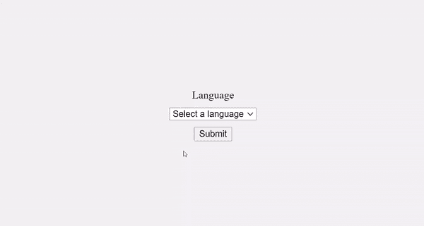
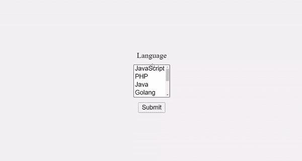
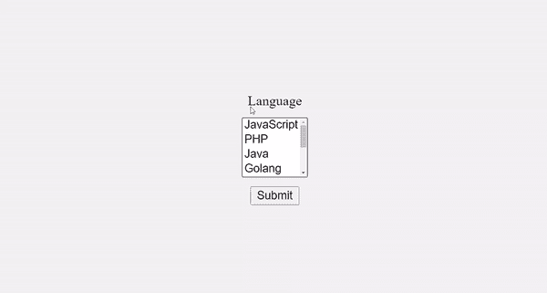
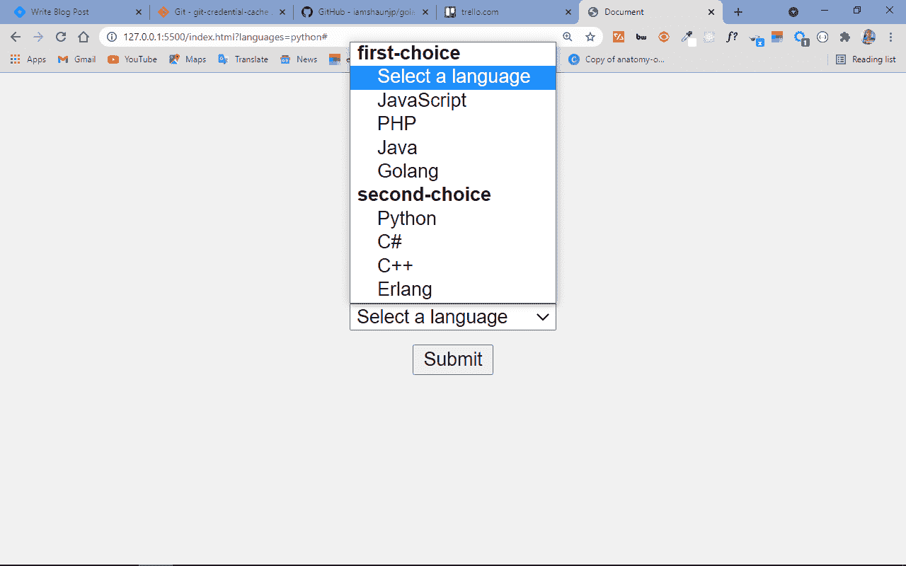
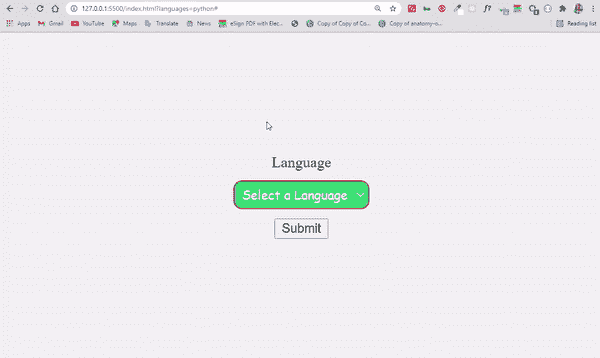

# 如何制作一个下拉菜单或组合列表

> 原文：<https://www.freecodecamp.org/news/html-select-tag-how-to-make-a-dropdown-menu-or-combo-list/>

您使用 HTML select 标记来创建下拉菜单，以便用户可以选择他们想要的值。这是收集数据并将其发送到服务器的一个重要功能。

select 标签通常放在一个表单元素中，供选择的项目放在另一个标签`<option>`中。它也可以是一个独立的元素，仍然与具有特殊属性之一的表单相关联。

在本教程中，我将带您了解如何创建一个带有 select 标签的下拉菜单，这样您就可以开始使用它在您的编码项目中收集数据。我还将谈到如何设计 select 标记的样式，因为众所周知，设计它很困难。

## 选择标签的属性

在我深入 whot 创建带有 select 标记的下拉菜单之前，我们需要讨论一下 select 标记所具有的属性。

这些是它的属性:

*   名称:您需要将名称附加到每个表单控件上，因为它在提交到服务器后用于引用数据。
*   multiple:该属性允许用户从下拉菜单中选择多个选项。
*   必需:这通常用于验证。有了它，除非用户从下拉列表中选择至少一个选项，否则表单不会提交。
*   disabled:该属性阻止用户与选项进行交互。
*   size:用数字表示，size 属性用于指定一次可以看到多少个选项。
*   autofocus:该属性用于所有表单输入，选择 inclusive，指定页面加载时输入应该是焦点。

## 如何创建带有选择标签的下拉菜单

要创建带有 select 标记的下拉菜单，首先需要一个 form 元素。这是因为其中还有一个 submit 按钮(表单元素),用于向服务器提交数据。

```
<form action="#">
      <label for="lang">Language</label>
      <select name="languages" id="lang">
        <option value="javascript">JavaScript</option>
        <option value="php">PHP</option>
        <option value="java">Java</option>
        <option value="golang">Golang</option>
        <option value="python">Python</option>
        <option value="c#">C#</option>
        <option value="C++">C++</option>
        <option value="erlang">Erlang</option>
      </select>
      <input type="submit" value="Submit" />
</form> 
```

我添加了一些简单的 CSS 来居中下拉菜单和按钮，并给主体一个浅灰色的背景:

```
body {
     display: flex;
     align-items: center;
     justify-content: center;
     margin: 0 auto;
     height: 100vh;
     background-color: #f1f1f1;
   }

input {
     display: flex;
     align-items: center;
     justify-content: center;
     margin: 0 auto;
   } 
```

为了使它更加精致和易于访问，您还可以将选择框附加到标签元素上，这样当标签文本被单击时它就会获得焦点。您可以使用以下代码来实现:

```
<form action="#">
      <label for="lang">Language</label>
      <select name="languages" id="lang">
        <option value="javascript">JavaScript</option>
        <option value="php">PHP</option>
        <option value="java">Java</option>
        <option value="golang">Golang</option>
        <option value="python">Python</option>
        <option value="c#">C#</option>
        <option value="C++">C++</option>
        <option value="erlang">Erlang</option>
      </select>
      <input type="submit" value="Submit" />
</form> 
```

我将一个数字符号(#)作为 action 属性的值，这样当您单击 submit 按钮时就不会得到 404。

但是现在我们必须对 CSS 做一点小小的改变:

```
 body {
     display: flex;
     align-items: center;
     justify-content: center;
     margin: 0 auto;
     height: 100vh; 
     background-color: #f1f1f1;
   }

input {
     display: flex;
     align-items: center;
     justify-content: center;
     margin: 0 auto;
   }

label {
     display: flex;
     align-items: center;
     justify-content: center;
     margin: 0 auto;
   }

select {
     margin-bottom: 10px;
     margin-top: 10px;
   } 
```

最终，结果是这样的:



这还没有结束。默认情况下会出现一个下拉列表项，如果用户在页面上点击 submit 按钮，这个下拉列表项就会被选中。

但这不是一个好的用户体验。你可以通过在下拉菜单的第一项中输入“选择一种语言”来摆脱它。

```
 <form action="#">
      <label for="lang">Language</label>
      <select name="languages" id="lang">
        <option value="select">Select a language</option>
        <option value="javascript">JavaScript</option>
        <option value="php">PHP</option>
        <option value="java">Java</option>
        <option value="golang">Golang</option>
        <option value="python">Python</option>
        <option value="c#">C#</option>
        <option value="C++">C++</option>
        <option value="erlang">Erlang</option>
      </select>
      <input type="submit" value="Submit" />
</form> 
```

当用户点击选择框来选择一个项目时，下拉菜单也会覆盖提交按钮——这是另一个对良好的用户体验有负面影响的事情。

您可以使用`size`属性来更改这一点，默认情况下，它将显示一定数量的项目，并显示下拉列表中其他项目的滚动。

这也让您可以去掉虚拟的第一个项目，因为有些项目会自动对用户可见。

```
 <form action="#">
      <label for="lang">Language</label>
      <select name="languages" id="lang" size="4">
        <option value="javascript">JavaScript</option>
        <option value="php">PHP</option>
        <option value="java">Java</option>
        <option value="golang">Golang</option>
        <option value="python">Python</option>
        <option value="c#">C#</option>
        <option value="C++">C++</option>
        <option value="erlang">Erlang</option>
      </select>
      <input type="submit" value="Submit" />
</form> 
```



使用`multiple`属性，您可以允许用户从下拉列表中选择多个项目。

```
 <form action="#">
      <label for="lang">Language</label>
      <select name="languages" id="lang" multiple>
        <option value="javascript">JavaScript</option>
        <option value="php">PHP</option>
        <option value="java">Java</option>
        <option value="golang">Golang</option>
        <option value="python">Python</option>
        <option value="c#">C#</option>
        <option value="C++">C++</option>
        <option value="erlang">Erlang</option>
      </select>
      <input type="submit" value="Submit" />
</form> 
```

默认情况下，这使得 4 个项目可见。要选择多个项目，用户必须按住 shift 或 ctrl 键，然后用鼠标选择。



这并不是 select 和`<option>`标签所能做的全部。你也可以用`<select>`标签中的`<optgroup>`元素制作一个多层选择框。

您可以将已经制作好的下拉列表转换为多层选择框，如下所示:

```
<form action="#">
      <label for="lang">Language</label>
      <select name="languages" id="lang">
        <optgroup label="first-choice">
          <option value="select">Select a language</option>
          <option value="javascript">JavaScript</option>
          <option value="php">PHP</option>
          <option value="java">Java</option>
          <option value="golang">Golang</option>
        </optgroup>
        <optgroup label="second-choice">
          <option value="python">Python</option>
          <option value="c#">C#</option>
          <option value="C++">C++</option>
          <option value="erlang">Erlang</option>
        </optgroup>
      </select>
      <input type="submit" value="Submit" />
</form> 
```



## 如何设置选择元素的样式

选择元素的样式经常令人困惑，并且在浏览器中呈现不一致。但是你可以尝试以下方法:

```
 <form action="#">
      <label for="lang">Language</label>
      <select name="languages" id="lang">
        <option value="select">Select a Language</option>
        <option value="javascript">JavaScript</option>
        <option value="php">PHP</option>
        <option value="java">Java</option>
        <option value="golang">Golang</option>
        <option value="python">Python</option>
        <option value="c#">C#</option>
        <option value="C++">C++</option>
        <option value="erlang">Erlang</option>
      </select>
      <input type="submit" value="Submit" />
</form> 
```

```
 select {
        margin-bottom: 10px;
        margin-top: 10px;
        font-family: cursive, sans-serif;
        outline: 0;
        background: #2ecc71;
        color: #fff;
        border: 1px solid crimson;
        padding: 4px;
        border-radius: 9px;
      } 
```

在上面的 CSS 代码片段中，我给了选择框中的文本如下外观:

*   草书字体系列和白色，
*   轮廓为 0 表示当它在焦点上时去掉难看的轮廓，
*   绿色背景，
*   1 像素的深红色边框，
*   4 个像素的边界半径以在所有边上获得稍微圆化的边界，
*   和一个 4 像素的填充来分隔东西。

选择框现在看起来更好了:


## 结论

在 HTML 中制作下拉列表和组合列表时，select 标签非常有用。它就像一个包中的单选按钮和复选框。

请记住，使用单选按钮，您只能从列表中选择一个项目，但是使用复选框，您可以选择多个项目。Select 更加灵活，因为您可以将其配置为仅接受单个项目或多个项目。

select 标签的一个问题是很难设计样式。一个合理的解决方案是使用一个 CSS 库，它提供了很好的实用程序类来设计表单和 select 元素的样式。

我希望本教程已经让您更加熟悉 select 标记，这样您就可以开始在您的项目中使用它了。

感谢阅读，继续编码。