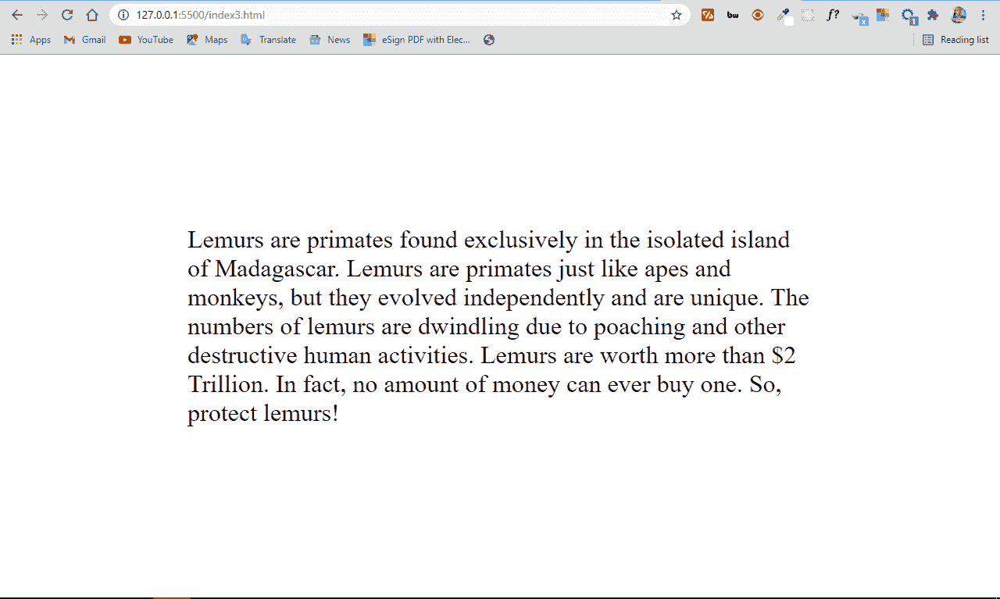
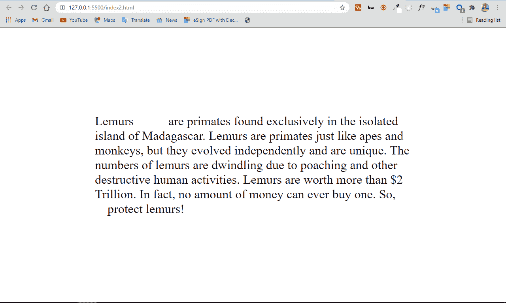
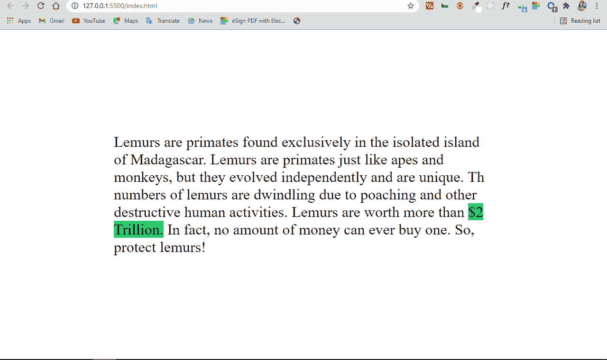
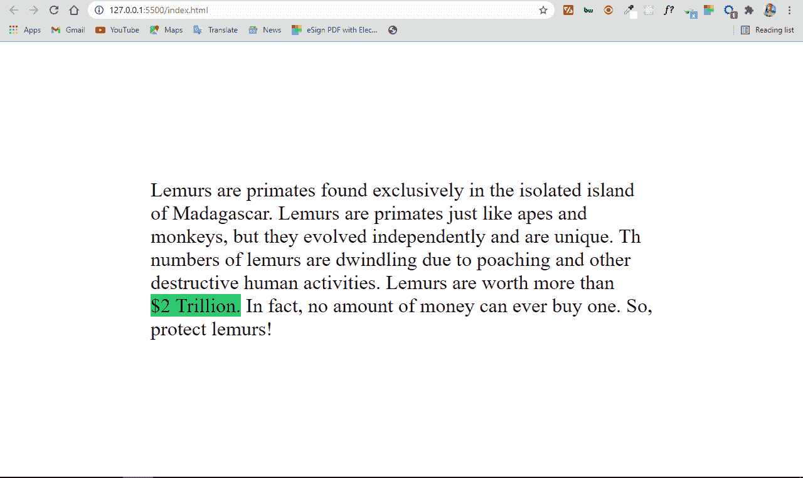

# HTML 空格–如何在字符实体中添加一个不间断空格

> 原文：<https://www.freecodecamp.org/news/html-space-how-to-add-a-non-breaking-space-with-the-nbsp-character-entity/>

在 HTML 中，不能用空格键在空格()字符后创建额外的空格。如果你想在你的 HTML 代码中添加 10 个空格，你试着用空格键添加它们，你在浏览器中只会看到一个空格。

此外，一个或多个应该在一起的单词可能会换行。

因此，在本文中，我将向您展示如何在代码中创建任意数量的空格，以及如何使用`&nbsp;`字符实体添加一个不间断空格。

## 一、什么是人物实体？

字符实体保留用于在浏览器中显示各种字符。

例如，小于符号(`<`)和大于符号(`>`)是为 HTML 中的标签保留的。如果您想在代码中使用它们，HTML 可能会将它们误认为开始和结束标记。

如果要用它们作为“大于”和“小于”，就需要用它们各自的字符实体(`&lt;`和`&gt;`)。然后，您可以安全地在浏览器中显示它们。

## 如何用`&nbsp;`在 HTML 中添加不间断空格

因为浏览器只会显示一个空格，即使你在你的代码中放了几百万个空格，HTML 有`&nbsp;`字符实体。它可以显示多个空格。

如果没有`&nbsp;`字符实体，您的代码将是这样的:

```
<div>
    <p>
      Lemurs are primates found exclusively in the isolated island of
      Madagascar. Lemurs are primates just like apes and monkeys, but they
      evolved independently and are unique. The numbers of lemurs are
      dwindling due to poaching and other destructive human activities. Lemurs
      are worth more than $2 Trillion. In fact, no amount of money can ever
      buy one. So, protect lemurs!
    </p>
</div> 
```

我添加了一些 CSS 来使 HTML 更清晰，更容易看到我想展示的内容:

```
body {
     display: flex;
     align-items: center;
     justify-content: center;
     height: 100vh;
     max-width: 800px;
     margin: 0 auto;
     font-size: 2rem;
}

span {
     background-color: #2ecc71;
} 
```



在下面的 HTML 代码中，我插入了一些`&nbsp;`字符实体来创建多个空格:

```
<div>
   <p>
     Lemurs &nbsp; &nbsp; &nbsp; &nbsp; &nbsp; are primates found exclusively
     in the isolated island of Madagascar. Lemurs are primates just like apes
     and monkeys, but they evolved independently and are unique. The numbers
     of lemurs are dwindling due to poaching and other destructive human
     activities. Lemurs are worth more than $2 Trillion. In fact, no amount
     of money can ever buy one. So, &nbsp; &nbsp; &nbsp; &nbsp; protect
     lemurs!
   </p>
</div> 
```



你可以看到前两个单词之间有 5 个空格，倒数第二个单词和倒数第三个单词之间有 4 个空格。那是因为我分别插入了 5 个和 4 个`&nbsp;`字符。

没有`&nbsp;`字符实体，那是不可能的。

## 如果您希望代码中有一堆空格，该怎么办？

例如，如果您希望代码中有 10 个空格，该怎么办？写 10 遍是多余和无聊的。

相反，HTML 为 2 个不间断空格提供了`&ensp;`字符实体，为 4 个不间断空格提供了`&emsp;`。

```
<div>
   <p>
     Lemurs &emsp; &nbsp; are primates found exclusively in the isolated
     island of Madagascar. Lemurs are primates just like apes and monkeys,
     but they evolved independently and are unique. The numbers of lemurs are
     dwindling due to poaching and other destructive human activities. Lemurs
     are worth more than $2 Trillion. In fact, no amount of money can ever
     buy one. So, &ensp; &ensp; protect lemurs!
   </p>
</div> 
```

在上面的代码中，我通过使用一次`&emsp;`( 4 个空格)和一次`&nbsp;`( 1 个空格)在前两个单词之间插入了 5 个空格。然后我在倒数第二个单词和倒数第三个单词之间使用了 2 个`&ensp`实体。因此，空白空间的数量与第一个示例中的相同:


### 为什么在代码中需要不间断的空格？

有时，HTML 可能会把应该在一起的单词分成另一行，例如，缩写、单位、日期、金额等等。

`&nbsp;`字符实体阻止了这种情况的发生。当你在这样的单词之间插入`&nbsp;`字符时，它会呈现一个空格，永远不会让任何一个单词换行。

在下面的 HTML 代码中，我有一些关于狐猴的信息——在马达加斯加发现的美丽的灵长类动物:

```
 <div>
    <p>
      Lemurs are primates found exclusively in the isolated island of
      Madagascar. Lemurs are primates just like apes and monkeys, but they
      evolved independently and are unique. Th numbers of lemurs are dwindling
      due to poaching and other destructive human activities. Lemurs are worth
      more than <span>$2 Trillion.</span> In fact, no amount of money can ever
      buy one. So, protect lemurs!
    </p>
</div> 
```

我有一些 CSS 来使它更清楚，并展示我试图展示的内容:

```
body {
    display: flex;
    align-items: center;
    justify-content: center;
    height: 100vh;
    max-width: 800px;
    margin: 0 auto;
    font-size: 2rem;
}

span {
    background-color: #2ecc71;
} 
```

结果看起来是这样的:


你可以看到 2 万亿美元突破了，这看起来并不好，因为它可能会使读者困惑。

`&nbsp;`字符实体将两个单词组合在一起:

```
<div>
    <p>
      Lemurs are primates found exclusively in the isolated island of
      Madagascar. Lemurs are primates just like apes and monkeys, but they
      evolved independently and are unique. Th numbers of lemurs are dwindling
      due to poaching and other destructive human activities. Lemurs are worth
      more than <span>$2&nbsp;Trillion.</span> In fact, no amount of money can
      ever buy one. So, protect lemurs!
    </p>
</div> 
```



多酷啊！

## 结论

您已经看到，使用`&nbsp;`、`&ensp;`和`&emsp;`字符实体，您可以在浏览器中显示空格。仅仅使用空格键是不可能的。

您还可以在特定位置使用`&nbsp;`字符实体，以防止应该在一起的单词进入下一行。

感谢阅读，继续编码。