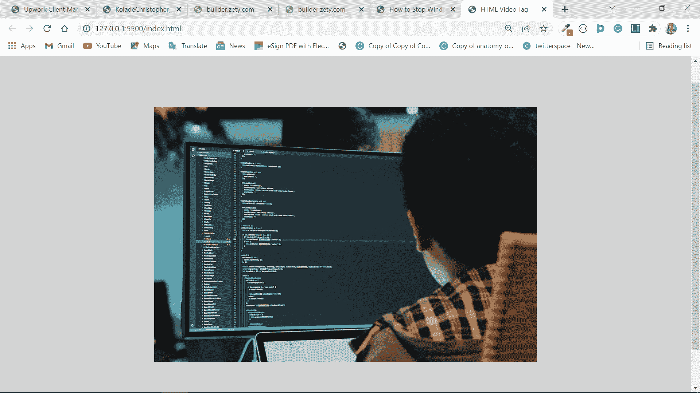
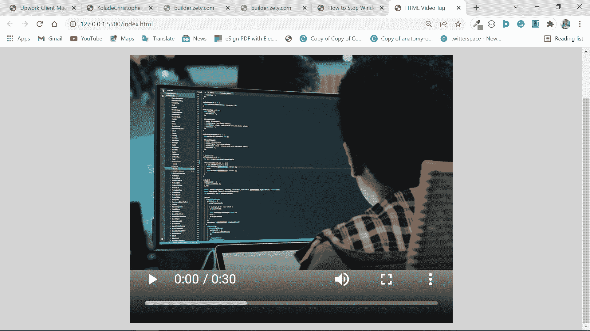
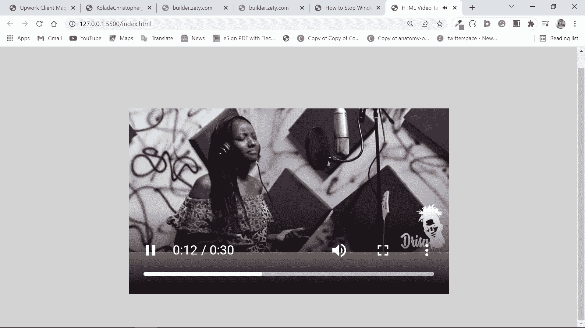

# HTML 视频——如何嵌入带有 HTML 5 视频标签的视频播放器

> 原文：<https://www.freecodecamp.org/news/html-video-how-to-embed-a-video-player-with-the-html-5-video-tag/>

在 HTML 5 出现之前，web 开发人员必须使用类似 Adobe flash player 的插件在网页上嵌入视频。

如今，你可以用`<video>`标签轻松地将视频嵌入 HTML 文档。

在这篇文章中，我们将看到`<video>`标签在 HTML 中是如何工作的。

## 目录

*   [基本语法](#basicsyntax)
*   [标签`<video>`的属性](#attributesofthevideotag)
*   [`src`属性](#thesrcattribute)
*   [`poster`属性](#theposterattribute)
*   [`controls`属性](#thecontrolsattribute)
*   [`loop`属性](#theloopattribute)
*   [`autoplay`属性](#theautoplayattribute)
*   [的`width`和`height`属性](https://www.freecodecamp.org/news/html-video-how-to-embed-a-video-player-with-the-html-5-video-tag/$thewidthandheightattributes)
*   [`muted`属性](#themutedattribute)
*   [`preload`属性](#thepreloadattribute)
*   C [结论](#conclusion)

## 基本语法

就像``标签一样，`<video>`带有一个`src`属性，您需要用它来指定视频的来源。

```
<video src="weekend.mp4"></video> 
```

默认情况下，在浏览器中显示为图像:


这个 CSS 将网页中的所有内容居中并改变背景颜色:

```
 body {
      display: flex;
      align-items: center;
      justify-content: center;
      min-height: 100vh;
      background-color: #d3d3d3;
    } 
```

此外，您可以使用`<source>`标签为`<video>`指定多个视频源。这个`<source>`标签也必须带有自己的`src`属性。

您可以使用多个`<source>`标签使同一视频的不同格式可用。然后，浏览器将播放它支持的格式。

```
<video controls>
   <source src="weekend.mp4" />
   <source src="weekend.ogg" />
   <source src="weekend .webm" />
</video> 
```

## `<video>`标签的属性

`<video>`标签支持全局属性，比如`id`、`class`、`style`等等。

如果你想知道什么是全局属性，它们是所有 HTML 标签都支持的属性。

`<video>`标签支持的具体属性包括`src`、`poster`、`controls`、`loop`、`autoplay`、`width`、`height`、`muted`、`preload`等。

### `src`属性

src 属性用于指定视频的来源。它可以是本地计算机上视频的相对路径，也可以是来自互联网的实时视频链接。

```
<video src="weekend.mp4"></video> 
```

它是可选的，因为您可以使用`<source>`标签来代替它。

### `poster`属性

使用海报属性，您可以在视频开始播放前或下载时加入要显示的图像。

```
<video src="weekend.mp4" poster="benefits-of-coding.jpg"></video> 
```

浏览器显示的不是视频第一个场景的图像，而是这个图像:


### `controls`属性

当您使用 control 时，它让浏览器显示播放和暂停、音量、搜索等回放控制器。

```
<video
      controls
      src="weekend.mp4"
      poster="benefits-of-coding.jpg"
></video> 
```



### `loop`属性

使用循环属性，您可以让视频自动重复播放。也就是说，每次停止播放时，让它重新开始播放。

```
<video
      controls
      loop
      src="weekend.mp4"
      poster="benefits-of-coding.jpg"
></video> 
```

### `autoplay`属性

`autoplay`属性允许您在页面加载后立即自动开始播放视频。

```
<video
      controls
      loop
      autoplay
      src="weekend.mp4"
      poster="benefits-of-coding.jpg"
></video> 
```

### `width`和`height`属性

您可以使用宽度和高度属性以像素为单位指定视频的宽度和高度。它只接受绝对值，例如像素。

```
<video
      controls
      loop
      autoplay
      src="weekend.mp4"
      width="350px"
      height="250px"
      poster="benefits-of-coding.jpg"
></video> 
```



### `muted`属性

您可以使用静音属性告诉浏览器在视频开始播放时不要播放任何与视频相关的声音。

```
<video
      controls
      loop
      autoplay
      muted
      src="weekend.mp4"
      width="350px"
      height="250px"
      poster="benefits-of-coding.jpg"
></video> 
```


如果指定了`controls`属性，用户可以点击音量按钮取消静音。

### `preload`属性

使用 preload 属性，您可以在页面加载时向浏览器提供是否下载视频的提示。

这个属性对于用户体验至关重要。

preload 属性可以使用 3 个值:

*   none:指定在用户按下 play 之前不会加载视频

*   auto:指定即使用户没有按播放键，也应下载视频

*   元数据:指定浏览器应该收集元数据，如长度、大小、持续时间等。

```
<video
      controls
      loop
      autoplay
      muted="true"
      preload="metadata"
      src="weekend.mp4"
      width="350px"
      height="250px"
      poster="benefits-of-coding.jpg"
></video> 
```

## 结论

在本文中，您了解了 HTML5 `<video>`标签及其属性，因此您可以在项目中正确使用它。

由于音频是完整视频的重要组成部分，您还可以使用`<video>`标签将音频文件放在网页上。但是在大多数情况下，为了获得合适的用户体验，您应该使用`<audio>`标签。

如果你觉得这篇文章很有帮助，请与你的朋友和家人分享，这样就可以让更多可能需要它的人得到它。