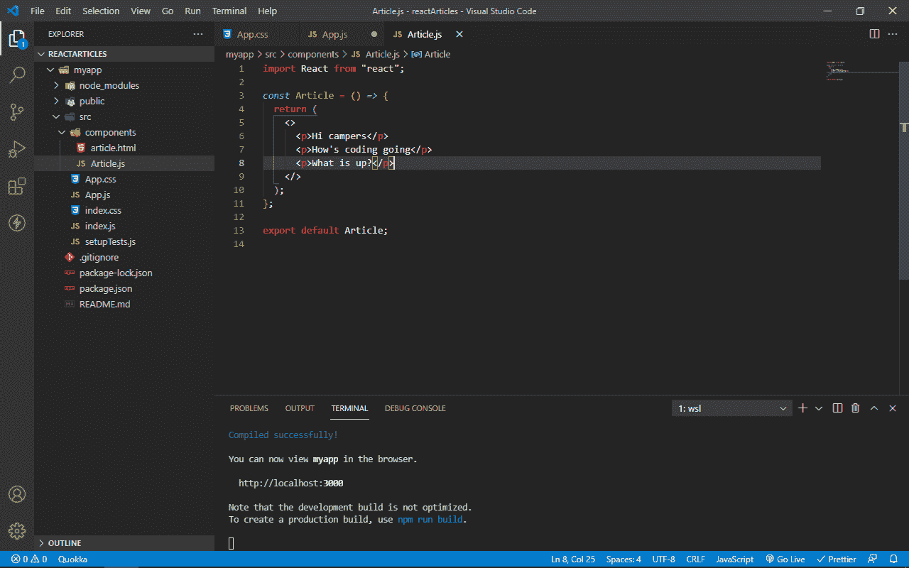
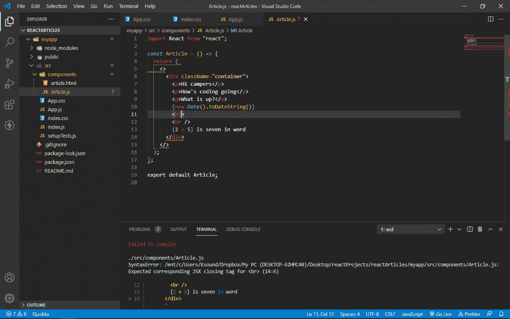
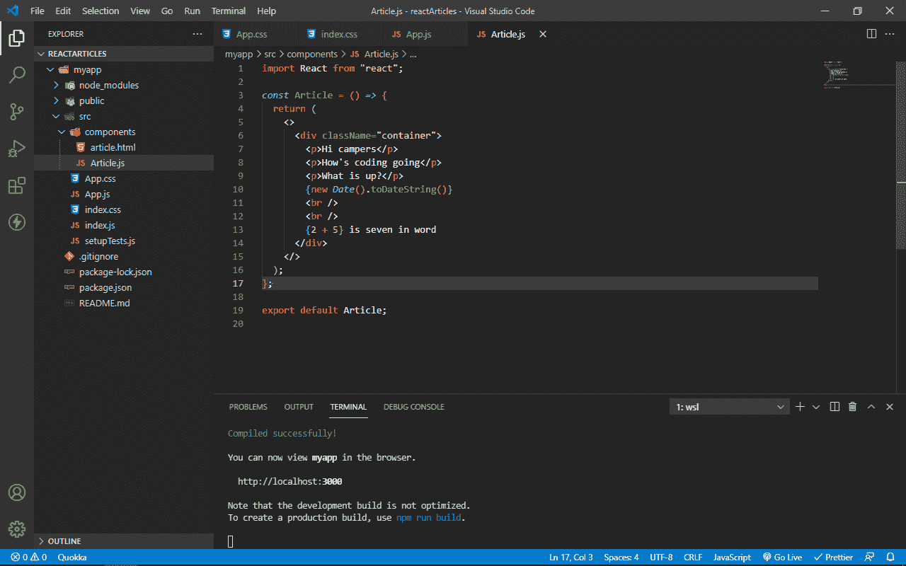

# HTML 和 JSX——有什么区别？

> 原文：<https://www.freecodecamp.org/news/html-vs-jsx-whats-the-difference/>

## HTML vs JSX

超文本标记语言(HTML)是用于确定网页结构的文档的标准语言。

HTML 是 web 开发中非常重要的语言。您的代码要么最初是 HTML 格式，要么编译成 HTML 格式，以便浏览器可以阅读。

另一方面，JSX 意味着 JavaScript 语法扩展，或者像有些人喜欢说的那样是 JavaScript XML。

它是作为`React.createElement()`的语法糖而创建的。它是 JavaScript 的扩展，允许开发人员在 JavaScript 中编写 HTML。所以当你写 JSX 的时候，技术上来说你是在一起写 JavaScript 和 HTML。

同样，这意味着 JavaScript 的保留关键字必须保持不变。这就是为什么 HTML 中的“For”属性在 JSX 是“HTMLFor ”,因为“for”是最常见的 JavaScript 保留关键字之一。

就浏览器的支持而言，所有浏览器都支持 HTML。另一方面，JSX 从来没有真正打算成为，所以你需要一个像 Babel 或 Webpack 这样的编译器把 JSX 转换成浏览器理解的 JavaScript。

## HTML 和 JSX 的主要区别

### 您需要返回 JSX 的单个父元素

HTML 和 JSX 的一个主要区别是，在 JSX，你必须返回一个父元素，否则它不会被编译。

很多开发人员使用`<div>...</div>`，但是很多人使用的更好的一个是“片段”`<>...</>`，这使得代码可读性更好。

在 HTML 中，你可以做任何你想做的事情，因为你不需要返回一个父元素。

这里你可以看到 JSX 没有编译，因为没有父元素。


这里 JSX 正在编译，因为有一个父元素(片段)。

### 你可以在 JSX 直接实现 JS

在 JSX，可以直接写 JavaScript。您可以通过将 JavaScript 放在花括号`{...}`中来做到这一点。而在 HTML 中，您需要一个脚本标签或外部 JavaScript 文件来实现 JavaScript:

```
const Article = () => {
  return (
    <>
      <div>
        <p>Hi campers</p>
        <p>How's coding going</p>
        <p>What is up?</p>
        {new Date().toDateString()}
        <br />
        <br />
        {2 + 5} is seven in word
        <br />
      </div>
    </>
  );
};
export default Article; 
```

### 所有标签在 JSX 自动关闭

标签可以在 JSX 自动关闭。也就是说，有可能将`<div></div>`作为`<div />`，将`<span></span>`作为`<span />`。你不想那样做，但这是可能的。

HTML 中的自结束标签可以在没有右尖括号前的斜线的情况下进行自结束，也就是说`<br />`可以作为`<br>`使用。但是在 JSX，你需要包括斜线。这应该让我想起一些事情——JSX 严重依赖 HTML 4 语法。


这里你可以看到 JSX 没有编译，因为在换行符的右尖括号前没有正斜杠。


这里你可以看到 JSX 正在编译，因为换行符标签里有一个正斜杠。

### ClassName 和 HTMLFor，而不是 JSX 的 class and for

在 JSX 中，要定义类名和 for 属性，不要使用`class`或`for`，因为这两个都是 JavaScript 中的保留关键字。

您实际上用关键字`class`创建了类组件。因此，要在 JSX 定义类名，您可以使用“`className`”，对于标签的属性，您可以使用“`HTMLFor`”:

```
const Article = () => {
  return (
    <>
      <div className="container">
        <p>Hi campers</p>
        <p>How's coding going</p>
        <p>What is up?</p>
        {new Date().toDateString()}
        <br />
        <br />
        {2 + 5} is seven in word
        <br />
        <form>
          <label htmlFor="name">Name</label>
          <input type="text" />
        </form>
      </div>
    </>
  );
};

export default Article; 
```

### 在 JSX 的 camelCase 中编写所有的 HTML 属性

在编写 JSX 时，需要在 camelCase 中编写所有的 HTML 属性和事件引用。于是，`onclick`变成了`onClick`，`onmouseover`变成了`onMouseOver`，以此类推:

```
const Article = () => {
  const sayHI = () => {
    alert("Hi Campers");
  };

  return (
    <>
      <div className="container">
        <p>Hi campers</p>
        <p>How's coding going</p>
        <p>What is up?</p>
        {new Date().toDateString()}
        <br />
        <br />
        {2 + 5} is seven in word
        <br />
        <button onClick={sayHI}>ALert Hi</button>
      </div>
    </>
  );
};
export default Article; 
```

### 在 JSX 将内联样式作为对象编写

最后，要定义 JSX 的内联样式，可以将它作为一个对象编写，属性放在 camelCase 中，值放在引号中，然后将其内联传递给 JSX。

这意味着你必须打开一个样式属性，用花括号代替引号。这与 HTML 相反，在 HTML 中，您可以在开始标记中自由定义数百万种样式，而不必将它们作为对象写入并放在引号中:

```
const Article = () => {
  const inlineStyle = {
    color: "#2ecc71",
    fontSize: "26px",
  };
  return (
    <>
      <div className="container">
        <p style={inlineStyle}>Hi campers</p>
        <p>How's coding going</p>
        <p>What is up?</p>
        {new Date().toDateString()}
        <br />
        <br />
        {2 + 5} is seven in word
        <br />
        <button onClick={sayHI}>ALert Hi</button>
      </div>
    </>
  );
};
export default Article; 
```

您可以选择将对象直接写在 style 属性中——也就是说，打开两个花括号并将属性和值放入其中。

但是更干净的方法是在 JSX 之外定义对象，然后将它传递到开始标记中。

```
const Article = () => {
  return (
    <>
      <div className="container">
        <p style={{ color: "#2ecc71", fontSize: "26px" }}>Hi campers</p>
        <p>How's coding going</p>
        <p>What is up?</p>
        {new Date().toDateString()}
        <br />
        <br />
        {2 + 5} is seven in word
        <br />
      </div>
    </>
  );
};

export default Article; 
```

注意，你不应该在普通的 HTML 中使用内嵌样式——你不想破坏你网站的搜索引擎优化。

## 就是这样！

感谢您的阅读。与我联系，查看我的[作品集](https://www.freecodecamp.org/news/html-vs-jsx-whats-the-difference/ksound22.github.io)，或者在 [Twitter](https://twitter.com/koladechris) 上关注我，我大部分时间都在那里发微博和参与任何网络开发。