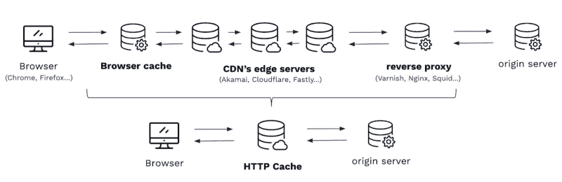
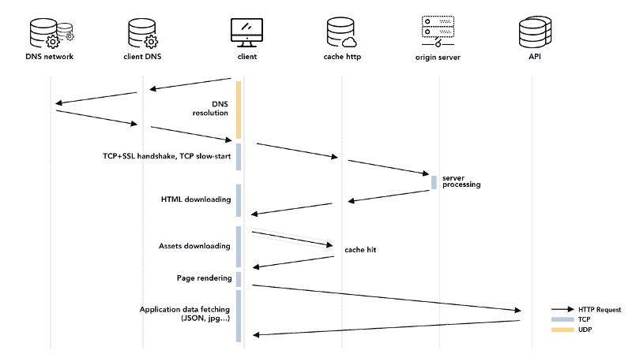

# HTTP 缓存的深入介绍:探索前景

> 原文：<https://www.freecodecamp.org/news/http-caching-in-depth-part-1-a853c6af99db/>

### 有本事你来抓我

大约两年前，我记得目睹了一次重聚，这对我的软件开发人员生活产生了深远的影响。

客户，一个有几十年经验的前开发人员，一个精通技术的产品负责人和另一个高级开发人员正在讨论一个缓存问题。API 正在回答导致客户端查看错误内容的旧视频片段。

很糟糕。非常糟糕。

虽然没有人知道如何解决这个问题，但他们似乎都同意一件事。该问题很可能是缓存问题。

当时我对 HTTP 缓存一无所知，所以我所能做的就是听他们争论到底哪里出了问题。他们都有不同的解释。

浏览器偏离了规范！当事人说。"*CDN 覆盖了我们的缓存指令！"科技产品负责人想。“*我们需要让整个缓存失效”*技术负责人回答道。*

因为我也想有所帮助，尽管我不确定如何，以我的理解水平，我开始向我的同事提问。

我清楚地记得每个人在回答我的问题时的自信程度。每个人都表现得好像他们知道 HTTP 缓存是怎么回事。但与此同时，他们所有的回答都让人觉得很模糊，很肤浅。好像每个人都对事物的运作有很高的理解，但是没有人想了解细节。

最终，问题神奇地自我修复了，团队对事情的解决非常满意。

但我没有。

我心想，这几天到底发生了什么？为什么没有人愿意承认他们不知道整个缓存是如何工作的？总是试图假装我们对某个主题的了解比我们实际了解的要多，这是对软件开发人员的诅咒吗？

所以我决定亲自去看看。我有点明白为什么每个人都在假装。这个题目一点也不容易。但我决心要查个水落石出。

这就是为什么几个小时的谷歌搜索变成了几个月的阅读文章、思考规范和实验缓存软件。

快进到今天，我现在意识到 web 性能(HTTP 缓存是其中最重要的一个方面)是一个我们没有得到足够培训的主题。讲的文章太少，大部分都不够深入。

下面的文章是我试图通过分享我在过去两年中所学到的关于 HTTP 缓存的一切来纠正这一点。

我不是缓存专家，也不会把你变成这样。但它有望让你更好地理解事物实际上是如何工作的。

### 我们开始吧

本系列文章讨论 HTTP 环境中的缓存。如果处理得当，缓存可以将应用程序的性能提高一个数量级。

相反，当被忽略或完全忽略时，它会导致一些由行为不当的代理服务器引起的真正不必要的副作用，这些代理服务器在没有明确的缓存指令的情况下，决定无论如何都要缓存并提供陈旧的资源。

在我们讨论缓存如何工作的战术细节之前，理解我们面临的问题的背景和前景是有帮助的。出于这个原因，本系列的第一部分涵盖了**应该在哪里进行**缓存以及**为什么**我们需要它。

事不宜迟，让我们从处理 HTTP 缓存时要记住的关键考虑事项的概述开始，其次是一般的 web 性能。

### 到处缓存

#### 浏览器

缓存是一种非常流行的技术。这个想法确实很吸引人:无论 I/O 请求有多长，计算有多 CPU 密集，或者任何其他编程任务，它总是相同的:将结果存储在某个地方，并按原样检索它，以供进一步应用。

以所有浏览器都实现的浏览器 HTTP 缓存为例，web 资源存储在用户的文件系统中。因此，将访问这些相同资源的进一步请求将使它们被立即交付。

没有网络请求，没有客户机/服务器往返，没有数据库访问，等等。你能想到比完全无延迟和完全服务器卸载更好的性能增强吗？那根本不可能。

有人可能会认为这种情况太理想，不切实际。如果这是真的，为什么大多数页面加载速度都没那么快？其中一个原因是，尽管所有的 web 资源都是可缓存的，但是它们不应该以相同的方式缓存。

例如，HTML 文件最先被下载，并且包含对其他资源的引用，众所周知，缓存这些文件是非常危险的。因此，除了最多几分钟之外，它们不太可能找到通往浏览器缓存的路，我们马上就会看到这一点。

但是另一个可能的解释是，根据我们的经验，缓存策略通常完全由 web 服务器决定。

在 web 服务器的配置文件上设置一个标志来自动激活 [ETag](https://developer.mozilla.org/fr/docs/Web/HTTP/Headers/ETag) 生成和最后修改的头并不耗时，并且可以给出不错的结果。

至少在一段时间内。直到一个人意识到这个特性不能像预期的那样工作，甚至更糟，用户由于未知的原因开始得到陈旧的内容。

此外，这些 web 服务器在缓存您的 API 方面不会有太大的好处。它们中的大多数基于文件元数据生成缓存头，这可能会产生[微妙的后果](https://github.com/sullo/nikto/issues/469)。但是对于 API 请求，没有文件可以读取元数据。因此，当他们看到动态生成的资源时，他们所能做的就是观察并转发请求。

诚然，尽管在浏览器中缓存非常高效，但并不像看起来那么简单。主流浏览器实现了不同的缓存层，我们所说的 HTTP 只是其中的一部分。如果你想知道的话，[它们可以以一些不总是像我们希望的那样可预测的方式与](https://blog.yoav.ws/tale-of-four-caches/)互动。

此外，众所周知，浏览器中的缓存非常危险，因为开发人员缺乏随意使资源无效的能力。这样做需要允许 web 服务器将信息推送到与之交互的每个客户端，而无需客户端发起连接，这在客户端/服务器架构中是不可能的。

此外，从缓存器的角度来看，尽管它很强大，但它还有其他缺陷。当没有明确的缓存指令时，它使用一些可疑的试探法，所以我们更有理由帮助它确切地知道该做什么。

但即使我们这样做了，用户也有能力刷新他们的缓存或禁用它。毕竟，这不是圣诞节可以要求的万能缓存工具。

因此，现在让我们把浏览器从等式中去掉，问问我们自己:没有它，HTTP 缓存还有意义吗？是否在其他地方实施？事实证明，浏览器只是缓存链中的一环。如果浏览器突然停止缓存一切，请放心:CDNs 会保护我们。

#### 加拿大

内容交付网络(CDN)是 HTTP 缓存世界的统一冠军。他们中的大多数已经安装了大量的服务器——Akamai 拥有 240，0 00 台服务器——这些服务器遍布全球各地，以便为我们的最终用户提供更好的服务。

这些公司在 web 性能方面积累了数十年的经验。大多数编写规格说明书或软件的人通常在这些公司工作，这多少表明他们知道自己在做什么。让我们快速浏览一下为什么它们如此重要以及它们是如何工作的。

首先，理解所有这些服务器都是 HTTP 服务器是至关重要的。在 HTTP 术语中，它们是代理服务器，这意味着它们使用 HTTP。他们不会将我们的请求封装到另一个可疑的专有应用协议中。他们只是使用这些代理，其中大部分甚至是免费或开源的！

直接的结果是，任何关于 HTTP 缓存的知识都可以立即付诸行动，以利用他们提供给我们的基础设施。除了数十亿个浏览器之外，我们现在还有数千台由专业公司战略性部署的服务器，等待我们指导他们如何缓存我们的内容，以实现最高效率。此外，根据你的优先级，这甚至不是最好的特性。

大多数现代 CDN 宣传的是以编程方式从 CDN 网络中即时清除资源的能力。我们再说一遍:*程序化*和*即时*。

就 HTTP 缓存而言，计算机科学中的两个难题可能已经被简化为一个了！缓存任何东西，并在我们需要的时候立即失效。从热衷于 web 性能的开发人员的角度来看，这已经很难再好了。

提醒一句:基于此，cdn 不可盲目信任。我们已经体验到宣传册上销售的内容和我们在生产中使用的内容之间的一些细微差异，在生产中，必须使用其他缓存破坏技术来确保缓存被实际清除。

在开始不小心地永远缓存所有资源之前，先对一个小样本进行实验可能是个好主意。然而，如果它今天不在这里，它最终会一致地降落在每个地方，使我们的生活变得容易得多。

要记住的另一个方面是，开发者将它们视为有效和强大的工具符合每个 CDN 的最佳利益。因此，他们通常会尽最大努力遵守规范。

此外，它们都提供了一些 web 接口，使得给出缓存规则变得轻而易举，这些缓存规则将覆盖或者很好地处理来自源服务器的上游缓存指令。在代码库之外配置缓存策略的能力会产生两个有趣的结果。

首先，这意味着除了开发人员之外的其他人可以控制这一点，根据您的观点，这可以被视为优势或劣势。在某些情况下，在关键场合让软件开发人员之外的人进行 CDN 级别的细粒度缓存设置可能会派上用场。

但也许更重要的是，这意味着您的应用程序的性能部分，或者至少是它的大部分，可以在基础结构级别上完全被分解。

所有在某种程度上经历过性能问题的开发人员都知道这一点:这很难在一个名为 *performance* 的文件中实现，并且[通常最好提前计划](http://e-culture-de-la-performance-web-sur-son-projet/)，就像详细的应用程序级日志记录一样。但是缓存不一定如此。

如果您的缓存头设置巧妙，CDN 配置良好，那么您可以编写优化较差的服务器代码(尽管，请不要这样做),并且通过重用仍然非常新鲜的缓存版本，仍然可以在不到 300 毫秒的时间内为大多数用户提供内容。

另一方面，正如人们所料，建立和维护这样一个服务器网络既昂贵又复杂。因此，虽然他们中的一些人有免费的计划，已经允许在相当广泛的地理区域内的一些严重的性能提升，但他们仍然是付费的解决方案。如果你的意图是缓存数百万的资源，准备好支付数千美元。这就是私有代理缓存发挥作用的地方。

#### 私人代理

HTTP 缓存游戏的第三个也是最后一个玩家就是我们刚刚谈到的许多 cdn 所使用的软件。[清漆](https://varnish-cache.org/)、[鱿鱼](http://www.squid-cache.org/)、[流量服务器](http://trafficserver.apache.org/)，甚至 [Nginx](https://www.nginx.com/) 这些名字有印象吗？嗯，他们当然应该！

鉴于我们刚才所说的 web 浏览器缓存的无与伦比的性能，以及我们刚才支持 cdn 的情况，人们可能会合理地问:当 cdn 可以做更多的事情，并且浏览器更接近我的最终用户时，为什么要在我的原始服务器前设置这些呢？

嗯，这是 HTTP 缓存领域的第三个也是最后一个解决方案，也有它的优点。事实上，我们认为这应该是第一个要寻找的解决方案。让我们来看看最流行的解决方案的一些优点。

首先，这些解决方案是免费和开源的，这可以被视为一把双刃剑。有多少曾经受到社区称赞的软件突然由于缺乏兴趣、赞助或两者兼而有之而停止由核心提交者维护？害怕看到项目的主要依赖项(web 框架、ui 库……)走向软件墓地是一个真正的问题。

虽然在评估这种风险时，人们必须始终考虑技术的成熟度，它已经存在多长时间，哪个大公司正在使用或支持它——他们通常两者都做——以及它在解决特定问题方面的有效性。幸运的是，我们谈论的代理人在所有级别上都得分很高。

另一个方面仅仅来自于性能增益。如前所述，cdn 就是由这些软件组成的。这有两个后果。

首先，它大大降低了终止使用的可能性，因为 CDNs 整个基础设施都依赖于它。这种稳定性比一个公司只是将一个库作为一个更大系统的一部分来使用要好得多。在这种情况下，软件*就是系统*。

第二，任何辛苦获得的关于它们的安装、配置和维护的知识将在你决定用 CDN 切换或补充你的缓存基础设施的那一天直接转移，因为它们是相同的服务器！在软件开发世界中，一切变化如此之快，这总是好消息。

这也是为什么学习 HTTP 缓存是一个很好的赌注的原因，因为它在许多不同的地方都是相关的。并且很可能会持续几十年，我们将在本文的结尾看到原因。

浏览器、边缘服务器、代理服务器……有很多缓存中介。同时考虑所有这些缓存可能有点让人不知所措，难以想象。幸运的是，正如我们前面提到的，所有这些缓存都支持 HTTP，并遵循相同的规范。

作为代理服务器，它们对客户端和服务器都是透明的。源服务器与代理通信，就像它是客户机一样，而最终用户浏览器与代理通信，就像它是服务器一样。即使在代理服务器之间也是如此。

因此，我们可以通过考虑所有缓存基础设施都等效于一个只有一个缓存代理的基础设施来模拟现实。

下面的图片很好地描述了这一点:



我们将在本系列文章的其余部分使用这种简化。这种抽象有助于可视化正在发挥作用的机制，但是它有一定的局限性。将两个代理一前一后放置会产生微妙的结果。

到目前为止，我们已经讨论了很多内容，但没有透露任何关于客户端和缓存服务器之间的详细交互。HTTP 缓存是一个复杂的主题。在进入第 2 部分真正的技术细节之前，还有最后一个重要的方面需要探讨。

### 面向未来的缓存

你是否曾经不得不等待几秒钟*才能与网页互动，或者在屏幕上看到任何有意义的东西？大概吧。那实际上[一点也不不可能](https://www.machmetrics.com/speed-blog/average-page-load-times-websites-2018/)。每个人在生活中的某个时候都经历过缓慢的互联网，即使是在有光纤连接的家里。*

过去的 UX 研究实际上已经得到了一些关于这方面的可怕指标。顺便说一句，40 多年来，这些指标一直保持不变，这使得它们不太可能在短期内改变。他们的指导方针是用几百*毫秒*来表达的，而我们习惯于浏览互联网并等待*几* *秒。*

那么，为什么我们相信 HTTP 缓存在今天是相关的，并且在未来几年几乎肯定会如此呢？

这都归结到一个基本问题:为什么网络这么慢？

这个问题无疑是一个难题，严格的检查会让我们走得太远，失去我们的主要焦点，即 HTTP 缓存。然而，如果我们不知道是什么使网页变慢，我们怎么能确定缓存，尽管它有很多优点，是这项工作的正确工具呢？

从概念上来说，网络已经发生了很大的变化。网页由主要包含文本和超链接的简单 HTML 文件组成的日子已经一去不复返了。

如今，许多网站都被贴上了 web 应用的标签，因为它们的外观和感觉都类似于桌面应用。但是，尽管这些年来有了很多改进和创新，有一件事始终未变:它总是从下载一个 HTML 文件开始。

当浏览器逐渐下载 HTML 时，它会发现所有其他资源，这些资源组合起来将导致所有客户端代码被解析并最终被执行。

例如，在典型的 SPA 中，请求流会继续。在执行时，应用程序开始从服务器下载数据，目前通常序列化为 JSON，以便呈现 UI。JSON 有效负载中的每个 URL，一旦被代码引用(甚至不需要添加到 DOM 中)，就会触发另一次下载，这样它就可以显示在屏幕上。



在这种执行模型中，应用程序完成工作所需的所有字节都分散在不同的位置，并且每次都必须下载，这是非常了不起的。可以说，这是 web 在软件开发领域如此独特的原因。

但是有一个问题。

事实上，到今天为止，典型的 web 应用程序需要 75 个请求，重 1.5 Mb，这意味着浏览器必须发起大量请求，每个请求大约 20kB。换句话说，这意味着一个典型的 web 应用程序是由许多短期连接组成的。

这里有一个问题:这与 TCP 优化的目的正好相反。

#### web 请求的剖析

理论上，所有这 75 个请求都应该经过以下步骤:

*   DNS 解析
*   TCP 握手
*   SSL 握手
*   TCP 流量和拥塞控制约束下的数据下载

让我们逐一看一看，并从中得出一个反直觉的结论。

DNS 解析是将人类可读的主机名(如 example.com)转换为 IP 地址的过程。虽然 DNS 协议是基于 UDP 而不是 TCP 的，但是获得主机名 IP 地址的旅程[可能会很长](https://howdns.works)，涉及多个 DNS 服务器。这些 DNS 解析花费 50 到 250 毫秒并不罕见。

然后，每个请求必须启动一个 TCP 连接。HTTP 一直需要一个可靠的传输协议来工作。如果代表每个 HTTP 请求的 ASCII 字节被无序地传递，那么一个状态行，如

```
GET /home.html HTTP/1.1 
```

会变成:

```
GTE /mohe.hmtl HTTP/1.1 
```

这个请求没有多大意义。

为了保证传送顺序，TCP 用一个称为序列号(SYN)的唯一标识符来标记应用程序数据的每个字节。问题是，出于安全原因，这个数字必须随机选择。

因此，如果客户端正在请求资源，如果不向服务器发送其初始序列号(ISN ),它就无法这样做。那么它必须等待服务器确认收到该数据段，然后才能发送应用程序数据。

除非请求是安全的，因为现在 80%的 HTTP 请求实际上都是安全的 HTTPS 请求。这些是普通的 HTTP 请求，除了它们被加密以保证(至少到目前为止)机密性、完整性和真实性。

为了实现这一点，客户端和服务器现在必须就 TLS 协议版本达成一致，选择加密功能，通过交换和验证 x509 证书来相互验证……对于不少于 [~10](https://tools.ietf.org/html/rfc8446#section-4) 的协议消息，这些消息可以被打包到最少 2 次 TCP 交换和尽可能多的往返中。

一旦连接建立并安全，TCP 就可以开始发送携带应用程序数据的数据段，比如 HTTP 请求。不幸的是，TCP 阻止我们在一批多个数据段中一次发送所有数据。

这种限制是必要的，这样我们就不会意外地在接收端造成缓冲区溢出。当启动连接的应用程序向底层 TCP 套接字请求数据时，TCP 将拒绝提供任何不完整的或由无序的小块组成的块。因此，需要一个缓冲器。

其工作方式是，TCP 在第一批中发送 N 个数据段，如果服务器收到所有数据段，将在下一批中发送两倍数量的数据段(2N ),依此类推，从而导致指数级增长。这种机制通常被称为[慢启动](https://hpbn.co/building-blocks-of-tcp/#slow-start)算法，是 TCP 运行的两种可能模式之一，另外还有拥塞避免。

我们不会在这个系列中讨论拥塞避免。但是如果只有一件事需要注意的话，那就是一旦 TCP 感觉到底层网络可能拥塞，该协议就开始更加保守地行动。从而延长了传输数据所需的时间。

#### 后果

记住所有这些步骤，让我们做一个简单的计算来实现一些重要的事情。在网络的开端，N 参数(在 TCP 术语中称为拥塞窗口)等于 1。有了这样一个窗口和 20kB 的平均资源，我们就可以确定完整传输一个平均请求需要多少次往返。

实际上，在正常情况下，最大的段大小( [MSS](https://tools.ietf.org/html/rfc879) )是 1460 字节。这相当于 20 000 / 1460 = 14 个 TCP 段。当根据我们刚刚描述的指数模式进行调度时，这相当于到服务器的 4 次往返。

现在，如果我们将一个基于 UDP 的 DNS 请求近似为一个基于 TCP 的对源服务器的请求，我们可以估计需要引导一个现代 web 应用程序的往返(RT)总数:

*   DNS 请求:~1 RT
*   TCP 连接设置:1 RT
*   SSL 握手:2 RT
*   资源下载:4 RTT
*   **总计:8 RT**

75 个请求每个都需要 8 次往返，因此总共需要 600 次到服务器的往返。欧洲和美国之间的典型 RTT 是 50 毫秒，当我们请求一个典型的 web 应用程序时，这给了我们信息在互联网上流动所花费的时间:30 秒。情况可能会变得更糟。

以亚马逊主页为例，一个典型的 [MPA](https://blog.octo.com/a-la-decouverte-des-architectures-du-front-2-4-les-multiple-page-applications/) ，目前重 6.3Mb，需要 339 个请求。这将转化为 2 分 15 秒的显著页面加载时间。作为练习，试着在 Facebook Messenger 主页上做同样的事情，这是一个典型的[温泉](https://blog.octo.com/a-la-decouverte-des-architectures-du-front-3-4-les-single-page-applications/)。

如何解读这个数字？如果每个资源都必须按顺序下载，TCP 初始拥塞降至最小值 1，并且如果 DNS 请求、TCP 和 SSL 握手每次都必须重新进行，那么这将是实际的页面负载。网络肯定会是一个非常不同的地方。

幸运的是，这些年来已经做了许多改进。DNS 解析缓存在不同的地方，TLS 握手结果被重用。

TCP 连接被允许在多个请求之间保持[状态](https://tools.ietf.org/html/rfc2616#page-44),避免了连接建立和每个请求的缓慢启动的开销。

TCP 的初始拥塞窗口被提高了两次，从 1 提高到 4，最近又提高到 10，10，3。浏览器开始开放并行连接(6)以及一些真正的[高级策略](https://www.igvita.com/posa/high-performance-networking-in-google-chrome/#predictor)来加速页面加载时间。

一些[提议](https://tools.ietf.org/html/rfc7413)试图脱离连接设置，尽管它们都没有被广泛实施。

一些 cdn 甚至收购了[专利算法](https://developer.akamai.com/legacy/learn/Optimization/TCP_Optimizations.html)来调整 TCP 的某些方面，比如拥塞避免，总是出于同样的原因:加快交付。

我们可以从浏览器和源服务器之间的所有这些往返中得出什么结论呢？

许多年前，带宽不再是瓶颈。

这对我们大多数人来说有些违背直觉，因为带宽多年来一直体现着浏览速度。毕竟，它有着精确的速度维度，单位时间内的比特数，这是互联网服务提供商在试图引诱我们成为他们的客户时唯一宣传的东西。

另外，在 3G 上浏览明显比 4G 慢。但这是因为带宽不再成为瓶颈的阈值是 5 Mb/s，3G 在理想情况下最大值是 2 Mb/s！

如果 Wi-Fi 或 5G 等无线技术确实比有线技术慢，那也是因为在无线系统中，由干扰引起的数据包丢失是常见的，从而使延迟更高且更不稳定。

HTTP 协议的最新版本，HTTP/2，代号为 H2，是 SPDY 协议的延续，SPDY 协议本身最初是根据这样的观察设计的:带宽不再重要。潜伏期会。但是延迟基本上是两个因素的函数:光纤中的光速，以及客户端和服务器之间的距离。

提高光在光纤中的速度的积极研究已经展开，但迄今为止我们只取得了很大进展。在大多数部署中，光已经以其最大理论极限的 60%传播。

但是即使我们达到了 99%,也只会对你的网站产生重大影响，如果它已经在最多几秒钟内加载的话。如果它的加载时间超过 5 秒，即使性能会有明显的提高，它仍然会感觉很慢。

因此，我们只有一个明显的选择:**缩短距离**。

实现这一点的唯一方法是利用浏览器和带有 HTTP 缓存的内容交付网络。

### 结论

在本文中，我们认为 HTTP 缓存是提高 web 应用程序性能的最有效的方法之一。正如许多研究不断指出的那样，页面加载时间是一个重要的主题，可以直接转化为用户满意度，并最终转化为盈利能力。

我们已经看到，缓存几乎可以发生在任何地方，从浏览器到 CDN，再到位于原始服务器前面的私有代理服务器。而且，与许多性能决策不同，它可以完全外化到主代码库之外，这既有价值又方便。

最后，我们仔细研究了现代 web 应用程序的结构，以理解为什么延迟是新的瓶颈，使缓存在今天和未来几年都有意义，即使 H2 稳步部署[。](https://httparchive.org/reports/state-of-the-web#h2)

在本系列的下一篇文章中，我们将深入探讨如何做到这一点。

在某种程度上，这第一部分仅仅是一个热身！我们将了解所有这些实际上是如何工作的:资源刷新、重新验证、表示、缓存控制头…等等！

敬请期待！

#### 为了更进一步:

伊利亚·格里戈利克高性能浏览器应用(必读):
[https://hpbn.co/](https://hpbn.co/)

作为 SPDY 协议基础的 Mike Belshe 论文:[https://docs.google.com/a/chromium.org/viewer?a=v&PID = sites&srcid = y2 hyb 21 PDW 0 ub 3 jnfgrldnxnedoxmzcyowi 1 N2 i4 yzi 3 nze 2](https://docs.google.com/a/chromium.org/viewer?a=v&pid=sites&srcid=Y2hyb21pdW0ub3JnfGRldnxneDoxMzcyOWI1N2I4YzI3NzE2)

活跃的 CDN 博客有大量精彩的文章:
[https://www.fastly.com/blog](https://www.fastly.com/blog)
https://blogs.akamai.com/web-performance/