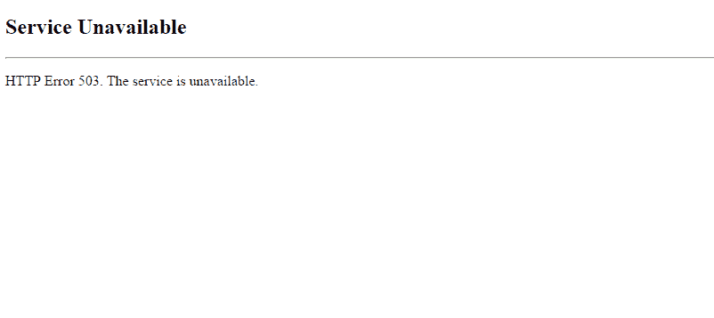

# HTTP 错误 503 服务不可用解释-503 错误代码的含义

> 原文：<https://www.freecodecamp.org/news/http-error-503-service-unavailable-explained-what-the-503-error-code-means/>

错误时有发生——有一些意想不到的维护，一个没有被注意到的错误，或者一个页面像病毒一样传播，大量的连接使服务器瘫痪。

如果你已经上网一段时间了，毫无疑问你会看到有点模糊的 503 服务不可用错误。

在这篇文章中，我们将讨论 HTTP 状态码，503 错误的含义，以及一些可能的解决方法——包括你试图访问的网站和你自己的网站。

## HTTP 状态代码概述

承载网页的服务器侦听来自 web 浏览器或设备(也称为客户端)的请求。然后，服务器使用一组不同的状态代码进行通信。

这些状态代码分为不同的类别，由状态代码的第一个数字表示:

*   1xx:Information–服务器仍在处理请求
*   2xx:Success–请求成功，服务器用页面或资源进行响应
*   3xx:重定向–页面或资源已经移动，服务器将以其新位置做出响应
*   4xx:客户端错误–来自浏览器或设备的请求出错
*   5xx:服务器错误–服务器出现错误

每个 HTTP 状态代码的最后两位数字代表每个类的更具体的状态。例如，301 表示页面或资源已经永久移动，而 302 表示移动是暂时的。

查看本页，了解常见 HTTP 状态代码及其含义:[https://en.wikipedia.org/wiki/List_of_HTTP_status_codes](https://en.wikipedia.org/wiki/List_of_HTTP_status_codes)

大多数状态代码完全没有被注意到，这很好，因为这意味着一切都在工作。只有当您到达 4xx-5xx 范围时，您可能会注意到一个状态代码，因为您会看到这样一个页面:

A typical 503 error page – Source: [Stack Overflow](https://stackoverflow.com/questions/27944151/asp-net-website-shows-503-service-unavailable-after-successful-publishing)

现在您已经对 HTTP 状态代码有了基本的了解，让我们更深入地研究一下 503 服务不可用错误。

## 503 错误代码是什么意思？

如上所述，5xx 状态代码意味着服务器本身有问题。

503 服务不可用错误意味着页面或资源不可用。服务器可能返回 503 错误的原因有很多，但一些常见的原因是维护、服务器代码中的错误或流量突然激增导致服务器不堪重负。

与 503 错误一起发送的消息可能会因其来自的服务器而异，但以下是您将看到的一些常见消息:

> - 503 服务不可用
> - 503 服务暂时不可用
> - HTTP 服务器错误 503
> - HTTP 错误 503
> -错误 503 服务不可用
> -由于维护停机或容量问题，服务器暂时无法服务您的请求。请稍后再试。
> 
> [来源](https://kinsta.com/blog/http-error-503/)

无论 503 错误的原因是什么，它通常是暂时的-服务器将重新启动，流量将逐渐减少，问题将自行解决。

## 如何解决 503 状态不可用错误

当试图解决一个 503 错误时，有两大阵营。

第一种情况是，你是一个最终用户，你试图访问一个不属于你的网站。在第二种情况下，你拥有这个网站，它向试图访问它的人抛出 503 错误。

解决 503 错误的方法根据你属于哪一组而不同。让我们来看看，如果您看到 503 错误，作为最终用户，您可以做些什么。

### 作为最终用户，如何解决 503 状态不可用错误

由于 5xx 状态代码意味着错误发生在服务器端，所以您无法直接做很多事情。

尽管 503 错误通常是暂时的，但在等待的时候，你还是可以做一些事情。

**#1:刷新页面**

有时错误是暂时的，只需简单的刷新即可。在页面打开的情况下，只需在 Windows 和 Linux 上按 Ctrl - R，或者在 macOS 上按 Cmd - R 来刷新页面。

**#2:查看页面是否对其他人关闭**

你可以做的下一件事是使用类似[的服务，它现在停机了吗？](https://www.isitdownrightnow.com/)或[为每个人或只有我](https://downforeveryoneorjustme.com/)下来看看其他人是否得到同样的错误。

只需进入其中一个网站，输入你想访问的网页的网址。

该服务将 ping 您输入的 URL，看它是否得到响应。然后，它会向您显示一些关于该页面的很酷的统计数据和图表:

Checking [freeCodeCamp](https://www.freecodecamp.org/) on Is It Down Right Now?

如果你向下滚动一点，你会看到其他人的一些评论。人们通常会给出他们的大致位置和其他数据，因此这可能是确定错误是否仅影响特定区域或特定设备的好方法。

**#3:重启你的路由器**

有时问题与 DNS 服务器故障有关。

DNS 代表域名系统，它们基本上充当 IP 地址和人类可读 URL 之间的翻译器。

例如，你可以通过直接输入谷歌的长 IP 地址(172.217.25.206)来访问谷歌，或者你可以只输入网址，www.google.com。

它是一个 DNS，通常托管在服务器上，在幕后处理所有这些。

也就是说，许多路由器缓存来自 DNS 服务器的响应(www.google.com<==>172 . 217 . 25 . 206)。但是有时这个缓存可能会损坏并导致错误。

重置或“刷新”缓存的一个简单方法是重启路由器。只需拔掉路由器大约 5 秒钟，然后再插上。

它应该在一分钟后重新启动，您的所有设备应该会自动重新连接。一旦他们这样做，尝试再次访问该网站。

### 作为网站所有者，如何解决 503 状态不可用错误

如果您是返回 503 错误的网站的所有者/开发者，那么您还可以做更多的事情来诊断和解决这个问题。

以下是一些让你开始的一般提示:

**#1:重启服务器**

开发是艰难的——即使是一个简单的静态页面也可能有如此多的活动部分，以至于很难确定是什么导致了 503 错误。

有时最好的办法是重启服务器，看看是否能解决问题。

Source: [imgflip](https://imgflip.com/i/1rs7t0)

重启服务器的具体方法可能会有所不同，但通常您可以从提供商的仪表板上访问它，或者通过 SSH 连接到服务器并运行重启命令来访问它。

几分钟后，服务器应该会重新启动。如果你已经把所有的东西都配置成在启动时自动运行，你可以访问你的网站，看看它是否工作正常。

**#2:检查服务器日志**

接下来要做的是检查日志。

服务器日志的位置会根据您运行的服务而有所不同，但是它们通常位于`/var/log/...`中。

查看一下目录，看看是否能找到什么。如果没有，运行`man program_name`查看程序手册。

**#3:检查是否有正在进行的自动化** **维护**

一些服务提供商提供自动软件包更新和维护。通常这是一件好事——它们通常发生在停机期间，有助于确保一切都是最新的。

这些定期维护会话偶尔会导致 503 错误。

例如，一些专门从事 WordPress 主机服务的主机提供商会在有新版本发布时自动更新 WP。每当更新时，WordPress 会自动返回一个 503 服务不可用的错误。

请咨询您的服务提供商，了解 503 错误是否是由定期维护引起的。

**#4:检查你的服务器的防火墙设置**

有时，503 服务不可用错误是由错误配置的防火墙造成的，其中连接可以通过，但无法返回到客户端。

您的防火墙可能还需要对 CDN 进行特殊设置，来自少数 IP 地址的多个连接可能会被误解为 DDoS 攻击。

调整防火墙设置的具体方法取决于很多因素。查看一下您的管道和服务提供商的仪表板，看看您可以在哪里配置防火墙。

**#5:检查代码**

像错误一样，错误也会发生。尽管你可能努力，但不可能把它们都抓住。偶尔有一个人可能会溜过并导致 503 错误。

如果您已经尝试了所有其他方法，但您的站点仍然显示 503 服务不可用错误，原因可能在代码的某个地方。

检查任何服务器端代码，并特别注意任何与正则表达式有关的东西——[一个小的正则表达式错误](https://www.freecodecamp.org/news/freecodecamp-servers-update-october-2019/)导致了 CPU 使用率的大幅上升，连续停机，以及我们在 freeCodeCamp 大约三天的恐慌。

希望您能够找到罪魁祸首，部署一个修复程序，然后一切都会恢复正常。

## 概括起来

这应该是你需要知道的关于 503 服务不可用错误的一切。当你看到一个 503 错误时，你通常无能为力，希望这些步骤能在你下次遇到时有所帮助。

保持安全，并快乐刷新，直到它的作品:)