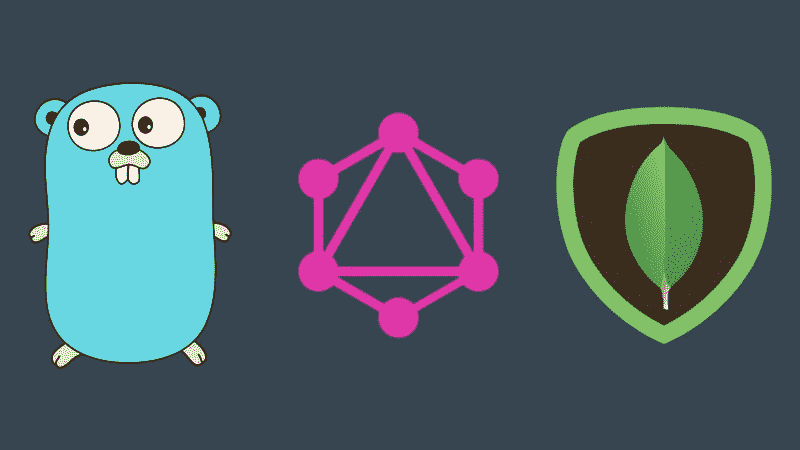
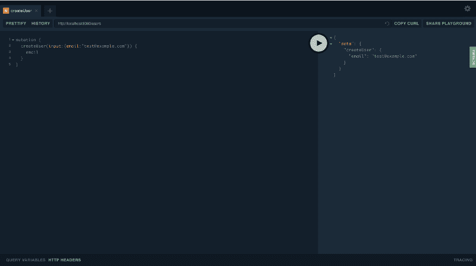
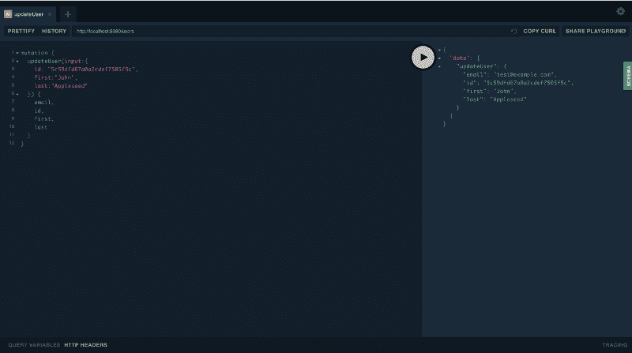
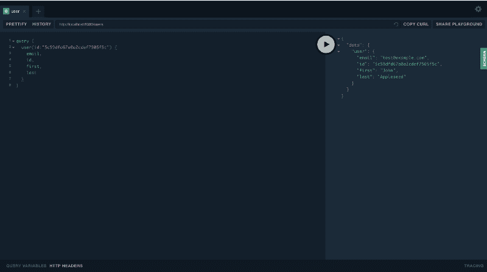

# 如何用 Go、GQLgen 和 MongoDB 处理 GraphQL 订阅

> 原文：<https://www.freecodecamp.org/news/https-medium-com-anshap1719-graphql-subscriptions-with-go-gqlgen-and-mongodb-5e008fc46451/>

作者:Anshul Sanghi

# 如何用 Go、GQLgen 和 MongoDB 处理 GraphQL 订阅

#### 使用 GraphQL 订阅和 MongoDB ChangeStreams 创建实时数据服务器



如果您过去使用过 GQLgen，您会知道它确实支持订阅模型，但是它们使用的实现并不完全适合 MongoDB。

对于那些还没有听说过或使用过 GQLgen 的人来说，它是一个 go 包，本质上是从 GraphQL 模式自动生成样板代码，并为您提供附加功能，如设置 GraphQL 服务器等。我们将在我们的 GraphQL 设置中广泛使用它，所以我建议您在继续之前先看看它，因为我在这里不会涉及太多。这个是一个很好的起点。

我们将构建一个 API 来处理创建/查询/更新用户，并在用户通过订阅收到新通知时进行监听。

我不得不对我的代码以及 GQLgen 生成的代码进行一些修改，以使其正常工作，但我不确定从性能角度来看这是否是最好的方法，我希望得到一些建议。这也不能涵盖除了所需部分之外的所有细节，因为这篇文章已经够长了。

### 设置

在深入研究代码之前，让我们建立一个初始项目。在您的`GOPATH`中创建一个新项目，并在其中创建一个包`db`。这个目录将包含与数据库本身相关的所有代码(在本例中是 MongoDB)。

接下来，安装以下必需的软件包:

```
go get github.com/99designs/gqlgengo get github.com/gorilla/muxgo get github.com/globalsign/mgo
```

需要安装以下软件包，这些软件包仅供 GQLgen 内部使用。我们不会直接使用它们，但它们是必需的:

```
go get github.com/pkg/errorsgo get github.com/urfave/cligo get golang.org/x/tools/go/ast/astutilgo get golang.org/x/tools/go/loadergo get golang.org/x/tools/importsgo get gopkg.in/yaml.v2
```

我们准备开始写一些代码:)

### 项目设置

我将使用 Golang 的`globalsign/mgo`包作为我的 MongoDB 驱动程序，它本质上是 labix/mgo.v2 的社区维护版本。点击[这里](https://github.com/globalsign/mgo)查看。

在您的 db 目录中，使用以下代码创建一个文件`setup.go`:

```
package dbimport (   "fmt"   "github.com/globalsign/mgo")
```

```
var session *mgo.Sessionvar db *mgo.Database
```

```
func ConnectDB() {   session, err := mgo.Dial("mongodb://localhost:27017,localhost:27018")
```

```
 if err != nil {      fmt.Println(err)   }   session.SetMode(mgo.Monotonic, true)   db = session.DB("subscriptionstest")}
```

```
func GetCollection(collection string) *mgo.Collection {   return db.C(collection)}
```

```
func CloseSession() {   session.Close()}
```

我已经在端口`27017`和`27018`上设置了副本集。我建议您在继续之前也这样做。接下来，在您的项目中创建一个`scripts`文件夹，并创建一个包含以下内容的新文件`gqlgen.go`:

```
// +build ignorepackage mainimport "github.com/99designs/gqlgen/cmd"func main() {   cmd.Execute()}
```

这只是运行生成器所需要的，因此我们将把它从我们的构建中排除。

现在，让我们用下面的代码创建一个新的包`users`并在其中创建一个文件`schema.graphql`:

```
schema {    query: Query    mutation: Mutation}type Query {    user(id: ID!): User!}
```

```
type Mutation {    createUser(input: NewUser!): User!    updateUser(input: UpdateUser!): User!    updateNotification(input: UpdateNotification): User!}
```

```
type User {    id: ID!    first: String!    last: String!    email: String!    notifications: [Notification!]!}
```

```
type Notification {    id: ID!    seen: Boolean!    text: String!    title: String!}
```

```
input NewUser {    email: String!}input UpdateUser {    id: ID!    first: String    last: String    email: String}input UpdateNotification {    id: ID!    userID: ID!    seen: Boolean!}
```

```
type Subscription {    notificationAdded(id: ID!): User!}
```

现在，从命令行导航到 users 文件夹并运行

```
go run ../scripts/gqlgen.go init
```

这将生成 4 个文件，即`resolver.go` `generated.go` `models_gen.go` `gqlgen.yml`。它还将在 users 包中创建一个名为 server 的文件夹，其中包含运行 GraphQL 服务器的代码。您可以删除它，因为我们将在项目的根目录下拥有我们自己的服务器，这也将允许我们最终拥有从一个服务器提供服务的多个 GraphQL 端点。

最初，我们将只使用`resolver.go`,它基本上包含了我们在模式文件中定义的各种查询和变化的逻辑。但是首先，我们需要转到`models_gen.go`文件，并将`bson:"_id"`标签添加到用户结构中的 id 字段，这样我们就可以将 ID 从数据库中获取到这个结构中。

```
type User struct {   ID            string         `json:"id" bson:"_id"`   First         string         `json:"first"`   Last          string         `json:"last"`   Email         string         `json:"email"`   Notifications []Notification `json:"notifications"`}
```

现在，让我们快速设置基本的解析器，而不涉及太多细节。您会注意到，在文件的顶部，您会看到类似于以下内容的一些代码:

```
type Resolver struct{}func (r *Resolver) Mutation() MutationResolver {   return &mutationResolver{r}}func (r *Resolver) Query() QueryResolver {   return &queryResolver{r}}func (r *Resolver) Subscription() SubscriptionResolver {   return &subscriptionResolver{r}}
```

我们将用这个来代替它:

```
type Resolver struct {   users *mgo.Collection}func New() Config {   return Config{      Resolvers: &Resolver{         users: db.GetCollection("users"),      },   }}func (r *Resolver) Mutation() MutationResolver {   r.users = db.GetCollection("users")   return &mutationResolver{r}}func (r *Resolver) Query() QueryResolver {   r.users = db.GetCollection("users")   return &queryResolver{r}}func (r *Resolver) Subscription() SubscriptionResolver {   r.users = db.GetCollection("users")   return &subscriptionResolver{r}}
```

我们这样做是为了在解析器结构中直接引用我们的集合，这将使我们更容易在整个解析器中使用集合。稍后当我们需要时，我会解释`**New**` 函数的意义。

让我们快速设置我们的基本解析器。

#### 创建用户解析程序

```
func (r *mutationResolver) CreateUser(ctx context.Context, input NewUser) (User, error) {   var user User   count, err := r.users.Find(bson.M{"email": input.Email}).Count()   if err != nil {      return User{}, err   } else if count > 0 {      return User{}, errors.New("user with that email already exists")   }   err = r.users.Insert(bson.M{"email": input.Email,})   if err != nil {      return User{}, err   }   err = r.users.Find(bson.M{"email": input.Email}).One(&user)   if err != nil {      return User{}, err   }   return user, nil}
```

#### 更新用户解析程序

```
func (r *mutationResolver) UpdateUser(ctx context.Context, input UpdateUser) (User, error) {   var fields = bson.M{}   var user User   update := false   if input.First != nil && *input.First != "" {      fields["first"] = *input.First      update = true   }   if input.Last != nil && *input.Last != "" {      fields["last"] = *input.Last      update = true   }   if input.Email != nil && *input.Email != "" {      fields["email"] = *input.Email      update = true   }   if !update {      return User{}, errors.New("no fields present for updating data")   }   err := r.users.UpdateId(bson.ObjectIdHex(input.ID), fields)   if err != nil {      return User{}, err   }   err = r.users.Find(bson.M{"_id": bson.ObjectIdHex(input.ID)}).One(&user)   if err != nil {      return User{}, err   }
```

```
 user.ID = bson.ObjectId(user.ID).Hex()
```

```
 return user, nil}
```

#### 更新通知解析程序

```
func (r *mutationResolver) UpdateNotification(ctx context.Context, input *UpdateNotification) (User, error) {   var user User   var oid = bson.ObjectIdHex(input.UserID)   if err := r.users.Find(bson.M{"_id": oid}).One(&user); err != nil {      return User{}, err   }   for index, val := range user.Notifications {      if bson.ObjectId(val.ID).Hex() == input.ID {         val.Seen = input.Seen         user.Notifications[index] = val         break      }   }   if err := r.users.UpdateId(oid, user); err != nil {      return User{}, err   }   return user, nil}
```

#### 查询用户解析器

```
func (r *queryResolver) User(ctx context.Context, id string) (User, error) {   var user User   if err := r.users.FindId(bson.ObjectIdHex(id)).One(&user); err != nil {      return User{}, err   }   user.ID = bson.ObjectId(user.ID).Hex()   return user, nil}
```

现在我们已经完成了设置，让我们进入主要部分。

### MongoDB 实时数据和更改流

MongoDB 现在从**版本 3.6** 开始支持类似 firebase 的实时数据。但是设置并不容易。变更流正常工作有几个重要的先决条件:

*   它仅适用于带有 WireTiger 驱动程序的共享集群和副本集。MongoDB v3.6+将 WireTiger 作为默认驱动程序，但我们确实需要自己设置一个副本集。
*   更改流仅在`["majority"](https://docs.mongodb.com/manual/reference/read-concern-majority/#readconcern.%22majority%22)`读取关注支持启用时可用(默认启用)。

下面是我们的 NotificationAdded Resolver 的方法签名:

```
func (r *subscriptionResolver) NotificationAdded(ctx context.Context, id string) (&lt;-chan User, error) {   panic("not implemented")}
```

这个实现有一个问题，我们需要稍微修改一下，让它正常工作。但是首先，让我们看看解析器中所需的代码，这也将使我们更容易理解为什么需要进行更改。

我们首先要定义两个变量`userDoc`和`change`，并像这样设置我们的 changeStream 监听器:

```
var userDoc Uservar change bson.Mcs, err := r.users.Watch([]bson.M{}, mgo.ChangeStreamOptions{MaxAwaitTimeMS: time.Hour, FullDocument: mgo.FullDocument("updateLookup")})
```

```
if err != nil {   return err}if cs.Err() != nil {   fmt.Println(err)}
```

这里，我们正在观察用户集合的变化。我们还将 ChangeStream 的超时设置为 1 小时。这是保持变更流活动且不自动关闭所必需的。我们还需要已更改的完整文档，因此我们也在 ChangeStreamOptions 中定义了该设置。watch 函数返回一个光标，我们可以对其进行迭代。

接下来，我们将启动一个`goroutine`来处理光标事件，如下所示:

```
go func() {   start := time.Now()   for {      ok := cs.Next(&change)      if ok {         byts, _ := bson.Marshal(change["fullDocument"].(bson.M))         bson.Unmarshal(byts, &userDoc)         userDoc.ID = bson.ObjectId(userDoc.ID).Hex()         if userDoc.ID == id {            *userChan <- userDoc         }      }      if time.Since(start).Minutes() >= 60 {         break      }      continue   }}()
```

这里我们使用`cursor.Next()`方法和一个 for 循环对光标进行迭代。每当有变更事件时，for 循环中的代码将被执行，来自该事件的数据将在`change`变量中对我们可用。

本质上，我们将在 for 循环中从 change 结构中提取完整的文档字段作为`type User`。然后，我们检查更改后的用户是否与订阅正在寻找的用户相同。如果是，我们将它发送到我们的通道，并等待更多的事件。

这也是讨论这个方法的方法签名的好时机。又一次，你会看到这样的东西:

```
func (r *subscriptionResolver) NotificationAdded(ctx context.Context, id string) (&lt;-chan User, error) {   ...}
```

它接收一个 id，即 userID，并期望返回一个通道。如果我们从这个函数返回一个通道，它将总是空的。让我们看一下`generated.go`文件来更好地理解这一点。与这个特定方法相关的代码看起来像这样(它在文件中是分开的，但是我在这里只聚合了所需的代码):

```
type SubscriptionResolver interface {   NotificationAdded(ctx context.Context, id string) (&lt;-chan User, error)}
```

```
func (ec *executionContext) _Subscription_notificationAdded(ctx context.Context, field graphql.CollectedField) func() graphql.Marshaler {   rawArgs := field.ArgumentMap(ec.Variables)   args, err := field_Subscription_notificationAdded_args(rawArgs)   if err != nil {      ec.Error(ctx, err)      return nil   }   ctx = graphql.WithResolverContext(ctx, &graphql.ResolverContext{      Field: field,   })      rctx := ctx   results, err := ec.resolvers.Subscription().NotificationAdded(rctx, args["id"].(string))   if err != nil {      ec.Error(ctx, err)      return nil   }   return func() graphql.Marshaler {      res, ok := <-results      if !ok {         return nil      }      var out graphql.OrderedMap      out.Add(field.Alias, func() graphql.Marshaler {         return ec._User(ctx, field.Selections, &res)      }())      return &out   }}
```

然后，返回的通道被生成的代码读取，以获取更新并将其传递给我们的客户端。问题是，一旦我们从解析器返回通道，函数的执行就已经结束了。基本上意味着通道永远不会在这里接收任何值。

另一方面，如果值是在从函数返回之前添加到通道中的，我们实际上必须等待一个小时才能将所有更新推送到客户端，因为我们要等待一个小时才能让更改流超时(假设我们对 ChangeStream 游标使用了非 goroutine 实现)。很明显，这不是一个理想的情况。让我们对上面的代码做一些修改，让它为我们服务。

我首先要在**_ Subscription _ notification added**方法中定义一个通道，它的指针将被传递给我们的解析器。它看起来会像这样:

```
func (ec *executionContext) _Subscription_notificationAdded(ctx context.Context, field graphql.CollectedField) func() graphql.Marshaler {   rawArgs := field.ArgumentMap(ec.Variables)   args, err := field_Subscription_notificationAdded_args(rawArgs)   if err != nil {      ec.Error(ctx, err)      return nil   }   ctx = graphql.WithResolverContext(ctx, &graphql.ResolverContext{      Field: field,   })
```

```
 userChan := make(chan User, 1)   rctx := ctx   go ec.resolvers.Subscription().NotificationAdded(rctx, args["id"].(string), &userChan)
```

```
 return func() graphql.Marshaler {      res, ok := <-userChan      if !ok {         return nil      }      var out graphql.OrderedMap      out.Add(field.Alias, func() graphql.Marshaler {         return ec._User(ctx, field.Selections, &res)      }())      return &out   }}
```

出于性能原因，我们正在创建一个新频道，一次只能购买一件商品。然后，我们将它的指针传递给我们的解析器，并使对这个解析器的调用成为一个 goroutine。

然后，**_ Subscription _ notification added**方法将返回一个函数，该函数监听`userChan`并在每次收到值时将更新推送到我们的客户端。

我们还需要改变我们刚刚修改的方法的方法签名，我们需要改变

```
type SubscriptionResolver interface {   NotificationAdded(ctx context.Context, id string) (&lt;-chan User, error)}
```

到

```
type SubscriptionResolver interface {   NotificationAdded(ctx context.Context, id string, userChan *chan User) error}
```

这就是我们需要的所有修改。一旦完成，下面是完整的**通知添加订阅解析器**的样子:

```
func (r *subscriptionResolver) NotificationAdded(ctx context.Context, id string, userChan *chan User) error {   var userDoc User   var change bson.M   cs, err := r.users.Watch([]bson.M{}, mgo.ChangeStreamOptions{MaxAwaitTimeMS: time.Hour, FullDocument: mgo.FullDocument("updateLookup")})   if err != nil {      return err   }   if cs.Err() != nil {      fmt.Println(err)   }   go func() {      start := time.Now()      for {         ok := cs.Next(&change)         if ok {            byts, _ := bson.Marshal(change["fullDocument"].(bson.M))            bson.Unmarshal(byts, &userDoc)            userDoc.ID = bson.ObjectId(userDoc.ID).Hex()            if userDoc.ID == id {               *userChan <- userDoc            }         }         if time.Since(start).Minutes() >= 60 {            break         }         continue      }   }()   return nil}
```

现在，向通道发送项目的代码和接收项目的代码都是非阻塞的，并且在后台运行。

唷！那是大量的工作，但那是我们必须做的所有繁重的工作。让我们转到有趣的部分，创建一个服务器，看看我们努力的结果。

### 有趣的东西

使用以下代码在项目的根目录下创建一个文件`main.go`:

```
package main
```

```
import (   "fmt"   "github.com/gorilla/mux"   "github.com/gorilla/websocket"   "github.com/rs/cors"      "log"   "net/http"   "os"   "github.com/99designs/gqlgen/handler"   "<project path relative to GOPATH>/users"   "<project path relative to GOPATH>/db")
```

```
const defaultPort = "8080"func main() {   port := os.Getenv("PORT")if port == "" {   port = defaultPort}
```

```
db.ConnectDB()
```

```
c := cors.New(cors.Options{   AllowedOrigins:   []string{"http://localhost:" + port},   AllowCredentials: true,})r := mux.NewRouter()r.Handle("/", handler.Playground("User", "/users"))r.Handle("/users", c.Handler(handler.GraphQL(users.NewExecutableSchema(users.New()),   handler.WebsocketUpgrader(websocket.Upgrader{      CheckOrigin: func(r *http.Request) bool {         return true      },   }))),)http.Handle("/", r)log.Fatal(http.ListenAndServe(":8080", nil))}
```

GQLgen 为我们提供了一些内置的处理程序，如 Playground 和 WebsocketUpgrader，它们本质上创建了一个 UI 来测试我们的 GraphQL 服务器，并与客户端建立 WebSocket 连接。

此外，还记得我们之前在解析器中添加了一个名为`**New**` 的函数吗，我提到过，我们稍后会谈到这个函数。嗯，在这里你可以看到为什么它是必需的。它实际上返回了一个配置结构，GQLgen 提供的处理程序需要这个结构来使我们的代码正常工作。您可以看到默认代码直接使用了`users.Config{Resolvers: &users.Resolvers{}}`,只要您在 resolvers 结构中包含了用于`users`字段的代码并将其设置为 users 集合，这也没有问题。

此时，我们已经准备好启动我们的 GraphQL 服务器并进行测试。

运行`go build`然后执行生成的二进制文件。服务器现在应该正在运行。在尝试运行我们的服务器之前，确保您已经运行了 MongoDB 副本集，否则，它将抛出一个错误。如果你需要运行副本集的帮助，你可以从这里的开始。

#### 创造用户



#### 更新用户



#### 查询用户



#### 通知已添加订阅

现在你知道了！

我要再次强调，这可能不是解决当前问题的最佳方案，但这是我对一个可能的解决方案的看法，我希望得到您的反馈和建议。

感谢阅读。几个？总是受到赞赏。