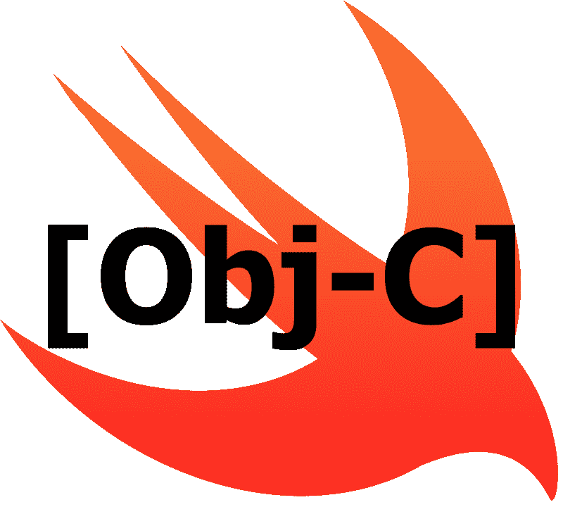

# Swift vs. Objective-C:潮流新秀 vs .恐龙

> 原文：<https://www.freecodecamp.org/news/https-medium-com-colin-gabriel-smith-swift-vs-objective-c-5b19add8e2ed/>

科林·史密斯

# Swift vs. Objective-C:潮流新秀 vs .恐龙

Swift vs. Objective-C. How do they compare?

### 斯威夫特简史

我记得在苹果 2014 年 WWDC(全球开发者大会)上推出 Swift 时，它是多么重要。这是镇上的话题，所有和我一起工作的开发人员都迫不及待地想尝试一下。iOS 社区非常热闹，围绕这种新语言有很多令人兴奋的事情。

开发它是为了继承我们在 Objective-C 中看到的一些概念，比如可扩展编程。但是它推动了一种不同的方法，用面向协议的设计进行编码，用静态类型增加安全性。

这是一个巨大的成功，并看到它的增长在推出后的几年里扶摇直上。它是 2015 年[最受欢迎的](https://insights.stackoverflow.com/survey/2015#tech)编程语言，2016 年[第二受欢迎的](https://insights.stackoverflow.com/survey/2016#technology)，2017 年第 11 位[最受欢迎的](https://insights.stackoverflow.com/survey/2017#technology)编程语言，击败了 Objective-C，2018 年[也击败了](https://insights.stackoverflow.com/survey/2018/#technology) Objective-C。

Swift 也是苹果公司在争取新手成为 iOS 开发者上的赌注。希望新的开发者能够学习这种语言，并用它来开发 iOS 应用。这就增加了应用商店的生态系统。由于 Swift 针对 iOS 应用进行了优化，这确保了正在编写的应用具有高质量。

Swifts 的受欢迎程度只会继续增加，尤其是对于较小的应用程序和初创企业。Swift 和 Objective-C 之间的差距只会继续扩大。这门年轻的语言前途光明。

### Objective-C 简史

Objective-C 是一种面向对象的编程语言，是 C 的超集，正如该语言的名字所显示的那样。这意味着任何有效的 C 程序都可以用 Objective-C 编译器编译。它的所有非面向对象的语法都来自 C，而面向对象的语法来自 SmallTalk。它是在 1984 年开发的，因此它有时间作为一种语言成熟起来，并且比 Swift 稳定得多。

大多数人都知道 Objective-C 是用于开发 iPhone 应用程序的语言，但历史远不止于此。我推荐阅读[这篇文章](https://medium.com/chmcore/a-short-history-of-objective-c-aff9d2bde8dd)以获得更深入的了解。

### Swift 的优势

Swift 的受欢迎程度大幅提高有几个关键原因。首先，苹果公司提供了许多与 Swift 协同工作的优秀开发工具。我个人比较喜欢的一个是操场，只兼容 Swift。苹果在 2016 年推出了 Playgrounds [。它们是作为学习如何编码的一种方式引入的，但是我喜欢它们是因为一个不同的原因。](https://developer.apple.com/videos/play/wwdc2016/408/)

移动开发总是比 web 开发有更多的障碍。你需要一个模拟器，你通常需要一个专有的集成开发环境(IDE)，你需要建立一个完整的项目，只是为了测试一些小的原型。在苹果的情况下，你还需要一个开发者账户。操场的好处是你可以绕过这些。你确实需要 Xcode 或 Playgrounds 应用，但仅此而已。您可以立即开始编码和编译代码。

然而，Swift 的另一个巨大优势是它是开源的。如果你曾经想知道一门编程语言是如何工作的，那么你可以[亲自去看看](https://github.com/apple/swift)！这是在更深层次上理解您日常使用的编程语言的好方法。

一项荣誉奖颁给了一个只有 Swift 才有的实用程序，即 [Swift 包管理器](https://swift.org/package-manager/)。Swift 包管理器只是一个与 Swift 构建系统集成的[依赖管理器](https://devopedia.org/dependency-manager)。这绝不是游戏规则的改变者，因为 CocoaPods 和 Carthage 很久以前就在做这项工作，但如果需要，这是另一个可用的解决方案。

这里有很多证据支持这样一个事实，即苹果正在做很多工作，让 Swift 成为 iOS 开发者更理想的编程语言。他们正在创造漂亮的实用工具和辅助工具来吸引人们开始使用这种语言。这表明苹果正在全力推动 Swift。

### 语言特征

让我们深入了解语言本身的一些细节。Swift 由于其静态类型和可选功能的使用而更加安全。在 Swift 中，如果您的代码需要一个字符串，Swift 的特性将保证您的代码得到一个字符串，而不是另一种类型，如 int。这当然取决于你是否按照语言的意图使用它，而不是强行打开所有的包装。

Swift 的另一大特点是它的语法。尤其是与 Objective-C 相比。描述这种语法的最佳词应该是“简洁”。if 语句不需要分号、self 调用或括号。感觉你跳过了很多其实并不需要的东西。可以让输入大量代码的过程“流动”得更好。

有些人说这导致了开发速度的提高，但是我自己不会这么说。不断需要打开对象以符合 Swifts 的类型安全，这抵消了简洁带来的开发收益。

Swift 还有很多很棒的控制流选项，包括 guard、if-let、高级 switch 语句、repeat-while 和 defer。我喜欢所有不同的选项，因为它让人们以对他们有意义的方式控制他们的代码流。很多人讨厌推迟，但喜欢警卫，反之亦然。您喜欢什么或不喜欢什么并不重要，但是选项就在那里，您可以用自己感觉最好的方式编码。

我忘不了滤镜、贴图、还原等所有的函数式编程特性。这对于处理集合非常有用，并且经常派上用场。

### 弱点

Swift 是一门年轻的语言，随之而来的是一些变化。版本之间的迁移简直是一种痛苦。在小公司，Apple 提供的迁移工具很有帮助，可以覆盖大多数情况。代码越多，帮助就越少。如果您的代码库同时包含 Objective-C 和 Swift 互操作代码，那就更糟了。

在我的上一家公司，迁移工作花了一整个周末的时间。他们不得不在周末做，这样他们就不会遇到来自其他开发人员的合并冲突。这对所有相关人员来说都是难以置信的痛苦。

这些迁移的一个原因是 Swift [没有 ABI 稳定](https://theswiftdev.com/2018/11/06/swift-5-and-abi-stability/)。这意味着新版 Swift 无法与旧版 Swift 兼容。这也意味着该语言不能与操作系统打包在一起。这对于拥有大型应用程序并积极应对应用程序规模的公司来说是一件大事，因为 Swift 正与应用程序捆绑在一起并增加其规模。

另一个问题是 Swift 与 Xcode 不兼容。Xcode 在使用 Swift 和 autocomplete [时感觉非常不稳定，有时根本就不工作](https://www.reddit.com/r/iOSProgramming/comments/8o1kbt/help_with_xcode_autocomplete_does_not_work/)。考虑到苹果对 Swift 的施压力度，这很奇怪。你可能会想，他们会想让使用 Swift 和 Xcode 的体验变得愉快。

Swift 在字符串处理方面也有问题，参见上面的代码示例。它太笨重了。在你的日常生活中，这还不算太糟。这一点在面试中发挥得最大。不幸的是，对于 Swift 开发人员来说，面试官喜欢问涉及字符串操作的问题。不同版本的 Swift 之间处理字符串的方式发生了变化，这使得问题更加复杂。

### Objective-C 的优势

Objective-C 是一种高度动态的、面向对象的语言。它是动态的，你可以在运行时使用像[swizzing](https://nshipster.com/method-swizzling/)这样的技术交换方法调用。由于它的消息发送模式，它能够做这些事情。这允许对象在运行时向其他对象发送消息，以确定被调用方法的调用。

在实际应用中，这意味着什么？一个很大的优势是运行时的适应性。这意味着在运行时访问私有 API 或模仿对象成为可能。这在单元测试中尤其有用。像 [OCMock](http://ocmock.org/swift/) 这样的库使这变得更加容易，并允许非常复杂的测试设置。拥有好的单元测试会让你的应用更加稳定可靠。

说到稳定性，Objective-C 已经存在了很长时间，这使得它成为一种非常稳定的语言。有了 Swift，你会遇到非常令人吃惊的错误，并且会破坏你的应用程序的稳定性。在我上面链接的例子中，这个崩溃可能是由你编写应用程序的实际语言引起的，而不是由你编写的代码产生的任何错误。这可能会令人沮丧。

最后一点，也是对某些公司更重要的一点，就是与 C 和 C++库的兼容性。因为 Objective-C 是 C 的超集，所以用 Objective-C 很容易使用 C 和 C++代码。如果您愿意，甚至可以使用 Objective-C++。如果您依赖于第三方 C 和 C++库，这一点很重要。

### 弱点

我听到的关于 Objective-C 的第一个主要抱怨是语法。我使用 Objective-C 开始了我的职业生涯，所以我对它没有任何问题。它很冗长，而且使用方括号有点不合常规。但是关于语法的观点也仅仅是观点而已。我想我会列出这一点，因为这是你提到 Objective-C 时首先想到的事情之一。

不过，我同意的一点是，块语法令人沮丧。[甚至有一个网站](http://goshdarnblocksyntax.com/)致力于解码 Objective-C 中的块的奥秘，我实际上经常使用这个网站作为参考。

Objective-C 目前面临的最大问题是，有一天苹果可能会放弃对 Objective-C 以及 Cocoa 和其他用于创建 iOS 应用的通用库的支持。由于 Objective-C 主要用于创建 iOS 应用程序，这将是该语言的丧钟。这也意味着 iOS 社区的新成员现在害怕学习 Objective-C，因为将来可能不再使用它。

让我们回到语言本身。由于语言的动态特性，很容易出现难以调试的问题。向 nil 发送消息的能力和在缺乏严格类型的情况下不崩溃的能力是导致这些难以调试的问题的一些例子。

在这些事情上，Objective-C 也不会支持你。虽然当你向 nil 发送消息时应用程序没有崩溃是件好事，但它可能会让你的应用程序处于一种奇怪的状态。像这样的问题很难调试。Swift 具有严格的类型和使用解包选项的事实在编译时防止了这些事情。

### 我应该学 Swift 还是 Objective-C？

对大多数人来说，答案是迅速的。苹果显然在推动 Swift 成为其 iOS 应用开发社区的首选语言。随着 ABI 稳定性的引入以及 Swift 与操作系统本身打包在一起，Swift 的性能只会继续提高。

如果你想找一份 iOS 开发人员的工作，Swift 将是你想学的语言。大多数初创到中级公司的 iOS 应用程序将完全用 Swift 编写。这意味着如果你学习 Swift，你将能够申请和面试更多的工作。

即使在仍然大量使用 Objective-C 的大公司，面试仍然可以在 Swift 中进行。因此，一旦你加入公司，你就可以学习目标 C，而不用担心在面试前增加自己的负担。

如果你已经在一家初创或中级公司工作，并想跳槽到一家更大的公司，你会想学习 Objective-C。目标技能-C 会给你专业知识，让你比其他面试候选人更有优势。

喜欢你读的书吗？看看我其他的一些文章:

第一次科技面试的小贴士。

从一无所有开始科技生涯。

你应该获得计算机科学学位吗？