# 深度学习的预处理:从协方差矩阵到图像白化

> 原文：<https://www.freecodecamp.org/news/https-medium-com-hadrienj-preprocessing-for-deep-learning-9e2b9c75165c/>

作者:哈德里安

这篇文章的目标是从数据预处理的基础到深度学习中使用的现代技术。我的观点是，我们可以使用代码(比如 Python/NumPy)来更好地理解抽象的数学概念。靠编码思考！？

我们将从数据科学和机器学习/深度学习中基本但非常有用的概念开始，如方差和协方差矩阵。我们将进一步探讨一些用于将图像输入神经网络的预处理技术。我们将尝试使用代码获得更具体的见解，以实际查看每个方程在做什么。

**预处理**是指在原始数据被馈送到机器学习或深度学习算法之前，对其进行的所有变换。例如，在原始图像上训练卷积神经网络可能会导致糟糕的分类性能([帕尔&苏迪普，2016](https://ieeexplore.ieee.org/document/7808140/) )。预处理对于加速训练也很重要(例如，中心和缩放技术，参见 [Lecun et al .，2012；参见 4.3](http://yann.lecun.com/exdb/publis/pdf/lecun-98b.pdf) 。

这是本教程的教学大纲:

**1。背景:**第一部分我们会得到一些关于方差和协方差的提醒。我们将看到如何生成和绘制假数据，以更好地理解这些概念。

**2。预处理:**在第二部分中，我们将看到一些预处理技术的基础知识，这些技术可以应用于任何类型的数据——**意味着规范化**、**标准化**和**白化**。

**3。白化图像:**在第三部分，我们将使用在 **1 中获得的工具和概念。**和 **2。**做一种特殊的美白叫做**零成分分析** (ZCA)。可用于深度学习的图像预处理。这一部分将非常实用和有趣的☃️！

随意叉[本帖关联的笔记本](https://github.com/hadrienj/Preprocessing-for-deep-learning)！例如，每当你有疑问时，检查矩阵的形状。

### 1.背景

#### A.方差和协方差

变量的方差描述了值分布的程度。协方差是一种衡量两个变量之间依赖程度的方法。

正协方差意味着当第二个变量的值也大时，第一个变量的值也大。负协方差意味着相反的情况:一个变量的大值与另一个变量的小值相关联。

协方差值取决于变量的大小，因此很难对其进行分析。可以使用更容易解释的相关系数。相关系数就是归一化的协方差。

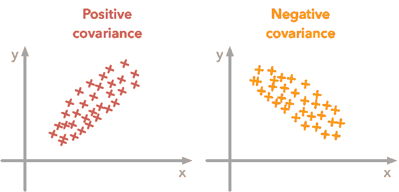

A positive covariance means that large values of one variable are associated with big values from the other (left). A negative covariance means that large values of one variable are associated with small values of the other one (right).

协方差矩阵是一个总结了一组向量的方差和协方差的矩阵，它可以告诉你很多关于变量的事情。对角线对应于每个向量的方差:

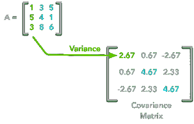

A matrix ***A*** and its matrix of covariance. The diagonal corresponds to the variance of each column vector.

让我们用方差公式来验证一下:

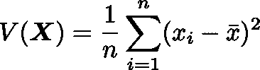

用 **n** 表示向量的长度，用 **x̄** 表示向量的平均值。例如， **A** 的第一列向量的方差为:

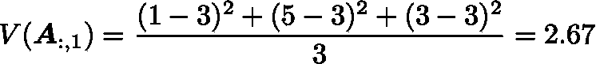

这是我们协方差矩阵的第一个单元。对角线上的第二个元素对应于从**到**的第二列向量的方差，依此类推。

**注**:从矩阵 **A** 中提取的向量对应 **A** 的列。

其他单元格对应于从 ***到*** 的两个列向量之间的协方差。例如，第一列和第三列之间的协方差位于协方差矩阵中作为列 1 和行 3(或列 3 和行 1)。

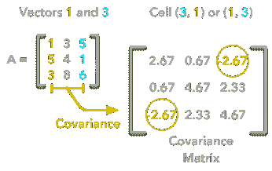

The position in the covariance matrix. Column corresponds to the first variable and row to the second (or the opposite). The covariance between the first and the third column vector of ***A*** is the element in column 1 and row 3 (or the opposite = same value).

让我们检查一下 **A** 的第一列向量和第三列向量之间的协方差等于-2.67。两个变量 ***X*** 和 **Y** 之间的协方差公式为:


变量 **X** 和 **Y** 是最后一个例子中的第一和第三列向量。让我们拆分这个公式，以确保它非常清楚:

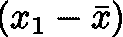

1.  求和符号(**σ**)意味着我们将对向量的元素进行迭代。我们将从第一个元素( **i=1** )开始，计算第一个元素 **X** 减去向量 **X** 的平均值。

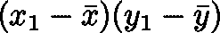

2.将结果乘以 **Y** 的第一个元素减去矢量**Y的平均值。**

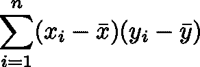

3.对向量的每个元素重复该过程，并计算所有结果的总和。

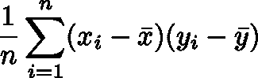

4.除以向量中的元素数。

**例 1。**

让我们从矩阵 **A** 开始:

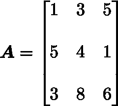

我们将计算第一列和第三列向量之间的协方差:

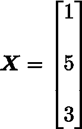

和

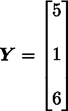

**x̄=3** ， **ȳ=4** ， **n=3** 所以我们有:

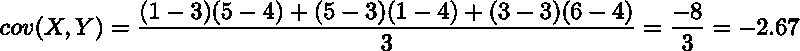

好的，太好了！这就是协方差矩阵的值。

**现在好走的路**。有了 NumPy，可以用函数`np.cov`计算协方差矩阵。

**值得注意的是**如果你想让 NumPy 使用列作为向量，必须使用参数`rowvar=False`。还有，`bias=True` 除以 **n** 而不是除以 **n-1** 。

让我们首先创建数组:

```
array([[1, 3, 5],       [5, 4, 1],       [3, 8, 6]])
```

现在我们将使用 NumPy 函数计算协方差:

```
array([[ 2.66666667, 0.66666667, -2.66666667],       [ 0.66666667, 4.66666667, 2.33333333],       [-2.66666667, 2.33333333, 4.66666667]])
```

看起来不错！

**用点积求协方差矩阵**

还有另一种方法来计算 **A** 的协方差矩阵。你可以把**和**放在 0 左右。从矢量的每个元素中减去矢量的平均值，得到平均值等于 0 的矢量。它与自己的转置相乘，然后除以观察次数。

让我们从一个实现开始，然后我们将尝试理解与前面等式的联系:

让我们在我们的矩阵上测试一下:

```
array([[ 2.66666667, 0.66666667, -2.66666667],       [ 0.66666667, 4.66666667, 2.33333333],       [-2.66666667, 2.33333333, 4.66666667]])
```

我们最终得到和以前一样的结果。

解释很简单。两个向量之间的点积可以表示为:

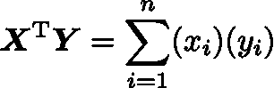

没错，它是向量的每个元素的乘积之和:

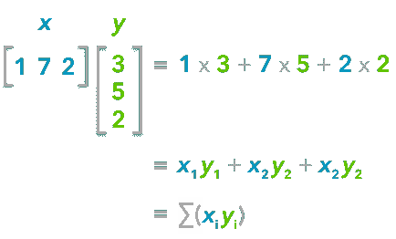

The dot product corresponds to the sum of the products of each element of the vectors.

如果 **n** 是我们的向量中元素的数量，并且我们除以 **n** :

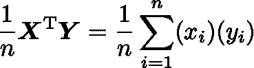

您可以注意到，这与我们之前看到的协方差公式相差不远:


唯一的区别是，在协方差公式中，我们从向量的每个元素中减去向量的平均值。这就是为什么我们需要在做点积之前将数据居中。

现在，如果我们有一个矩阵 **A** ，在 **A** 和它的转置之间的点积将会给你一个新的矩阵:

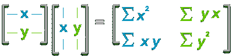

If you start with a zero-centered matrix, the dot product between this matrix and its transpose will give you the variance of each vector and covariance between them, that is to say the covariance matrix.

这就是协方差矩阵！

#### B.可视化数据和协方差矩阵

为了更深入地了解协方差矩阵及其用途，我们将创建一个函数来显示协方差矩阵和 2D 数据。您将能够看到协方差矩阵和数据之间的联系。

这个函数将计算协方差矩阵，就像我们在上面看到的那样。它将创建两个子图—一个用于协方差矩阵，一个用于数据。来自 [Seaborn](https://seaborn.pydata.org) 的`heatmap()`函数被用来创建颜色梯度——小的值将被涂成浅绿色，大的值被涂成深蓝色。我们选择了调色板中的一种颜色，但您可能更喜欢其他颜色。数据用散点图表示。

#### C.模拟数据

**不相关的数据**

现在我们有了 plot 函数，我们将生成一些随机数据来可视化协方差矩阵能告诉我们什么。我们将从使用 NumPy 函数`np.random.normal()`从正态分布中提取的一些数据开始。


Drawing sample from a normal distribution with NumPy.

该函数需要分布的平均值、标准偏差和观察次数作为输入。我们将创建 300 个观察值的两个随机变量，标准偏差为 1。第一个平均值为 1，第二个平均值为 2。如果我们从正态分布中随机抽取两组 300 个观察值，两个向量将是不相关的。

```
(300, 2)
```

**注 1** :我们用`.T`转置数据，因为原始形状是`(2, 300)`，我们想要观察的行数(形状`(300, 2)`也是如此)。

**注 2** :为了再现性，我们使用`np.random.seed`功能。下次我们运行单元时将使用相同的随机数。

让我们看看数据是什么样子的:

```
array([[ 2.47143516, 1.52704645],       [ 0.80902431, 1.7111124 ],       [ 3.43270697, 0.78245452],       [ 1.6873481 , 3.63779121],       [ 1.27941127, -0.74213763],       [ 2.88716294, 0.90556519],       [ 2.85958841, 2.43118375],       [ 1.3634765 , 1.59275845],       [ 2.01569637, 1.1702969 ],       [-0.24268495, -0.75170595]])
```

很好，我们有两个列向量。

现在，我们可以检查分布是否正常:

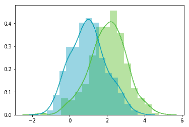

看起来不错！

我们可以看到，这些分布具有相同的标准偏差，但平均值不同(1 和 2)。这正是我们所要求的。

现在，我们可以用我们的函数绘制数据集及其协方差矩阵:

```
Covariance matrix:[[ 0.95171641 -0.0447816 ] [-0.0447816 0.87959853]]
```

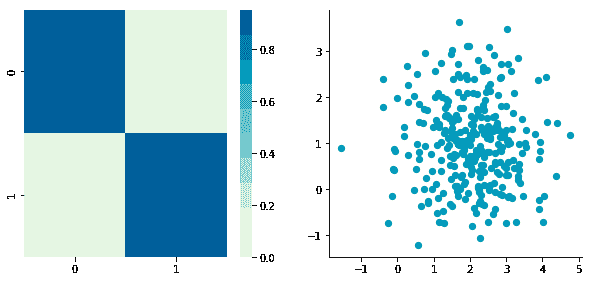

我们可以在散点图上看到，两个维度是不相关的。请注意，我们有一个维度的平均值为 1 (y 轴)，另一个维度的平均值为 2 (x 轴)。

还有，协方差矩阵显示每个变量的方差很大(1 左右)，第 1 列和第 2 列的协方差很小(0 左右)。因为我们确保了两个向量是独立的，所以这是一致的。反之不一定成立:协方差为 0 并不能保证独立性(见[此处](https://stats.stackexchange.com/questions/12842/covariance-and-independence))。

**相关数据**

现在，让我们通过从一列指定另一列来构造相关数据。

```
Covariance matrix:[[ 0.95171641 0.92932561] [ 0.92932561 1.12683445]]
```

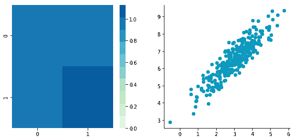

两个维度之间的相关性在散点图上是可见的。我们可以看到，可以画一条线，用来从 **x** 预测 **y** ，反之亦然。协方差矩阵不是对角线(对角线外有非零像元)。这意味着维度之间的协方差是非零的。

太好了！我们现在有了查看不同预处理技术的所有工具。

### 2.预处理

#### A.均值归一化

均值归一化就是从每个观察值中去除均值。

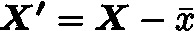

其中 **X'** 为归一化数据集， **X** 为原始数据集， **x̅** 为 **X** 的均值。

均值归一化的效果是使数据以 0 为中心。为此，我们将创建函数`center()`:

让我们用之前创建的矩阵 **B** 来试一试:

```
Before:
```

```
Covariance matrix:[[ 0.95171641 0.92932561] [ 0.92932561 1.12683445]]
```

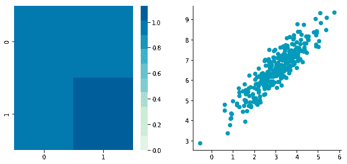

```
After:
```

```
Covariance matrix:[[ 0.95171641 0.92932561] [ 0.92932561 1.12683445]]
```


第一个图再次显示了原始数据 **B** ，第二个图显示了居中的数据(查看刻度)。

#### B.标准化或规范化

标准化用于将所有特征放在同一尺度上。每个以零为中心的尺寸除以其标准偏差。


其中 **X'** 为标准化数据集， **X** 为原始数据集， **x̅** 为 **X** 、、 **σ** 为 ***X*** 的标准差。

让我们用不同的比例创建另一个数据集，以检查它是否正常工作。

```
Covariance matrix:[[ 0.95171641 0.83976242] [ 0.83976242 6.22529922]]
```

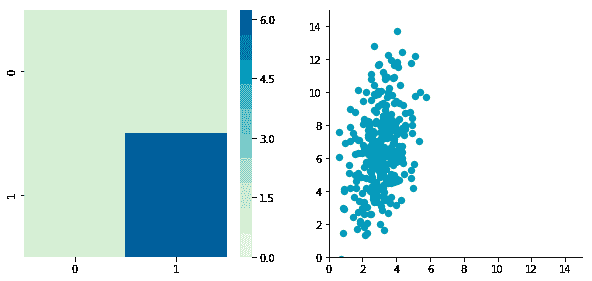

我们可以看到 **x** 和 **y** 的尺度是不同的。还要注意的是，由于尺度的差异，相关性似乎更小。现在让我们标准化它:

```
Covariance matrix:[[ 1\.          0.34500274] [ 0.34500274  1\.        ]]
```

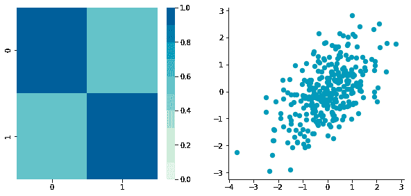

看起来不错。您可以看到比例是相同的，数据集在两个轴上都以零为中心。

现在，看看协方差矩阵。您可以看到每个坐标(左上角的单元格和右下角的单元格)的方差都等于 1。

这个新的协方差矩阵实际上是相关矩阵。两个变量( **c1** 和 **c2** )之间的皮尔逊相关系数为 0.54220151。

#### C.白粉

白化或球形化数据意味着我们希望将其转换为一个协方差矩阵，即单位矩阵，对角线上的值为 1，其他像元的值为 0。参照白噪音称之为白化。

这里有更多关于单位矩阵的细节。

白化比其他预处理稍微复杂一点，但是我们现在已经有了所有需要的工具。它包括以下步骤:

*   以数据为中心
*   去相关数据
*   重新调整数据

让我们再来一次 **C** 试着做这些步骤。

1.  **零点对中**

这指的是均值归一化( **2。一个**。回头查看关于`center()`功能的详细信息。

```
Covariance matrix:[[ 0.95171641  0.83976242] [ 0.83976242  6.22529922]]
```


**2。去相关**

此时，我们需要去相关我们的数据。直观地说，这意味着我们要旋转数据，直到不再有相关性。看看下面的图片就明白我的意思了:

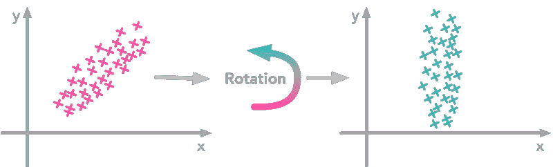

左图显示相关数据。例如，如果你取一个具有大的 **x** 值的数据点，那么相关的 **y** 值也很大。

现在取所有的数据点，做一个旋转(可能逆时针旋转 45 度左右。右边标绘的新数据不再相关。您可以看到，大的和小的 **y** 值与同类的 **x** 值相关。

问题是:为了得到不相关的数据，我们如何找到正确的旋转？

实际上，这正是协方差矩阵的特征向量所做的。它们指示数据扩散最大的方向:

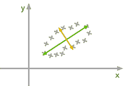

协方差矩阵的特征向量给出了使方差最大化的方向。**绿色**线的方向是方差最大的地方。只要看看投射在这条线上的最小和最大的点——扩散很大。与**橙色**线上的投影相比——传播非常小。

关于特征分解的更多细节，见本帖。

因此，我们可以通过使用特征向量来投影数据，从而消除数据的相关性。这将对应用所需的旋转和移除维度之间的相关性产生影响。以下是步骤:

*   计算协方差矩阵
*   计算协方差矩阵的特征向量
*   将特征向量矩阵应用于数据—这将应用旋转

    让我们将其打包成一个函数:

让我们尝试去相关我们的零中心矩阵 **C** 看看它的作用:

```
Covariance matrix:[[ 0.95171641 0.83976242] [ 0.83976242 6.22529922]]
```

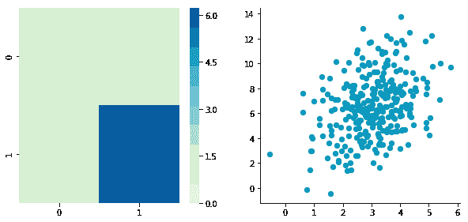

```
Covariance matrix:[[ 5.96126981e-01 -1.48029737e-16] [ -1.48029737e-16 3.15205774e+00]]
```

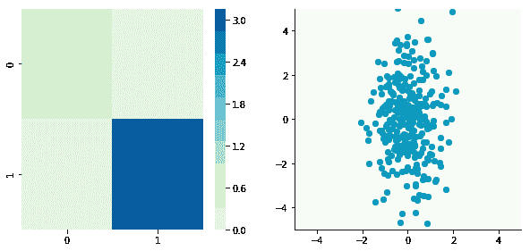

不错！这是工作。

我们可以看到相关性不再存在了。协方差矩阵，现在是对角矩阵，确认两维之间的协方差等于 0。

**3。重新调整数据**

下一步是缩放不相关矩阵，以便获得对应于单位矩阵的协方差矩阵。为此，我们通过将每个维度除以其对应特征值的平方根来调整去相关数据。

**注意**:我们增加一个小值(这里是 10^-5)以避免被 0 除。

```
Covariance matrix:[[ 9.99983225e-01 -1.06581410e-16] [ -1.06581410e-16 9.99996827e-01]]
```

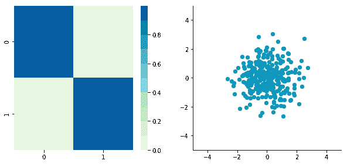

万岁！我们可以看到，有了协方差矩阵，一切都好了。我们有一个看起来像单位矩阵的东西——对角线上是 1，其他地方是 0。

### 3.图像白化

我们将看到如何白化可以应用于预处理图像数据集。为了做到这一点，我们将使用 [Pal &苏迪普(2016)](https://ieeexplore.ieee.org/document/7808140/) 的论文，他们给出了这个过程的一些细节。这种预处理技术被称为零分量分析(ZCA)。

看看报纸，但这是他们得到的结果。显示原始图像(左)和 ZCA 后的图像(右)。

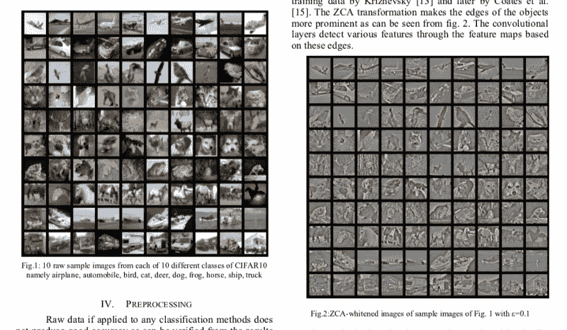

Whitening images from the CIFAR10 dataset. Results from the paper of [Pal & Sudeep (2016)](https://ieeexplore.ieee.org/document/7808140/).

重要的事情先来。我们将从 CIFAR 数据集中加载图像。这个数据集可以从 Keras 获得，你也可以从这里下载。

```
(50000, 32, 32, 3)
```

CIFAR10 数据集的训练集包含 50000 幅图像。`X_train`的形状是`(50000, 32, 32, 3)`。每个图像是 32px 乘 32px，每个像素包含 3 个维度(R，G，B)。每个值都是 0 到 255 之间相应颜色的亮度。

我们将从仅选择图像的子集开始，比如说 1000 个:

```
(1000, 32, 32, 3)
```

那更好。现在，我们将重塑数组，使其具有每行一个图像的平面图像数据。每张图片都会是`(1, 3072)`因为 32 x 32 x 3 = 3072。因此，包含所有图像的数组将是`(1000, 3072)`:

```
(1000, 3072)
```

下一步是能够看到图像。Matplotlib ( [doc](https://matplotlib.org/api/_as_gen/matplotlib.pyplot.imshow.html) )中的函数`imshow()`可用于显示图像。它需要形状为(M x N x 3)的图像，所以让我们创建一个函数来重塑图像，并能够从形状`(1, 3072)`中可视化它们。

例如，让我们绘制一个已经加载的图像:

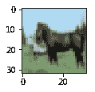

可爱！

我们现在可以实现图像的白化。 [Pal &苏迪普(2016)](https://ieeexplore.ieee.org/document/7808140/) 描述过程:

**1。**第一步是重新缩放图像，通过除以 255(像素的最大值)获得范围[0，1]。

回想一下，获得范围[0，1]的公式是:


但是，在这里，最小值是 0，所以这导致:

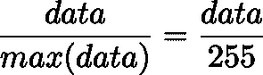

```
X.min() 0.0X.max() 1.0
```

平均减法:按像素还是按图像？

好酷，我们的像素值的范围现在在 0 和 1 之间。下一步是:

**2。**减去所有图像的平均值。

在这里要小心。

一种方法是获取每幅图像，并从每个像素中移除该图像的平均值( [Jarrett 等人，2009](https://www.computer.org/csdl/proceedings/iccv/2009/4420/00/05459469.pdf) )。这个过程背后的直觉是，它将每个图像的像素集中在 0 附近。

另一种方法是对每幅图像取 3072 个像素中的每一个(R、G 和 B 为 32×32 像素),然后减去所有图像中该像素的平均值。这被称为每像素均值减法。这一次，每个像素将根据所有图像以 0 **为中心。当您向网络提供图像时，每个像素都被视为一个不同的特征。利用每像素平均减法，我们将每个特征(像素)集中在 0 附近。这是一种常用的技术(【如】万等，2013 )。**

我们现在将从我们的 1000 幅图像中进行每像素平均减法。我们的数据是按照这些维度`(images, pixels)`组织的。因为有 1000 张 32 x 32 x 3 = 3072 像素的图像，所以是`(1000, 3072)`。因此，每个像素的平均值可以从第一个轴获得:

```
(3072,)
```

这给了我们 3072 个值，这是平均值的数量——每个像素一个。让我们看看我们的价值观:

```
array([ 0.5234 , 0.54323137, 0.5274 , …, 0.50369804, 0.50011765, 0.45227451])
```

这接近 0.5，因为我们已经归一化到范围[0，1]。然而，我们仍然需要去除每个像素的平均值:

为了让自己相信这是可行的，我们将计算第一个像素的平均值。让我们希望它是 0。

```
array([ -5.30575583e-16, -5.98021632e-16, -4.23439062e-16, …, -1.81965554e-16, -2.49800181e-16, 3.98570066e-17])
```

这不完全是 0，但它足够小，我们可以认为它起作用了！

现在我们要计算以零为中心的数据的协方差矩阵。就像我们在上面看到的，我们可以用 NumPy 的`np.cov()`函数来计算它。

**请注意**我们的变量是我们不同的形象。这意味着变量是矩阵 **X** 的行。为了明确起见，我们将用参数`rowvar=TRUE`将此信息告知 NumPy，即使默认为`True`(参见[文档](https://docs.scipy.org/doc/numpy/reference/generated/numpy.cov.html)):

**现在神奇的部分** —我们将计算协方差矩阵的奇异值和向量，并使用它们来旋转我们的数据集。如果你需要更多的细节，看看[我的关于奇异值分解(SVD)的帖子](https://hadrienj.github.io/posts/Deep-Learning-Book-Series-2.8-Singular-Value-Decomposition/)。

**注意**:使用大量图像会花费一些时间，这就是为什么我们只使用 1000 的原因。在论文中，他们使用了 10000 张图片。请根据您使用的图像数量随意比较结果:

在论文中，他们使用了以下等式:

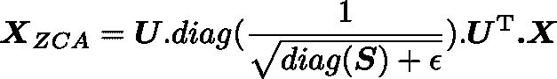

用 **U** 表示左奇异向量，用 **S** 表示初始归一化图像数据集的协方差的奇异值，用 **X** 表示归一化数据集。 **ϵ** 是一个叫做白化系数的超参数。 **diag(a)** 对应一个矩阵，向量 **a** 为对角线，其他所有单元格为 0。

我们将尝试实现这个等式。让我们从检查奇异值分解的尺寸开始:

```
(1000, 1000) (1000,)
```

**S** 是包含 1000 个元素(奇异值)的向量。 **diag(S)** 因此将是以 **S** 为对角线的`(1000, 1000)`形状:

```
[[ 8.15846654e+00 0.00000000e+00 0.00000000e+00 …, 0.00000000e+00 0.00000000e+00 0.00000000e+00] [ 0.00000000e+00 4.68234845e+00 0.00000000e+00 …, 0.00000000e+00 0.00000000e+00 0.00000000e+00] [ 0.00000000e+00 0.00000000e+00 2.41075267e+00 …, 0.00000000e+00 0.00000000e+00 0.00000000e+00] …,  [ 0.00000000e+00 0.00000000e+00 0.00000000e+00 …, 3.92727365e-05 0.00000000e+00 0.00000000e+00] [ 0.00000000e+00 0.00000000e+00 0.00000000e+00 …, 0.00000000e+00 3.52614473e-05 0.00000000e+00] [ 0.00000000e+00 0.00000000e+00 0.00000000e+00 …, 0.00000000e+00 0.00000000e+00 1.35907202e-15]]
```

```
shape: (1000, 1000)
```

检查这部分:


这也是形状`(1000, 1000)`以及 **U** 和 **U^T** 。我们还看到 **X** 具有形状`(1000, 3072)`。 **X_ZCA** 的形状为:

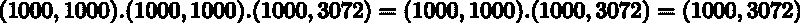

其对应于初始数据集的形状。很好。

我们有:

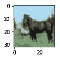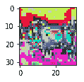

令人失望！如果你看看论文，这不是他们展示的那种结果。实际上，这是因为我们没有重新缩放像素，并且存在负值。为此，我们可以使用与上面相同的技术将其放回范围[0，1]中:

```
min: 0.0max: 1.0
```

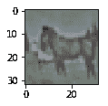

万岁！太好了！它看起来像报纸上的图像。如前所述，他们使用了 10000 张图片，而不是像我们一样的 1000 张。

要根据您使用的图像数量和超参数 **ϵ** 的效果查看结果的差异，以下是不同值的结果:

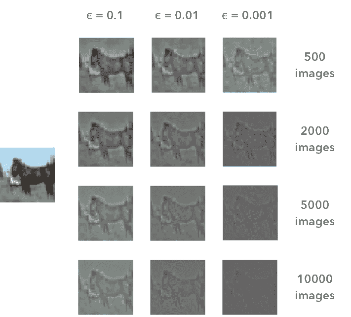

根据我们使用的图像数量和超参数 **ϵ** 的值，白化的结果是不同的。左边的图像是原始图像。在论文中， [Pal &苏迪普(2016)](https://ieeexplore.ieee.org/document/7808140/) 用了 10000 张图片，ε= 0.1。这对应于左下角的图像。

仅此而已！

我希望你在这篇文章中发现了一些有趣的东西，你可以在我的[博客](https://hadrienj.github.io/posts/Preprocessing-for-deep-learning/)上阅读，还有 LaTeX for the math，以及其他文章。

你也可以在 Github [这里](https://github.com/hadrienj/Preprocessing-for-deep-learning)叉 Jupyter 笔记本。

#### 参考

K. Jarrett、K. Kavukcuoglu、M. Ranzato 和 Y. LeCun，“对象识别的最佳多阶段架构是什么？，“2009 年 IEEE 第 12 届计算机视觉国际会议，2009，第 2146–2153 页。

[A. Krizhevsky，“从微小图像中学习多层特征”，特隆特大学硕士论文，2009 年。](http://citeseerx.ist.psu.edu/viewdoc/download?doi=10.1.1.222.9220&rep=rep1&type=pdf)

Y. A. LeCun，L. Bottou，G. B. Orr 和 K.-R. Müller，“有效的反向传播”，载于《神经网络:交易的诀窍》，施普林格，柏林，海德堡，2012 年，第 9-48 页。

[K. K. Pal 和 K. S .苏迪普，“卷积神经网络用于图像分类的预处理”，2016 年 IEEE 电子信息通信技术最新趋势国际会议(RTEICT)，2016 年，第 1778–1781 页。](https://ieeexplore.ieee.org/document/7808140/)

[万，，张，岑，费格斯，“用 DropConnect 实现神经网络的正则化”，国际机器学习会议，2013 年，第 1058-1066 页。](http://proceedings.mlr.press/v28/wan13.html)

**巨大的资源和质量保证**

[维基百科—美白改造](https://en.wikipedia.org/wiki/Whitening_transformation)

[CS231 —用于视觉识别的卷积神经网络](http://cs231n.github.io/neural-networks-2/)

达斯汀·斯坦斯伯里——聪明的机器

[关于协方差矩阵的一些细节](http://www.visiondummy.com/2014/04/geometric-interpretation-covariance-matrix/)

[SO—Python 中的图像白化](https://stackoverflow.com/questions/41635737/is-this-the-correct-way-of-whitening-an-image-in-python)

[每个图像或整个数据集的平均归一化](http://ufldl.stanford.edu/wiki/index.php/Data_Preprocessing)

[均值减影—所有图像还是每幅图像？](https://stackoverflow.com/questions/29743523/subtract-mean-from-image)

[为什么对中很重要——参见第 4.3 节](http://yann.lecun.com/exdb/publis/pdf/lecun-98b.pdf)

[ZCA 上的 Kaggle 内核](https://www.kaggle.com/nicw102168/exploring-zca-and-color-image-whitening/notebook)

[ZCA 是如何在 Keras 中实现的](https://github.com/keras-team/keras-preprocessing/blob/b9d142456a64ef228475f07cb2f2d38fd05bd249/keras_preprocessing/image.py#L1254:L1257)