# 如何将反应式操纵杆构建为单个 RxJS 可观察流

> 原文：<https://www.freecodecamp.org/news/https-medium-com-henry-little-a-reactive-joystick-built-with-rxjs-abfca3668786/>

亨利·利特尔-拜尔

# 如何将反应式操纵杆构建为单个 RxJS 可观察流

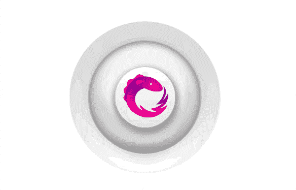

我们可能都熟悉操纵杆的概念。

我们开始握住操纵杆的手柄，四处移动手柄，当我们松开手柄时，手柄轻轻地回到初始位置。

现在，如果我们想构建某种模拟浏览器中操纵杆行为的软件组件，该怎么办呢？

有了 RxJS，这变得非常简单。这也是一个有趣的练习来证明你的反应式思维。你可以直接跳到这里的代码[如果你愿意的话](https://github.com/EnricoPicci/reactive-joystick)，否则继续阅读，看看我们能做什么。

### 哪些是我们感兴趣的事件？

操纵杆的行为可以被看作是以某种方式结合在一起的一系列事件。

我们感兴趣的第一个事件是当用户在手柄上按下鼠标(`mousedown`)——手柄正好是操纵杆图像的中心部分。

如果您按住鼠标，那么您可以四处移动，您会看到手柄相应地移动——因此鼠标的`mousemove`事件是我们想要捕捉的第二个系列事件。

最后，我们需要考虑用户何时释放鼠标(`mouseup`)，因为这是导致操纵杆手柄回到其初始位置的事件。

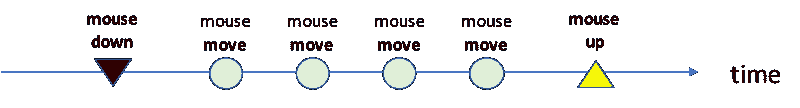

Relevant events for the Joystick case

松开手柄后，可以重复整个过程。鼠标按在手柄上，然后移动，然后松开。一次又一次。

这种重复可以看作是一连串的事件。我们可以说操纵杆的行为是由这一系列事件控制的。

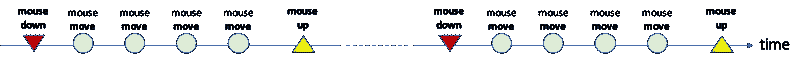

The stream of events of a Joystick

如果我们能够构建这样的事件流，我们就能很好地实现我们的目标——也就是说，使用 RxJS 为浏览器实现一个游戏杆软件组件。

### RxJS 的构建模块

浏览器实际上为我们提供了感兴趣的事件的通知:DOM 元素上代表操纵杆手柄的`mousedown`事件，以及 DOM 文档级的`mousemove`和`mouseup`事件。

RxJS 自带函数`fromEvent`,允许我们从浏览器事件中创建一个可观察对象。

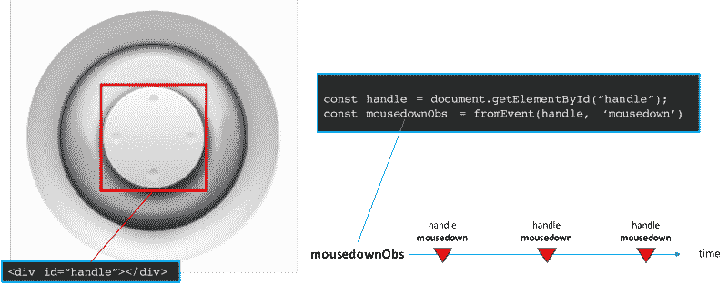

Create an Observable with `fromEvent` RxJS function

使用这种机制，我们可以创建三个事件流，它们将成为我们解决方案的构建块: **mouse_DOWN_Obs** 、 **mouse_MOVE_Obs** 、 **mouse_UP_Obs** 。

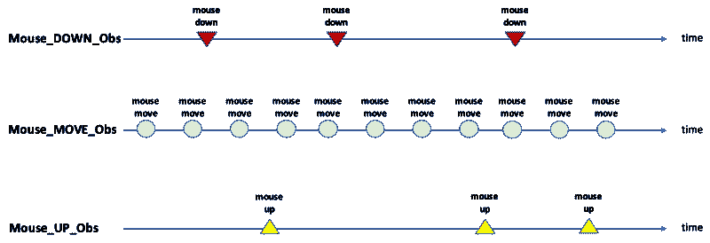

The streams of events which are our building blocks

但这些只是我们的基础。为了得到我们想要的，我们需要对它们做些什么:我们需要忽略第一个`mousedown`之前发生的所有`mousemove`事件，然后忽略下一个`mouseup`之后发生的所有`mousemove`事件。然后，当新的`mousedown`事件发生时，我们再次重复这一切。这些组成了**“操纵杆事件流”** *。*

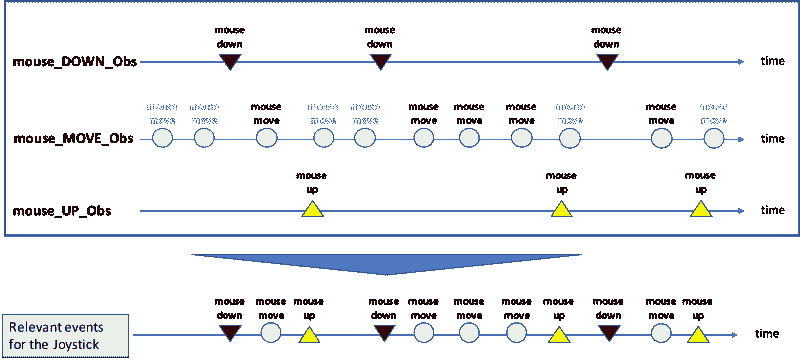

Joystick event stream built from building blocks

### 通过算子合成实现可观测量的转换

当用户按下操纵杆手柄上的鼠标，即 **mouse_DOWN_Obs** 时，一切开始。我们可以称之为源可观测量。

一旦我们从 **mouse_DOWN_Obs** 得到事件通知，我们必须*切换*并开始监听 **mouse_MOVE_Obs。**

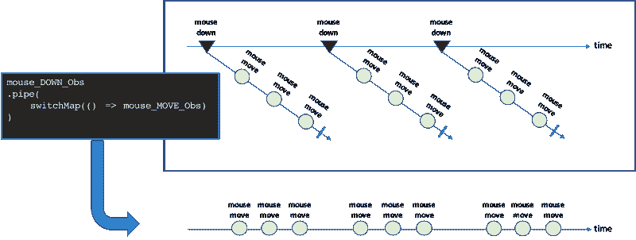

The first transformation with switchMap

看起来我们似乎没有取得很大的成就，但事实上我们现在处于这样一个位置，我们可以*接受*鼠标 _ 移动 _ 观察到的通知*直到*我们收到**鼠标 _ 移动 _ 观察到的**消息。在这一点上，我们停下来只是为了在来自 **mouse_DOWN_Obs** 的下一个通知时重新启动。

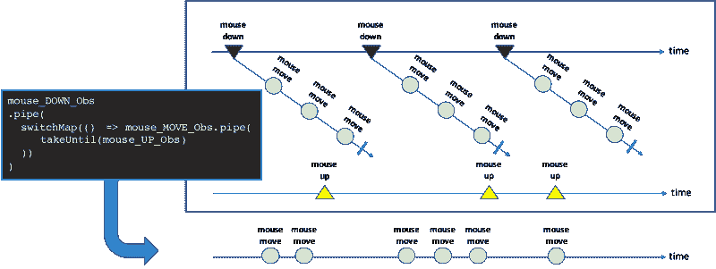

The second transformation with takeUntil

请注意，我们将`takeUntil`应用于 **mouse_MOVE_Obs** ，因为这是我们想要完成的可观察值。如果我们对 **mouse_DOWN_Obs** 应用了更高的级别，就会发生这样的情况:

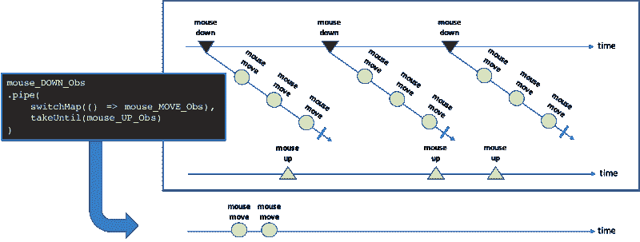

只有第一个移动事件序列会被通知，然后事件流会被关闭。操纵杆没有更多事件。

### 现在是副作用的时候了

我们已经学会了如何构建一个与操纵杆相关的所有事件的流。为了对这个流做一些有用的事情，我们需要将事件链接到我们想要做的某种动作。更具体地说:

*   当我们感觉到一个`mousemove`事件时，我们必须改变浏览器上句柄的位置
*   当我们感觉到一个`mouseup`事件时，我们必须轻轻地将手柄移回到它的原始位置，设置一些过渡风格
*   当我们感知到一个`mousedown`事件时，我们必须重置过渡风格

但是要小心。不是所有的`mousemove` 事件，不是所有的`mouseup` 事件，也不是所有的`mousedown` 事件。仅属于**“操纵杆相关事件”** *集合的事件。*例如，我们对操纵杆激活前(按下手柄上的鼠标)或松开操纵杆手柄后发生的所有`mousemove`事件不感兴趣。

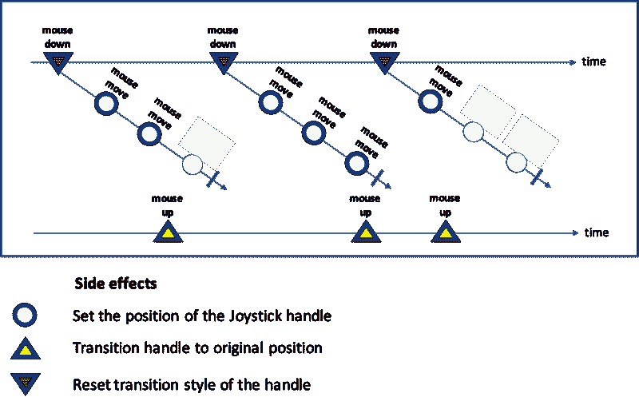

Where we need side effects

让我们回到我们推理的主线上来。在一些事件发生时，我们需要做些什么。改变系统状态的东西。在我们的例子中，这是浏览器上句柄的位置。在**功能编程**术语中，这些被称为**副作用**，即改变系统状态的功能。

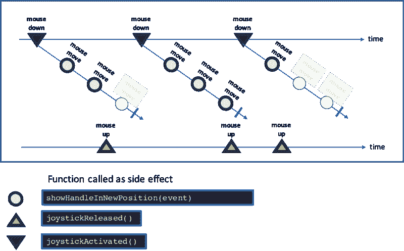

Side effects as functions — Functions as side effects

RxJS 给了我们两种实现**副作用**的方法。

第一种是可观察的`subscribe`方法。第二个是`tap`操作符，以前称为`do`，它*“对源可观测值的每个发射执行一个* **副作用** *，但返回一个与源完全相同的可观测值”*—***副作用*** 由作为参数传递给`tap`的函数决定。`tap`是我们将要使用的方法。

最终，这是实现我们的反应式操纵杆的核心代码

```
const handle = document.getElementById("handle");const mouse_DOWN_Obs = rxjs.fromEvent(handle, 'mousedown');const mouse_MOVE_Obs = rxjs.fromEvent(document, 'mousemove');const mouse_UP_Obs = rxjs.fromEvent(document, 'mouseup');
```

```
function activateJoytick() {  mouse_DOWN_Obs.pipe(    rxjs.operators.tap(() => joystickActivated()),    rxjs.operators.switchMap(() => mouse_MOVE_Obs.pipe(      rxjs.operators.takeUntil(mouse_UP_Obs.pipe(        rxjs.operators.tap(() => joystickReleased())      )),    )),    rxjs.operators.tap(event => showHandleInNewPosition(event))  )  .subscribe();}
```

### 示例代码

您可以在这里找到示例代码[，在这里您可以将 RxJS 实现与使用纯 JavaScript 构建的实现进行比较。](https://github.com/EnricoPicci/reactive-joystick)