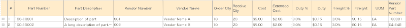
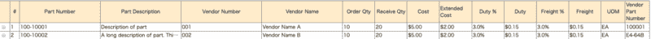
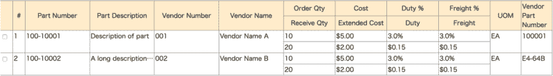
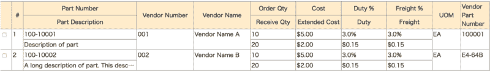
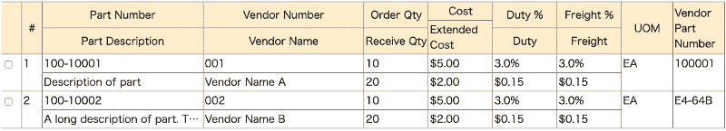
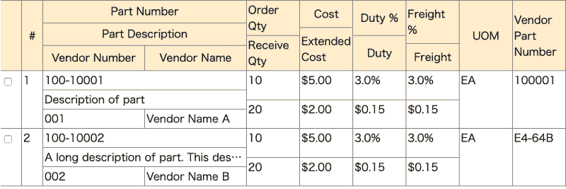
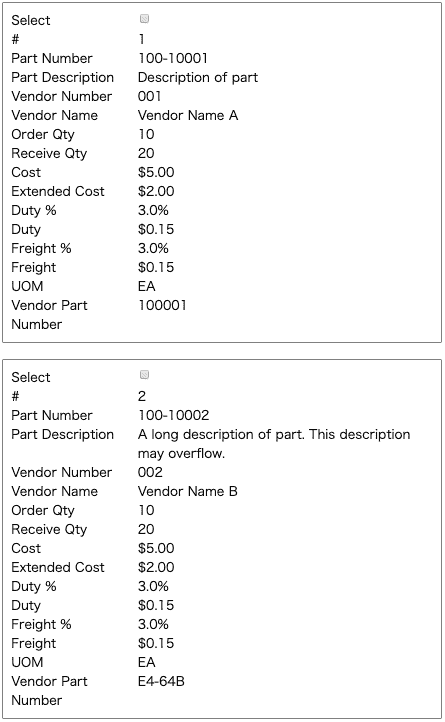
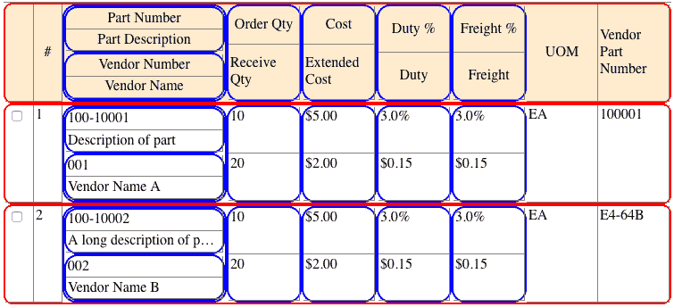

# 如何使用网格布局模块用纯 CSS 创建响应式表格

> 原文：<https://www.freecodecamp.org/news/https-medium-com-nakayama-shingo-creating-responsive-tables-with-pure-css-using-the-grid-layout-module-8e0ea8f03e83/>

### TL；速度三角形定位法(dead reckoning)

显示相似数据集合的最流行的方法是使用表格，但是 HTML 表格的缺点是很难响应。

在本文中，我使用 CSS Grid Layout 模块和 CSS 属性(没有 Javascript)来布局表格，这些表格根据屏幕宽度换行，这进一步改变了基于小屏幕布局的卡片。

对于没有耐心的人，请看下面的 pen 的原型实现。

[https://codepen.io/ShingoNakayama/embed/preview/LMLeRZ?height=300&slug-hash=LMLeRZ&default-tabs=html,result&host=https://codepen.io](https://codepen.io/ShingoNakayama/embed/preview/LMLeRZ?height=300&slug-hash=LMLeRZ&default-tabs=html,result&host=https://codepen.io)

### 响应式 HTML 表格的一点历史

响应式表并不是一个新话题，已经提出了许多解决方案。[“响应式表格数据综述”](https://css-tricks.com/responsive-data-table-roundup/)克里斯·科伊尔(Chris Coyier)于 2012 年首次发表，将事情总结得非常简洁(包括 2018 年的更新)。

[“使用 CSS3 Flexbox 的真正响应表”](https://hashnode.com/post/really-responsive-tables-using-css3-flexbox-cijzbxd8n00pwvm53sl4l42cx)Vasan subra manian 展示了用 Flexbox 实现的包装列的想法。

尽管已经提出了许多有趣的想法，像 [bootstrap](https://getbootstrap.com/docs/4.0/content/tables/#responsive-tables) 这样的库选择了小屏幕水平滚动。

既然我们现在有了 CSS 网格，我想我们可以有一个更好的替代水平滚动的方法。

### HTML 表格

从基础开始，HTML 中的表格是一种通过行和列的矩阵显示项目集合的布局格式。项目按行排列，在相同的列中有相同的数据属性，行通常用一个或多个可排序的属性排序。这种格式为您提供了快速掌握和检查大量数据的鸟瞰图。

例如，下面是一个假设的采购订单详细信息表，您可能会在采购应用程序中看到它。



Table of purchase order details

在这种情况下，一个条目是一个采购订单细节，它具有诸如零件号、零件描述等属性。

当使用 HTML 表格时，数据的布局被硬编码为行和列(例如`<tr>`和`<td>`)。这对于适合整个桌子宽度的屏幕的使用来说可能是足够的，但是实际上，这不适用于当今存在的无数设备。就技巧而言，您可以改变表格的显示属性，并使用任何您可以使用 CSS 的布局，但这似乎在语义上不正确。

### 重新定义的表格(=项目集合)

让我们从重新定义表格数据应该如何在 HTML 中表示开始。

如前所述，由于表数据本质上是项目的有序集合，使用有序列表似乎是很自然的。此外，由于表格通常用于补充文本描述，因此将其包含在一个部分中似乎是很自然的，但这将取决于如何使用表格数据的上下文。

```
<section>
 <ol>
  <!-- The first list item is the header of the table -->
  <li>
   <div>#</div>
   <!-- Enclose semantically similar attributes as a div hierarchy -->
   <div>
    <div>Part Number</div>
    <div>Part Description</div>
   </div>
   ...
  </li>
  <!-- The rest of the items in the list are the actual data -->
  <li>
   <div>1</div>
   <!-- Group part related information-->
   <div>
    <div>100-10001</div>
    <div>Description of part</div>
   </div>
  ...
  </li>
 ...
 </ol>
</section>
```

普通的`<div>`用于表达项目属性，因为 HTML5 没有为此定义合适的标签。这里的关键是将语义相似的属性表达为`<div>`的层次结构。在定义数据应该如何布局时，将使用这种结构。我将在下一节的样式主题中回到这个问题。

至于`<div>`元素内部的实际数据，列表中的第一项是表头，其余项都是实际数据。

现在，是时候开始讨论用 CSS Grid 对项目进行样式化了。

### 样式化项目集合

这里的基本思想是在显示宽度允许的情况下，将该项目的所有属性显示为一个普通的表。这种布局可以看到尽可能多的项目(行)。



Full Table

当显示的宽度变窄时，为了节省水平空间，一些属性被垂直堆叠。堆叠属性的选择应基于:

1.  这些属性在垂直堆叠时有意义吗？而且，
2.  垂直堆叠时，是否节省水平空间？



Wrapping Table 1\. Start by wrapping columns that need little width, and give the other columns space



Wrapping Table 2\. Wrap “Part Description”, to be able to see the description



Wrapping Table 3\. Further wrap “Vendor Name”



Wrapping Table 4\. Wrap vendor related information under part related information


Wrapping Table 5\. Fully wrapped

当宽度进一步缩小到移动设备的大小时，每个项目都显示为一张卡片。这种布局具有冗余性，因为属性名称在每张卡片上重复显示，并且具有最低的可浏览性，但不损害可用性(例如，水平滚动、超小文本等)。


Two Column Card Layout



One Column Card Layout

现在让我们深入细节。

#### 样式步骤 1:整个表格

这里有一个 CSS Grid 将如何实现的可视化总结。



Grid containers

为了使列换行，多个网格容器被定义为一个层次结构。红框是每行的网格容器，蓝框是每个换行的列组的容器。

让我们通过定义一个名为`.item-container`的类并将它应用到`<li>`(红框)来将列表设置为网格容器。

```
.item-container {
    display: grid;
    grid-template-columns: 2em 2em 10fr 2fr 2fr 2fr 2fr 5em 5em;
}
```

用`grid-template-columns`指定的显式列的数量是 9，这是直接在`<li>`下面的顶级`<div>`的数量。

列的宽度在相对长度中定义，以使列换行。实际分数必须根据内容进行微调。

不换行的列以绝对长度定义，以最大化换行列的宽度使用。在采购订单细节示例中，第二列是一个两位数的 Id，所以我将宽度设置为 2 m 的两倍。

接下来，我们定义另一个名为`.attribute-container`的网格容器，并将其应用于列表(蓝色框)下的所有中间`<div>`。

```
.attribute-container {
    display: grid;
    grid-template-columns: repeat(auto-fit, minmax(var(--column-width-min), 1fr));
    }
```

使用`minmax`函数，用一个名为`--column-width-min`的 CSS 变量来指定`.attribute-container`下所有网格项的最小列宽(稍后将详细介绍)，最大列宽设置为占用剩余空间(例如一个分数)。由于`grid-template-columns`是`repeat` ed，可用的水平空间将被分割成最大数量的列，这可能至少需要`--column-width-min`，其余的列将转到下一行。如果有多余的水平空间，列的宽度将被拉伸，因为`repeat`是`auto-fit` ed。

#### 样式步骤 2:包装表格

接下来，需要为每一列单独指定`--column-width-min`，以便换行。为了清楚起见，需要指定变量，以便整个表也能正确呈现。为此，为每个`.attribute-container`设置一个类，并为每个类范围指定一个不同的`--column-width-min`。

让我们看看应用了`.part-id`的 HTML，

```
<div class="attribute-container part-id">
    <div>Part Number</div>
    <div>Part Description</div>
</div>
```

和 CSS:

```
.part-id {
    --column-width-min: 10em;
}
```

这个特定的网格容器将有两列，只要每个网格项目的可用宽度大于 10em(例如，网格容器的宽度大于 20em)。一旦网格容器的宽度变得小于 20em，第二个网格项将转到下一行。

当我们像这样组合 CSS 属性时，我们只需要一个网格容器`.attribute-container`，其中的细节会改变类的应用位置。

我们可以进一步嵌套`.attribute-container` s，拥有不同宽度的多层包装，如下所示。

```
<div class="attribute-container part-information">
    <div class="attribute-container part-id">
        <div class="attribute" data-name="Part Number">Part Number</div>
        <div class="attribute" data-name="Part Description">Part Description
    </div>
    </div>
    <div class="attribute-container vendor-information">
        <div class="attribute">Vendor Number</div>
        <div class="attribute">Vendor Name</div>
    </div>
</div>
.part-information {
    --column-width-min: 10em;
}
.part-id {
    --column-width-min: 10em;
}
.vendor-information {
    --column-width-min: 8em;
}
```

以上全部附在以下媒体查询中。实际的断点应该根据表格换行到极限时所需的宽度来选择。

```
@media screen and (min-width: 737px) {
...
}
```

#### 样式步骤三:卡片布局

卡片布局看起来像一个典型的表单，属性名在第一列，属性值在第二列。

为此，定义了一个名为`.attribute`的类，并将其应用于`<li>`下的所有叶子`<div>`标签。

```
.attribute {
    display: grid;
    grid-template-columns: minmax(9em, 30%) 1fr;
}
```

属性名取自名为`data-name`的叶子`<div>`的自定义属性，例如`<div class=”attribute” data-name="Part Number">`，并创建一个伪元素。伪元素将服从网格容器的布局。

```
.attribute::before {
    content: attr(data-name);
}
```

列表中的第一项是标题，不需要显示。

```
/* Don't display the first item, since it is used to display the header for tabular layouts*/
.collection-container>li:first-child {
    display: none;
}
```

最后，卡片为移动设备排列在一列中，但为稍微宽一点的屏幕排列在两列中，但不足以显示一张表。

```
/* 2 Column Card Layout */
@media screen and (max-width: 736px) {
    .collection-container {
        display: grid;
        grid-template-columns: 1fr 1fr;
        grid-gap: 20px;
    }
...
}
/* 1 Column Card Layout */
@media screen and (max-width:580px) {
    .collection-container {
        display: grid;
        grid-template-columns: 1fr;
    }
}
```

### 整理笔记

可访问性是一个根本没有考虑的领域，可能还有一些改进的空间。

如果你有任何想法或第二个想法，请随时评论！

当然，感谢你的阅读。