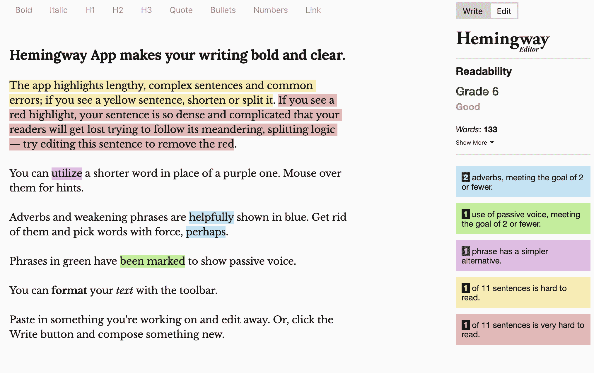
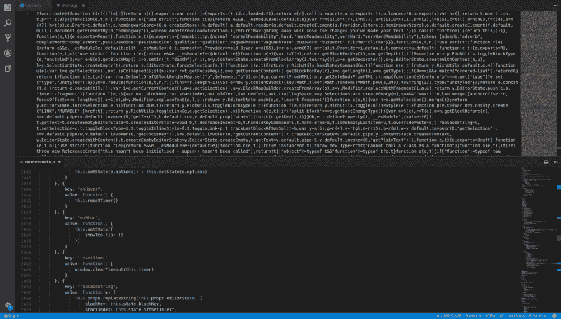
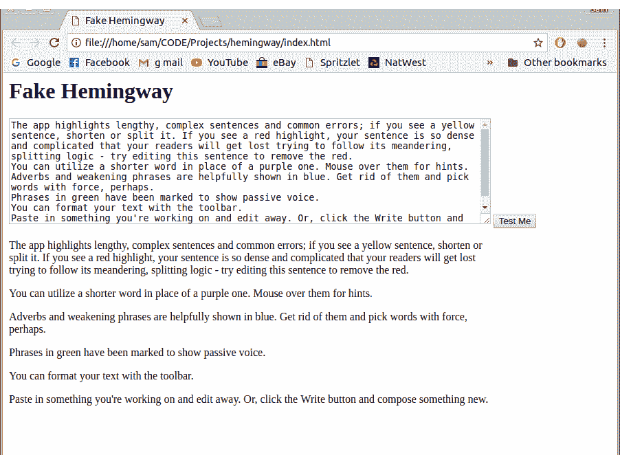
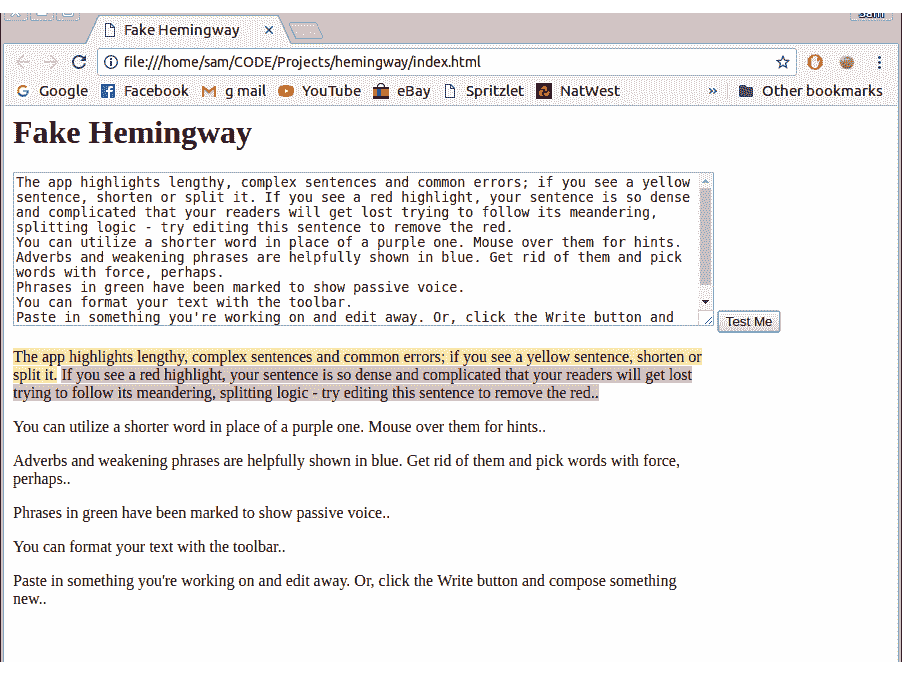
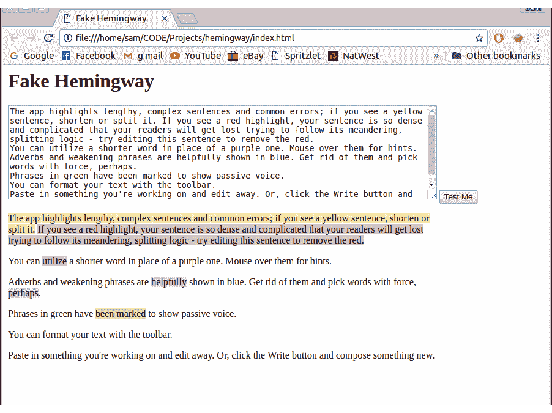
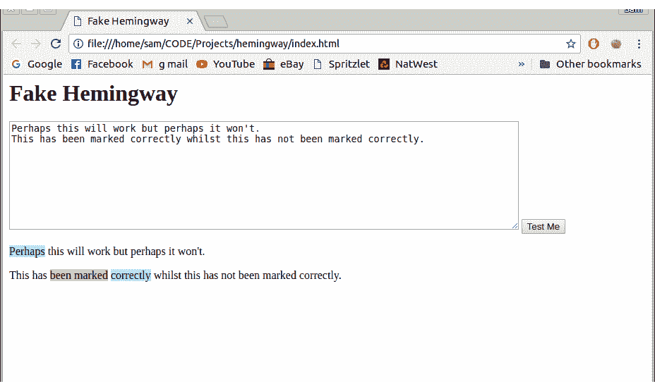
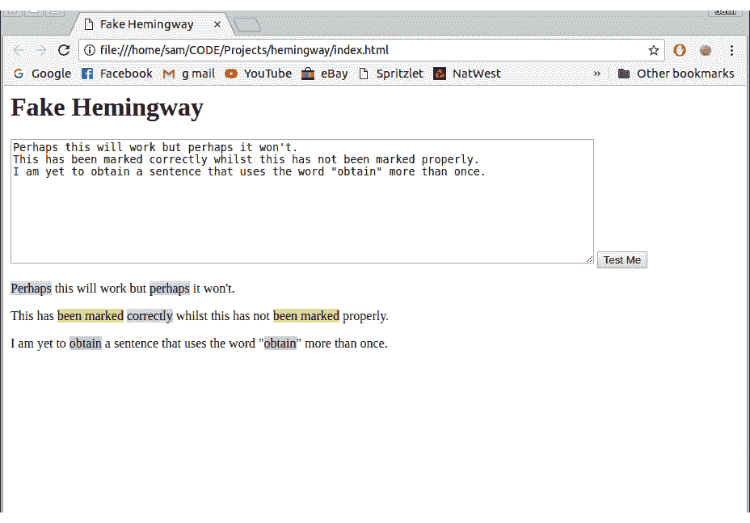
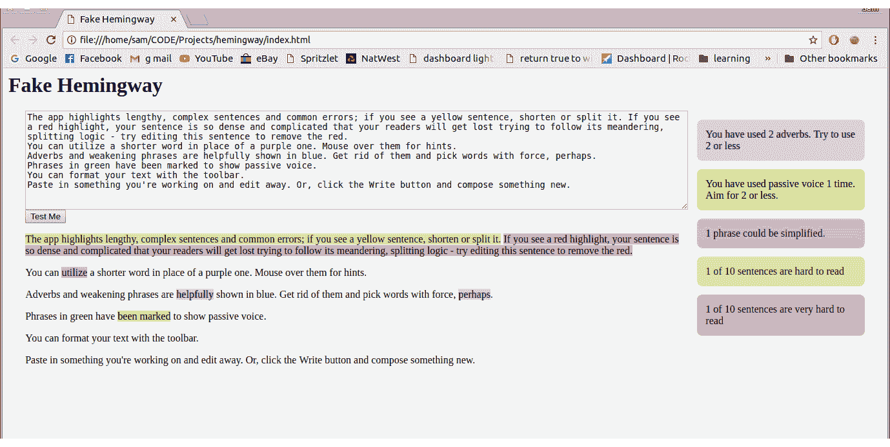

# 我如何逆向工程海明威编辑器-一个流行的写作应用程序-并在泰国的海滩上建立了自己的

> 原文：<https://www.freecodecamp.org/news/https-medium-com-samwcoding-deconstructing-the-hemingway-app-8098e22d878d/>

我一直在使用海明威应用程序来改进我的帖子。与此同时，我一直在努力寻找小项目的创意。我想到了将海明威风格的编辑器整合到 markdown 编辑器中的想法。所以我需要了解海明威是如何工作的！



A screenshot of the Hemingway Editor

### 获取逻辑

当我第一次使用这个应用程序时，我不知道它是如何工作的。它可以将文本发送到服务器来计算书写的复杂性，但我希望它是在客户端计算的。

在 Chrome 中打开开发者工具(Windows/Linux 上的 Control + Shift + I 或 F12，Mac 上的 Command + Option + I)并导航到*源*提供了答案*。*在那里，我找到了我要找的文件:**鹤鸣道 3-web.js.**



Minified file on the top, Formatted file on the bottom. What a difference it makes!

这段代码是缩略形式的，阅读和理解起来很痛苦。为了解决这个问题，我将文件复制到 VS 代码中，并格式化文档(VS 代码为*Control*+*Shift*+*I*)。这将一个 3 行的文件变成了一个 4859 行的文件，所有内容都被很好地格式化了。

### 探索代码

我开始在文件中寻找任何我能理解的东西。文件的开头包含立即调用的函数表达式。我不知道发生了什么事。

```
!function(e) {
  function t(r) {
      if (n[r])
          return n[r].exports;
      var o = n[r] = {
          exports: {},
          id: r,
          loaded: !1
      };
...
```

这种情况持续了大约 200 行，然后我决定我可能是在阅读代码以使页面运行(React？).我开始浏览剩下的代码，直到找到我能理解的东西。(通过查找函数调用和函数定义，我错过了很多东西)。

我理解的第一段代码是在第 3496 行！

```
getTokens: function(e) {
  var t = this.getAdverbs(e), 
    n = this.getQualifiers(e),
    r = this.getPassiveVoices(e), 
    o = this.getComplexWords(e);
  return [].concat(t, n, r, o).sort(function(e, t) {
    return e.startIndex - t.startIndex
  })
}
```

令人惊讶的是，所有这些功能都在下面定义了。现在我知道了这个应用程序是如何定义副词、限定词、被动语态和复杂词汇的。有些很简单。该应用程序根据限定词、复杂单词和被动语态短语的列表检查每个单词。根据单词是否以“ly”结尾来过滤单词，然后检查它是否在以“ly”结尾的非副词单词列表中。

下一个有用的代码是高亮单词或句子的实现。在这段代码中有一行:

```
e.highlight.hardSentences += h
```

“硬句子”是我能理解的，是有意义的。然后我在文件中搜索`hardSentences`，找到了 13 个匹配项。这导致计算可读性统计的一行:

```
n.stats.readability === i.default.readability.hard && (e.hardSentences += 1),
n.stats.readability === i.default.readability.veryHard && (e.veryHardSentences += 1)
```

现在我知道在`stats`和`i.default`中都有一个`readability`参数。搜索文件，我找到了 40 个匹配的。其中一个匹配是`getReadabilityStyle`功能，在这里他们给你的写作打分。

有三个级别:正常、困难和非常困难。

```
t = e.words;
n = e.readingLevel;
return t < 14
  ? i.default.readability.normal
  : n >= 10 && n < 14
    ? i.default.readability.hard
    : n >= 14 ? i.default.readability.veryHard 
      : i.default.readability.normal;
```

“正常”少于 14 个字，“困难”是 10–14 个字，“非常困难”是 14 个字以上。

现在来看看如何计算阅读水平。

我在这里花了一段时间试图找到如何计算阅读水平的任何概念。我发现它在`getReadabilityStyle`函数上面 4 行。

```
e = letters in paragraph;
t = words in paragraph;
n = sentences in paragraph;

getReadingLevel: function(e, t, n) {
  if (0 === t 
 0 === n) return 0;
  var r = Math.round(4.71 * (e / t) + 0.5 * (t / n) - 21.43);
  return r <= 0 ? 0 : r;
}
```

也就是说你的分数是 4.71 *平均单词长度+ 0.5 *平均句子长度-21.43。就是这样。海明威就是这样给你的每个句子打分的。

### 我发现的其他有趣的事情

*   重点注释(右手边关于你写作的信息)是一个大的转换声明。三元语句用于根据你写得有多好来改变回答。
*   在被归类为“研究生”水平之前，该等级上升到 16 级。

### 我要用这个做什么

我打算做一个基本的网站，并应用我从解构海明威应用程序中学到的东西。没什么特别的，更多的是作为实现一些逻辑的练习。我以前构建过一个 Markdown 预览器，所以我可能还会尝试创建一个带有突出显示和评分系统的写作应用程序。

# 创建我自己的海明威应用

弄清楚海明威应用程序是如何工作的之后，我决定实施我所学到的来制作一个更简化的版本。

我想确保我保持了基本的风格，更注重逻辑而不是风格。我选择了一个简单的文本框输入框。

#### 挑战

1.如何保证性能？每次按键时重新扫描整个文档在计算上是非常昂贵的。这可能导致 UX 阻塞，这显然不是我们想要的。

2.如何将文本拆分成段落、句子和单词来突出。

#### 可能的解决方案

*   只重新扫描有变化的段落。通过计算段落数并将其与修改前的文档进行比较来实现这一点。使用它来查找已更改的段落或新段落，并且只扫描那个段落。
*   有一个按钮可以扫描文件。这大大减少了扫描函数的调用。

2.使用我从海明威那里学到的东西——每一段都是一个

,任何需要突出显示的句子或单词都包装在一个具有必要类别的内部。

### 构建应用程序

最近我读了很多关于构建最小可行产品(MVP)的文章，所以我决定我也要运行这个小项目。这意味着保持一切简单。我决定用一个输入框，一个扫描按钮和一个输出区。

这些都很容易在我的 index.html 档案中建立起来。

```
<link rel=”stylesheet” href=”index.css”>
<title>Fake Hemingway</title>
<div>
    <h1>Fake Hemingway</h1>
    <textarea name=”” id=”text-area” rows=”10"></textarea>
    <button onclick=”format()”>Test Me</button>
    <div id=”output”>
    </div>
</div>
<script src=”index.js”></script>
```

现在开始有趣的部分。现在让 Javascript 开始工作。

要做的第一件事是将文本框中的文本呈现到输出区域。这包括查找输入文本并将输出的内部 html 设置为该文本。

```
function format() {
    let inputArea = document.getElementById(“text-area”);
    let text = inputArea.value;
    let outputArea = document.getElementById(“output”);
    outputArea.innerHTML = text;
}
```

下一步是将文本分成段落。这是通过用' \n '分割文本并将每个文本放入一个

标签来实现的。为此，我们可以映射段落数组，将它们放在

标签之间。使用模板字符串使这变得非常容易。

```
let paragraphs = text.split(“\n”);
let inParagraphs = paragraphs.map(paragraph => `<p>${paragraph}</p>`);
outputArea.innerHTML = inParagraphs.join(“ “);
```



当我这样做的时候，不得不将测试文本复制并粘贴到文本框中，这让我很恼火。为了解决这个问题，我实现了一个立即调用的函数表达式(IIFE ),以便在网页呈现时填充文本框。

```
(function start() {
    let inputArea = document.getElementById(“text-area”);
    let text = `The app highlights lengthy, …. compose something new.`;
    inputArea.value = text;
})();
```

现在，每当您加载或刷新 web 页面时，文本框都已经预先填充了测试文本。简单多了。

### 突出

现在我已经很好地渲染了文本，并且我正在测试一个一致的文本，我不得不突出显示。我决定解决的第一种类型的强调是困难和非常困难的句子强调。

第一步是循环遍历每个段落，并把它们分成一系列句子。我使用了一个 split()函数，在每一个句号后面加一个空格。

```
let sentences = paragraph.split(‘. ’);
```

从海明威那里，我知道我需要计算单词的数量和每个句子的层次。句子的水平取决于单词的平均长度和每句话的平均单词量。下面是我是如何计算出每句话的字数和总字数的。

```
let words = sentence.split(“ “).length;
let letters = sentence.split(“ “).join(“”).length;
```

利用这些数字，我可以使用我在海明威应用程序中找到的等式。

```
let level = Math.round(4.71 * (letters / words) + 0.5 * words / sentences — 21.43);
```

根据每个句子的级别和字数，设定它们的难度。

```
if (words < 14) {
    return sentence;
} else if (level >= 10 && level < 14) {
    return `<span class=”hardSentence”>${sentence}</span>`;
} else if (level >= 14) {
    return `<span class=”veryHardSentence”>${sentence}</span>`;
} else {
    return sentence;
}
```

这个代码说，如果一个句子超过 14 个单词，并且有 10 到 14 个级别，那么它就很难，如果它超过 14 个单词，并且有 14 个或以上的级别，那么它就很难。我再次使用了模板字符串，但是在 span 标签中包含了一个类。这是我将如何定义突出。

CSS 文件真的很简单；它只是有每一类(副词，被动，硬句子)并设置它们的背景颜色。我从海明威应用程序中提取了精确的颜色。

一旦句子被返回，我就把它们连接起来，组成每个段落。

此时，我意识到我的代码中有一些问题。

*   没有句号。当我把段落分成句子时，我去掉了所有的句号。
*   句子中的字母数字包括逗号、破折号、冒号和分号。

我的第一个解决方案非常简单，但是很有效。我使用了 split('symbol ')和 join(')来删除标点符号，然后添加了“.”走到尽头。当它有效时，我寻找一个更好的解决方案。尽管我没有太多使用 regex 的经验，但我知道这是最好的解决方案。经过一番谷歌搜索，我找到了一个更优雅的解决方案。

```
let cleanSentence = sent.replace(/[^a-z0–9\. ]/gi, “”) + “.”;
```

完成这些后，我有了一个部分工作的产品。



Hard sentence highlighting

我决定着手的下一件事是副词。要查找副词，海明威只需找到以“ly”结尾的单词，然后检查它是否在非副词“ly”单词列表中。如果把“应用”或“意大利”作为副词，那就糟了。

为了找到这些单词，我把句子分成一系列单词。我映射了这个数组并使用了 IF 语句。

```
if(word.match(/ly$/) &&, !lyWords[word] ){
    return `<span class=”adverb”>${word}</span>`;
} else {
    return word
};
```

虽然这在大多数情况下都有效，但我发现了一些例外。如果一个单词后面有一个标点符号，那么它与以“ly”结尾的单词不匹配。比如“鳄鱼优雅地滑行；“它的猎物不知道”会有“优雅”这个词在数组中。为了解决这个问题，我重用了`.replace(/^a-z0-9\. ]/gi,””)`功能来清理每个单词。

另一个例外是如果单词是大写的，这很容易通过在字符串上调用`toLowerCase()`来解决。


Adverbs working

现在我有了一个可以处理副词和突出显示单个单词的结果。然后，我为复杂的限定词实现了一个非常相似的方法。那时我意识到我不再只是在寻找单个的单词，而是在寻找短语。我不得不改变我的方法，从检查每个单词是否在列表中，到查看句子是否包含每个短语。

为此，我对句子使用了`.indexOf()`函数。如果有单词或短语的索引，我会在索引处插入一个开始 span 标记，然后在密钥长度后插入结束 span 标记。

```
let qualifiers = getQualifyingWords();
let wordList = Object.keys(qualifiers);
wordList.forEach(key => {
    let index = sentence.toLowerCase().indexOf(key);
    if (index >= 0) {
    sentence =
        sentence.slice(0, index) +
        ‘<span class=”qualifier”>’ +
        sentence.slice(index, index + key.length) +
        “</span>” +
        sentence.slice(index + key.length);
    }
});
```

随着这一工作，它开始看起来越来越像海明威编辑器。


Getting complex phrases and qualifiers working

突出显示的最后一部分是被动语态。海明威使用了一个 30 行的函数来查找所有的被动短语。我选择使用海明威实现的大部分逻辑，但是对过程进行不同的排序。他们寻找列表中的任何单词(is，are，was，was，be，be，been，being ),然后检查下一个单词是否以 ed 结尾。

我把一个句子中的每个单词循环一遍，检查它们是否以 ed 结尾。对于我找到的每个“ed”单词，我检查前一个单词是否在前一个单词列表中。这看起来简单得多，但可能性能较差。

这样一来，我就有了一个可以突出显示我想要的所有东西的应用程序。这是我的 MVP。



All the highlighting working

### 然后我遇到了一个问题

当我写这篇文章时，我意识到我的代码中有两个巨大的错误。

```
// from getQualifier and getComplex
let index = sentence.toLowerCase().indexOf(key);
// from getPassive
let index = words.indexOf(match);
```

这些只会找到键或匹配的第一个实例。下面是这段代码将产生的结果的一个例子。



Code with bugs in

“也许”和“被标记”应该分别突出显示两次，但它们没有。

为了修复 getQualifier 和 getComplex 中的 bug，我决定使用递归。我创建了一个`findAndSpan` 函数。`indexOf()` 查找单词或短语的第一个实例。它把句子分成 3 部分:短语前，短语，短语后。递归的工作原理是将“after the phrase”字符串传递回函数。这将继续下去，直到没有更多的短语的实例，字符串将被传递回来。

```
function findAndSpan(sentence, string, type) {
    let index = sentence.toLowerCase().indexOf(key);
    if (index >= 0) {
        sentence =
            sentence.slice(0, index) +
            `<span class="${type}">` +
            sentence.slice(index, index + key.length) +
            "</span>" +
            findAndSpan(
                sentence.slice(index + key.length), 
                key,
                type);
    }
    return sentence;
}
```

被动语态也需要做类似的事情。递归采用了几乎相同的模式，传递剩余的数组项，而不是剩余的字符串。递归调用的结果被传播到一个数组中，然后被返回。现在，该应用程序可以处理重复副词、限定词、复杂短语和被动语态的使用。



### 统计计数器

我想做的最后一件事是一行漂亮的方框，告诉你用了多少副词或复合词。

为了存储数据，我创建了一个对象，为我想要计数的每个参数设置了键。我一开始把这个变量作为一个全局变量，但是我知道我以后必须改变它。

现在我必须填充这些值。这是通过在每次找到它时递增该值来实现的。

```
data.sentences += sentence.length
or
data.adverbs += 1
```

每次运行扫描时都需要重置这些值，以确保这些值不会持续增加。

有了我需要的值，我必须让它们呈现在屏幕上。我改变了 html 文件的结构，使输入框和输出区域位于左边的 div 中，为计数器留出了右边的 div。这些计数器是具有适当的 id 和类以及“计数器”类的空 div。

```
<div id=”adverb” class=”adverb counter”></div>
<div id=”passive” class=”passive counter”></div>
<div id=”complex” class=”complex counter”></div>
<div id=”hardSentence” class=”hardSentence counter”></div>
<div id=”veryHardSentence” class=”veryHardSentence counter”></div>
```

有了这些 div，我使用 document.querySelector 使用收集的数据为每个计数器设置内部 html。对“counter”类进行一点点造型，web 应用程序就完成了。在这里尝试一下或者在这里看看[我的代码。](https://github.com/SamWSoftware/Projects/tree/master/hemingway)



The completed app