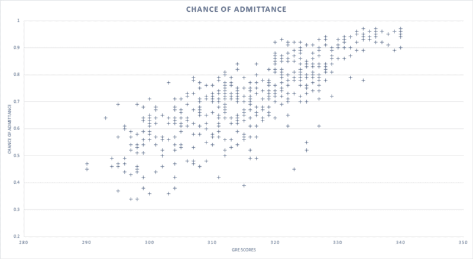
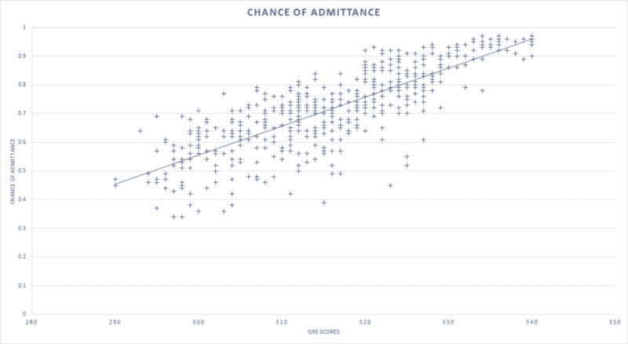
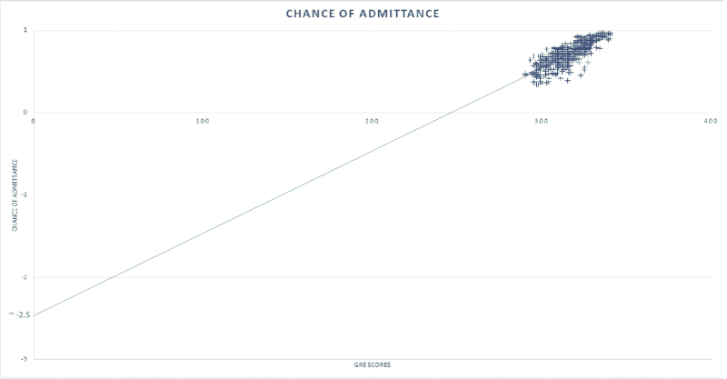
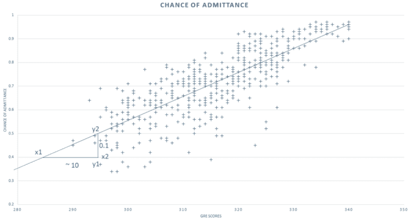
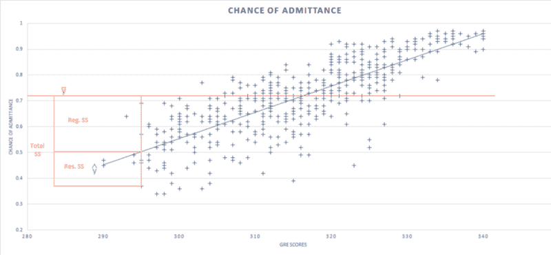
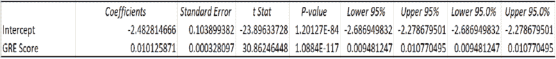
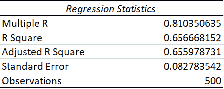
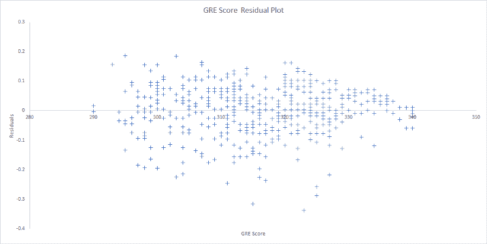

# 如何读取回归表

> 原文：<https://www.freecodecamp.org/news/https-medium-com-sharadvm-how-to-read-a-regression-table-661d391e9bd7-708e75efc560/>

作者 Sharad Vijalapuram

# 如何读取回归表

Photo by [Isaac Smith](https://unsplash.com/photos/6EnTPvPPL6I?utm_source=unsplash&utm_medium=referral&utm_content=creditCopyText) on [Unsplash](https://unsplash.com/search/photos/graph?utm_source=unsplash&utm_medium=referral&utm_content=creditCopyText)

### **什么是回归？**

回归是最重要和最常用的数据分析过程之一。简单地说，它是一种解释因变量和一个或多个自变量之间关系强度的统计方法。

因变量可以是您试图预测或理解的变量或字段。自变量可以是您认为可能对因变量有影响的字段或数据点。

通过这样做，它回答了几个重要的问题—

*   哪些变量很重要？
*   这些变量有多重要？
*   我们对这些变量有多少信心？

### 让我们举个例子…

为了更好地解释回归表中的数字，我认为使用一个样本数据集并遍历这些数字及其重要性会很有用。

我使用的是一个小型数据集，其中包含 500 名学生的 GRE(美国研究生院入学考试)成绩以及他们被大学录取的几率。

因为`chance of admittance`依赖于`GRE score`，`chance of admittance`是因变量，`GRE score`是自变量。

Scatterplot of GRE scores and chance of admittance

#### 回归线

画一条最能描述学生 GRE 成绩与其被录取几率之间关系的直线，就给了我们**线性回归线**。这在各种 BI 工具中被称为**趋势线**。画这条线背后的基本思想是最小化回归线经过的给定 x 坐标和 y 坐标上的数据点之间的距离。

Scatterplot with a regression line.

回归线使我们更容易表示这种关系。它基于一个将 x 系数和 y 截距关联起来的数学方程。

**Y 轴截距**是 x = 0 时直线与 Y 轴相交的点。当 x 为 0 时，它也是模型将采用或预测的值。

**系数**提供变量对整个模型的影响或权重。换句话说，它提供了自变量单位变化的因变量变化量。

#### 计算回归线方程

为了找出模型的 y 轴截距，我们将回归线延伸足够远，直到它在 x = 0 处与 y 轴相交。这是我们的 y 截距，大约是-2.5。这个数字对于我们正在处理的数据集来说可能没有实际意义，但目的是仅显示 y 轴截距的计算。

Calculating the y-intercept

这个模型的系数就是回归线的斜率，可以通过 GRE 分数变化的导纳变化来计算。

Calculating the slope

在上面的例子中，系数就是

> m = (y2-y1) / (x2-x1)

在这种情况下，它将接近 0.01。

公式 y = m*x + b 帮助我们计算我们回归线的数学方程。将我们从延长回归线中获得的 y 轴截距和斜率值代入，我们可以得出以下等式

> y = 0.01x — 2.48

-2.48 是我从回归表中得到的更准确的 y 截距值，如本文后面所示。

这个等式让我们预测一个学生的 GRE 分数已知时被录取的机会。

现在我们有了基础，让我们开始阅读和解释回归表。

### 读取回归表

回归表大致可以分为**三个部分** —

*   **方差分析(ANOVA):** 顾名思义就是提供模型中方差的分析。
*   **回归统计:**提供关于变化的数字信息，以及模型对给定数据/观察值的变化的解释程度。
*   **残差输出:**为每个数据点提供模型预测的值和因变量的实际观测值与其回归模型预测值的差值。

### **方差分析(ANOVA)**

ANOVA table

#### 自由度(df)

**回归 df** 是我们回归模型中自变量的个数。由于本例只考虑 GRE 成绩，所以为 1。

**残差 df** 是数据集的观测值(行)总数减去被估计的变量数。在这个例子中，GRE 分数系数和常数都被估计。

残差 df = 500 — 2 = 498

**总 df**-是回归和剩余自由度的总和，等于数据集的大小减 1。

#### **平方和(SS)**

Regression line with the mean of the dataset in red.

**回归 SS** 是由回归模型解释的因变量的总变化量。它是所有数据点的预测值和平均值之差的平方和。

> ∑ (ŷ — ӯ)

根据 ANOVA 表，回归 SS 为 6.5，总 SS 为 9.9，这意味着回归模型解释了数据集中所有可变性的大约 6.5/9.9(约 65%)。

**残差 SS** —是回归模型无法解释的因变量的总变化。它也被称为**误差平方和**，是所有数据点的实际值和预测值之差的平方和。

> ∑(y-ŷ)

根据 ANOVA 表，剩余 SS 约为 3.4。一般来说，误差越小，回归模型就能越好地解释数据集中的变化，因此我们通常希望最小化这种误差。

**总 SS**——是回归 SS 和剩余 SS 的总和，或者是如果 GRE 分数**不**考虑在内，录取机会会变化多少。

**均方误差(MS)** —是回归和残差的平方和或平方和除以自由度的平均值。

> 回归 ms =∑(ŷ-ӯ)/reg。df

> 残差 ms =∑(y-ŷ)/分辨率 df

**F** —用于检验自变量斜率为零的假设。数学上，它也可以计算为

> F =回归 MS /残差 MS

这是通过将 F 统计量与具有分子度回归 df 和分母度残差 df 的 F 分布进行比较来计算的。

**显著性 F** —只不过是自变量系数为零的零假设的 p 值，与任何 p 值一样，低 p 值表示因变量和自变量之间存在显著关系。

**标准误差** —提供系数分布的估计标准偏差。它是不同情况下系数的变化量。比其标准误差大得多的系数意味着该系数不为 0 的概率。

**t-Stat** —是测试的 t 统计量或 t 值，其值等于系数除以标准误差。

> t-Stat =系数/标准误差

同样，相对于标准误差的系数越大，t-Stat 越大，系数远离 0 的概率越高。

**p 值**-将 t 统计量与 t 分布进行比较，以确定 p 值。我们通常只考虑独立变量的 p 值，该值提供了获得样本的可能性，该样本与用于推导回归方程的样本接近，并验证回归线的斜率是否实际为零或系数是否接近所获得的系数。

低于 0.05 的 p 值表示回归线的斜率不为零的置信度为 95%，因此因变量和自变量之间存在显著的线性关系。

p 值大于 0.05 表明回归线的斜率可能为零，并且在 95%的置信水平下没有足够的证据表明因变量和自变量之间存在显著的线性关系。

由于自变量 GRE 成绩的 p 值非常接近于 0，我们可以极其自信地认为，GRE 成绩与录取机会之间存在显著的线性关系。

**上下 95%** —由于我们大多使用数据样本来估计回归线及其系数，它们大多是真实系数的近似值，进而是真实回归线。95%的下限和上限给出了每个系数的下限和上限的第 95 个置信区间。

由于 GRE 分数的 95%置信区间是 0.009 和 0.01，边界不包含零，因此，我们可以 95%确信 GRE 分数和录取机会之间存在显著的线性关系。

请注意，95%的置信水平被广泛使用，但是 95%以外的水平也是可能的，并且可以在回归分析期间设置。

### **回归统计**

Regression Statistics table

**R (R 平方)** —代表模型的力量。它显示了自变量解释的因变量的变化量，并且总是位于值 0 和 1 之间。随着 R 的增加，模型解释的数据变化越多，模型的预测就越好。低 R 值表明模型与数据不太吻合，自变量不能很好地解释因变量的变化。

> R =回归平方和/总平方和

然而，R 平方*不能*确定系数估计和预测是否有偏差，这就是为什么您必须评估残差图，这将在本文后面讨论。

R-square 也不能表明回归模型是否合适。对于良好的模型，您可以使用较低的 R 平方值；对于不符合数据的模型，您可以使用较高的 R 平方值。

在这种情况下，r 是 65 %，这意味着 GRE 分数可以解释入学机会变化的 65%。

**调整后的 R**—R 乘以一个调整系数。这在比较具有不同自变量的不同回归模型时使用。在多元回归模型中决定正确的自变量时，这个数字很方便。

**倍数 R** —是 R 的正平方根

**标准误差** —不同于系数的标准误差。这是回归方程误差的估计标准偏差，是回归线准确性的良好衡量标准。它是剩余均方误差的平方根。

> Std。误差= √(分辨率毫秒)

### **剩余输出**

残差是回归模型的实际值和预测值之间的差值，残差输出是回归模型的因变量预测值和每个数据点的残差。

顾名思义，残差图是残差和自变量之间的散点图，在这种情况下，自变量是每个学生的 GRE 分数。

残差图对于检测像**异方差**、**非线性、**和**异常值**这样的事情很重要。检测它们的过程不作为本文的一部分讨论，但是，我们示例的残差图具有随机分散的数据这一事实有助于我们确定这一模型中变量之间的关系是线性的。

Residual Plot

### **意图**

本文的目的不是构建一个有效的回归模型，而是在必要时通过回归表中的样本数据集提供所有回归变量及其重要性的演练。

虽然本文以单变量线性回归为例进行了解释，但请注意，在多变量或其他情况下，其中一些变量可能更重要。

### **参考文献**

*   [研究生招生数据集](https://www.kaggle.com/mohansacharya/graduate-admissions)
*   [阅读回归表的 10 件事](https://egap.org/methods-guides/10-things-know-about-reading-regression-table)
*   [回归分析回顾](https://hbr.org/2015/11/a-refresher-on-regression-analysis)