# 如何在你的城市建立一个强大的编码社区——以及我是如何做到的

> 原文：<https://www.freecodecamp.org/news/https-medium-com-xgee-whiz-tips-for-building-an-amazing-coding-community-7606c81c3822/>

比利·勒

# 如何在你的城市建立一个强大的编码社区——以及我是如何做到的

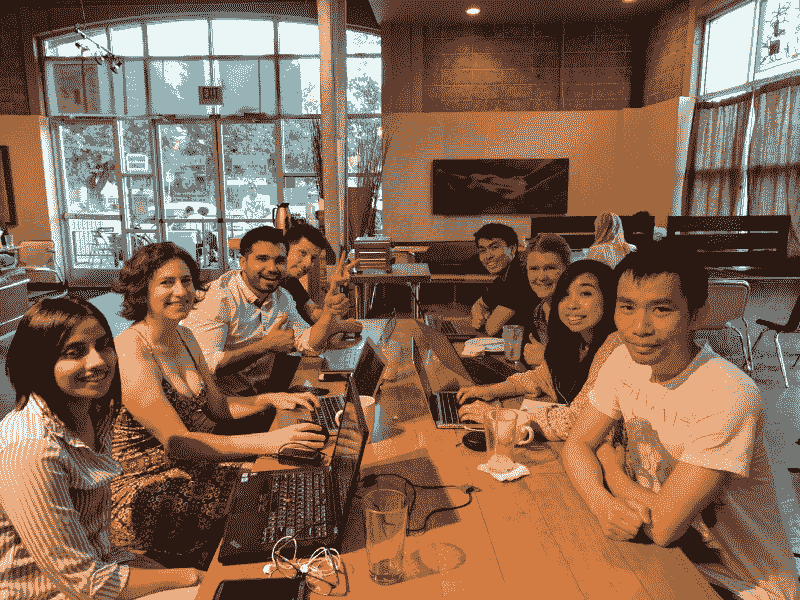

A bunch of campers who were really focused until I snapped their picture.

社区很重要。它们是将共同的信念、共同的激情和归属感粘合在一起的基石。这有助于每个人朝着个人或集体的目标共同努力。

一年多来，我一直是萨克拉门托自由代码营的组织者，我学到了很多关于如何管理一个社区的知识。我遇到了来自其他学习小组的人，我们经常交流如何管理社区的技巧。这个话题经常被提起，因为我认为人们真的想组织他们自己的社区。

在这篇文章中，我将分享一些管理社区的技巧。我将详细阐述我一路走来学到的一些价值观、技巧、领导力和组织技能。我把这些整理成了 10 条建议，我想你会发现这些建议是可行的，而且令人难忘的。

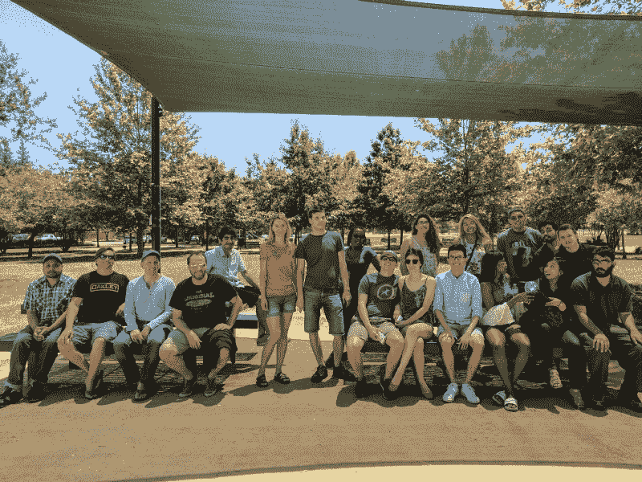

A group photo of campers during our first annual community BBQ

### 技巧 1:将时间投入到生产力和社交编码上

我鼓励人们带着耳机参加活动。这是因为我希望人们在活动的第一个小时就能完成一些工作。因为社区是在一起的，所以真的很容易被周围发生的对话分散注意力。

为了帮助人们朝着他们的编码目标前进，我试图实施一项政策，鼓励人们在活动期间花一个小时来编写代码。

这不仅限于 freeCodeCamp 材料。人们可以开发 Java，帮助他人编写代码，观看视频教程，或者做其他任何事情。

鼓励人们多产有助于他们建立现有的技能，这样他们就能成为更好的开发人员。我希望每个人都有机会朝着自己的目标努力。

关于这些事件的第二部分是，它们为社交编码或社交网络留出了时间。许多开发人员会告诉你，知道如何编程会让你找到工作，但是软技能同样重要。

对于安静的类型，我经常试着让他们参与谈话。有时在与另一个人交谈的过程中，我会找机会问那个安静的人，“你对这个[插入主题]有什么看法？”我知道这个人在注意听，但不一定想大声说出来。我可能会让人们为难，但我想让他们知道，他们的意见在我的社区是受重视的。

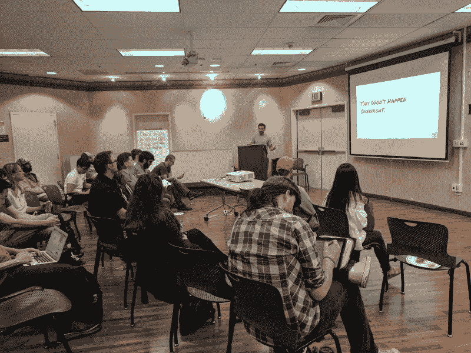

We hold talks at least once a month on introductory topics. The topic for this meeting was Professional Web Design Tips.

### **提示 2:试着记住你的成员的名字**

如果从中可以学到一个重要的教训，那就是努力记住参加你的学习小组的人的名字。这会让他们感到被重视，因为你花了时间去记住他们的名字。

戴尔·卡耐基在《如何赢得朋友和影响他人》一书中提出了一个重要概念，那就是记住别人的名字，让他们觉得自己很重要。“我就是这样在别人面前表现自己的。

如果你不擅长记名字，试着运用一些技巧，比如慢慢地重复别人的名字，或者在脑海中重复他们的名字。或者找到定义他们的面部特征并把他们和他们的名字联系起来。如果你需要更多的建议，这里有一篇很棒的文章，提供了如何记住别人名字的提示。

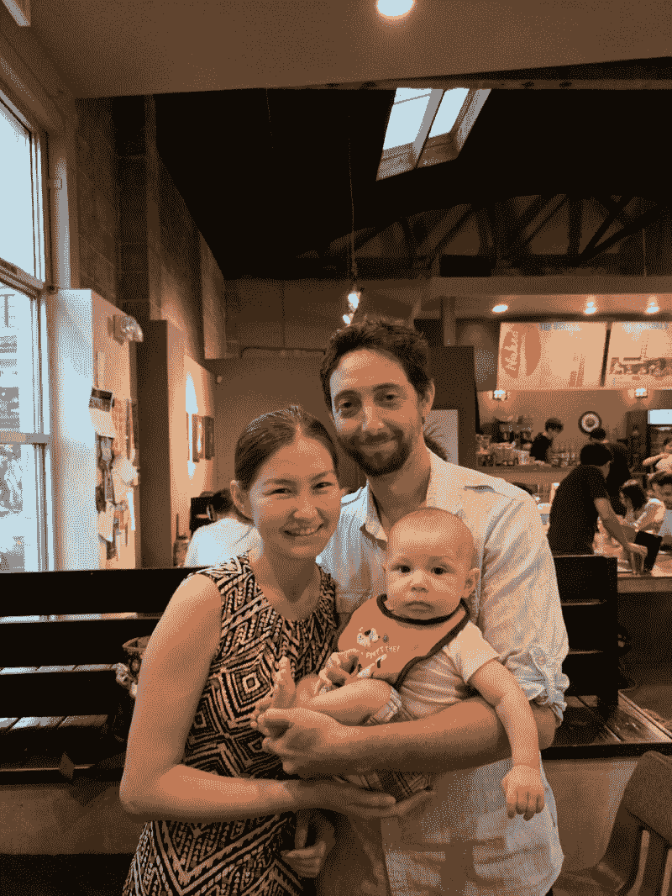

This family came together for one of my freeCodeCamp events.

### **技巧 3:用温暖的微笑问候每个人**

第一印象很重要，会产生持久的影响。为了给我的社区定下基调，当人们进来时，我通常站在前门附近，并在他们进来时向他们打招呼。

这是我了解个人、了解他们为什么参加活动、他们想要实现的目标以及他们正在做什么的黄金机会。

通过接纳新来者，我让他们知道我们是一个友好的社区，我们在这里满足他们的需求。

通过了解一些关于他们的事实，我可以做以下事情之一:将他们介绍给另一个可以与他们配对进行编程的露营者，将他们介绍给可以帮助他们完成他们遇到困难的特定挑战的人，或者甚至只是将他们带到场地中的一个可用座位。

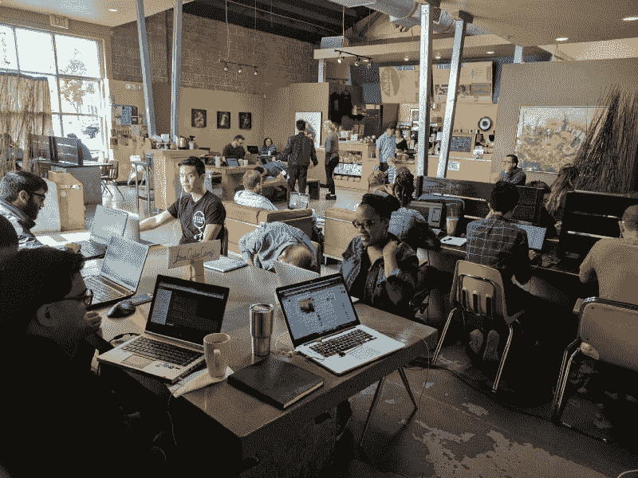

This is our normal coffee shop. We take up about half of the seats in the venue.

### **提示 4:试着让每个人都在一起**

如果人们感到没有归属感，那么一个社区就不是一个社区。社区的另一个重要方面是团结。安排活动时，找一个有大桌子或能让所有人坐在一起的地方。

通过让每个人彼此靠近，每个人都感觉他们属于一个社区。露营者可以一起工作，参与关于技术的对话，并帮助彼此克服挑战或共同应对挑战。

我喜欢有教室般环境的咖啡店。咖啡店是非正式的，让人们在加入谈话时感觉更舒服。人们坐得很近，所以他们可能会偷看别人的屏幕，并问:“嘿，你在做什么？”

环境是有机的，给成员一个发展友谊的机会。

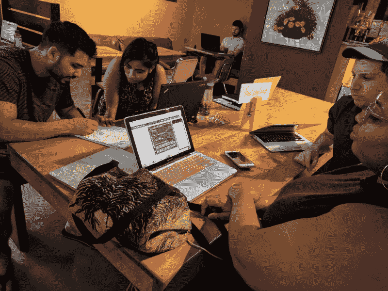

Campers are helpful. You can see their level of concentration while they work.

### **提示 5:至少提前两周安排活动**

我经常看到组织者等到最后一分钟才宣布一项活动。他们通常只有几个出席者。

你希望以最大化的参与为目标，如果你给人们不到一周的通知，你将不会得到这个目标。

如果你不能提前两周安排活动，那就尽量提前安排。

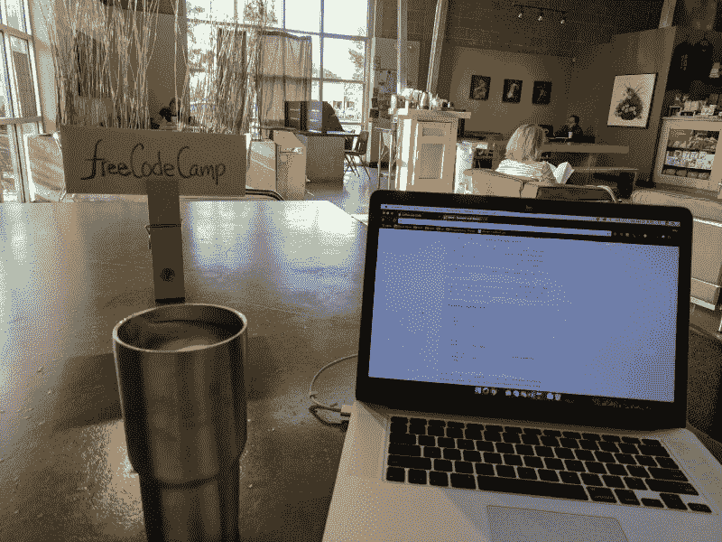

This is my normal freeCodeCamp sign that I put up to let people know where to find me.

### **提示 6:使用标志让人们知道你是谁，你在哪里**

当我刚开始组织活动时，我没有使用任何视觉显示来让新人知道我们在场地中的谁和位置。人们会走进门，像一个迷路的孩子一样四处张望，然后不得不通过问陌生人“这是[插入活动名称]吗？”来玩猜谜游戏

你不想让人们处于那种情况，因为你会违反我的清单上的第二条建议。如果人们不能在第一时间找到你，你会让他们感到不受欢迎。

当你竖起一块牌子时，你也在公开做广告。有时候，我会有团队以外的人来问我这个团队是干什么的。陌生人会好奇，这可能是一个获得新成员的机会。你永远不知道你会遇见谁。

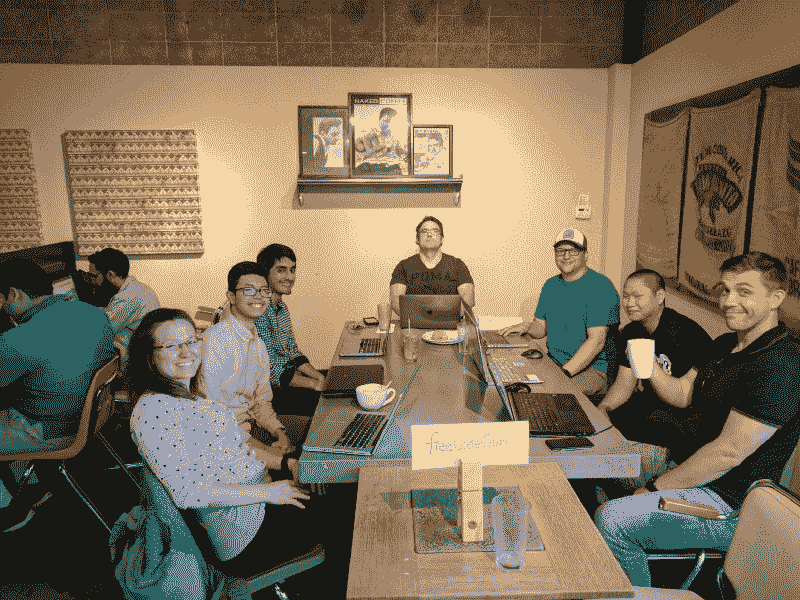

Everyone is happily hacking away and enjoying each other’s company.

### **提示 7:与组织活动保持一致**

试着每个月至少组织一次活动。这将向你的成员展示他们正在参与一个活跃的社区。

安排适当数量的活动是你必须考虑的事情。

你想每周二做一次吗？这个月的第一个星期五？每个星期六早上？这些都是你要考虑的事情。

我想变得灵活，所以我安排对我来说方便的活动。

在我组织的早期，有一次我连续两个月每周都安排一个活动，我感到筋疲力尽。这与我想要的感觉完全相反，所以我拨了回来。

现在我一个月安排三次活动，但每次都不一样。两个是“咖啡和编码”活动，一个是“谈话、研讨会或黑客之夜”。

两个“咖啡和编码”活动中的一个是在周五晚上为那些可以在工作日晚上出来的人举办的。但是对于那些有家庭并且只有周末有空的人，我会在周六早上安排一次活动。

我试图通过采用这种策略来瞄准两种不同的受众。

至于我的“讲座、研讨会或黑客之夜”，我通常安排在周六。根据主题的不同，它们会持续三个小时到七个小时。

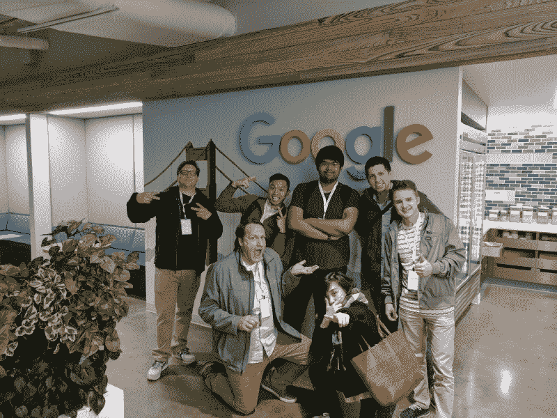

freeCodeCamp Sacramento sometimes take field trips to San Francisco together to attend awesome meetups like SFHTML5.

### **小贴士#8:要有创造力，在你的领域要有优势**

我所在的区域有涵盖中高级主题的聚会。当我刚开始学习如何编码时，有几次去拜访他们时，我感到很失落。当时什么都不说得通。

所以当我最终开始像社区领袖一样思考时，我问自己，“这个市场缺少什么？”

这就是我开始想象萨克拉门托自由代码营会是什么样的——一个友好而有趣的社区，面向所有想要学习如何编码的人。同样，它帮助那些不知道如何编码的人变得自给自足，以便他们能够自己学习。

做没人做的利基。

我的大部分演讲都是针对一些介绍性的话题，比如“[Sass 简介](https://docs.google.com/presentation/d/1KeazHW4A9ep2WTjE5w2fEpXmkVh7bJ325YE4IDw_UA8/edit?usp=sharing)”、“[网页可访问性](https://docs.google.com/presentation/d/1WcLMHttsnTMP25kwpETQ9PkqvPsaGNKfn27p6wJQPHE/edit?usp=sharing)、“[从 Codepen.io 毕业](https://docs.google.com/presentation/d/1xfIVBZetquwTdlu-cRg9zPmdc7BNYL3HFIFwYwfbeng/edit?usp=sharing)”以及其他我认为新开发人员可能需要帮助的领域。

你想跳出框框思考。今年，我举办了第一次年度免费代码营萨克拉门托烧烤。我们摆脱了编码，转而吃了一些美味的自制烧烤。

新的活动给你的社区注入活力，让事情变得有趣和新鲜。想出新的方法接近你的观众，让他们对即将到来的事件感到兴奋。

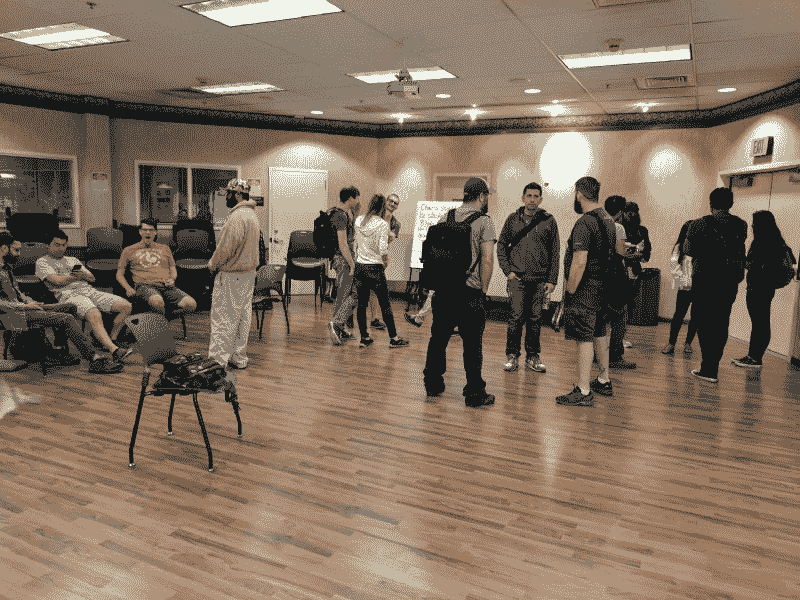

Plenty of Campers stay till the very end of an event to hang out and talk.

### **提示 9:尽可能早到晚归**

这是我在部队学到的，但不一定对所有人都可行。我习惯尽可能早地到达，为活动做准备。

我通常会提前给会场打电话，让他们知道我要来，以及参加的人数。有时场馆会为我们预留一个区域，但很多时候他们不会，比如它和咖啡店一起。

提前一个小时到达，侦察这个地方，并开始使用标志为你的成员划分出一个区域，或者带着你的物品进入这个区域。

当人们开始出现时，引导他们到你想让他们坐的地方，然后在前门的位置上和人们打招呼。

早到，并且始终如一地早到，给人留下你认真对待这些事件的印象。如果有人有问题，人们会认为你是关键人物。

如果你不在那里，你可能会在你小组的新成员中制造混乱。我参加过一次聚会，组织者总是迟到，人们对组织者的评价很差。

你不想给任何人一个借口来批评你一些可以预防的事情，因为它会影响到你所在社区的每个人。

至于呆得晚，我经常尽可能呆得久一点。尽管我把活动安排在两个小时左右，但很多时候与会者会呆得更久。

作为活动组织者，如果我有时间，我可能会多呆几个小时，但其他成员可以在预定时间离开，因为这是对他们的期望。

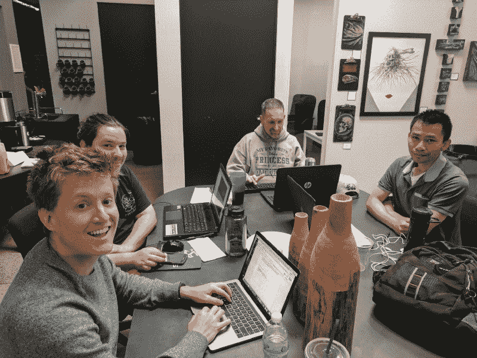

Here is a group of campers who were participating in an AngelHack Hackathon.

### **提示#10:在网上吸引你的观众**

让你的在线会员参与进来尤其重要。freeCodeCamp 在吸引新会员加入你的在线社区方面做得很好。

我试着在新成员加入我们的[脸书团队](https://www.facebook.com/groups/free.code.camp.sacramento/)后的一周内给他们发一条私人信息。当他们加入时，让他们感到受欢迎是与他们交流的好方法。这样他们可以快速介绍自己。您还可以回答他们的问题，邀请他们参加您的活动。

我还发布了这一周在我们地区发生的所有当地事件。这可能包括其他聚会，如 Ruby coding、比特币和区块链、企业家精神、WordPress 和许多其他相关的技术话题。我通常按天来划分，并提供每个小组的 meetup 页面的链接。

归根结底，我是在倡导技术。我尽量不把我的支持局限于我的团队。我对我的社区有偏见，但我想以不同的方式服务于我的社区之外。

此外，我经常发布文章、教程和其他好的资源供社区使用。分享是关怀。

最后，我问人们他们想从社区中看到什么。我进行了一次民意调查，从我们的会员那里收集他们想听的话题的建议。我甚至问成员们他们在那一周完成了什么。

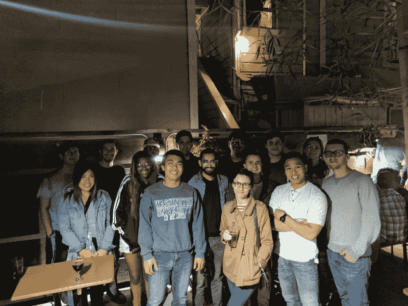

There are some nights after an event where we would all go out for a drink.

这些只是我用来吸引我的在线社区的一些策略，这样它就不会感觉陈旧。记得要有创意。

我有更多的方式来参与和发展我的社区。我对我的社区有一个更大的愿景，我希望看到它在未来实现。但是现在，这是我所能做的，因为我们是由志愿者管理的。有时候，我会花一天 25%的时间思考我能做些什么来改善我的社区。有时候感觉就是兼职。

所以，如果你想建立你的社区并看到它成长，准备好尽你最大的努力吧！

### 欣赏更多我们社区的图片！

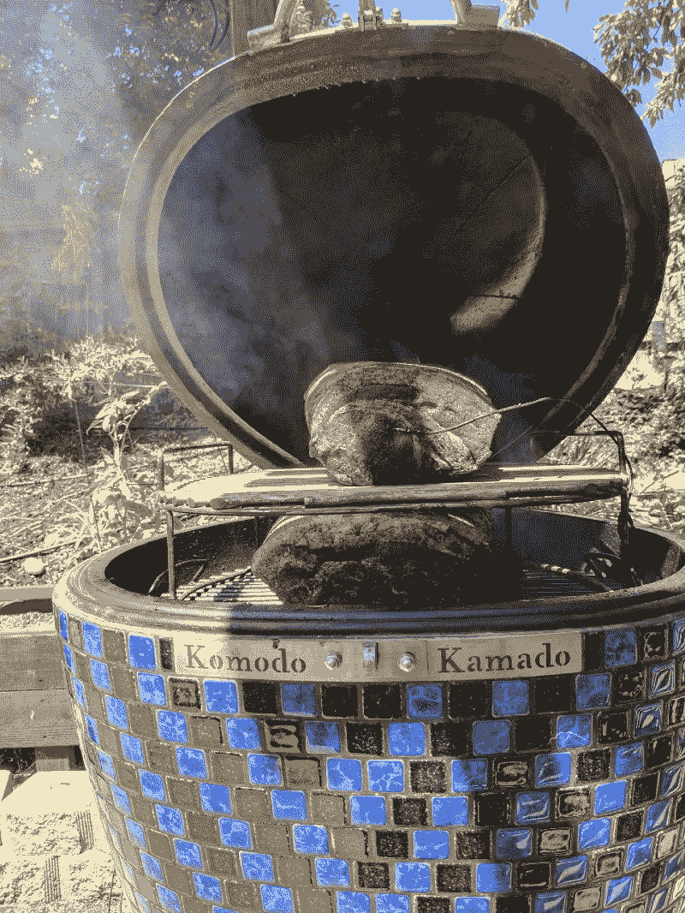

The 25-pound slow-cooked pulled pork we ate. ??

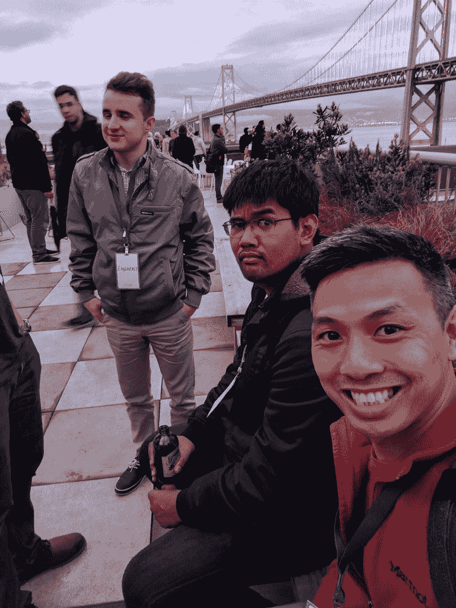

On top of the roof of Google San Francisco with the beautiful Oakland Bay Bridge in the background.

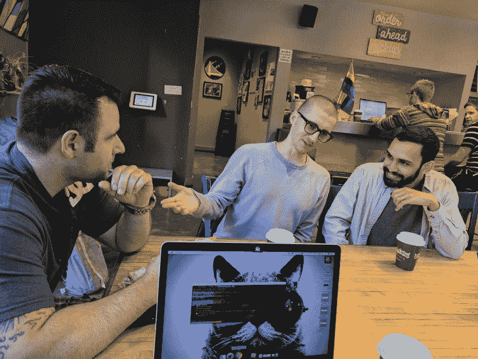

Enjoying a refreshing cup of Philz coffee on another field trip to SFHTML5.

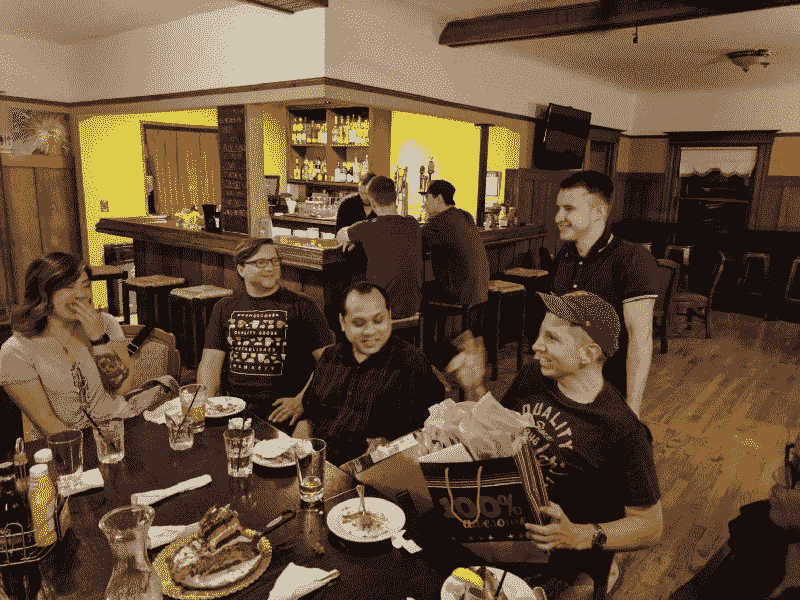

Sending off one of our members to graduate school with some parting gifts!

如果你喜欢这篇文章，请分享给同行。

我很想听听社区组织者和他们如何改善他们的社区。

如果你想了解更多关于我和我在社区中的参与情况，你可以在 twitter 上关注我。:)

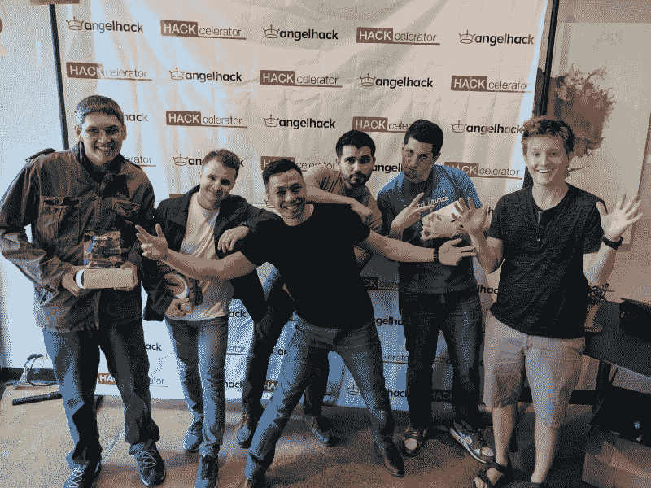

Some of the freeCodeCamp Sacramento members who won the Govtech challenge at an AngelHack Hackathon.

### 那都是乡亲们！