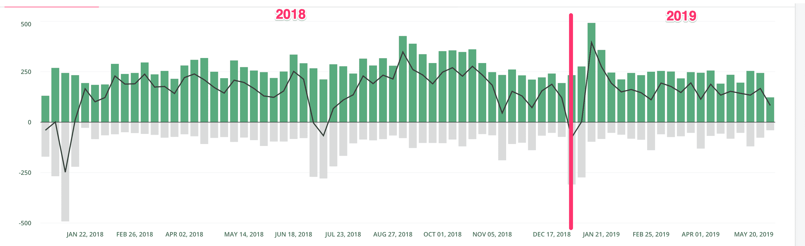

# 和泽尔一起关闭星期五

> 原文：<https://www.freecodecamp.org/news/https-zellwk-com-blog-shutting-down-fridays-with-zell/>

如果你逗留一段时间，你可能会注意到，在 2018 年的大部分时间里，我习惯于每周五发布一个视频(和一个音频)。我称之为“和泽尔在一起的星期五”。

2019 年，我决定不再做视频。我想分享一下我决定不再做视频的原因。

## 为什么我开始制作视频

我开始制作视频是因为三个原因:

1.  我以为会很有趣。
2.  如果我想在未来发布基于视频的课程，这将是一个很好的做法。
3.  我听说视频有助于吸引更多订户

2018 年初终于有机会尝试做视频了。我承诺了一年(一共做了 44 个视频)。大约每周一个视频。

## 为什么我要取消和泽尔的周五聚会。

两个原因:

1.  视频不会给我带来额外的订户
2.  视频制作对我来说并不有趣

我可能应该对每一个陈述说得更多，所以我们开始吧。

### 视频不会给我带来额外的订户

这是 2018 年和 2019 年的用户图表。绿色条表示新用户的数量。

从 2018 年 1 月 1 日至 2019 年 5 月 22 日，新订户数量每周徘徊在 250 人左右。2019 年 1 月停止发布视频，但订阅人数保持在每周 250 人。

这告诉我，这些视频并没有带来新的订户。我的视频大部分是被已经在关注我的人观看的。

### 视频制作并不有趣

制作视频需要大量的工作。

1.  我不得不站在摄像机前
2.  说话的方式不要让人觉得太假
3.  编辑我所说的话(最难的部分)
4.  根据视频写一篇文章

第 3 点和第 4 点是杀手。

我讨厌编辑过程。我讨厌擦洗和修剪音频。这个过程一点都不好玩。比起剪辑视频，我更愿意做别的。

另外，将视频转换成文章也需要大量的工作。我必须写一份视频中发生的事情的文字记录，创建图像，并写一篇流畅的文章。

一点都不好玩。

工作量太大了。

我累坏了。

所以我决定停下来。

## 我还会拍视频吗？

我不能肯定地说。当恐惧消失时，也许我会再次制作视频。但是如果我再次开始制作视频，我会用不同的方式。

## 最后的话

你不会知道你是否应该(或不应该)做某事，直到你做了它。

试试看。

如果不是为了你，你随时可以走开。

如果你走开，你就会知道为什么它不适合你。你会更清楚自己想做什么/不想做什么。你可以更好地专注于下一件事。

有时候，现在适合你的并不意味着它永远适合你。

不断尝试，不断挑战你的假设。

* * *

感谢阅读。这篇文章最初发表在我的博客上。如果你想要更多的文章来帮助你成为一个更好的前端开发者，请注册[我的时事通讯](https://zellwk.com)。