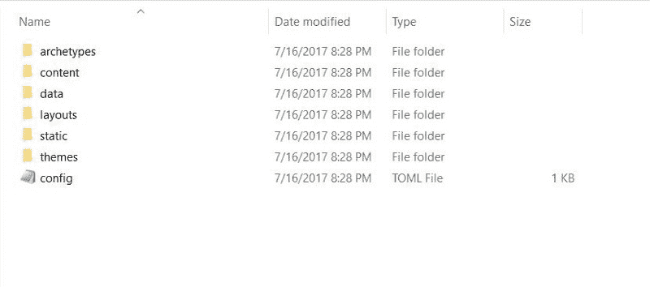
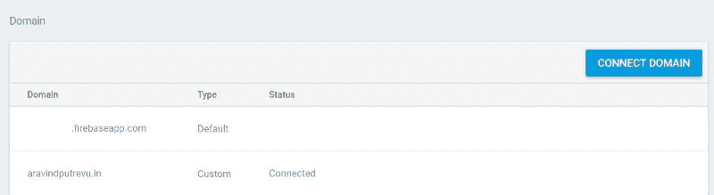

# Hugo + Firebase:如何分分钟免费创建自己的静态网站

> 原文：<https://www.freecodecamp.org/news/hugo-firebase-how-to-create-your-own-dynamic-website-for-free-in-minutes-463b4fb7bf5a/>

作者:阿拉文·普特勒乌

# Hugo + Firebase:如何分分钟免费创建自己的静态网站


有没有想过建立自己的网站来发布自己的项目组合、简历或博客。在本文结束时，您将能够创建一个。

一般来说，要开发一个网站，你需要了解 HTML、CSS 和一点 JavaScript(有时)。但是，对于这一点，你不需要有任何编码技能。你只需要基本的电脑技能。

要建立一个网站，你需要有一个“空间”(又名托管)，在那里你所有的文件将被上传。每当有人键入您的网站并点击 enter 时，这些文件就会在浏览器上提供/呈现给用户。

让我们从您需要了解的内容开始:

#### 谷歌账户

我相信你可能已经有了一个 Gmail 账户，这就足够了。如果没有，请创建一个。

#### 领域

这是可选的。世界上有各种各样的域名提供商，另外你可以在谷歌上购买。您可以找到域名提供商列表。这就像在[亚马逊](http://amazon.com)购物一样简单。

#### 雨果

[Hugo](https://gohugo.io/) 是一款基于 [Go](https://golang.org/) 语言的工具，可以生成静态网站。你可以使用各种模板，制作不同类型的网站，如博客、作品集网站等。

从[这里](https://github.com/gohugoio/hugo/releases)下载。

#### 重火力点

Firebase 是一个移动和网络应用平台，几年前被谷歌收购。Firebase 将托管作为其功能之一。然而，许多移动开发者使用它进行分析、通知、应用程序崩溃报告。我们将使用它来托管我们的网站。

#### 节点. js

Node.js 是一个开源的 JavaScript 运行时，建立在 Chrome 的 V8 JavaScript 引擎上。对于本教程，您需要将它安装在您的计算机上，Firebase 工具才能工作。你可以从[这里](https://nodejs.org/en/download/)下载安装。

#### 步骤 1:在你的机器上安装 Hugo

Windows:你会得到一个简单的可移植的可执行文件。你可以把它放在任何地方，并通过命令行运行。您可以将它添加到 Windows 环境变量中的 path 变量中，以便在任何地方引用它。

Mac:你可以用自制软件安装。如果你的 mac 上没有安装 brew，你可以从[这里](https://github.com/gohugoio/hugo/releases)下载 tarball。

无论哪种方式，请确保您能够通过发出以下命令来访问 Hugo。

#### 步骤 2:创建模板网站

前往您决定创建网站的位置，输入以下命令:

```
$ hugo new site <path_to_folder>
```

在给定的位置，你可以看到一个文件夹结构，如下图所示。



Image taken on Windows 10

这些文件夹只是内容的占位符。你的站点的所有文本内容都放在 *content* 文件夹中。

您可以运行以下命令来添加新文件。

```
$ hugo new about.md
```

如果你想添加一篇博客文章，在*“内容”*文件夹中创建一个名为“*博客”*的文件夹，然后开始添加你的文件。这些文件的扩展名为*。md"* 即[降价](https://en.wikipedia.org/wiki/Markdown)文件。

Markdown 是一种纯文本格式标记语言。它既漂亮又简单。有很多关于如何降价的指南，这里有一个。

#### 步骤 3:为网站设置主题

雨果有一个很棒的社区。他们的[主题](https://themes.gohugo.io/)网站丰富了不同类别的网站主题。前往它，并选择一个主题，这符合你的要求。

我选择了[介绍](https://github.com/vickylaiio/hugo-theme-introduction)主题。点击下载按钮会重定向到 [GitHub](https://github.com/vickylaiio/hugo-theme-introduction) 。

每个主题都有自己的设置方式。这个特别的主题没有很多步骤。只需将 zip 文件克隆或下载到主题文件夹中。将 *config.toml* 文件复制到你网站的根文件夹中。

#### 第四步:设置你的偏好

打开 *config.toml* 文件并开始编辑。给出你的名字和你希望在网站上显示的其他细节。一些主题支持谷歌分析，这样你就可以跟踪用户访问计数等。你可以给你的 GA Id 来收集数据。

#### 步骤 5:建立一个 Firebase 托管项目

正如我前面提到的， [Firebase](https://en.wikipedia.org/wiki/Firebase) 是一个漂亮的移动平台，拥有大量的功能。我使用 Firebase 托管来托管我通过 Hugo 生成的静态网站。

要使用 Firebase 服务，请使用您的 Google 帐户和[登录 Firebase 网站](https://firebase.google.com/)。

点击*“转到控制台”*通过给项目命名来创建项目。你会看到一个概述页面，你应该选择“*开始托管。”*

#### 步骤 6:在您的机器上设置 Firebase 工具

打开计算机上的终端/命令行界面，并在下面键入命令。

```
$ npm install -g firebase-tools
```

以上命令安装 Firebase-tools 包。您需要再执行几个命令才能直接部署您的网站。

```
$ firebase login
```

这个命令将您的机器连接到 Firebase 项目。它使您能够列出并选择您想要将您的变更推送到的项目。

```
$ firebase list
```

您可以运行上面的命令来查看您已经创建的项目。对整个工作流程的最后一点，我们需要将你的网站的根文件夹初始化为 Firebase 项目根目录。

```
$ firebase init
```

它会问你一些问题，比如

*   您想设置哪些 Firebase CLI 功能？答案:托管。
*   为此目录选择一个默认的 Firebase 项目答案:选择您在步骤 5 中创建的 Firebase 项目。
*   您想将用作您的公共目录吗？回答:是的。
*   配置为单页应用程序？回答:是的。

为了避免混淆，我在每一步都做了详细的截图供你参考。可以在这里下载[。](https://www.dropbox.com/s/z6siqqymi1rin0u/Screenshots_Firebase_Tools_Setup.zip?dl=0)

终于！Firebase 初始化完成。

#### 第七步:在本地验证你的网站

运行以下命令，在您的计算机上本地检查您的站点。

```
$ hugo server -w
```

Hugo 附带了一个轻量级的高性能 web 服务器，您可以在其中检查您的所有更改。确保您的所有图像都放在 *static/img* 文件夹中。在一个迭代过程中，更改您的*配置文件*，并在浏览器上验证这些文件。下面是您的服务器将运行的端口。

```
http://localhost:1313
```

#### 步骤 8:部署你的网站

键入以下命令来生成您的站点，并将其推送到您在**步骤 5** 中配置的相应 Firebase 项目。

```
$ hugo && firebase deploy
```

#### 步骤 9:将其连接到您的域(可选)

Firebase 提供了一个选项来连接您的域到 Firebase 应用程序。点击*连接域名*，给你的域名添加 TXT 记录，以验证你的域名所有权。



为此，请登录您的域名注册机构门户网站。

#### 步骤 10:创建一篇博客文章

创建一篇博客文章非常简单。Hugo 理解减价文件。只需前往*内容- > b* 日志文件夹(文件夹位置取决于主题)。创建降价文件。重复步骤 8 以查看结果。

如果您有任何疑问或疑问，可以在 [twitter](https://twitter.com/aravindputrevu) 上给我发 DM！

随时乐意帮忙！