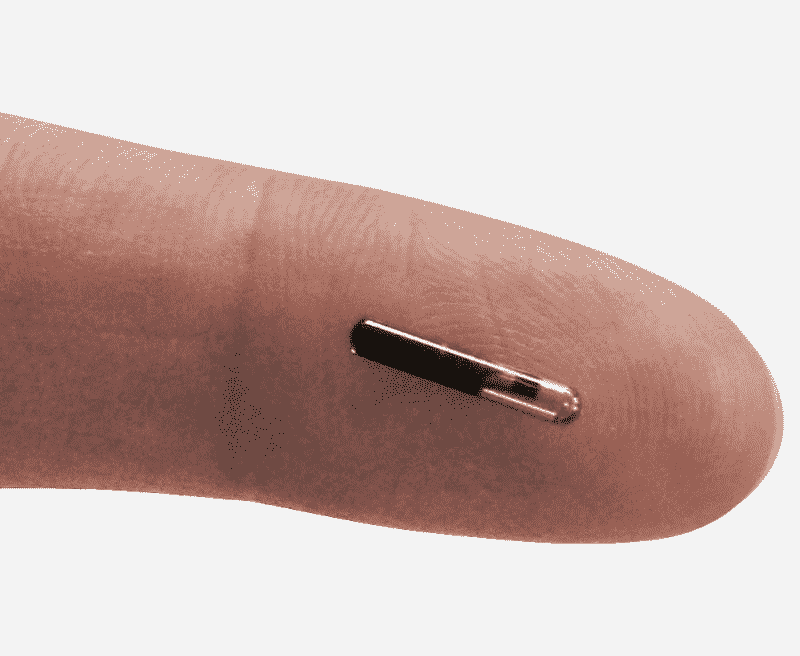

# 人类微芯片:公正地看待利弊

> 原文：<https://www.freecodecamp.org/news/human-microchipping-an-unbiased-look-at-the-pros-and-cons-ba8f979ebd96/>

作者安德鲁·布朗

# 人类微芯片:公正地看待利弊

#### 人体微芯片？那是什么？

NBC 是许多最近预测到 2017 年我们将会看到所有美国公民开始被贴上植入在他们皮肤下的微芯片的标签的人之一，有效地利用技术来回答这个问题，“我是我所说的那个人吗？”

RFID 微芯片通过一种廉价且可用的程序嵌入到皮肤下，为以持有者身份为中心的真实世界提供了一个数字接口:你的 ID、信用卡信息、公交卡、借书证和你目前放在钱包/钱夹中的许多其他信息来源可以存储在你皮肤下的 RFID 芯片上。

坦白说，我对我们的微芯片未来感到兴奋。然而，我已经尽我所能在下面概述了优点和缺点(短期和长期)。

An RFID microchip enveloped in medical-grade silicone, ready to inject just under human skin.

#### 现实(短期)利益:

*   **鉴定。**我们的护照已经有了微芯片，机场、火车站和汽车站从扫描护照过渡到扫描手臂将是一个最小的基础设施变化。你的驾照和身份证也是如此:警察只需要一个芯片扫描仪，你就可以完全扔掉钱包了(假设你已经用 NFC 取代了信用卡/借记卡)。
*   会员资格。 Baja Beach Club 是第一家向 VIP 客户提供微芯片的俱乐部。好处包括很容易获得会员资格(不再需要随身携带钥匙卡)，加上 ATM 组件可以让您跟踪和维护食物和酒的标签。也便于工作场所控制谁可以在何时何地出现——淘汰他们自己的钥匙和钥匙卡。同样的道理也适用于图书馆、健身房、酒店和餐厅预订、奖励卡管理，以及任何你认为自己有权进入的地方。
*   不再有身体混乱。不幸的是，每年约有 28，000 名婴儿在医院里被弄混，最终被错误的父母带走。另一方面，尸体偶尔也会在殡仪馆混淆，造成一些非常尴尬的情况。出生时植入的芯片完全消除了能力较弱的人无法识别自己的能力。
*   **婴儿和老人安全。**老人从养老院“逃离”并不少见。美国每天有超过 2000 名儿童被绑架(相当于每年超过 80 万名被绑架儿童)。每年有 160 万到 280 万青少年离家出走。能够跟踪任何人(当然，这给了你这样做的权限！)随时意味着全国数百万父母和看护者的安心。
*   **诱拐儿童。**巴西的百万富翁已经开始在他们的孩子身上植入芯片来阻止绑架者，其他国家也将效仿。在绑架事件中，最初的 3-4 小时是最关键的，将近 74%的绑架导致谋杀发生在这段时间内。未来基金会的一项研究显示，75%的英国父母会购买一种跟踪孩子位置的设备。
*   **健康元数据。**一次简单的扫描就可以告诉你的医生你对什么过敏，你过去被开了什么抗生素，你现在正在服用什么药物，以及大量其他信息，这些信息可以在你需要医疗护理时加以考虑——即使你没有意识。
*   **防盗。**当然，使用你手掌中的 RFID 芯片来支付购物、借书或开门与使用你钱包中塑料卡中的 RFID 没有太大区别。不过，至少有一个显著的区别:你很容易丢失或被偷钱包。你身体的一部分很难被偷走。此外，当你的卡嵌入你的手或手臂，而不是放在你前面或后面口袋的钱包时，犯罪分子就很难秘密扫描你的卡数据。
*   **刑事管理。**监狱不是安全的地方；每个人都知道。植入芯片的罪犯不仅使越狱变得过时，还改善了“内部”的信息收集。昨晚谁在浴室里挑起了这场争斗？只需倒带检查 GPS 路口。
*   **执法&枪支管制。** Browning 和 Smith & Wesson 已经采用了一种植入式枪支系统，这种系统要求武器离主人很近才能开火。无论你的武器库是从你家被盗，还是在斗争中从他们手中夺走了一名军官的枪，除了注册的所有者，没有人能够开枪。这也意味着你的孩子不会意外地开了他们在你床头柜里找到的手枪。这个*也*意味着在犯罪现场不再有“丢失的武器”:武器芯片中的 GPS 读数可以随时报告它们在哪里，何时开火，以及——本质上——是谁。

#### 现实(短期)劣势:

*   **不确定性。**我们不知道微芯片长期使用会对身体产生什么影响。我们不知道普遍碎裂的社会影响。我们不知道这个想法的每个方面会出现什么问题，而且我们可能只有在尝试之后才会知道。
*   **不能犯轻微罪行。**超速行驶、多看一场电影等。情境化的好处总是以传播扩展的情境数据为代价:为了更好地为你服务，那些提供服务的人需要获得更多关于你的信息。举例来说，一个简单的永远在线的全球定位系统也提供了知道你何时超速的方法。
*   **访问控制。**允许公司扫描你的芯片进行身份识别，这本身就让他们能够知道你在他们公司的什么地方。
*   **数据泄露。任何新技术总是充斥着漏洞和利用。将如此多的信息和依赖放在一个芯片上，使它成为黑客和其他无用之人的主要目标。如果信息是可写的(除了可读之外)，还存在被假冒或数据损坏的可能性。**
*   **更换硬件。**毫无疑问，这项技术会随着时间的推移不断改进，增加越来越多的功能。这些新功能可能需要新的硬件，而早期的硬件可能不容易被物理替换。
*   **没有通用的标准。**不幸的是，由于现有的数字识别系统种类繁多，没有一张卡能处理所有这些系统。你需要为地铁植入一个 RFID 芯片，为你的信用卡植入一个，为你的图书馆卡植入一个，等等(或者，至少，植入一个可重写的芯片，一次存储一个以上的芯片)。
*   身体的迁移。如果没有对植入的芯片进行适当的护理，它们能够在体内迁移。如果芯片无处不在，这就不是什么问题了(因为它们只是可以被寻找)，但在此之前，如果在通常的位置找不到它们，它们完全有可能被完全忽略(例如在医疗紧急情况下)。
*   **医疗。**FDA 已经声明，人体微芯片的几种风险包括不良组织反应、电击危险，以及最重要的潜在风险——与磁共振成像(MRIs)等强磁医疗设备的“不兼容性”。你不能把任何金属带进核磁共振成像仪；这包括起搏器、动脉瘤夹、牙科植入物、髋关节/膝关节置换(除非它们是非磁性钛)、*和*嵌入式微芯片。

#### 乌托邦式的主张:

*   数字世界的增强。将数字身份带入现实世界可能具有看似“神奇”的含义:当你进入时，房间会根据你的偏好自动调节恒温器；当你坐下时，汽车会启动你最喜欢的广播电台；当你坐在电视机前时，电视会继续播放你正在观看的任何节目；当你购物时，商店会使用无人机将你需要的内容送到你的购物车，等等。
*   **无缝的双因素身份认证。**最佳安全性的安全格言是将您知道的东西(密码)与您拥有的东西(通常是您的手机，现在)结合使用。你的手机有很多缺点(它可能被盗、丢失、死亡、被黑、被擦等)，这些都可以通过一个无缝的解决方案来解决，该解决方案可以增加密码以增加安全性，而没有当前 2FA 解决方案的不便(诚然温和)。

#### 反乌托邦声称:

*   **革命性的火力。**当枪支与主人身上的芯片配对后，革命英雄再也无法闯入压迫者的军火库将火力转向他们。
*   **可负担性和可用性。**如此重视一款只有寻求它的人才能使用的设备，需要密切关注它的可用性和可负担性。如果优势实际上不利于那些选择不参加的人，阶级之间的差距可能会扩大。
*   **数字拟态。**在一个完全由你皮肤内的芯片控制的世界里，黑客和作恶者可能会扫描你芯片上的数据并将其复制到他们自己的芯片上，有效地复制你的物理存在(这与仅仅窃取数字证书明显不同)。
*   **大哥。**每部好莱坞电影都告诉我们，植入的微芯片主要是为老大哥、政府和企业持续追踪我们的每一个行踪。这是一个真正的问题，需要从一开始就通过隐私控制和良好的安全实践来解决。
*   **芯片自由。在一个你用手中的芯片购买食物的世界里，不难想象有些人可能更喜欢用钱包里的卡来代替。然而，不难想象一个微芯片的“利益”决定其用途的世界——基本上要求每个人接受微芯片或者挨饿、失业等等。**
*   **秘密芯片。**微芯片的好处之一是它对不知道它的人来说是隐形的，这使得小偷和对手更难窃取你的信息。然而，这种优势是一把双刃剑，当你考虑到人们可能会在睡觉或无意识时忘记别人在自己身上植入的微芯片。

#### 其他考虑因素:

*   圣经启示录声称这可能是“野兽的标记”，表明启示录的开始。
*   目前没有政府机构监督或控制神经电接口增强，最接近的机构是 FDA，因为它对医疗设备有广泛的管辖权。

> 我错过什么了吗？请在评论中告诉我，我会将它添加到列表中！