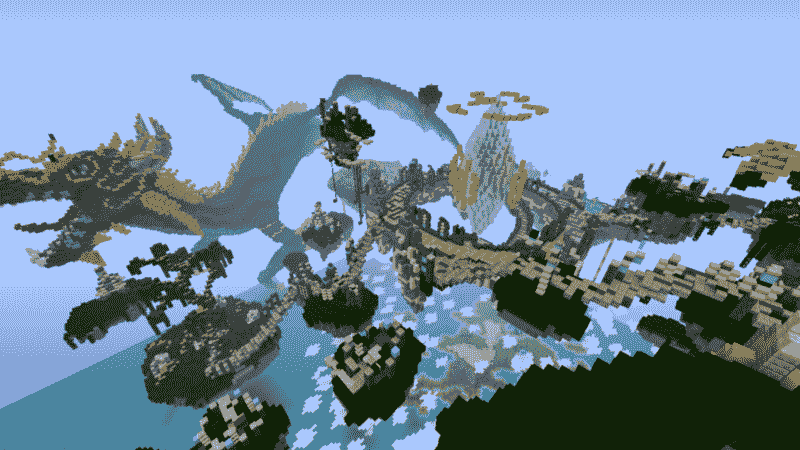
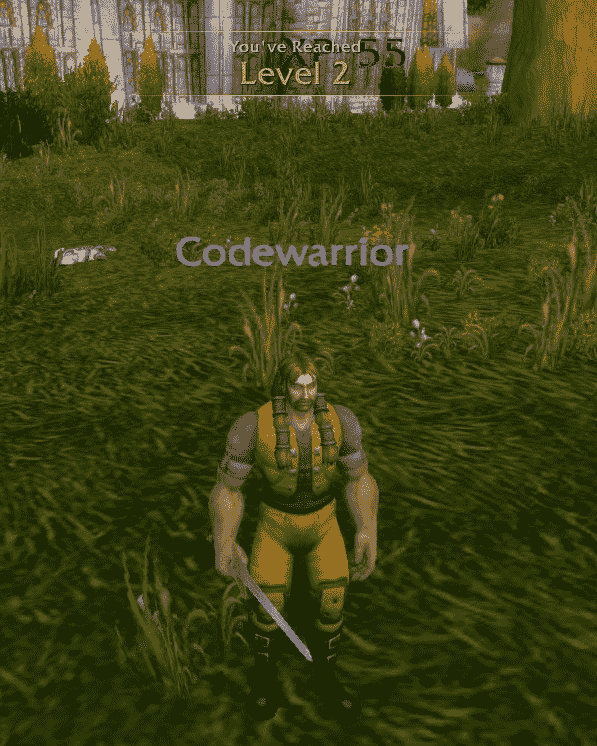
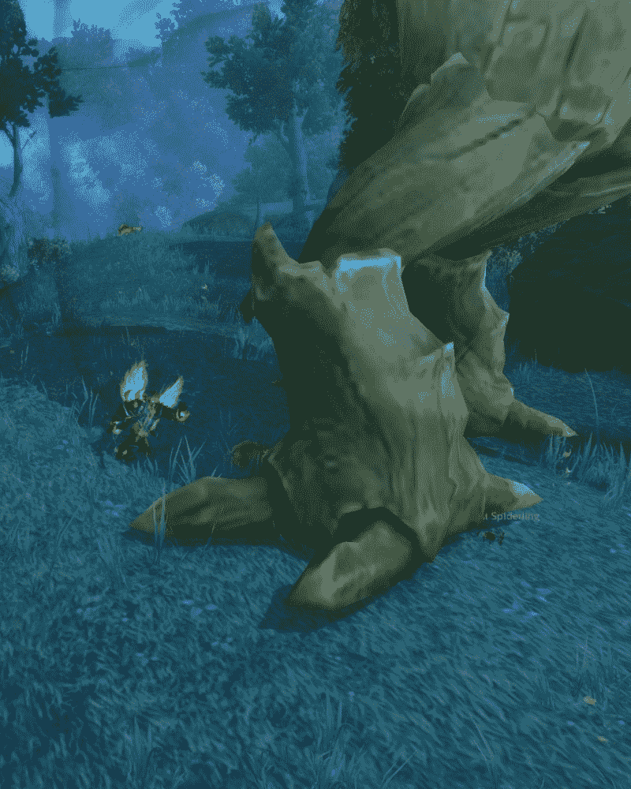
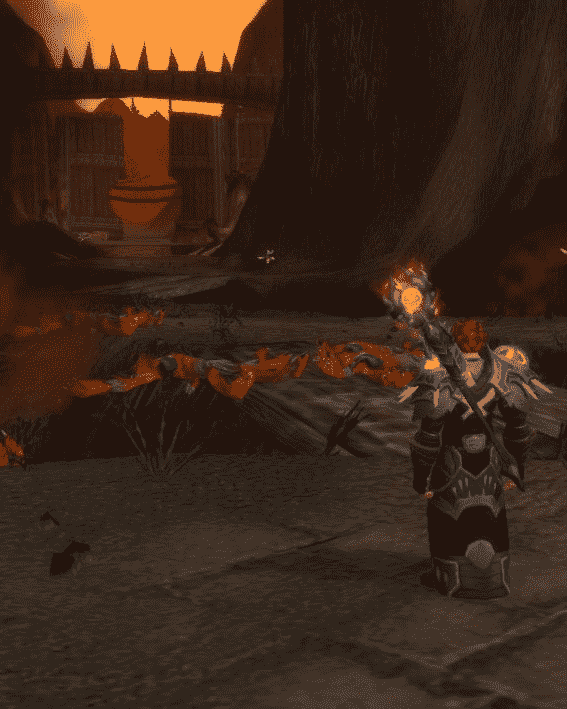
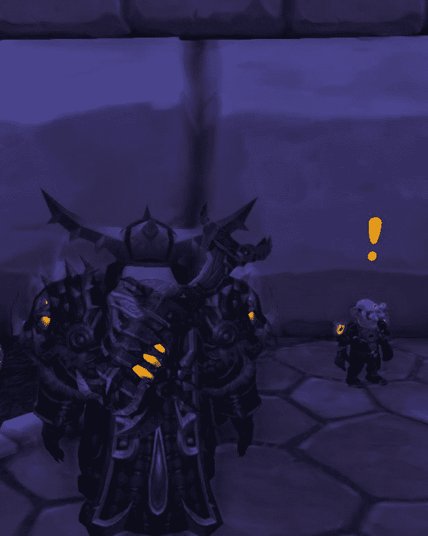
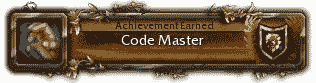
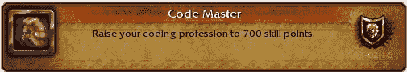

# 快点，村民们需要你的帮助！

> 原文：<https://www.freecodecamp.org/news/hurry-the-villagers-need-your-help-962dc3df2d78/>

作者德鲁

# 快点，村民们需要你的帮助！

A manually assembled Minecraft sculpture

学习编码需要时间。这需要耐力。

这可能会令人沮丧。但是它会带你走上一些不熟悉的道路。

这是让我们坚持下去的挑战。

承诺是，如果我们继续解决问题，我们最终会克服它，我们可以比开始时更强大，更聪明地迎接下一个挑战。

游戏化——将非游戏的东西变成游戏的做法——已经成为一种流行的方式，让人们在漫长而艰难的过程中保持参与。比如学习编码。

前提很简单:给人们一些小挑战，推动他们以某种方式成长，然后经常为此奖励他们。

现代 MMORPG(大型多人在线角色扮演游戏)证明了一系列以有意义的方式奖励人们的挑战是如何让他们长期参与的。

请允许我在这里全面介绍书呆子，并在 MMORPG 世界和初露头角的程序员所面临的挑战之间做一些比较。

升级是游戏世界的核心原则之一。通常玩家从 1 级开始，通过各种方式获得经验值，推动他们更接近下一级。

在 MMORPG 中，玩家可以通过杀死敌人、探索新领域和完成任务获得经验值。你的等级越高，智力、力量和敏捷等属性增加的越多。

你的属性越高，你就变得越强大。你越强大，就越有可能在遭遇更大的敌人和更严峻的挑战时幸存下来。

在编程方面，我们也在提升。我们通过探索一种新语言的领域、解决编码问题以及用代码解决现实世界中的问题来完成任务，从而获得 XP。

在整个过程中，我们在获得经验值的同时也在增加我们的属性。我们获得了更多的知识(智力)，我们学会了突破具有挑战性的任务(力量)，并发展了各种各样的技能，使我们能够以许多不同的方式灵活地解决同一问题(敏捷性)。

MMORPG 中的战斗系统可以类似于用于创建程序的过程。函数和算法成为我们的符咒和武器。

随着玩家等级的提升，他们将获得在不同情况下都有效的新技能。当敌人出现时，你需要在正确的时间使用正确的能力杀死他。

以 Java 领域的编译怪兽为例。当你试图攻击他时，他可能只是嘲笑你，并用强大的“零例外之锤”回击你。

如果你只知道收费，你永远也不会打败他。他总是会让你撤退到你的大本营去养伤。

为了打败这个特殊的敌人，你可以试着施放“无效检查咒”来使他的攻击无效。

还有 Div 巨魔。这些老谋深算的生物可能会令人沮丧。他们拥有通过移动到屏幕上不同的地方或者完全隐形来躲避你攻击的能力。

如果你选择了 CSS 天赋，你可以用“照明”技能攻击他们。照明{边框:纯红 1px})来打破他们的隐形，让你可以正确地排列你的攻击。

成为一名强大的程序员需要掌握许多不同的能力，并且知道何时何地使用它们。

探险可以同时令人兴奋和恐惧。

在 MMORPG 中，我们通常从许多不同的起点开始我们的旅程，这取决于我们选择的角色类型。这些起始区域通常让我们轻松进入这个新世界，并让我们对游戏的玩法感到舒适。

虽然这可能是一个很好的介绍和愉快的经历，但玩家通常会对基础感到厌倦，并想知道接下来会发生什么。同理，新程序员也有各种各样的起点可以选择。

无论您从什么开始，您通常会从最基本的领域开始，尝试简单的命令并从那里开始构建。起初，这里的风景看起来很神秘，但是你会很快熟悉周围的环境。你会离你开始的地方越来越远。

虽然你可能会选择留在你原来的土地上，并成为该地区最强大的玩家，但更有可能的是，你会离开一个新的方向，寻找你的下一次冒险。

探索是 MMORPG 类型电影的标志。你将与虚拟角色互动，这些虚拟角色将在各种任务中寻求你的帮助。有时，他们会派你去做一件简单的差事，收集需要的物资。其他时候，他们会恳求你把他们整个村庄从附近恶龙的残酷折磨中拯救出来。

不管要求是什么，你都有责任让他们的像素化生活变得更好，并改善你周围的世界。通常，完成任务会有奖励。但是，最终，成为英雄的荣耀和你一路走来获得的经验将会超过彩虹尽头等待你的任何金子。

就像 MMORGP 无助的村民恳求你把他们从龙的手中救出来一样，现实世界的企业会把你作为他们的遗产代码库英雄或他们的服务器救世主。

在编程世界中，任务可以以各种形式出现。人们的需求多得数不过来，通常可以通过合理且精心构建的代码来实现解决方案。

他们可能会给你一个简单的收集猫咪照片的任务来点亮他们的一天，或者请你在适当的时候给他们带来具体的健康信息，从而永远改变他们的生活。

从平凡到看似不可能的任务，到处都有需要完成的任务。这取决于你是否接受这些挑战，用你通过编程获得的能力来解决这些现实世界的问题。

如果你刚刚开始你的冒险，并被新环境的广阔所淹没，深呼吸，记住每个人都是从这里开始的。没有人生来就知道如何编码，就像他们生来就不知道如何演奏 MMORPG 一样。

我们都必须经历相同的起点，并逐步提高我们的技能。关键是加载、登录并开始游戏。只有一种方法可以变得更好，那就是努力去做。

出去杀死那些怪物，拯救那些村民。用不了多久，那个起步区——以及你的低级技能——只不过是一个强大战士的古怪记忆。

*最初发表于 2016 年 3 月 2 日[thecodinghyrax.wordpress.com](https://thecodinghyrax.wordpress.com/2016/03/02/hurry-the-villagers-need-your-help/)。*