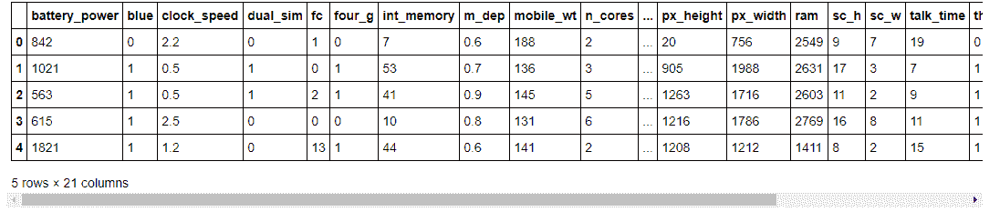
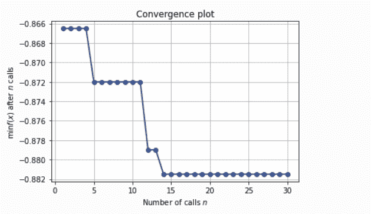
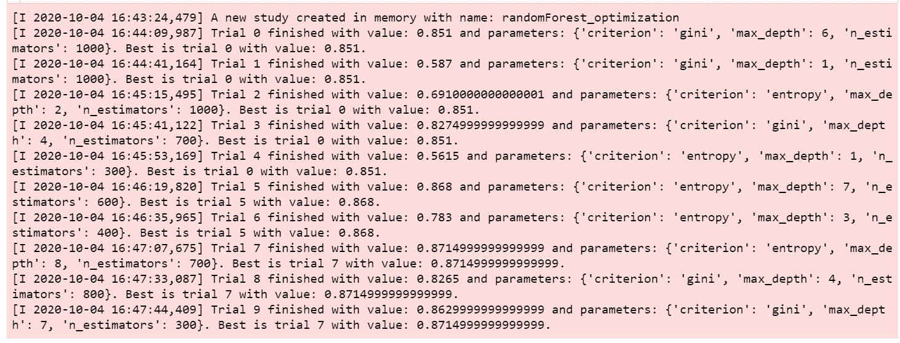
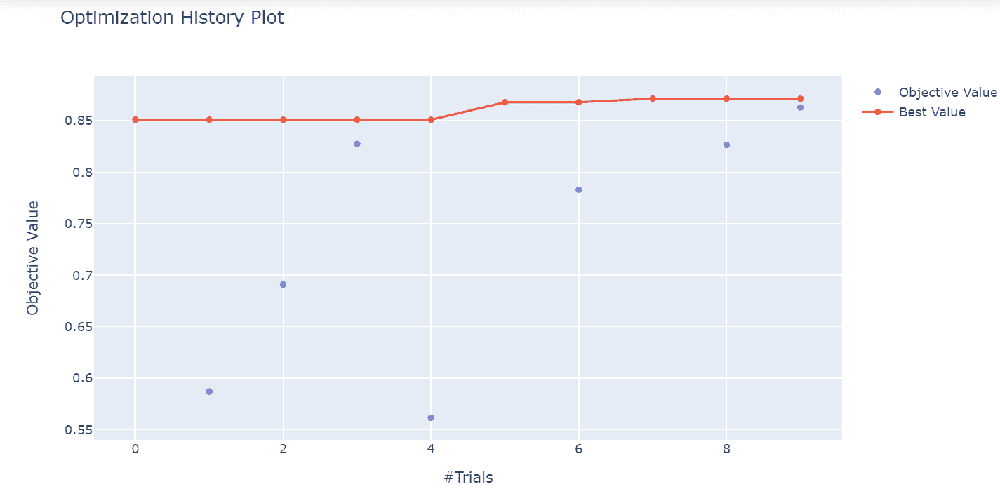
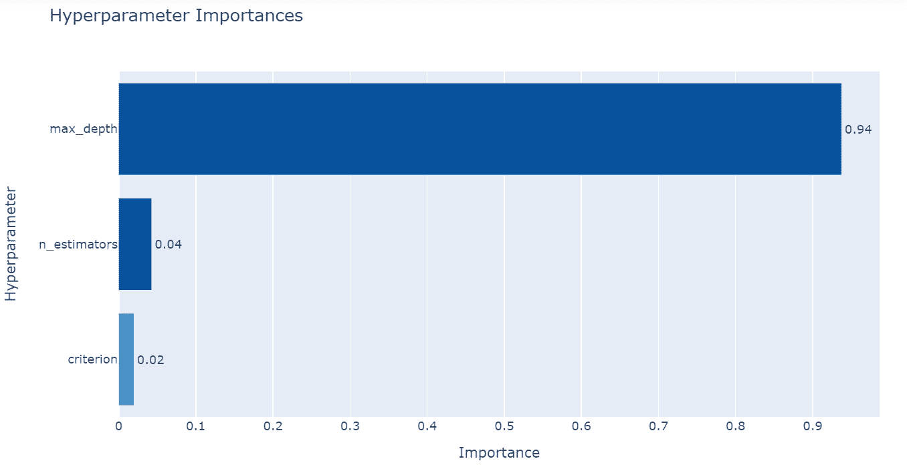
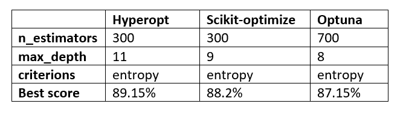

# 提高机器学习模型性能的超参数优化技术

> 原文：<https://www.freecodecamp.org/news/hyperparameter-optimization-techniques-machine-learning/>

在从事机器学习项目时，你需要遵循一系列步骤，直到你达到目标。

您必须执行的步骤之一是对您选择的模型进行超参数优化。这个任务总是在模型选择过程之后，在这个过程中，您选择比其他模型表现更好的模型。

## 什么是超参数优化？

在我定义超参数优化之前，你需要了解什么是超参数。

简而言之，超参数是用于控制学习过程的不同参数值，并且对机器学习模型的性能具有显著影响。

随机森林算法中超参数的一个例子是估计数( *n_estimators* )、最大深度( *max_depth* )和标准。这些参数是**可调的**，可以直接影响模型训练的好坏。

那么**超参数优化**就是寻找正确的超参数值组合的过程，以在合理的时间内实现数据的最高性能。

这个过程对机器学习算法的预测精度起着至关重要的作用。因此，超参数优化被认为是建立机器学习模型的最棘手的部分。

这些机器学习算法大多带有其超参数的默认值。但是默认值并不总是在不同类型的机器学习项目上表现良好。这就是为什么你需要优化它们，以获得最佳性能的正确组合。

> *一个好的超参数选择真的可以让一个算法大放异彩。*

有一些优化超参数的常用策略。现在让我们详细看一下每一个。

## 如何优化超参数

### 网格搜索

这是一种广泛使用的传统方法，它执行超参数调整来确定给定模型的最佳值。

网格搜索通过尝试您想要在模型中尝试的每个可能的参数组合来工作。这意味着**将花费大量时间**来执行整个搜索，这在计算上非常昂贵。

你可以在这里了解更多关于如何实现网格搜索的信息。

### 随机搜索

这种方法的工作方式稍有不同:**超参数值的随机**组合被用来为所建立的模型寻找最佳解决方案。

随机搜索的缺点是有时会错过搜索空间中的重要点(值)。

你可以在这里了解更多关于如何实现随机搜索[。](https://github.com/Davisy/Hyperparameter-Optimization-Techniques/blob/master/RandomizedSearchCV.ipynb)

## 替代超参数优化技术

现在，我将向您介绍几种替代的高级超参数优化技术/方法。这些可以帮助您获得给定模型的最佳参数。

我们将研究以下技术:

1.  远视
2.  Scikit 优化
3.  optina

## 远视

Hyperopt 是由 James Bergstra 开发的用于超参数优化的强大 Python 库。

它使用一种贝叶斯优化形式进行参数调整，允许您获得给定模型的最佳参数。它可以大规模地优化一个具有数百个参数的模型。

为了运行第一次优化，Hyperopt 有四个你需要知道的重要特性。

### 搜索空间

Hyperopt 具有不同的功能来指定输入参数的范围。这些被称为随机搜索空间。搜索空间最常见的选项有:

*   **hp.choice(标签，选项)**–可用于分类参数。它返回其中一个选项，应该是一个列表或元组。
    例如:`hp.choice("criterion", ["gini","entropy",])`
*   **hp.randint(label，upper)**–可用于整型参数。它返回一个范围内的随机整数(0，上限)。
    例如:`hp.randint("max_features",50)`
*   **hp.uniform(label，low，high)**–返回一个在`low`和`high`之间的统一值。
    举例:`hp.uniform("max_leaf_nodes",1,10)`

您可以使用其他选项有:

*   **hp.normal(label，mu，sigma)**–返回一个实际值，该值正态分布有平均 mu 和标准差 sigma
*   **hp.qnormal(label，mu，sigma，q)**–返回一个类似 round(normal(mu，sigma) / q) * q 的值
*   **hp.lognormal(label，mu，sigma)**–返回根据 exp(normal(mu，sigma))得出的值
*   **hp.qlognormal(label，mu，sigma，q)**–这将返回一个类似 round(exp(normal(mu，sigma)) / q) * q 的值

你可以在这里了解更多关于搜索空间选项的信息。

简单说明一下:每个可优化的随机表达式都有一个标签(例如，n_estimators)作为第一个参数。这些标签用于在优化过程中向调用者返回参数选择。

### 目标函数

这是一个最小化函数，从搜索空间接收超参数值作为输入，并返回损失。

这意味着在优化过程中，我们用选定的 haypeparameter 值训练模型并预测目标特征。然后，我们评估预测误差，并将其返回给优化器。

优化器将决定检查哪些值并再次迭代。您将在实际示例中学习如何创建目标函数。

### fmin

fmin 函数是优化函数，它迭代不同组的算法及其超参数，然后最小化目标函数。

fmin 有五个输入，分别是:

*   最小化的目标函数
*   定义的搜索空间
*   要使用的搜索算法，例如随机搜索、TPE(树 Parzen 估计器)和自适应 TPE
    注意:`hyperopt.rand.suggest`和`hyperopt.tpe.suggest`为超参数空间的顺序搜索提供逻辑
*   最大评估次数
*   和试验对象(可选)

示例:

```
from hyperopt import fmin, tpe, hp,Trials

trials = Trials()

best = fmin(fn=lambda x: x ** 2,
    		space= hp.uniform('x', -10, 10),
    		algo=tpe.suggest,
    		max_evals=50,
    		trials = trials)

print(best)
```

### 试验对象

Trials 对象用于保存所有超参数、损失和其他信息。这意味着您可以在运行优化后访问它。

此外，试验可以帮助您保存重要信息，稍后加载，然后恢复优化过程。在下面的实际例子中，你会学到更多。

```
from hyperopt import Trials 

trials = Trials()
```

现在你已经了解了远视的重要特征，我们来看看如何使用它。您将遵循以下步骤:

*   初始化要搜索的空间
*   定义目标函数
*   选择要使用的搜索算法
*   运行远视功能
*   分析存储在**试验对象**中的评估输出

### 实践中的超波特

在这个实际例子中，我们将使用**移动价格数据集。**我们的任务是创建一个模型，预测移动设备的价格会有多高:0 ( *低成本*)、1 ( *中等成本*)、2 ( *高成本*)或 3 ( *非常高成本*)。

### 安装 Hyperopt

您可以通过运行以下命令从 PyPI 安装 hyperopt:

```
pip install hyperopt
```

然后导入以下重要包，包括 hyperopt:

```
# import packages 
import numpy as np 
import pandas as pd 
from sklearn.ensemble import RandomForestClassifier 
from sklearn import metrics
from sklearn.model_selection import cross_val_score
from sklearn.preprocessing import StandardScaler 
from hyperopt import tpe, hp, fmin, STATUS_OK,Trials
from hyperopt.pyll.base import scope

import warnings
warnings.filterwarnings("ignore")
```

### 资料组

让我们从数据目录加载数据集。要获得关于数据集的更多信息，请在此处阅读。

```
# load data 
data = pd.read_csv("data/mobile_price_data.csv")
```

像这样检查数据集的前五行:

```
#read data 
data.head()
```



First five rows

如您所见，在我们的数据集中，我们有不同的带有数值的要素。

让我们看看数据集的形状。

```
#show shape
data.shape
```

我们得到以下结果:

(2000, 21)

在这个数据集中，我们有 *2000 行*和 *21 列*。现在，让我们来了解一下该数据集中的要素列表。

```
#show list of columns 
list(data.columns)
```

['battery_power '，' blue '，' clock_speed '，' dual_sim '，' fc '，' four_g '，' int_memory '，' m_dep '，' mobile_wt '，' n_cores '，' pc '，' px_height '，' px_width '，' ram '，' sc_h '，' sc_w '，' talk_time '，' three_g '，' touch_screen '，' wifi '，' price_range']

你可以在这里找到每个列名[的含义。](https://www.kaggle.com/iabhishekofficial/mobile-price-classification)

### 将数据集分割成目标要素和独立要素

这是一个分类问题。因此，我们现在将从数据集中分割目标要素和独立要素。我们的目标特征是**价格范围**。

```
# split data into features and target 
X = data.drop("price_range", axis=1).values 
y = data.price_range.values
```

### 预处理数据集

接下来，我们将通过使用 scikit-learn 的 [StandardScaler](https://scikit-learn.org/stable/modules/generated/sklearn.preprocessing.StandardScaler.html) 方法来标准化独立特征。

```
# standardize the feature variables 
scaler = StandardScaler()
X_scaled = scaler.fit_transform(X)
```

### 定义优化的参数空间

我们将使用**随机森林算法**的三个超参数: *n 估计量、最大深度、*和*准则*。

```
space = {
    "n_estimators": hp.choice("n_estimators", [100, 200, 300, 400,500,600]),
    "max_depth": hp.quniform("max_depth", 1, 15,1),
    "criterion": hp.choice("criterion", ["gini", "entropy"]),
}
```

我们在上面选择的超参数中设置了不同的值。现在我们将定义目标函数。

### 定义一个函数来最小化(目标函数)

我们想要最小化的函数叫做**超参数调整**。优化其超参数的分类算法是**随机森林**。

我使用交叉验证来避免过度拟合，然后函数将返回一个损失值及其状态。

```
# define objective function

def hyperparameter_tuning(params):
    clf = RandomForestClassifier(**params,n_jobs=-1)
    acc = cross_val_score(clf, X_scaled, y,scoring="accuracy").mean()
    return {"loss": -acc, "status": STATUS_OK}
```

记住[远视](https://github.com/hyperopt/hyperopt/tree/master/hyperopt)最小化功能。这就是为什么我在 **acc** 中加了负号。

### 微调模型

最后，首先我们将实例化试验对象，微调模型，然后打印最佳损失及其超参数值。

```
# Initialize trials object
trials = Trials()

best = fmin(
    fn=hyperparameter_tuning,
    space = space, 
    algo=tpe.suggest, 
    max_evals=100, 
    trials=trials
)

print("Best: {}".format(best))
```

100%|█████████████████████████████████████████████████████████| 100/100[10:30 < 00:00，6.30s/试，最佳损失:-0.8915]最佳:{'criterion': 1，' max_depth': 11.0，' n_estimators': 2}。

进行超参数优化后，损耗为 **- 0.8915** 。这意味着通过在随机森林分类器中使用 *n_estimators = 300，max_depth = 11，*和 *criterion = "entropy"* ，模型性能具有 **89.15%** 的准确度。

### 使用 trials 对象分析结果

trials 对象可以帮助我们检查在实验过程中计算的所有返回值。

**(a) trials.results**
这显示了搜索过程中“目标”返回的词典列表。

```
trials.results
```

[{'loss': -0.879000000000001，' status': 'ok'}，{'loss': -0.877，' status': 'ok'}，{'loss': -0.768，' status': 'ok'}，{'loss': -0.8205，' status': 'ok'}，{ ' loss ':-0.87200000000000001，' status': 'ok'}，{ ' loss ':' loss ':' ok ' }，{ ' loss ':-0........]

**(b)trials . loss()**
这显示了损失的列表(每个‘ok’试验的浮动)。

```
trials.losses()
```

[-0.87900000000000001，-0.877，-0.768，-0.8205，-0.872000000000001，-0.883，-0.854999999999999，-0.879999999999，-0.595，-0.87650000009。.........]

**(c)trials . status()**
显示状态字符串列表。

```
trials.statuses()
```

['ok '，' ok '，' ok '，' ok '，' ok '，' ok '，' ok '，' ok '，' ok '，' ok '，' ok '，' ok '，' ok '，' ok '，' ok '，' ok '，' ok '，' ok '，' ok '，' ok '，' ok '，' ok '，' ok '，' ok '，' ok '，' ok '，' ok '，..........]

注意:这个 trials 对象可以保存，传递给内置的绘图例程，或者用您自己的定制代码进行分析。

既然你已经知道了如何实现 Hyperopt，那么让我们来学习第二种备选的超参数优化技术，称为****Scikit——优化**** 。

## sci kit-优化

Scikit-optimize 是另一个用于超参数优化的开源 Python 库。它实现了几种基于模型的顺序优化方法。

该库非常易于使用，并为贝叶斯优化提供了一个通用工具包，可用于超参数调优。它还支持对 scikit-learn 库提供的机器学习算法的超参数进行调优。

scikit-optimize 构建在 Scipy、NumPy 和 Scikit-Learn 之上。

Scikit-optimize 至少有四个你需要知道的重要特性，以便运行你的第一次优化。现在让我们深入研究一下。

### 空间

scikit-optimize 具有不同的函数来定义包含一维或多维的优化空间。搜索空间最常见的选项有:

*   ****实数****——这是一个可以取任何实数的搜索空间维度。您需要定义下限和上限，并且两者都包含在内。
    举例:`Real(low=0.2, high=0.9, name="min_samples_leaf")`
*   ****整数**** —这是一个可以取整数值的搜索空间维度。
    举例:`Integer(low=3, high=25, name="max_features")`
*   ****分类**** —这是一个可以采用分类值的搜索空间维度。
    举例:`Categorical(["gini","entropy"],name="criterion")`

注意:在每个搜索空间中，您必须使用 ****名称**** 参数来定义要优化的超参数名称。

### BayesSearchCV

BayesSearchCV 类提供了一个类似于`GridSearchCV`或`RandomizedSearchCV`的接口，但是它对超参数执行贝叶斯优化。

BayesSearchCV 实现了一个“**”和一个“ ****【得分】**** ”方法以及其他常见的方法，如 **predict()、predict_proba()、decision_function()、transform()** 和**inverse _ transform()**，如果它们在所使用的估计器中实现的话。**

**与 GridSearchCV 相反，并不是所有的参数值都被尝试过。而是从指定的分布中采样固定数量的参数设置。尝试的参数设置的数量由 n_iter 给出。**

**注意你将在下面的一个实际例子中学习如何实现 BayesSearchCV。**

### **目标函数**

**这是一个将由搜索过程调用的函数。它从搜索空间接收超参数值作为输入，并返回损失(越低越好)。**

**这意味着在优化过程中，我们用选定的超参数值训练模型，并预测目标特征。然后，我们评估预测误差，并将其返回给优化器。**

**优化器将决定检查哪些值并再次迭代。您将在下面的实际例子中学习如何创建目标函数。**

### **【计算机】优化程序**

**这是执行贝叶斯超参数优化过程的函数。优化函数在每个模型和搜索空间迭代以优化然后最小化目标函数。**

**scikit-optimize 库提供了不同的优化功能，例如:**

*   ******dummy_minimize**** —在给定界限内均匀采样随机搜索。**
*   ******forest _ minimize****—使用决策树的顺序优化。**
*   ******gbrt_minimize**** —使用梯度增强树的顺序优化。**
*   ******gp_minimize —**** 使用高斯过程的贝叶斯优化。
    注意:我们将在下面的实际例子中实现 gp_minimize。**

**您应该了解的其他功能如下:**

*   **[空间变压器](https://scikit-optimize.github.io/0.7/modules/classes.html#module-skopt.space.transformers) s**
*   **[实用功能](https://scikit-optimize.github.io/0.7/modules/classes.html#module-skopt.utils)**
*   **[绘图功能](https://scikit-optimize.github.io/0.7/modules/classes.html#module-skopt.plots)**
*   **[基于模型优化的机器学习扩展](https://scikit-optimize.github.io/0.7/modules/classes.html#module-skopt.learning)**

### **sci kit-实践中的优化**

**既然您已经了解了 scikit-optimize 的重要特性，让我们来看一个实际的例子。我们将使用与 Hyperopt 相同的数据集 ****移动价格数据集**** 。**

### **安装 sci kit-优化**

**scikit-optimize 需要以下 Python 版本和包:**

*   **Python >= 3.6**
*   **NumPy (>= 1.13.3)**
*   **scipy(= 0.19.1)**
*   **joblib (>= 0.11)**
*   **scikit-learn >= 0.20**
*   **matplotlib >= 2.0.0**

**您可以使用以下命令安装最新版本:**

```
`pip install scikit-optimize`
```

**然后导入重要的包，包括 scikit-optimize:**

```
 `# import packages
import numpy as np
import pandas as pd
from sklearn.ensemble import RandomForestClassifier
from sklearn import metrics
from sklearn.model_selection import cross_val_score 
from sklearn.preprocessing import StandardScaler
from skopt.searchcv import BayesSearchCV
from skopt.space import Integer, Real, Categorical 
from skopt.utils import use_named_args
from skopt import gp_minimize

import warnings

warnings.filterwarnings("ignore")`
```

### **第一种方法**

**在第一种方法中，我们将使用 ****BayesSearchCV**** 来执行随机森林算法的超参数优化。**

### **定义搜索空间**

**我们将调整随机森林模型的以下超参数:**

*   ******n_estimators**** —森林中的树木数量。**
*   ******max_depth**** —树的最大深度。**
*   ******判据**** —衡量分割质量的函数。**

```
`# define search space 
params = {
    "n_estimators": [100, 200, 300, 400],
    "max_depth": (1, 9),
    "criterion": ["gini", "entropy"],
}`
```

**我们将搜索空间定义为一个字典。它使用超参数名作为键，变量的范围作为值。**

### **定义 BayesSearchCV 配置**

**BayesSearchCV 的好处是搜索过程是自动执行的，只需要很少的配置。**

**该类可以像 Scikit-Learn 一样使用(GridSearchCV 和 RandomizedSearchCV)。**

```
`# define the search
search = BayesSearchCV(
    estimator=rf_classifier,
    search_spaces=params,
    n_jobs=1,
    cv=5,
    n_iter=30,
    scoring="accuracy",
    verbose=4,
    random_state=42
)`
```

### **微调模型**

**然后，我们通过传递预处理的特性和目标特性(price_range)来执行搜索。**

```
`# perform the search
search.fit(X_scaled,y)`
```

**您可以从 ****搜索**** 中使用 ****best_score_**** 属性找到最佳得分，使用 ****best_params_**** 属性找到最佳参数。**

```
`# report the best result

print(search.best_score_)
print(search.best_params_)`
```

**请注意，当前版本的 scikit-optimize (0.7.4)与最新版本的 scikit learn (0.23.1 和 0.23.2)不兼容。因此，当您使用这种方法运行优化过程时，可能会出现如下错误:**

```
`TypeError: object.__init__() takes exactly one argument (the instance to initialize)`
```

**你可以在他们的 GitHub 账号里找到更多关于这个错误的信息。**

*   **[https://github . com/sci kit-optimize/sci kit-optimize/issues/928](https://github.com/scikit-optimize/scikit-optimize/issues/928)**
*   **[https://github . com/sci kit-optimize/sci kit-optimize/issues/924](https://github.com/scikit-optimize/scikit-optimize/issues/924)**
*   **[https://github . com/sci kit-optimize/sci kit-optimize/issues/902](https://github.com/scikit-optimize/scikit-optimize/issues/902)**

**我希望他们很快解决这个不兼容的问题。**

### **第二种方法**

**在第二种方法中，我们首先通过使用 scikit-optimize 提供的空间方法来定义搜索空间，这些方法是 **分类和整数。****

```
`# define the space of hyperparameters to search
search_space = list()
search_space.append(Categorical([100, 200, 300, 400], name='n_estimators'))
search_space.append(Categorical(['gini', 'entropy'], name='criterion'))
search_space.append(Integer(1, 9, name='max_depth'))`
```

**我们在上面选择的超参数中设置了不同的值。然后我们将定义目标函数。**

### **定义一个函数来最小化(目标函数)**

**我们最小化的函数叫做 ****evalute_model**** ，优化其超参数的分类算法是 ****随机森林**** 。**

**我使用交叉验证来避免过度拟合，然后函数将返回损失值。**

```
`# define the function used to evaluate a given configuration

@use_named_args(search_space)
def evaluate_model(**params):
    # configure the model with specific hyperparameters
    clf = RandomForestClassifier(**params, n_jobs=-1)
    acc = cross_val_score(clf, X_scaled, y, scoring="accuracy").mean()`
```

******use_named_args()**** 装饰器允许目标函数接收参数作为关键字参数。当您想要设置 scikit-learn 的估计器参数时，这尤其方便。**

**记住 scikit-optimize 将函数最小化，这就是我在 ****acc 中添加负号的原因。******

### **微调模型**

**最后，我们通过使用 scikit-optimize 的 ****gp_minimize**** 方法(它使用基于高斯过程的优化)来微调模型。然后，我们打印最佳损失及其超参数值。**

```
`# perform optimization

result = gp_minimize(
    func=evaluate_model,
    dimensions=search_space,
    n_calls=30,
    random_state=42,
    verbose=True,
    n_jobs=1,
)`
```

******输出:****
**迭代第 1 次开始。随机点的评价函数。**
**迭代编号:1 结束。在随机点进行评估。**
**耗时:8.6910**
**函数值获取:-0.8585**
**当前最小值:-0.8585**
**迭代次数:2 开始。随机点的评价函数。**
**迭代编号:2 结束。在随机点进行评估。**
**耗时:4.5096**
**获得的函数值:-0.7680**
**当前最小值:-0.8585 …………****

**并不是说它会一直运行到最后一次迭代。对于我们的优化过程，总迭代次数是 30。**

**然后，我们可以打印出我们所使用的最佳精度和所选超参数的值。**

```
`# summarizing finding:

print('Best Accuracy: %.3f' % (result.fun)) 
print('Best Parameters: %s' % (result.x))`
```

```
`Best Accuracy: -0.882
Best Parameters: [300, 'entropy', 9]`
```

**进行超参数优化后，损失为 ****-0.882**** 。这意味着通过使用随机森林分类器中的**【n _ estimators 】= 300、* *max_depth = 9、** 和**criterion = " entropy "**，模型的性能具有 88.2% 的准确度。**

**我们的结果和第一部分的远视相差不大( ****准确率 89.15%**** )。**

### **打印函数值**

**通过使用 OptimizeResult 对象(Result)中的 ****func_vals**** 属性，可以打印每次迭代的所有函数值。**

```
`print(result.func_vals)`
```

******输出:****
数组([-0.8665，-0.7765，-0.7485，-0.86，-0.872，-0.545，-0.81，
-0.7725，-0.8115，-0.8705，-0.8685，-0.879，-0.816，-0.8815，
-0.8645，-0.845**

### **绘制收敛轨迹**

**我们可以使用 scikit-optimize 中的 ****plot_convergence**** 方法来绘制一条或多条收敛轨迹。我们只需要在 plot_convergence 方法中传递 OptimizeResult 对象(Result)即可。**

```
`# plot convergence 

from skopt.plots import plot_convergence

plot_convergence(result)` 
```

****

**该图显示了优化过程中不同迭代的函数值。**

**既然您已经知道了如何实现 scikit-optimize，那么让我们学习第三种也是最后一种可选的超参数优化技术，称为 ****Optuna。******

## **optina**

**Optuna 是另一个用于超参数优化的开源 Python 框架，它使用贝叶斯方法来自动搜索超参数空间。该框架由一家名为 Preferred Networks 的日本人工智能公司开发。**

**Optuna 比 Hyperopt 更容易实现和使用。您还可以指定优化过程应该持续多长时间。**

**为了运行您的第一次优化，Optuna 至少有五个您需要知道的重要特性。**

### **搜索空间**

**Optuna 为所有超参数类型提供了不同的选项。最常见的选择如下:**

*   ******分类参数****–采用****trials . suggest _ categorial()****的方法。您需要提供参数的名称及其选项。**
*   ******整数参数****–**采用****trials . suggest _ int()****方法。您需要提供参数的名称、下限值和上限值。****
*   ******Float 参数****–**采用****trials . suggest _ Float()****方法。您需要提供参数的名称、下限值和上限值。****
*   ******连续参数****–**采用****trials . suggest _ uniform()****方法。您需要提供参数的名称、下限值和上限值。****
*   ******离散参数****–**采用****trials . suggest _ Discrete _ uniform()****方法。您需要提供参数的名称、低值、高值和离散化的步长。****

### **优化方法(采样器)**

**Optuna 有不同的方法来执行超参数优化过程。最常见的方法有:**

*   **[****grid sampler****](https://optuna.readthedocs.io/en/stable/reference/generated/optuna.samplers.GridSampler.html)–**它采用网格搜索。试验建议在研究过程中给定搜索空间的所有参数组合。****
*   ****[****random sampler****](https://optuna.readthedocs.io/en/stable/reference/generated/optuna.samplers.GridSampler.html)–**它采用随机抽样。该采样器基于独立采样。******
*   ****[****TPE sampler****](https://optuna.readthedocs.io/en/stable/reference/generated/optuna.samplers.TPESampler.html)**–**它采用了 TPE(Tree-structured Parzen Estimator)算法。********
*   ****[****cmaes sampler****](https://optuna.readthedocs.io/en/stable/reference/generated/optuna.samplers.CmaEsSampler.html)**–它使用 CMA-ES 算法。******

### ****目标函数****

****目标函数的工作方式与 hyperopt 和 scikit-optimize 技术相同。唯一的区别是 Optuna 允许您在 one 函数中定义搜索空间和目标。****

****示例:****

```
**`def objective(trial):
    # Define the search space
    criterions = trial.suggest_categorical('criterion', ['gini', 'entropy'])
    max_depths = trial.suggest_int('max_depth', 1, 9, 1)
    n_estimators = trial.suggest_int('n_estimators', 100, 1000, 100)

    clf = sklearn.ensemble.RandomForestClassifier(n_estimators=n_estimators,
                                 criterion=criterions,
                                 max_depth=max_depths,
                                 n_jobs=-1)

    score = cross_val_score(clf, X_scaled, y, scoring="accuracy").mean()

    return score`**
```

****研究****

****一项研究对应于一项优化任务(一组试验)。如果您需要开始优化过程，您需要创建一个研究对象，并将目标函数传递给一个名为 ****【优化()**** 的方法，并设置试验次数，如下所示:****

```
`study = optuna.create_study()
study.optimize(objective, n_trials=100)`
```

 ******create _ study()****方法允许你选择是否要 **最大化** 或 **最小化** 你的目标函数。**

**这是我喜欢的 optuna 中更有用的特性之一，因为你可以选择优化过程的方向。**

**请注意，您将在下面的实际示例中学习如何实现这一点。**

### **形象化**

**Optuna 中的可视化模块提供了不同的方法来创建优化结果的图形。这些方法帮助您获得关于参数之间交互的信息，并让您知道如何前进。**

**这里有一些你可以使用的方法。**

*   ******plot _ contour()****–该方法将参数关系绘制为病历报告中的等高线图。**
*   ******plot _ intermediate _ values()****–**该方法绘制研究中所有试验的中间值。****
*   ********plot _ optimization _ history()****–**该方法绘制一项研究中所有试验的优化历史。******
*   ********plot _ param _ importances()****–**该方法绘制超参数重要性及其值。******
*   ********plot _ edf()****–**该方法绘制一个研究的目标值 EDF(经验分布函数)。******

****我们将在下面的实际例子中使用上面提到的一些方法。****

### ****实践中的 Optuna****

****现在您已经知道了 Optuna 的重要特性，在这个实际的例子中，我们将使用我们在上面的前两个方法中使用的相同的数据集( ****移动价格数据集**** )。****

### **安装 Optuna**

**您可以通过以下方式安装最新版本:**

```
`pip install optuna`
```

**然后导入重要的包，包括 optuna:**

```
`# import packages 
import numpy as np 
import pandas as pd 
from sklearn.ensemble import RandomForestClassifier 
from sklearn import metrics 
from sklearn.model_selection import cross_val_score 
from sklearn.preprocessing import StandardScaler 
import joblib 

import optuna 
from optuna.samplers import TPESampler

import warnings
warnings.filterwarnings("ignore")`
```

### **在一个函数中定义搜索空间和目标**

**正如我上面解释的，Optuna 允许你在一个函数中定义搜索空间和目标。**

**我们将为随机森林模型的以下超参数定义搜索空间:**

*   ******n_estimators**** —森林中的树木数量。**
*   ******max_depth**** —树的最大深度。**
*   ******判据**** —衡量分割质量的函数。**

```
`# define the search space and the objecive function

def objective(trial):
    # Define the search space
    criterions = trial.suggest_categorical('criterion', ['gini', 'entropy'])
    max_depths = trial.suggest_int('max_depth', 1, 9, 1)
    n_estimators = trial.suggest_int('n_estimators', 100, 1000, 100)

    clf = RandomForestClassifier(n_estimators=n_estimators,
                                 criterion=criterions,
                                 max_depth=max_depths,
                                 n_jobs=-1)
    score = cross_val_score(clf, X_scaled, y, scoring="accuracy").mean()

    return score`
```

**我们将使用****trial . suggest _ categorial()****方法为 **max_depth** 和**n _ estimates**的 **判据** 和****trial . suggest _ int()****定义一个搜索空间。**

**此外，我们将使用交叉验证来避免过度拟合，然后函数将返回平均精度。**

### **创建研究对象**

**接下来，我们创建一个与优化任务相对应的研究对象。 ****create-study()**** 方法允许我们提供研究的名称，优化的方向( **最大化** 或 **最小化** )，以及我们想要使用的优化方法。**

```
`# create a study object 

study = optuna.create_study(study_name="randomForest_optimization",
                            direction="maximize",
                            sampler=TPESampler())`
```

**在我们的例子中，我们将我们的研究对象命名为****random forest _ optimization****。优化的方向是 ****最大化**** (意思是分数越高越好)使用的优化方法是 ****TPESampler()。******

### **微调模型**

**要运行优化过程，我们需要从我们创建的研究对象中传递目标函数和**方法中的试验次数。****

****我们已经将试验次数设置为 10 次(但是如果您想要运行更多试验，您可以更改次数)。****

```
 **`# pass the objective function to method optimize()

study.optimize(objective, n_trials=10)`**
```

******O **输出:********

****

**然后，我们可以打印出最佳精度和所用的选定超参数值。**

**要显示所选的最佳超参数值:**

```
`print(study.best_params)`
```

******输出:**** { '准则':'熵'，'最大深度':8，' n _ 估计量':700}**

**要显示最好的分数或准确度:**

```
`print(study.best_value)`
```

******输出:**** 0.871499999999999。**

**我们最好的成绩是 87.15%左右。**

### **地块优化历史**

**我们可以使用 Optuna 的****plot _ optimization _ history()****方法来绘制研究中所有试验的优化历史。我们只需要在方法中传递优化的学习对象。**

```
`optuna.visualization.plot_optimization_history(study)`
```

****

**该图显示了优化过程中不同试验的最佳值。**

### **图超参数重要性**

**Optuna 提供了一个名为****plot _ param _ importances()****的方法来绘制超参数重要性。我们只需要在方法中传递优化的学习对象。**

****

**从上图可以看出，最大深度是最重要的超参数。**

### **保存和加载超参数搜索**

**您可以使用 ****joblib**** 包保存和加载超参数搜索。**

**首先，我们将把超参数搜索保存在 optuna_searches 目录中。**

```
`# save your hyperparameter searches 

joblib.dump(study, 'optuna_searches/study.pkl')`
```

**然后如果你想从 optuna_searches 目录中加载超参数搜索，你可以使用 joblib 中的 ****load()**** 方法。**

```
 `# load your hyperparameter searches

study = joblib.load('optuna_searches/study.pkl')`
```

## **包扎**

**恭喜你，你已经到文章结尾了！**

**让我们看看本文中讨论的三种超参数优化技术选择的总体得分和超参数值。**

****

**每种技术呈现的结果彼此没有太大的不同。所选择的迭代或试验的次数非常重要。**

**对我来说，Optuna 易于实现，是我在超参数优化技术中的首选。请让我知道你的想法！**

**你可以在这里下载本文使用的数据集和所有笔记本:
[https://github . com/Davisy/Hyperparameter-Optimization-Techniques](https://github.com/Davisy/Hyperparameter-Optimization-Techniques)**

**如果你学到了新的东西或者喜欢阅读这篇文章，请分享给其他人看。在那之前，我的下一篇文章再见！。也可以通过 Twitter [@Davis_McDavid](https://twitter.com/Davis_McDavid) 找到我**