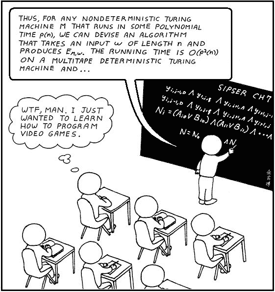

# 我分析了所有提到堆栈溢出的书。这里是最受欢迎的。

> 原文：<https://www.freecodecamp.org/news/i-analyzed-every-book-ever-mentioned-on-stack-overflow-here-are-the-most-popular-ones-a9930201c383/>

这里有三个值得你花时间的链接:

1.  我分析了所有提到堆栈溢出的书。以下是最受欢迎的( [5 分钟阅读](http://bit.ly/2mBw3d1))
2.  我如何构建 TinyMails:一个 chrome 扩展，帮助你写更短的邮件( [3 分钟阅读](http://bit.ly/2n1VnX4))
3.  Airbnb iOS 应用程序上的游击可用性测试新体验功能( [9 分钟阅读](http://bit.ly/2migxl7))

额外收获:在 Ewa 的代码 Vlog 的最新一集中，她与 Webpack 进行了斗争，并使用 React 建立了一个食谱盒应用程序( [11 分钟观看](http://bit.ly/2naxSu2))

### 想到这一天:

> "那些不把过去存档的人注定要重打过去."——加芬克尔和斯帕福德

### 今日趣事:

网络漫画作者[奥鹅](http://abstrusegoose.com/206)

### 今日学习小组:

[首尔自由代码营](http://bit.ly/2naQ3zL)

编码快乐！

–昆西·拉森，自由代码营的老师