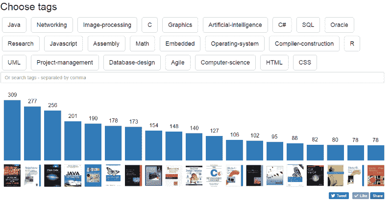
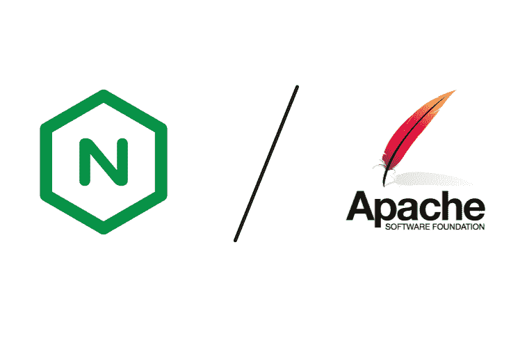

# 我分析了所有提到堆栈溢出的书。这里是最受欢迎的。

> 原文：<https://www.freecodecamp.org/news/i-analyzed-every-book-ever-mentioned-on-stack-overflow-here-are-the-most-popular-ones-eee0891f1786/>

弗拉德·韦策尔

# 我分析了所有提到堆栈溢出的书。这里是最受欢迎的。


找到下一本编程书籍很难，而且风险很大。

作为一个开发者，你的时间是很稀缺的，看书占用了你大量的时间。你可能在编程。你可能在休息。但是你却把宝贵的时间用来阅读和拓展你的技能。

那么你应该读哪本书呢？我和我的同事经常讨论书籍，我注意到我们对某本书的看法大相径庭。

所以我决定更深入地研究这个问题。我的想法是:解析世界上最受欢迎的程序员资源，寻找一家知名书店的链接，然后统计每本书被提及的次数。

幸运的是，Stack Exchange(Stack Overflow 的母公司)刚刚公布了他们的数据转储。所以我坐下来开始编码。



A screenshot from the tool I built: [dev-books.com](http://www.dev-books.com)

> *“如果你好奇的话，总体来说，最值得推荐的书是[有效处理遗留代码](https://amazon.co.uk/dp/0131177052/?tag=devbookscom-21)，其次是[设计模式:可重用面向对象软件的元素](https://amazon.co.uk/dp/0201633612/?tag=devbookscom-21)。虽然这些的标题像阿塔卡马沙漠一样干燥，但内容仍然应该是高质量的。你可以通过标签对书籍进行分类，比如 JavaScript、C、Graphics 等等。显然，这并不是书籍推荐的全部，但如果你刚刚开始学习编码或希望增强自己的知识，这无疑是一个很好的起点。”——[Lifehacker.com](http://lifehacker.com/dev-books-is-a-massive-collection-of-the-most-recommend-1792134129)*回顾

不久之后，我启动了[dev-books.com](http://www.dev-books.com)，它允许你探索我收集和整理的所有数据。我收到了超过 100，000 的访问者，并收到了许多要求我描述整个技术过程的反馈。

所以，正如我所承诺的，我现在要描述一下我是如何构建一切的。

### 获取和导入数据

我从[archive.org](https://archive.org/details/stackexchange)那里获得了堆栈交换数据库转储。

从一开始，我就意识到不可能使用像`myxml := pg_read_file(‘path/to/my_file.xml’)`这样的流行方法将 48GB 的 XML 文件导入到新创建的数据库(PostgreSQL)中，因为我的服务器上没有 48GB 的 RAM。所以，我决定使用一个 [SAX](https://en.wikipedia.org/wiki/Simple_API_for_XML) 解析器。

所有的值都存储在`<r` ow >标记之间，所以我使用 Python 脚本来解析它:

经过三天的导入(几乎一半的 XML 都是在这段时间内导入的)，我意识到我犯了一个错误:`ParentID`属性应该是`ParentId`。

此时，我不想再等一周，从一台 AMD E-350 (2 x 1.35GHz)换到了一台 Intel G2020 (2 x 2.90GHz)。但这仍然没有加快进程。

下一个决策—批量插入:

StringIO 允许您使用类似 file 的变量来处理函数`copy_from`，该函数使用了`COPY`。这样整个导入过程只用了一个晚上。

好了，是时候创建索引了。理论上，GiST 索引比 GIN 慢，但是占用空间少。所以我决定用 GiST。又过了一天，我有了一个 70GB 的索引。

当我尝试几个测试查询时，我意识到处理它们花费了太多的时间。原因？磁盘 IO 等待。SSD GOODRAM C40 120Gb 帮了大忙，即使不是目前为止最快的 SSD。

我创建了一个全新的 PostgreSQL 集群:

```
initdb -D /media/ssd/postgresq/data
```

然后，我确保更改了我的服务配置中的路径(我使用了 Manjaro OS):

```
vim /usr/lib/systemd/system/postgresql.service
```

```
Environment=PGROOT=/media/ssd/postgresPIDFile=/media/ssd/postgres/data/postmaster.pid
```

我重新加载我的配置并启动 postgreSQL:

```
systemctl daemon-reloadpostgresql systemctl start postgresql
```

这次花了几个小时进口，但我用了杜松子酒。索引占用了 SSD 上 20GB 的空间，简单的查询不到一分钟。

### 从数据库中提取书籍

数据最终导入后，我开始寻找提到书籍的帖子，然后使用 SQL 将它们复制到一个单独的表中:

```
CREATE TABLE books_posts AS SELECT * FROM posts WHERE body LIKE ‘%book%’”;
```

下一步是找到这些链接中的所有超链接:

```
CREATE TABLE http_books AS SELECT * posts WHERE body LIKE ‘%http%’”;
```

此时，我意识到 StackOverflow 代理所有链接，如:`rads.stackowerflow.com/[$isbn]/`

我创建了另一个表格，其中包含所有带有链接的帖子:

```
CREATE TABLE rads_posts AS SELECT * FROM posts WHERE body LIKE ‘%http://rads.stackowerflow.com%'";
```

使用正则表达式提取所有的[书号](https://en.wikipedia.org/wiki/International_Standard_Book_Number)。我通过`regexp_split_to_table`将栈溢出标签提取到另一个表中。

一旦我提取并统计了最受欢迎的标签，标签中提到最多的前 20 本书在所有标签中都非常相似。

我的下一步:提炼标签。

这个想法是从每个标签中取出前 20 本提到的书，并排除已经被处理的书。

因为这是“一次性”工作，所以我决定使用 PostgreSQL 数组。我编写了一个脚本来创建如下查询:

手里拿着数据，我走向网络。

### 构建 web 应用程序

由于我不是 web 开发人员——当然也不是 web 用户界面专家——我决定基于默认的 Bootstrap 主题创建一个非常简单的单页面应用程序。

我创建了一个“按标签搜索”选项，然后提取最流行的标签，使每个搜索都可以点击。

我用条形图显示了搜索结果。我尝试了 Hightcharts 和 D3，但它们更适合仪表板。这些在响应性方面有一些问题，并且配置起来相当复杂。因此，我基于 SVG 创建了自己的响应图表。为了使其具有响应性，必须在屏幕方向改变事件时重新绘制它:

### Web 服务器故障



Nginx vs. Apache

就在我发表了《dev-books.com》之后，我的网站吸引了一大群人。Apache 无法同时为 500 多个访问者提供服务，所以我很快设置了 Nginx，并在途中切换到它。当实时访问者在同一时间飙升至 800 时，我真的很惊讶。

### 结论:

我希望我解释得足够清楚，让你明白我是如何建立这个的。如果你有任何问题，请随意提问。你可以在推特和[脸书](https://www.facebook.com/VLP-Labs-727090070789985/)上找到我[。](https://twitter.com/VLPLabs)

正如我所承诺的，我将在三月底发表我在 Amazon.com 和谷歌分析的完整报告。到目前为止，结果确实令人惊讶。

请务必点击下面的“绿心”并关注我，了解更多关于技术的故事:)

敬请关注[dev-books.com](http://www.dev-books.com)