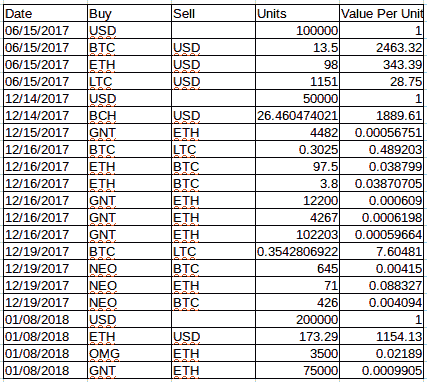
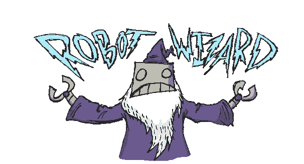
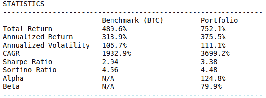
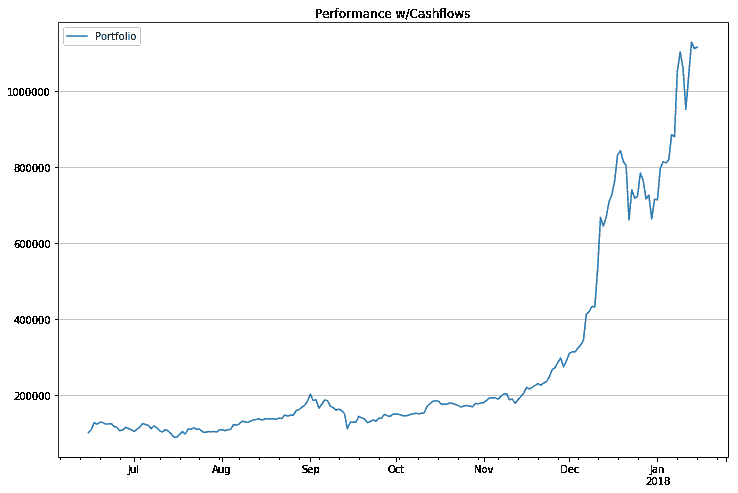
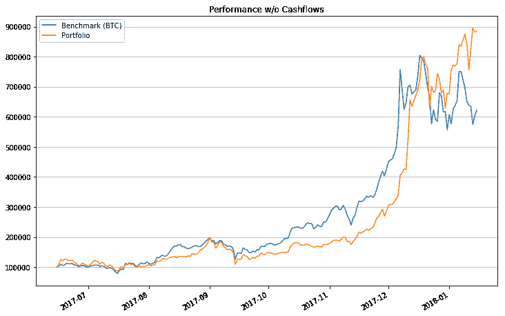
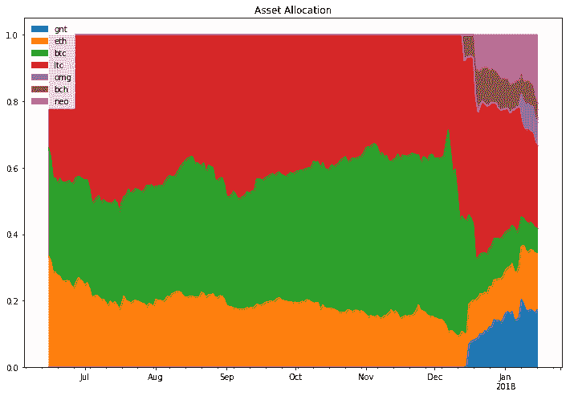
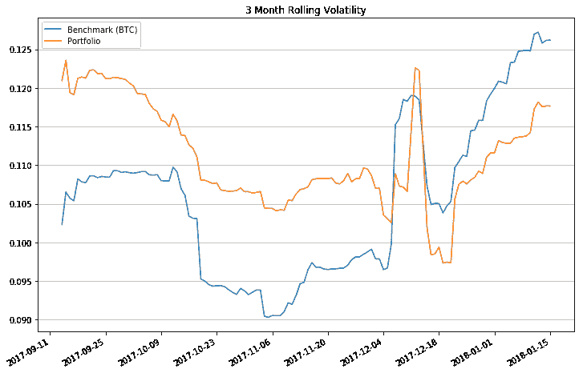

# 我做了一个 Jupyter 笔记本，可以为你分析加密货币投资组合

> 原文：<https://www.freecodecamp.org/news/i-built-a-jupyter-notebook-that-will-analyze-cryptocurrency-portfolios-for-you-bdaba618aeca/>

加密投资领域的参与度无需介绍。随着[市值、交易量和公众意识的上升](http://www.ibtimes.co.uk/year-cryptocurrencies-became-mainstream-1654616)，我想我应该整理一个简单的 Jupyter 笔记本，以便对我自己的加密投资组合中的投资活动有一个更清晰和更广泛的观点。

TL；这是代码。)

### 我们为什么要分析我们的投资组合？

因为只看我们(可能很胖的)钱包的总价值，我们肯定错过了关于我们投资的重要细节——尽管我喜欢不时看看 Blockfolio。因为看到我们的涟漪去月球，并掩盖了我们的其他投资可能会大大增加我们的金融风险。因为我们都希望自己的钱增值，但通过选择不同的密码来实现这一点，比选择一个可能最终失败(并让我们破产)的登月计划更容易、更安全。

让我们面对现实吧，市场收益太大了，我们不能对我们投资组合的真实特征一无所知。

### 重要的投资组合特征

现在，我们的投资组合有几个特征值得我们好好看看，包括回报**和**风险。但是很多时候我们只关注其中一个而不是另一个。

我们可以从几个方面来看回报:从开始到目前为止我们赚了多少钱，我们在特定时间段赚的平均利率(例如，年回报率)，我们的投资与基准的几个特征相比表现得有多好(例如， [alpha](https://www.investopedia.com/terms/a/alpha.asp) )，甚至是基于我们的起点(例如， [CAGR](https://en.wikipedia.org/wiki/Compound_annual_growth_rate) )达到我们当前投资所需的年复合利率。

同样重要的是，如果不是更重要的话，我们如何看待风险及其对回报的影响。我不知道你怎么想，但我想确保我能根据我能承受的风险来获得不错的回报。如果我们承担了巨大的风险来获得一个特定的回报，而我们本可以用小得多的风险来获得同样的回报，那么获得更有效率的投资的途径是显而易见的。

这就是理解波动性、相关性和风险调整后的回报发挥作用的地方，通过计算统计数据，如回报的标准差(或波动性)、[贝塔](https://www.investopedia.com/terms/b/beta.asp)、[夏普比率](https://en.wikipedia.org/wiki/Sharpe_ratio)和[索提诺比率](https://en.wikipedia.org/wiki/Sortino_ratio)。

虽然我们可以计算所有的统计数据来衡量我们投资组合的表现，但如果我们不包括一个参考点来看看我们在比较中做得如何，那就没什么用了。这被称为[基准](https://www.investopedia.com/terms/b/benchmark.asp)，我们将使用加密货币的金童:比特币。

### 笔记本演练

所以我不想在这里展示一堆代码，因为我认为你应该自己浏览一下笔记本，感受一下。不要怕，笔记本里有一些清晰的解释，代码也有注释！这也有助于更好地理解这篇文章。如果你愿意，克隆回购协议并先试一试。不过，我会通过一些统计数据和漂亮的可视化效果向您展示结果。

首先，我们需要创建一个模拟我们如何投资组合的交易单。下面这个包含在[回购](https://github.com/grantathon/crypto_portfolio_analysis)中。这些实际上是我投资的相同的 cryptos 和到目前为止我买卖它们的次数，但是钱的数量和分配(即我买卖的数量)不是；)

你可以把交易单看作是我们的投资策略。这些交易是我们根据自己的魔力或算法告诉我们的东西决定进行的。

Source: [Playstarbound](https://community.playstarbound.com/threads/glitch-ship-ai-feedback.80652/page-11)

除了交易单，我们还需要历史市场数据。我选择了简单的方法:从 [CoinGecko](https://www.coingecko.com/) 下载一些 CSV 文件，并将它们放入一个数据文件夹中。但是从 API 中提取数据会更好！

现在我们想对我们的投资策略进行回溯测试。简而言之，进行回溯测试可以让我们及时回到我们的第一笔交易，及时向前，模拟我们的投资组合直到今天发生的交易活动。回溯测试可能非常复杂，可以用在许多不同的场景中(对金融极客来说:这是双关语)，但在我们的例子中，它相当简单。

根据上面的统计数据，很明显，与我们的基准相比，我们的投资组合表现相当不错。回报更好，波动性只是稍微差一点，我们的贝塔系数出人意料地低于 100%。看看那个阿尔法！

好的。数字不错，但我想看一些图表。

这太吓人了。上图显示了我们投资组合的美元价值如何随时间演变，包括我们所有的现金流(即存款和提款)。虽然形象化这一点很好，但很难清楚地了解我们的投资组合在包括现金流在内的真实表现。例如，如果我存了 100 万美元(我希望如此)，投资组合会出现一个巨大的峰值！

现在好多了。通过去除见证现金流时的每日回报，我们可以更准确地反映投资组合的真实表现。幸运的是，我们的现金流数量很少，所以这种方法是可以接受的。正如你所看到的，我们花了一些时间赶上比特币，但它做到了，并最终超过了它(感谢[假人](https://golem.network/)和[尼奥](https://neo.org/))。

实际上，你可以看到，在疯狂的比特币、以太币和莱特币热潮(又名比特币基地热潮)之后，我们的投资组合变得更加多样化。这肯定与即将到来的比特币提款的抑制以及新增资产中可能出现的更大回报有很大关系。

好了，你知道了。显然，我们的投资组合在多样化后经历了更少的波动(即风险)。多样化(和运气)赢得胜利！

对我来说，这是最有趣的情节。这是一个矩阵，代表了我们投资组合中所有资产之间的相关性。虽然许多资产彼此之间有中等至高的相关性，但 T2 的比特币现金与每一项资产的相关性都非常低。你甚至可以看到它与[奥米塞戈](https://omisego.network/)呈负相关！相关性确实会随着时间的推移而变化，但在我们的投资组合中看到这些类型的关系还是很有趣的。

再一次，继续克隆回购协议，然后玩一会儿，这样你就能更详细地了解我们是如何着手分析我们的投资组合的。你甚至可以添加你自己的贸易单来一瞥你的。如果你发现了窃听器，告诉我！

### 总结一下

我希望你已经更好地理解了通过不同的视角来看待你的投资组合的重要性。仅仅通过可视化资产价格变动很难获得清晰的理解，尤其是最近在加密领域发生的一切。此外，随着时间的推移，我们承担了多少风险，以及当我们投资时，这些风险将如何演变，这并不总是清楚的。

显而易见的是，在这样一个市场中，多元化非常重要，因为我们谁也不知道这个市场将走向何方。记住这一点，当你在暴风雨和 HODL 中航行时，最好留意你的船。

顺便说一句，这些都不应被视为投资建议，守则也是如此。无论你从事哪种投资，都完全由你自己决定。

全面披露:在写这篇文章的时候，我投资了 BCH、BTC、瑞士联邦理工学院、GNT、LTC、NEO 和 OMG。