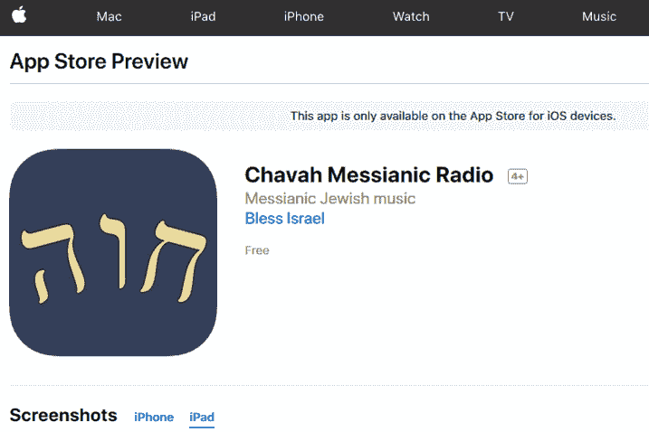
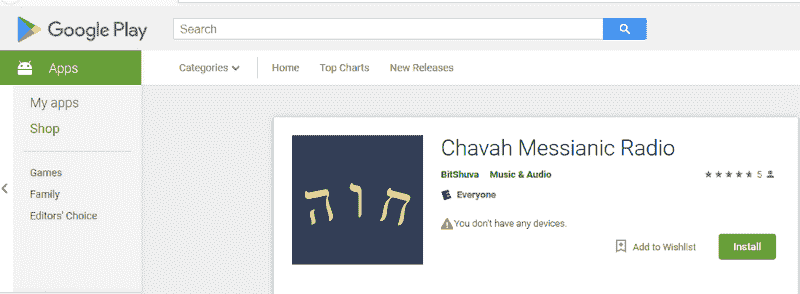
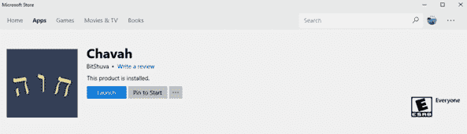
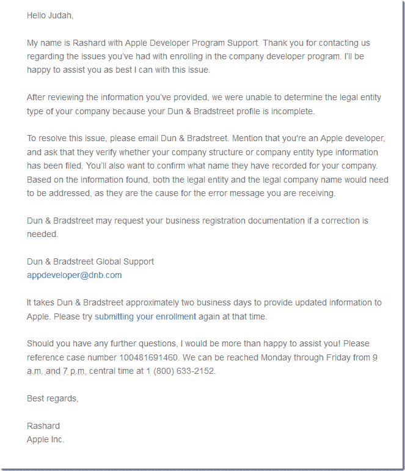

# 我建立了一个渐进式网络应用程序，并在 3 个应用程序商店中发布。以下是我学到的。

> 原文：<https://www.freecodecamp.org/news/i-built-a-pwa-and-published-it-in-3-app-stores-heres-what-i-learned-7cb3f56daf9b/>

作者:JudahGabriel Himango

# 我建立了一个渐进式网络应用程序，并在 3 个应用程序商店中发布。以下是我学到的。

#### 一个月的工作，几百美元，还有很多繁文缛节。

我最近发布了类似潘多拉的音乐播放器 Chavah Messianic Radio，作为一个进步的网络应用，并提交给了 3 个应用商店(Google Play，iOS 应用商店，Windows 商店)。

这个过程既痛苦又有启发。以下是我学到的。

### 为什么？

首先，你可能会想，“为什么要把你的应用放在应用商店里呢？就活在打开的 web 上吧！”

简而言之，答案是因为**是用户**所在的地方。我们已经训练了一代用户在专有的应用商店中寻找应用，而不是在免费和开放的网络上。

对于我的网络应用程序，有两大理由进入应用程序商店:

1.  用户需求
2.  苹果敌对移动平台对网络应用的限制

用户需求:我的用户多年来一直问我，“有没有一款针对 Chavah 的应用程序？店里没看到。”

他们这么问是因为我们已经训练用户在专有应用商店中寻找应用。

到目前为止，我对我的用户的回应是，

> “哦，你不需要一个应用程序——只要在你的手机上访问网站就可以了！管用！”

但我有点撒谎。

真正的网络应用只能在手机上运行。这让我想到了第二个原因:苹果敌对移动平台对网络应用的限制。

像苹果这样的移动平台供应商，对充分利用你的手机的应用程序非常感兴趣。访问您的位置，播放背景音频，获取您的 GPS 坐标，一次播放多项内容，等等。

苹果对此完全没有意见。

但前提是你要向苹果支付每年 99 美元的特权费。

如果你想在一个普通的老网络应用程序中做这些事情，那么，goshdarnit，苹果不会拒绝你这些事情，它甚至阻止你请求许可。

对于我的类似潘多拉的音乐播放器应用程序，这种可怕的破碎以多种方式出现。

从“iOS Safari 不会让你在没有首先与页面互动的情况下播放音频”这样的小事，到“如果你的应用程序在背景中或者如果你的屏幕关闭，iOS Safari 不会让你播放下一首歌曲”这样的重大、令人窒息的事情

哦，还有奇怪的视觉异常，比如[在文本框中输入，然后看到你的文本出现在屏幕的其他地方](https://stackoverflow.com/questions/46339063/ios-11-safari-bootstrap-modal-text-area-outside-of-cursor)。

因此，为了让我的 HTML5 音乐应用程序在人们的移动设备上真正发挥作用，有必要将我的 PWA 变成 app store 中的一个应用程序。

### 进入壁垒

在理想情况下，将您的 web 应用程序发布到应用程序商店应该是这样的:

*   您的 Web/云主机或持续集成提供商
*   你发布了一个渐进式 Web 应用程序。发布到应用商店？

☑ iOS 应用商店

☑ Google Play

☑ Windows 应用商店

(或者，微软正在试验，当必应抓取时，你的 PWA 会自动出现在 app store 中。)

但是唉，我们并不是生活在这个理想的世界里。相反，我们必须处理各种专有的原生 BS，才能在商店中获得我们的 web 应用程序。

每个应用程序商店都有一个进入壁垒:在应用程序商店中使用现有的 web 应用程序和 it 有多困难。

我在下面列出了一些障碍。

### 费用

*   苹果公司:99 美元/年，让你的应用程序出现在 iOS 应用商店。
*   **Google:** 在谷歌 Play 商店列出你的应用程序需要一次性支付 25 美元。
*   **微软:**免费！

不要让我付钱给你让你的用户可以使用我的应用程序。我的应用丰富了你的平台。没有好的 app，你的平台就会被抛弃。

苹果曾经明白这一点。当苹果首次推出 iPhone 时，史蒂夫·乔布斯(Steve Jobs)坚信 HTML5 是未来，应用将只是网络应用。没有针对第三方的原生 iPhone SDK。苹果后来放弃了这一愿景。

谷歌收取象征性的 25 美元一次性费用。可能是为了避免垃圾邮件发送者，减少真正的垃圾应用程序进入商店。

微软似乎下定决心，不管质量如何，只增加应用商店中应用的总数。

**赢家:**微软。很难挣脱。

### 添加本机功能

在理想的情况下，我不需要为我的 web 应用程序编写一行额外的代码来集成到操作系统中。或者，正如史蒂夫·乔布斯在 2007 年所说的，

> “完整的 Safari 引擎在 iPhone 内部。因此，你可以编写出惊人的 Web 2.0 和 Ajax 应用程序，其外观和行为与 iPhone 上的应用程序完全一样。并且这些应用可以与 iPhone 服务完美集成。他们可以打电话、发电子邮件、在谷歌地图上查找位置。”

> *——史蒂夫·乔布斯，2007 年*

对我来说，这意味着我的 web 应用程序使用标准的 HTML5 音频播放背景音频；这在所有操作系统上都能正常工作。

我的 web 应用程序会声明正在播放的音频，操作系统会检测到这一点，并在锁定屏幕上显示当前正在播放的歌曲信息。

我的应用使用标准 HTML5 音频 API 控制音频；操作系统会注意到这一点，并在锁定屏幕上提供播放/暂停/下一个/音量/跟踪栏控制。

但可悲的是，我们并没有生活在这个理想的世界里。上面列出的所有东西实际上都不能在所有 3 个平台上开箱即用。

我的 web 应用程序需要在后台播放音频。并从我的 CDN 加载 URL。听起来很合理，对吧？另外，在锁屏上显示当前播放的歌曲信息怎么样？以及控制音频(播放/暂停/下一个等。)从锁屏？这有多难？

这里采用了三种非常不同的方法:

*   **苹果**:我们没有给 web 应用一个声明这种能力的方法；你需要写一个本地的包装器(比如用 Cordova)来和操作系统交互。
*   **Google** : Web FTW！让我们[创建一个新的 web 标准](https://developers.google.com/web/updates/2017/02/media-session)，从锁定屏幕显示音频&控件。背景音频？当然，去吧！
*   微软:我们将把我们专有的 API window . windows . *，注入到你的 JavaScript 全局命名空间中，你可以用它来做你想做的事情。

在此了解每个商店的更多细节:

对于 iOS 应用商店，你的 web 应用需要播放背景音频吗？[使用 Cordova 插件](https://github.com/danielsogl/cordova-plugin-background-audio)。需要在锁定屏幕上显示当前播放的歌曲吗？[使用 Cordova 插件](https://github.com/leon/cordova-plugin-nowplaying)。需要从锁屏控制当前播放的歌曲？[使用 Cordova 插件](https://github.com/leon/cordova-plugin-remotecommand)。你明白了。基本上，科尔多瓦欺骗苹果认为你是一个本地应用程序。因为你不是一个讨厌的网络应用，苹果让你做所有本地应用能做的事情。你只需要本地技巧——科尔多瓦插件——就可以做到。

对于 Google Play，我只需编写 JS 代码就能实现这一点，这很好；这里不需要 Cordova 插件。当然，除了 Android 上的 Chrome 之外，JS 在任何地方都不会工作…但是，嘿，也许有一天(在理想的世界里！)所有的移动浏览器都将实现这些 web API……整个世界将融为一体。我几乎准备好弹出一些约翰·列侬的嬉皮士乌托邦曲调。

对于 Windows 应用商店，是否要播放背景音频？不好意思！也就是说，除非你在我们的专有能力清单文件(easy) *和*中声明你的意图，否则你使用[窗口实现这个专有媒体接口。windows . SystemMediaTransportControls](https://stackoverflow.com/questions/49240479/enabling-background-audio-in-my-windows-store-html5-app?rq=1)(没那么容易)。否则，当你的应用程序进入后台时，我们会将你静音。

**赢家**:谷歌。我希望能够只写 JavaScript，让操作系统从我的应用程序中获取提示。

**亚军** : Windows。我仍然可以编写普通的旧 JavaScript，但我需要与一个专有的 Windows JS API 对话，该 API 是在 Windows 上运行时注入到我的进程中的。不可怕。

**失败者**:苹果。他们不关心网络应用。实际上，比那更糟。感觉他们实际上对网络应用程序怀有敌意。iOS Safari 是新的 Internet Explorer 6。它已经落后于几乎所有的网络标准，尤其是在渐进式网络应用方面。这可能是出于商业原因:网络应用扰乱了他们每年 99 美元+ 33%的应用内购买收入。所以为了让我的网络应用在他们的平台上工作，我必须假装自己是一个本地应用。

### App Store 注册

向 app store 提交您的 PWA 需要注册、业务验证和更多的繁文缛节。以下是 3 家应用商店的表现:

*   苹果公司:你必须证明你是一家合法的注册企业。这种验证不是由我们完成的，而是由第三方完成的[，他们可能知道也可能不知道你的业务。](http://www.dnb.com/)
*   谷歌:你想让你的应用程序出现在我们的商店里？我们觉得很酷。
*   微软:你想让你的应用程序出现在我们的商店里？我们觉得很酷。

对我来说，最大的痛点是被苹果验证为合法业务。

首先，我去网站注册了苹果的开发者项目。我填写了我的名字和公司信息。(旁白:我猜苹果不会让你提交 app 的，除非你有注册的，合法的公司？)

我点击下一步。

"您输入的信息与您的 D&B 个人资料不符."

我的…什么？

谷歌搜索显示“D&B 简介”是邓白氏公司的。我以前从未听说过这个组织，但是我发现苹果公司利用他们来验证你合法公司的详细资料。

很明显，我在 D&B 的个人资料与我在苹果开发者注册中填写的不符。

我又用谷歌搜索了一些，发现苹果开发论坛上充斥着类似的帖子。没有人有一个好的答案。

我联系苹果开发支持。24 小时后，我收到一封电子邮件，说我应该联系 D&B。

我决定联系他们…但是苹果公司说他们需要几天的时间来回复。

在这一点上，我正在考虑放弃整个想法。

在等待 D&B 的支持人员给我回复时，我决定去 D&B 的站点，验证我的身份，并更新我的公司信息，我认为这些信息是从政府注册记录中获取的。

我说过这有多糟糕吗？我只想在商店中列出我现有的 web 应用程序。请帮忙。

我去 D&B 更新我的商业资料。惊喜！他们的验证逻辑中有一个 JavaScript 错误，阻止我更新个人资料。

谢天谢地，我是一个熟练的开发人员。我点击在他们的 JavaScript 中放一个断点，点击提交，将 isValid 标志改为 true，瞧！我更新了我在 D&B 的资料。

回到 Apple Dev ->让我们再试一次。注册我的公司…

"错误:您输入的信息与您的 D&B 个人资料不匹配."

AREYOUFREAKINKIDDINGME。

再和苹果谈谈。“哦，更新的 D&B 信息可能需要 24-48 小时才能进入我们的系统。”

你知道，因为数字信息从服务器 A 传到服务器 b 要 2 天，唉。

两天后，我试着注册…终于成功了！现在我加入了苹果开发者计划，可以提交应用进行审核了。

**赢家**:谷歌和微软；两人都花了整整 5 分钟注册。

**失败者**:苹果开发者注册又慢又痛苦。花了大约一周的时间实际注册了他们的开发者项目。它需要我联系两个不同的该死的公司的支持。它要求我在第三方网站上*运行时调试 JavaScript 代码，这样我就可以通过他们漏洞百出的客户端验证，这样我的信息就会流向苹果，这样我就可以向商店提交我的应用程序。哇，只是…哇。*

如果苹果有任何可取之处，那就是他们有一个 501c3 非营利项目，非营利组织可以免除 99 美元的年费。我利用了这一点。也许这个额外的步骤让事情变得复杂了。

### 应用程序打包、构建、提交

一旦你有了一个网络应用，你必须对它施些魔法，把它变成你可以提交给应用商店审核的东西。

*   **苹果**:首先，买一台 Mac 没有 Mac，你无法构建 iOS 应用。安装 XCode 和这些构建工具和框架，从我们的开发者计划获取证书，在一个名为 iTunes Connect 的独立网站上创建一个描述文件，将其与您在 Apple Dev center 上生成的证书链接起来，然后使用 XCode 提交。简单得像一、二、三……三十七……
*   **Google** :下载 Android Studio，通过它生成安全证书，然后用 Studio 打包。将包上传到 Android 开发者网站。
*   **微软**:生成一个。appx 包使用这些免费的命令行工具，或者 Visual Studio。上传到微软开发中心网站。

好消息是，**有一个免费的工具可以神奇地将你的网络应用变成应用包**。那个令人敬畏的免费工具叫做 [PWABuilder](https://www.pwabuilder.com/) 。它会分析一个 URL，告诉你需要做什么(例如，可能会在你的 PWA web 清单中添加一些主屏幕图标)。在一个 3 步向导中，您可以下载包含所有神奇功能的软件包:

*   对于 Windows，它实际上会生成。appx 包。你可以把它拿到 Windows 开发中心网站上提交。
*   对于 Google 来说，它会生成一个包含您的 PWA web 应用程序的包装器 Java 应用程序。从 Android Studio 中，您构建这个项目，它生成可以上传到 Android Dev Center 站点的 Android 包。
*   对于苹果公司，它生成一个 XCode 项目，可以用 XCode 构建。这需要一台苹果电脑。

苹果再一次成为所有这些问题中最痛苦的一个。我没有苹果电脑。但是如果没有 Mac，就不能为 PWA 构建 XCode 项目。

我不想花几千美元在苹果的应用商店发布我的免费应用。我不想为丰富苹果 iOS 平台的特权买单。

谢天谢地， [MacInCloud](http://macincloud.com/) 每月花费大约 25 美元，他们会给你一台已经安装了 XCode 的 Mac 机。您可以使用 Windows 远程桌面，甚至通过 web 界面远程访问它。

仅仅构建 XCode 项目并提交是不够的。我不得不在苹果开发者网站上生成一个安全证书，然后在一个单独的网站 iTunes Connect 上创建一个新的应用配置文件，你实际上是在那里提交这个包的。

这还不是全部:由于苹果对网络应用怀有敌意，我不得不安装一些特殊的框架，并添加 Cordova 插件，让我的应用程序可以在后台播放音频，将当前歌曲添加到锁定屏幕，从锁定屏幕控制歌曲音量和播放状态，等等。

这花了我至少一周的时间让我的应用程序进入工作状态，然后我才能把它提交到应用程序商店。

**赢家**:微软。想象一下:你可以去一个为你的 web 应用生成应用包的网站。如果你不喜欢，你可以下载命令行工具来完成这项工作。GUI 人？免费的 Visual Studio 可以工作。

**亚军**:谷歌。需要 Android Studio，但它是免费的，每个人都可以运行，而且足够简单。

**失败者**:苹果。我不应该为了开发我的应用程序而去买一台专有的电脑——一台几千美元的苹果电脑。苹果开发中心—>iTunes Connect tangling 似乎是一个不食人间烟火的经理试图将 iTunes 推向开发者。它应该只是苹果开发者中心网站的一部分。

### 应用测试

一旦你终于完成了所有的魔法咒语，将你现有的网络应用程序变成了一个移动应用程序包，你可能想在将你的应用程序发布给普通大众之前将它发送给测试人员。

*   苹果公司:为了测试，你让你的测试人员在他们的 iOS 设备上安装 Test Flight。然后在 iTunes Connect 中添加测试人员的电子邮件。测试人员会收到一个通知，并可以在你的应用程序进入应用程序商店之前对其进行测试。
*   **Google** :在 Android 开发中心，你添加测试人员的邮箱地址。添加后，他们可以在 App Store 中看到您的 alpha/beta 版本。
*   **微软**:这个我其实没用过，不做评论。

**赢家**:掷硬币。苹果的试飞 app 简单精简。您可以简单地在管理员端控制 alpha/beta 的到期时间。谷歌紧随其后；这很容易，甚至不需要一个单独的应用程序。

### 应用回顾

一旦您的应用程序准备就绪，您就可以提交应用程序进行审核。评审是通过使用程序清单(例如，你有启动图标吗？)和真人(“你的应用是 X 的克隆，我们拒绝它”)

*   苹果:在提交之前，XCode 会在构建过程中警告你潜在的问题。人工应用审查大约需要 24-48 小时。
*   谷歌:有人在家吗？Android Studio 没有告诉我任何潜在的问题，我的应用程序在提交后的几分钟内就获得了批准。我认为没有一个真正的人看过我的应用程序。
*   微软:在提交时，一个快速的程序审查发现了一个关于错误图标格式的问题。通过后，一个人类在 4 天内审核了我的 app。

**赢家**:苹果。

当然，作为一名开发者，我喜欢我的应用立即出现在 Google Play 商店的事实。但我怀疑，那只是因为它实际上并没有被人类审阅过。

苹果拥有最快的人工审查周转时间。更新也在 24 小时内通过审查。

微软在这里被击中或错过。最初的审查花了 3 或 4 天。后来的更新花了 24 小时。然后另一次更新，我添加了 XBox 平台，又花了 3-4 天。

### 结论

获取一个现有的 PWA 并让它们在移动平台上运行并在应用程序商店中列出是很痛苦的，也是很花钱的。

**赢家**:谷歌。他们让进入应用商店变得最容易。通过尝试标准化操作系统平台可以使用的 web API(hello，lovely navigator.mediaSession ),使其最容易集成到本机平台中

**亚军**:微软。他们让给你的网络应用洒上魔法变得最容易，把它变成一个可以提交给他们商店的包。(可以使用 [PWABuilder](http://pwabuilder.com/) 网站免费完成！)与他们的平台集成意味着使用自动注入的 window.Windows.* JavaScript 名称空间。还不错。

**失败者**:苹果。不要要求我购买 Mac 来构建 iOS 应用程序。不要逼我用原生包装器来集成你的平台。不要要求我摆弄安全证书；让您的构建工具为我创建它们，并将它们自动存储在我的开发中心帐户中。不要让我使用两个不同的网站:苹果开发中心和 iTunes Connect。

最后的想法:网络永远是赢家。它打败了闪电侠。它杀死了 Silverlight。它摧毁了桌面上的本地应用。浏览器是富客户端平台。操作系统仅仅是一个浏览器启动器和硬件通信器。

在移动领域，网络也将胜出。开发者不想为主要平台开发 3 个独立的应用。公司不想为 3 个应用程序的开发付费。

所有这些的答案是网络。我们可以构建丰富的网络应用程序——渐进式网络应用程序——并为所有的应用程序商店打包。

特别是苹果公司有一个反常的动机去阻止网络的进步。这与微软在 90 年代末和 21 世纪初的动机相同:它希望成为优秀应用的平台。艾滋病毒/艾滋病破坏了这一点；他们到处跑。

我的软件智慧是这样的:PWAs 将最终胜出并超越本地移动应用。在 5 到 10 年内，原生 iOS 应用将会像 Win32 C 应用一样普遍。苹果会继续踢和尖叫，让 iOS Safari 落后于潮流，尽可能阻止 PWA 的发展。(甚至他们最近在 iOS Safari 11.1 [中对 pwa 的“支持”实际上削弱了 pwa](https://news.ycombinator.com/item?id=16826852)。)

我对移动应用平台的建议是接受不可避免的情况，要么自动将高质量的 PWA 添加到您的应用商店，要么允许开发人员轻松地(例如，免费，点击 3 次或更少)向您的商店提交 PWA。

读者们，我希望这是对 2018 年应用商店 PWAs 的有益一瞥。

你向应用商店提交过 PWA 吗？我很想在评论区听到你的经历。你可以在我的博客上阅读更多我的博文[。](http://debuggerdotbreak.judahgabriel.com)