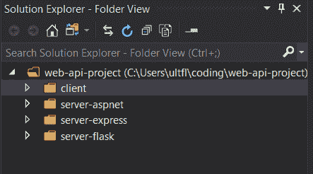
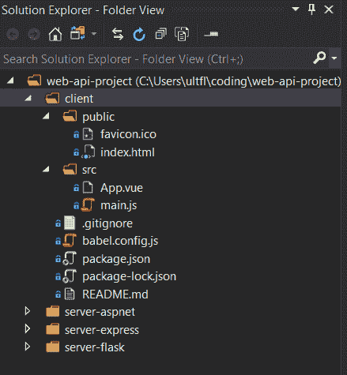
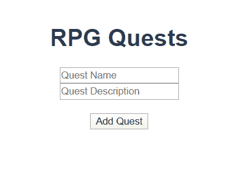
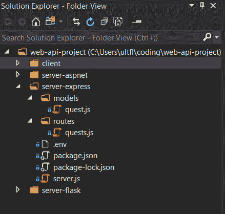
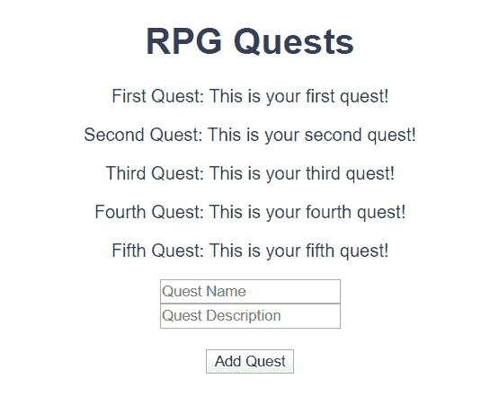
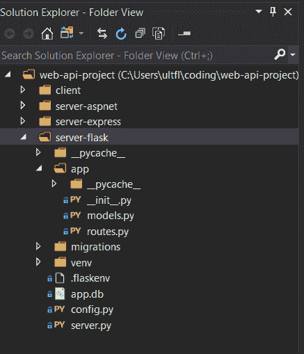
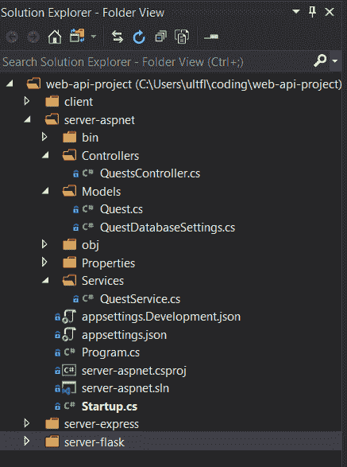

# 我使用 Express、Flask 和 ASP.NET 重新构建了相同的 web API。这是我的发现。

> 原文：<https://www.freecodecamp.org/news/i-built-a-web-api-with-express-flask-aspnet/>

我一直在寻找一个后端框架来支持桌面游戏应用程序，并决定做一些研究来确定最适合我的需求。

目标很简单:构建一个简单的 RESTful API，允许前端应用执行基本的 T2 操作，向我介绍开发过程。

有很多后端框架选项，我最熟悉的是 JavaScript、C#和 Python(按此顺序)，这在某种程度上限制了我的选择。自然的起点是构建一个简单的前端，它将向 API 发送请求，API 将依次读取和写入本地数据库。

我用 Express 开始了我的开发过程，出于我将很快解释的原因，这使我也检查了 Flask 和 ASP.NET。我认为我的发现可能对那些正在研究小型项目后端框架的人有用。在本文中，我还将提供代码示例和我用来构建一切的资源。

你也可以在 [GitHub](https://github.com/sominator/web-api-project) 上获得完整的代码。

我应该提醒一下，我不会将一个框架提升到另一个之上，也没有对部署、身份验证或可伸缩性等方面进行比较。如果这些细节对您很重要，您的里程可能会有所不同！

然而，我将提供一个**TL；如果你只是想得到总结和关键的学习内容，请点击底部的 DR** 。

开始了。

## 定义 API

如果你是 web 开发的新手，你可能会问，“什么是 API？”

为了找到一个有意义的答案，我不得不问这个问题上百次。直到我建立了自己的 API，我才能说我理解了 API *是做什么的。*

简而言之，API 或“应用编程接口”允许两个不同的计算系统相互通信。在本文中，我将展示一个简单的前端应用程序，它显示一个“任务”跟踪器，玩家可以在桌面角色扮演游戏中查看该跟踪器。每个任务都有一个“名称”和一个“描述”，它们都显示在网络浏览器中。

如果我已经在网站上列出了所有的任务，只是想让玩家查看，我就不需要 API 或后端了。然而，对于这个项目，我希望能够允许用户添加任务，搜索任务，删除任务，等等。对于这些操作，我需要将任务存储在某个地方，但我的前端应用程序无法将信息直接传输到数据库。

为此，我需要一个 API，它可以接收来自网站的 HTTP 请求，判断如何处理这些请求，与我的数据库进行交互，并向上游发送更多信息，以便用户可以看到发生了什么。

整个东西——前端“客户机”，后端“API”或服务器，以及数据库——被称为“栈”，或者更准确地说，称为“完整栈”。对于这个项目，我构建了一个简单的前端网站作为堆栈的顶部，并在尝试不同的框架和数据库时切换掉了它下面的所有内容。

## 项目结构

这个项目的结构相当简单，前端客户端与三个不同的服务器分开，我将根据需要启动这些服务器来为 API 提供服务。



我使用 [Visual Studio 社区](https://visualstudio.microsoft.com/vs/community/)作为我的代码编辑器和 IDE，其中安装了 JavaScript、Python 和 C#所需的语言包。

我将依次概述我使用每个框架的经验，并提供我用来让它们与客户机一起工作的教程和软件包的链接。但首先，我们来看看前端！

## 客户端:Vue.js

客户端的目标是拥有一个简单的网站，通过 API 从数据库接收信息并显示给用户。为了简化流程，我的要求是客户端只需要“读取”数据库中的所有项目，并为用户提供“创建”新请求的能力。

这些“读取”和“创建”操作——“CRUD”中的“R”和“C”——类似于 HTTP 方法“GET”和“POST”，我们将在下面的代码中看到。

在前端开发中，我最习惯使用 [Vue](https://vuejs.org/) ，并使用 [Vue CLI](https://cli.vuejs.org/) 搭建一个基本客户端，文件结构如下:



我用以下内容替换了 Vue CLI 提供的样板标记:

```
<template>
    <div id="app">
        <h1>RPG Quests</h1>
        <p v-for="(quest, index) in quests" v-bind:key="index">{{quest.name}}: {{quest.description}}</p>
        <input type="text" v-model="newQuestName" placeholder="Quest Name" /> <br />
        <input type="text" v-model="newQuestDescription" placeholder="Quest Description" /><br /><br />
        <button v-on:click="postQuest">Add Quest</button>
    </div>
</template>
```

以及相应的 Vue 代码:

```
import axios from 'axios';

    export default {
        name: 'App',
        data: function () {
            return {
                quests: null,
                newQuestName: null,
                newQuestDescription: null
            }
        },
        methods: {
            getQuests: function () {
                axios
                    .get('http://localhost:3000/quests')
                    .then(response => (this.quests = response.data));
            },
            addQuest: function () {
                axios
                    .post('http://localhost:3000/quests', {
                        name: this.newQuestName,
                        description: this.newQuestDescription
                    });
            },
            postQuest: function () {
                axios.all([this.addQuest(), this.getQuests()]);
                this.$forceUpdate();
            }
        },
        mounted: function () {
            this.getQuests();
        }
    }
```

如果你不熟悉 Vue，前端的细节并不重要！这里有意义的是，我使用一个名为 [Axios](https://github.com/axios/axios) 的 JavaScript 包向潜在的服务器发出 GET 和 POST 请求。

当客户端加载时，它将向 URL http://localhost:3000/quests 发出 GET 请求，从数据库中加载所有的 quest。它还提供了几个输入框和一个按钮，可以发布一个新的任务。

使用 Vue CLI 为 http://localhost:8080 上的客户端提供服务，应用程序的前端看起来像这样:



一旦任务被添加到数据库中，它们将开始出现在“角色扮演任务”标题和输入栏之间。

### 客户端资源

为了构建客户端，我使用了:

*   [包管理节点](https://nodejs.org/en/) / [NPM](https://www.npmjs.com/)
*   脚手架、服务设施和建筑项目
*   [Axios](https://github.com/axios/axios) 用于向 API 发出 HTTP 请求
*   [Vue Axios 文档](https://vuejs.org/v2/cookbook/using-axios-to-consume-apis.html)了解如何将 Axios 与 API 配合使用
*   [Postman](https://www.postman.com/) 用于在客户端实现 API 请求之前，通过浏览器对其进行测试。

## JavaScript API: Express

[Express](https://expressjs.com/) 是一个用于 [NodeJS](https://nodejs.org/en/) 的轻量级 web 框架，它允许你用 JavaScript 编写服务器端应用程序。

它不固执己见，这意味着您可以按照自己喜欢的方式构建应用程序，而无需 It 为您定义架构。你可以随心所欲地添加包来改进功能，作为一个框架新手，我发现这是一把双刃剑。稍后会详细介绍。

由于对 JavaScript 最熟悉，我对整个堆栈只在一种语言而不是几种语言上运行的前景感到兴奋。我听说过“MEVN 栈”，它表示由 [MongoDB](https://www.mongodb.com/) 、Express、Vue 和 NodeJS 组成的全栈应用程序，并决定在项目的这次迭代中尝试一下。

我按照一个 [web API 教程](https://dev.to/beznet/build-a-rest-api-with-node-express-mongodb-4ho4)首先构建一个模板应用，然后使用另一个 [MEVN 教程](https://medium.com/@anaida07/mevn-stack-application-part-1-3a27b61dcae0)来填充如何让 API 与我构建的 Vue 客户端通信的细节。我为这个项目创建的 Express API 遵循与前者类似的结构，使用 MongoDB 作为数据库:



如果您有 JavaScript 背景，Express 相当容易阅读，即使您不熟悉一些后端术语。例如，下面是/routes/quests.js 中的一个片段，它处理 HTTP [端点](https://en.wikipedia.org/wiki/Web_API#Endpoints)请求:

```
router.get('/', async (req, res) => {
    try {
        const quests = await Quest.find();
        res.json(quests);
    } catch (err) {
        res.status(500).json({ message: err.message });
    }
});

router.post('/', async (req, res) => {
    const quest = new Quest({
        name: req.body.name,
        description: req.body.description
    });
    try {
        const newQuest = await quest.save();
        res.status(201).json(newQuest);
    } catch (err) {
        res.status(400).json({ message: err.message });
    }
});
```

代码的一般主题是接收请求，尝试联系数据库进行工作，然后向请求者发送响应。具体细节可能相当复杂，特别是如果您正在编写自己的[中间件](https://expressjs.com/en/guide/using-middleware.html)来处理请求和响应之间的事情，但是代码至少是可读的。

我发现使用 MongoDB 作为 NoSQL 数据库并不费力。如果你在使用 Express，你最有可能使用[mongose](https://mongoosejs.com/)作为[ODM](https://en.wikipedia.org/wiki/Object-relational_mapping#Object-oriented_databases)——基本上就像一个“中间人”,将你的数据的模型翻译到数据库中。

这个应用程序中的模型(在 Mongoose 术语中称为“模式”)非常简单，位于/models/quests.js 中:

```
const questSchema = new mongoose.Schema({
    name: {
        type: String,
        required: true
    },
    description: {
        type: String,
        required: true
    }
});
```

以上表明数据库应该存储我们的两个字段:一个任务名称和一个任务描述。这两个字段都是字符串，并且是必需的。所有 GET 和 POST 请求都必须符合这个模型才能与数据库交互。

在将所有这些连接起来并发布了一些新的任务后，前端站点开始填充数据:



然而，建立 Express API 的过程并不是一帆风顺的。作为一名主要的前端和 2D 游戏开发者，我已经非常熟悉 JavaScript 生态系统是如何分散的。这种挫败感在尝试构建后端应用程序时被放大了。有许多*包需要让一切正常运行，每个包都有自己所需的配置和实现。*

如果你正在寻找一个可以开箱即用的框架，那么 Express 肯定不是你的选择。它是轻量级的，灵活的，易于阅读的，以一种非常“选择你自己的冒险”的方式。我很喜欢代码的简洁，以及按照我认为合适的方式构建项目的能力，但是故障排除和错误处理确实还有很多不足之处。

### JavaScript/Express 资源

为了构建 JavaScript API，我使用了:

*   [包管理节点](https://nodejs.org/en/) / [NPM](https://www.npmjs.com/)
*   [将](https://expressjs.com/)表示为主 web 框架
*   [Dotenv](https://www.npmjs.com/package/dotenv) 创建特定环境变量
*   Nodemon 监视文件的变化并重启服务器，这样我就不用这么做了
*   [CORS](https://expressjs.com/en/resources/middleware/cors.html) 允许[跨源请求](https://developer.mozilla.org/en-US/docs/Web/HTTP/CORS)(如果你试图从一个客户机向一个服务器发出请求，而这两个请求都在你的机器上本地运行，基本上会很痛苦)
*   [MongoDB](https://www.mongodb.com/) 用于 [NoSQL](https://www.mongodb.com/nosql-explained) 数据库
*   用于编写映射到 MongoDB 的模型
*   [本 API 教程](https://dev.to/beznet/build-a-rest-api-with-node-express-mongodb-4ho4)提供了如何创建 Express-MongoDB 堆栈的基本理解
*   [这篇 MEVN 教程](https://medium.com/@anaida07/mevn-stack-application-part-1-3a27b61dcae0)填补了运行 MongoDB-Express-Vue-Node 全栈的空白

## Python API: Flask

在构建 Express API 的过程中，我和一位从事 Python 工作的数据科学朋友进行了一次对话。这让我有了尝试非 JavaScript 框架的想法，看看它们是否更适合我的应用。

我粗略地看了一下 [Django](https://www.djangoproject.com/) ，因为我听说它是一个强大的后端框架，提供开箱即用的一切。我有点被它的固执己见所吓倒，于是选择试用 [Flask](https://palletsprojects.com/p/flask/) ，这有点像 Python 中的 Express。

我按照优秀的 [Flask 大型教程](https://blog.miguelgrinberg.com/post/the-flask-mega-tutorial-part-i-hello-world)的前几部分来设置我的应用程序结构，使用配套的 [RESTful API 教程](https://blog.miguelgrinberg.com/post/designing-a-restful-api-with-python-and-flask)来填充 HTTP 请求片段。文件结构只比 Express API 稍微复杂一点:



我跟随的教程使用 [SQLite](https://www.sqlite.org/index.html) 作为它的数据库，用 [Flask-SQLAlchemy](https://flask-sqlalchemy.palletsprojects.com/en/2.x/) 作为 [ORM](https://en.wikipedia.org/wiki/Object-relational_mapping) 。与 Express API 最相似的 HTTP 请求代码位于/app/routes.py 中:

```
@app.route('/quests', methods=['GET'])
def get_quests():
    questQuery = Quest.query.all()
    quests = {}
    for quest in questQuery:
        quests[quest.name] = quest.description
    return jsonify(quests)

@app.route('/quests', methods=['POST'])
def post_quest():
    newQuest = Quest(name=request.json['name'], description=request.json['description'])
    db.session.add(newQuest)
    db.session.commit()
    return "Quest Added!"
```

类似地，数据库模型(类似于 Mongoose“模式”)位于/app/models.py 中:

```
class Quest(db.Model):
    name = db.Column(db.String(256), primary_key=True, index=True, unique=True)
    description = db.Column(db.String(256), index=True, unique=True)
```

正如我提到的，与 Python 相比，我更熟悉 JavaScript 和 C#，与后者一起构建 Flask API 感觉像是作弊。某些事情，比如路径、包处理和编写可工作的代码都很简单，尽管我确实在让 API 为客户端正确解析 JSON 时遇到了麻烦。我怀疑这更多的是因为我对这门语言不熟悉，而不是其他原因，但这确实需要时间来排除故障。

老实说，我来自一个非 Flask 背景的人，我确实有点期望完成几个教程并开发一个 API，而不必为此做那么多工作。

我不能说结果是那样的，因为 Python 确实有自己的特点，需要一些时间来适应。尽管如此，Python 生态系统似乎组织得非常好，我很享受构建 Flask API 的时光。

我还听说 Django 对于大型项目来说是一个更好、更具可伸缩性的选择。但是，这似乎需要一个单独的、更陡峭的学习曲线才能变得熟练。

作为一个非 Python 开发人员，Flask 对我来说很容易，只需一个周末就能学会并构建一些东西。我怀疑学习 Django 可能会花费更长的时间，但是从长远来看可能会有更大的收益。

### Python/Flask 资源

为了构建 Flask API，我使用了:

*   用于包管理的 [Python 3](https://www.python.org/) / [pip](https://pip.pypa.io/en/stable/)
*   [烧瓶](https://palletsprojects.com/p/flask/)作为主 web 框架
*   [python-dotenv](https://pypi.org/project/python-dotenv/) 配置环境变量
*   [SQLite](https://www.sqlite.org/index.html) 作为数据库
*   [Flask-SQLAlchemy](https://flask-sqlalchemy.palletsprojects.com/en/2.x/) 作为 ORM 使用 SQLite
*   [Flask-Migrate](https://flask-migrate.readthedocs.io/en/latest/) 作为将数据迁移到 SQLite 的附加工具
*   烧瓶-CORS 处理与 Express API 相同的 CORS 问题
*   [烧瓶大型教程](https://blog.miguelgrinberg.com/post/the-flask-mega-tutorial-part-i-hello-world)学习基础知识
*   [Flask REST API 教程](https://blog.miguelgrinberg.com/post/designing-a-restful-api-with-python-and-flask)了解如何接收 HTTP 请求

## c# API:ASP.NET

我都不知道自己谷歌了多少次”。 [NET](https://dotnet.microsoft.com/) “了解它是什么，它与 ASP.NET 的[有何不同，以及我为什么想要使用其中的任何一个。我的 C#知识主要来自于与](https://dotnet.microsoft.com/apps/aspnet) [Unity](https://unity.com/) 的合作，后者存在于。并且没有提供很多接触微软更大的生态系统。

我花了一些时间研究 [Razor Pages](https://docs.microsoft.com/en-us/aspnet/core/razor-pages/?view=aspnetcore-3.1&tabs=visual-studio) 和 [MVC](https://docs.microsoft.com/en-us/aspnet/core/mvc/overview?view=aspnetcore-3.1) ，终于了解了 ASP。作为微软的开源 web 框架，NET 的功能非常广泛。我决定让 ASP.NET 为我的应用程序做一个潜在的后端，并着手用 ASP.NET 核心和 MongoDB 完成[官方 web API 教程](https://docs.microsoft.com/en-us/aspnet/core/tutorials/first-mongo-app?view=aspnetcore-3.1&tabs=visual-studio)。

鉴于此，这个版本的 API 的文件结构比其他版本更复杂。NET 项目的足迹往往要大得多:



我还应该提到，我已经安装了 Visual Studio 和所有必需的工作负载，这使得设置过程更加容易。另外，在 MongoDB 的 Express API 上花了一些时间，我发现项目的数据库部分是相似的，尽管默认情况下，spent 似乎更喜欢使用微软的 [SQL Server](https://www.microsoft.com/en-us/sql-server/default.aspx) 和[实体框架 ORM](https://docs.microsoft.com/en-us/ef/) 。

HTTP 请求的 ASP.NET 代码比我们看到的其他两个 API 要复杂一点，但是它比不上围绕它的所有代码。

首先，考虑/Controllers/quest controller . cs 中处理请求的这个片段:

```
namespace QuestAPI.Controllers
{
    [Route("quests/")]
    [ApiController]
    public class QuestsController : ControllerBase
    {
        private readonly QuestService _questService;

        public QuestsController(QuestService questService)
        {
            _questService = questService;
        }

        [HttpGet]
        public ActionResult<List<Quest>> Get() =>
            _questService.Get();

        [HttpPost]
        public ActionResult<Quest> Create(Quest quest)
        {
            _questService.Create(quest);
            return CreatedAtRoute("GetQuest", new { id = quest.Id.ToString() }, quest);
        }
    }
}
```

不太可怕，几乎有点可读性，用 C#的方式。/Models/Quest.cs 中的数据模型甚至更简单:

```
namespace QuestAPI.Models{
    public class Quest
    {
        [BsonId]
        [BsonRepresentation(BsonType.ObjectId)]
        public string Id { get; set; }

        [BsonElement("Name")]
        public string Name { get; set; }

        public string Description { get; set; }
    }
}
```

这两个代码片段本质上做的事情与我们之前看到的例子一样:从前端获取请求，处理它们以获取或修改数据库中的数据，并将响应发送回客户端。

然而，正如你可能从复杂的文件结构中看出的那样，围绕这些片段有如此多的代码，以及[接口](https://docs.microsoft.com/en-us/dotnet/csharp/programming-guide/interfaces/)、[依赖注入](https://docs.microsoft.com/en-us/aspnet/core/fundamentals/dependency-injection?view=aspnetcore-3.1)和其他抽象，以至于理解它们是如何协同工作的很有挑战性。

请考虑/Startup.cs 中的以下配置代码:

```
 public void ConfigureServices(IServiceCollection services)
        {
            services.Configure<QuestDatabaseSettings>(Configuration.GetSection(nameof(QuestDatabaseSettings)));

            services.AddSingleton<IQuestDatabaseSettings>(sp => sp.GetRequiredService<IOptions<QuestDatabaseSettings>>().Value);

            services.AddSingleton<QuestService>();

            services.AddCors(options =>
            {
                options.AddPolicy(MyAllowSpecificOrigins, builder =>
                {
                    builder.WithOrigins("http://localhost:3000/quests", "http://localhost:8080").AllowAnyHeader().AllowAnyMethod();
                });
            });

            services.AddControllers();
        }
```

或者这个特殊的嵌套位来自一个单独的 [SQL Server web API 教程](https://docs.microsoft.com/en-us/aspnet/core/tutorials/first-web-api?view=aspnetcore-3.1&tabs=visual-studio):

```
 [HttpGet]
    public async Task<ActionResult<IEnumerable<TodoItemDTO>>> GetTodoItems()
    {
        return await _context.TodoItems
            .Select(x => ItemToDTO(x))
            .ToListAsync();
    }
```

Lol。什么？？作为一个新用户，即使我很熟悉 C#，我也可以逐行理解每一个抽象，或者我可以相信框架为我处理了一切，然后忘记它。

我倾向于确切地知道我的代码是如何工作的，这样我就可以在必要的时候修改它。但是我确实觉得我花在学习 spent 的来龙去脉上的时间可以更好地用于掌握另一个框架。

公平地说，ASP.NET 似乎与 Django 相似，更固执己见，并为您提供了大量现成的东西，包括认证解决方案、数据库管理等等。如果这些东西对你很重要，那当然值得考虑。

它还得到了微软和开源社区的全力支持。因此，如果您正在考虑开发需要扩展的企业级应用程序，您可能会希望将 ASP.NET 作为一个潜在的解决方案。

### C#/ASP。净资源

为了构建 ASP.Net API，我使用了以下资源:

*   作为我的代码编辑器和 IDE，安装了 ASP.NET 和 web 开发工作负载(我已经有了从 Express API 运行的 MongoDB)
*   微软用 ASP.NET 和 MongoDB 构建 web APIs 的官方教程

## TL；速度三角形定位法(dead reckoning)

总的来说，除了其中的一些小变化和小问题，我已经让每个 web APIs 与 Vue 客户端一起工作，能够从数据库查看任务和向数据库添加任务。希望我对这个过程的解释对你自己寻找后端框架有所帮助，但是这里有一些额外的建议以防万一:

*   如果您是一名 JavaScript 开发人员和/或想要管理您的应用程序所做的一切，包括它的架构，请考虑使用 Express。
*   如果您是 Python 开发人员和/或希望在开发小项目时有愉快的体验，请尝试 Flask，但是如果您需要更多开箱即用的支持并且不介意遵循固执己见的框架，请考虑使用 Django。
*   如果你是一名 C#开发人员，并且愿意花时间学习 C#编码最佳实践的最神秘的细节，那么考虑使用 ASP.NET。或者，如果您需要开箱即用的企业级支持，您很难找到更好的。
*   如果你不知道用什么，只想学习后端开发，那就看看 Flask 吧。它很容易操作，会教你用任何编码语言构建 web 应用程序所需的基础知识。
*   如果你不知道用什么，想要一次冒险，那就选择快车。有一个包管理和堆栈溢出问题的兔子洞在等着你，这可能会让你抓狂，但你会学到很多关于 JavaScript 生态系统和 web 开发的知识。

此外，有两件事值得一提，让我在这个过程中感到困惑:CORS 和环境变量。前者我已经在本文中提到过几次了，但是为了理解在你的机器上构建一个全栈应用的范围，它值得再讨论一次。

除非您有一个集成开发环境来为您处理整个堆栈，否则您可能会有一个客户端、一个服务器和一个数据库，它们都是彼此独立运行的。

例如，在上面的 Express API 部分，我正在运行

1.  Vue CLI 服务器，它在端口 8080 上呈现了我的前端应用程序；
2.  在端口 3000 上启动 Express API 服务器的 NPM 脚本；和
3.  Mongo 数据库的一个独立实例，让所有的东西都可以一起工作。这是三个命令提示符打开和一般的混乱！

如果您深入研究上面(或 GitHub 上)的 Vue 代码，您将会看到代表运行在 http://localhost:8080 上的客户端发出的请求是针对 http://localhost:3000 上的服务器的，Express API 正在侦听该服务器。这被称为“跨来源资源共享”，或 [CORS](https://developer.mozilla.org/en-US/docs/Web/HTTP/CORS) ，出于安全考虑，它被浏览器屏蔽了。大多数框架需要你安装一个额外的包来让整个框架在你的本地环境中运行。

第二，你会想要变得对[环境变量](https://en.wikipedia.org/wiki/Environment_variable)感到舒服，这真的可以在运行时帮助平滑一些粗糙的路径边缘。对于 Express 和 Flask 项目，我分别使用了 [dotenv](https://www.npmjs.com/package/dotenv) 和 [Flask-Env](https://pypi.org/project/Flask-Env/) 。

这两个包都允许您在一个文档中配置数据库的位置，或者应用程序应该使用的默认端口。然后，您的应用程序在运行时使用该文档来确定在哪里可以找到所有内容，而不需要您进行任何进一步的配置。

最后一点可能会有帮助，如果你只是在做一个后端项目，不想经历构建前端客户端的麻烦:考虑使用像 [Postman](https://www.postman.com/) 这样的第三方应用。我用它向每个 API 发出 HTTP 请求，以确保它们在 Vue 客户机上分层之前正常工作，并试图让整个堆栈一起运行。

我希望这篇文章对你寻找后端框架的过程有所帮助。让我知道你发现了什么！

如果你喜欢这篇文章，请考虑[查看我的游戏和书籍](https://www.nightpathpub.com/)，[订阅我的 YouTube 频道](https://www.youtube.com/msfarzan?sub_confirmation=1)，或者[加入 *Entromancy* Discord](https://discord.gg/RF6k3nB) 。

米（meter 的缩写））S. Farzan 博士曾为知名视频游戏公司和编辑网站(如 Electronic Arts、Perfect World Entertainment、Modus Games 和 MMORPG.com)撰稿和工作，并担任过*地下城&龙无冬*和*质量效应:仙女座*等游戏的社区经理。他是 *[Entromancy:一款赛博朋克奇幻 RPG](https://www.nightpathpub.com/rpg)* 的创意总监兼首席游戏设计师，也是 *[夜路三部曲](http://nightpathpub.com/books)* 的作者。在 Twitter 上找到 m . s . Farzan[@ sominator](https://twitter.com/sominator)。