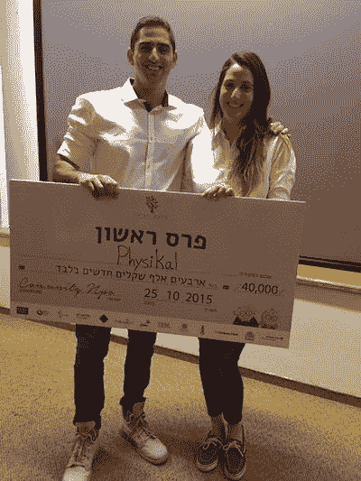
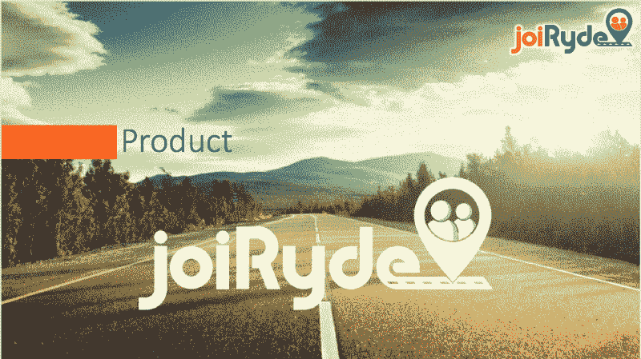
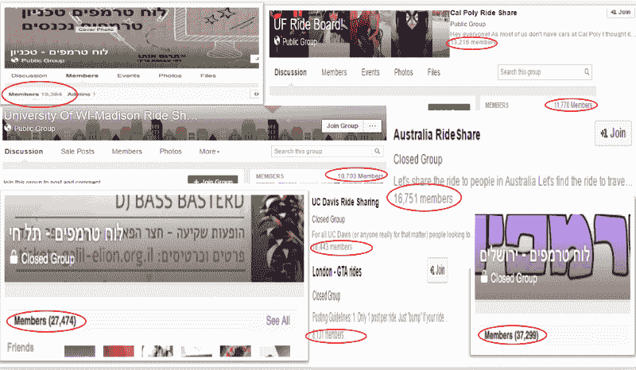
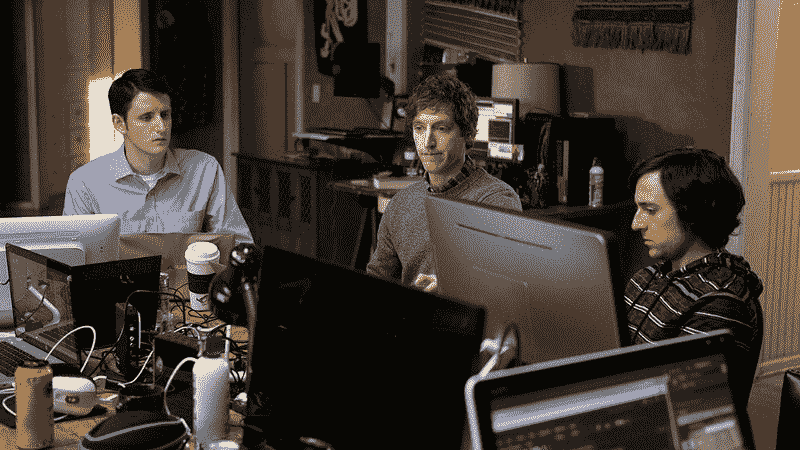
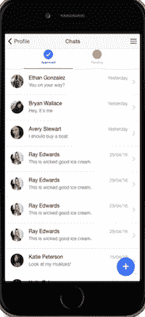
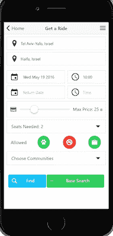

# 我把我的第一个创业公司烧成了灰烬。这里有一些惨痛的教训。

> 原文：<https://www.freecodecamp.org/news/i-burned-my-first-start-up-to-the-ground-here-are-some-hard-lessons-learned-ecf17c642534/>

奥马尔·戈德堡

# 我把我的第一个创业公司烧成了灰烬。这里有一些惨痛的教训。

我的第一家创业公司陷入困境已经将近 12 个月了。我将告诉你这一切是如何发生的，希望我的错误——以及我从这些错误中学到的见解——能在你自己的创业冒险中帮助你。

在你阅读这篇汽油浸透的故事之前，请知道我现在过得很好。我刚刚从 Y Combinator 的创业学校毕业，创办了一家名为 Mindflow.ai 的新公司。你可以在 GitHub 上查看 [Mindflow.ai，在](https://github.com/Arieg419/Mindflow.ai)[上注册我们的 Alpha 版本](http://mindflowai.com)。

所以，事不宜迟，这里有一些惨痛的教训。

> “制造人们想要的东西”—保罗·格拉厄姆

在着手建立我的第一家公司之前，我是一个经常性的应用开发者和黑客马拉松参与者。我喜欢用软件将想法“实现”的冲动。我建得越多，学到的就越多。在建立了几个项目之后，我开始觉得只要有足够的决心、耐心和毅力，几乎任何事情都是可能的。

Me and my sister winning 1st place at summer-long hackathon.

但是从事辅助项目和构建原型已经不够了！我渴望建造一些真正实用的东西。我想体验创建软件，真正为人们解决问题，最好是大规模的。 ***我想建一个公司*** **。**

作为一名来自特拉维夫的在 Technion(海法，100 多公里外)学习的大学生，我想解决的问题很清楚。交通工具！通勤是一个棘手的问题，找到往返校园的方法总是一个物流问题。

### 驾偷来的车乱开

Our nifty splash page

以色列的公共交通因低劣和周末稀少而臭名昭著。为了解决这个问题，学生们成立了拼车脸书小组。基本上，一个学生会张贴他的起始和最终目的地以及出发时间。想要加入的学生可以通过脸书、WhatsApp 或短信联系，协调接车事宜，并分担汽油费用。

这些脸书团体可能会变得相当大，并且经常协调一次乘坐是一件令人头痛的事情。搜索相关的帖子，记得带上确切的现金，在敲定乘车细节之前与几位司机交谈，这些只是协调乘车所需的几个步骤。

Ride share facebook groups around the world

即使增加了协调乘车的努力，拼车仍然是一种常见的解决方案。最终，这是一次比公共交通更顺畅的体验。

我想通过构建一个移动应用程序，为乘车搜索、协调和支付提供端到端的解决方案，让乘车共享体验变得更简单、更愉快。

### 招募团队

很自然地，我求助于我的黑客马拉松伙伴。经过几周的高级劝说策略后；我使他们相信这项事业是有价值的。

我们是一个三人小组。我会担任 CEO，我的朋友是 CTO 和 CPO(首席产品官)。

我们都是从未开发过真正产品的开发人员。大家都离职了，我们这些当学生的(我！)搁置学业。我们看起来有点像这样:

### 早期错误

作为第一次创始人， ***我真的不相信这能行得通*** *。虽然我希望如此，但在我看来，最好的情况是校园里的人们会使用我们的应用。我最大的期望是在这个过程中学到很多东西，并和我的朋友们一起获得真实世界的经验。仅此一点就证明我有理由暂停学业。*

由于这种心态，许多本应被慎重考虑的决定都没有得到考虑。

尽管我们每个人都有自己的角色(CEO、CTO、CPO ),但我们并不尊重他们。每一个决定，无论是 API 设计、徽标还是登录流程，都是一场激烈的争论。

这不一定是件坏事。这甚至可以在一群热情的人身上预料到。每个人都有“最好”产品的愿景，这些愿景并不总是完全一致，这是很自然的。但是这些争论需要尽快解决，不能阻碍进步。

***创业公司不是民主国家。*** 当你有一个团队时，每个人都应该有一套职责， ***创始人需要互相信任*。对于给定的决定，表达你的意见是可以的。但归根结底，责任和权力应该落在一个人的肩上。**

### 最有价值球员

我们都听说过建立一个 MVP 来测试你的产品的重要性。在确认你的想法之前，千万不要进入全面开发模式！

尽管我们的初衷是好的，但我们的“MVP”是一款成熟的跨平台移动应用。特征的数量是荒谬的。

仔细想想，我可以举出几家公司，它们的功能比我们试图构建的要少。这很糟糕，原因有几个:

1.  我们的最后期限远得令人沮丧。在 MVP 工作之前，我们进行了将近 6 个月的核心开发。有趣的是，这个最后期限永远不会到来…
2.  我们单独编码，没有 ***真实的用户反馈。***
3.  我们*打磨了*这个应用程序，试图在让任何人看到我们在做什么之前完善它。真是浪费时间！

这里有一些我们正在做的事情的截图。回过头来看，这看起来并不像一个 MVP 应该有的样子。

In app chat for the MVP. Why?!

User profile with Facebook Graph API

Search for a ride

### 资金和加速器

该死，脸书的新闻传送算法真好。一个阳光明媚的早晨，当我在编码间隙浏览我的 feed 时，突然出现了一些奇怪的事情。运输和清洁能源加速器广告。他们为建立智能交通/清洁能源企业的企业家提供 10 万英镑的资助。

我们争论是否应该申请…毕竟，我们只是学生… 2 天和 3 个月之后，我们提交了一份申请表。

你瞧，我们被叫去面试了！

加速器面试周期是一个紧张的过程。我们准备了一页纸、执行摘要、宣传资料并做了市场调查。只是提醒一下，我们是 3 个完全没有业务开发经验的黑客。这个过程充满压力，凸显了团队成员之间方法的鲜明对比。

这个过程消耗了我的开发时间，但是它非常重要。研究和准备让我对我们正在建造的东西更有信心。此时，我们所有人都开始相信这将成为一家真正的公司。

几个星期后，我们被选中了！我们欣喜若狂。但随着加速器的选择，以及资金注入公司的承诺，事情变得更糟了。

我们作为一个团队的沟通恶化了，我们的问题被放大了。作为队友，我们超越了自己的界限，每个人都试图参与每一个做出的决定。这一点我们大家都很清楚。但是我们没有处理这些问题，而是选择压制它们。我们不希望一场潜在的丑陋对话扰乱我们的运气，或者让我们在投资者面前显得四分五裂。 ***男人，那是个错误。***

### 事情变得支离破碎

有了 10 万美元的资助，我们现在有了推动 MVP 的跑道。加速器提供了法律顾问，我们做的第一件事就是将 JoiRyde 注册为一家公司。这涉及到股票的分配。这不包括 ***签署*** 任何形式的授权协议。我强调签字，因为我们写了一份，但我们的新律师想修改它，并告诉我们不要签字。

因此，因为我们是平等的合伙人，没有授权协议，尽管我们的投资才进行了 7 个月，我们所有人都持有公司 33%的股份。这是公司的另一个致命错误*。*

*

How I wish our legal counsel would have reacted* 

*在经历了建立公司的繁文缛节之后，需要做出更多的决定，比如哪位创始人会和我一起在旧金山发布我们的 Alpha 版本。出于对相关人员的尊重，我将在这里跳过戏剧的细节。*

*我们对公司的未来看法不一致。商业决策是针对个人的。在这一点上造成的损害是不可逆转的。我们的一位创始人没有作为一个团队来解决我们之间的分歧，而是让我们的投资者参与进来。这标志着我们的投资者遇到了麻烦，他找到我，试图了解发生了什么。*

*在仔细考虑了这件事之后，我决定我们不能继续与这位有争议的创始人合作。在一个已经竞争激烈的市场中，我们的公司即将面临诸多挑战。如果他们在信任、沟通和愿景方面已经存在严重问题，那么随着公司的发展，这些问题肯定会成倍增长。*

### *试图找到中间立场*

*我们试图找到一个解决方案，向有问题的创始人提供补偿。*

*我们提供的股份相当于我们未签字但口头同意的创始人协议中所写的股份。 ***没有。****

*我们给了*比我们未签字但口头同意的创始人协议中写的更多的*股份。 ***没有。****

*这位有问题的创始人想在离开公司时拥有 33%的股份。从法律上讲，这是可能的，因为我们没有授权协议。 此时油门拉了出来(理直气壮地如此)。没有一个投资者会支持一个甚至还没有一个用户就陷入如此混乱的公司。旅程结束了。*

### ****回首****

*12 个月后，事情平息了下来。我已经回到了学校(完成了大三的学业)，启动了我目前的创业项目的 alpha 版本 [Mindflow.ai](https://arieg419.wixsite.com/mindflow) ，并于下个月开始在脸书进行软件工程实习。*

*虽然我的第一家公司没有像我计划的那样成功，但我学到了很多东西，并感谢我所拥有的经历。总结我旅程中的关键收获。*

1.  *了解你的创始人——这听起来太老套了。不要和不熟的人一起开公司！创办一家公司是 ***难、*** 难，你会经历一次情绪的过山车。在匆忙开公司之前，确保你们有一个共同的良好记录。*
2.  *保持精简 —弄清楚你的冒险范围，尽可能精简。有足够 3 个人做的工作吗？够两个人吃吗？有太多的创始人肯定会让你很早很快产生挫败感。*
3.  ***找到缺失的部分**——在建立一个精益团队时，每个创始人都应该拿出一套独特的技能。让三个创始人分享相似的技能没有多大意义。最好是，每个创始人都带来一些不同的和必要的东西。*
4.  ***船快，船常—** “嘘嘘……..我们进入隐形模式了！!"LOLZ。除非你正在研究一项突破性的专利，否则要尽早向人们展示你正在研究的东西。收集反馈，整合，发送，重复。*
5.  ***尽快解决法律问题**——准备暂停你的生活去创办你的公司？太好了！如果你已经决定这么做了，那就花时间和金钱来理清像创始人协议这样的基本问题。*这会拯救我们的公司。我从未想过事情会发展成这样。第二件事开始变得情绪化，剧本变化很快。在 s*#t 撞击风扇之前，将潜在的损害降至最低。**

### *走向*

*如果你觉得这很有帮助，请给它一个❤.你可以在 [Medium](https://medium.com/@omergoldberg) 、 [Linkedin](https://www.linkedin.com/in/omer-goldberg-680b40100/) 或 [Github](https://github.com/Arieg419) 上关注我，我会在那里发布科技/创业相关的东西。*