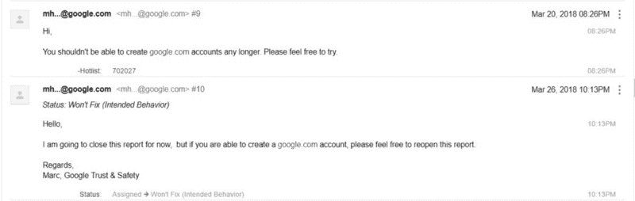
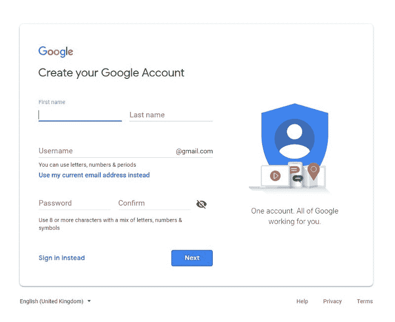
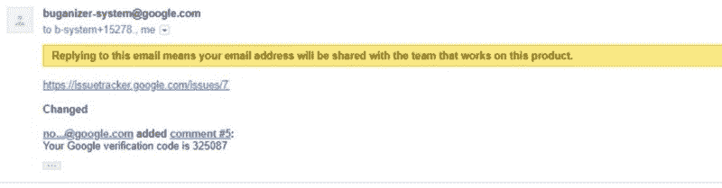
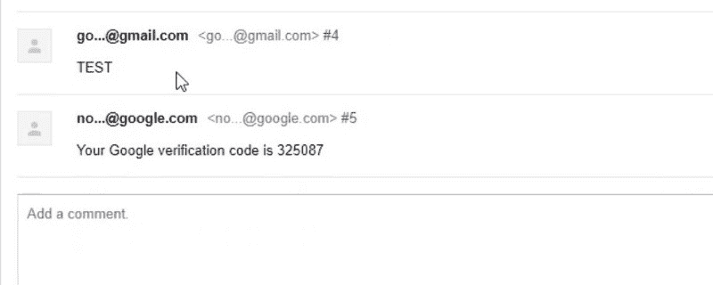
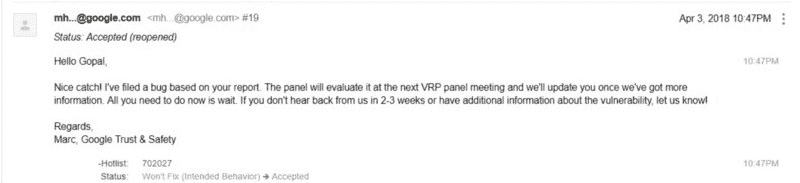
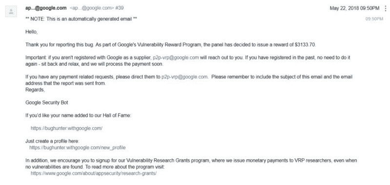

# 我绕过了“我如何为 15600 美元奖金黑进谷歌的 bug 跟踪系统本身。”以下是方法。

> 原文：<https://www.freecodecamp.org/news/i-bypassed-how-i-hacked-googles-bug-tracking-system-itself-for-15-600-in-bounties-here-s-how-3355c8c63955/>

作者戈帕尔·辛格

# 我绕过了“[我是如何黑掉谷歌的 bug 追踪系统本身来换取 15600 美元奖金的。](https://medium.freecodecamp.org/messing-with-the-google-buganizer-system-for-15-600-in-bounties-58f86cc9f9a5)“下面是方法。

Photo by [rawpixel](https://unsplash.com/photos/nMVK0udN0-o?utm_source=unsplash&utm_medium=referral&utm_content=creditCopyText) on [Unsplash](https://unsplash.com/search/photos/bug?utm_source=unsplash&utm_medium=referral&utm_content=creditCopyText)

大家好！

我读了一些文章，发现了一个我喜欢的 bug:[“获得一个谷歌员工账户](https://medium.freecodecamp.org/messing-with-the-google-buganizer-system-for-15-600-in-bounties-58f86cc9f9a5)”这是由[阿历克斯·比尔桑](https://www.freecodecamp.org/news/i-bypassed-how-i-hacked-googles-bug-tracking-system-itself-for-15-600-in-bounties-here-s-how-3355c8c63955/undefined)发现的。我开始测试问题跟踪器，并试图看看我是否能获得一个谷歌账户。然后查看问题跟踪器，我注意到在浏览组件中有两个公共问题跟踪器。于是我点击了安卓公共追踪器。

我可以在那里看到向 Android 报告的错误。要报告 Android 公共问题跟踪器中的错误，您可以发送电子邮件至:

**buganizer-system+***componentID***@ Google . com**

其中 android 的组件 id 是 190923。

我可以看到我的问题被列入公共问题跟踪。我收到了来自 buganizersystem+my_email@google.com 的确认邮件。对本邮件的回复将发送至:

**buganizer-system+***componentID**+**issueID***@ Google . com**

我回复了那封邮件，并在对话中发表了评论。我可以添加一个谷歌电子邮件，看看我是否能得到一个确认码。为了测试这一点，我在 Gmail 设置中点击了[转发和 POP/IMAP](https://mail.google.com/mail/u/0/#settings/fwdandpop) ，并将谷歌邮件添加到转发邮件地址中。我很惊讶地看到我在 Android 公共问题跟踪器中获得了一个确认码。

这里有两个部分来获得一个谷歌账户**注册**和**验证**。我可以验证 Google 帐户，但我无法注册@google.com 帐户，因此我的报告因无法修复而关闭。我几乎要放弃了，因为在初步修复后，我无法使用我的 google.com 电子邮件。但我决定再试一次。

然后，我开始访问谷歌的每个子域，看看我是否能使用 google.com 的电子邮件注册。这个新的注册页面出现了(见下文)。最初，我无法找到“使用我当前的电子邮件地址”来将它发送到[https://partnerissuetracker.corp.google.com/](https://partnerissuetracker.corp.google.com/)。然后你可以点击创建一个帐户，你可以看到有一个选项使用你目前的电子邮件地址。

看到新的注册页面后，我的心率加快了。我开始使用**buganizer-system+***componentID**+**issueID***@ Google . com**电子邮件注册，然后它要求我输入代码进行验证。

#### 验证您的电子邮件地址

我在等待对话中的验证码，然后我收到了电子邮件中的验证码和问题跟踪器中的对话。

成功注册谷歌账户后，我重新提出了这个问题。这里的影响是，你可以访问需要谷歌账户的 https://google.ridecell.com。除此之外，我试着把我的账户升级到 Gmail，因为我有一个谷歌账户。我把它添加到我的 Gmail 中，这样我就可以从**buganizer-system+***componentID**+**issueID***@ Google . com**发送电子邮件了

如果你试图欺骗 google.com 的电子邮件，你的邮件将会变成垃圾邮件。但我的电子邮件出现在收件箱里，而且是发自@google.com，这样攻击者就可以假装自己是谷歌的员工。

#### 接得好！

在我寻找 bug 的时候是晚上 9:50，终于，最期待的邮件到了:我得到了 **$3133.70** 。我整晚都睡不着。

观看此视频，了解更多信息:

感谢亚历克斯·比尔桑(Alex Birsan)没有他的报道，这是不可能的。我从阅读他的文章中学到了很多。此外，感谢[阿维纳什·贾恩](https://www.freecodecamp.org/news/i-bypassed-how-i-hacked-googles-bug-tracking-system-itself-for-15-600-in-bounties-here-s-how-3355c8c63955/undefined)和[亚历克斯·比尔桑](https://www.freecodecamp.org/news/i-bypassed-how-i-hacked-googles-bug-tracking-system-itself-for-15-600-in-bounties-here-s-how-3355c8c63955/undefined)抽出时间审阅草稿。

感谢阅读！

戈帕尔·辛格(【https://twitter.com/gopalsinghcse】T2)