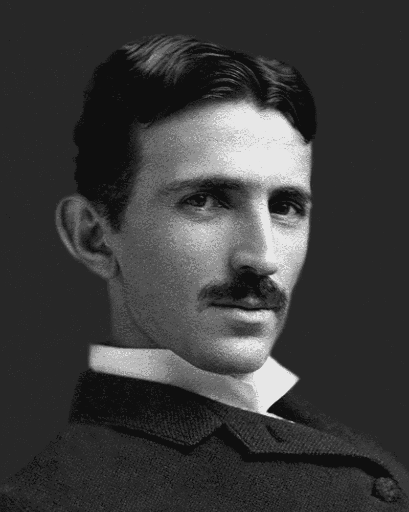

# 我和一个科技亿万富翁一起露营。他给我的建议是无价的。

> 原文：<https://www.freecodecamp.org/news/i-camped-out-with-a-tech-billionaire-the-advice-he-gave-me-was-priceless-c3bdcc29c068/>

作者:亚当·诺尔

# 我和一个科技亿万富翁一起露营。他给我的建议是无价的。

我们围坐在一堆小篝火旁，透过寒冷的加州空气，仰望耀眼的星空。

我和我的朋友开始和这个团体的一个成员交谈。我不知道他是谁，但我立刻觉得他很有趣。

这个男人引导我们的谈话，从教育到设计，再到创新中的意外收获。

后来我才知道，这个人是我们大多数人每天都在使用的技术的发明者，他是一个白手起家的亿万富翁。

不过，我从没想到会这样。他谦逊、善良、风趣。

这个人对历史有着深刻而全面的见解。他对技术在社会中的作用有强烈的看法。他雄辩地分享了他的想法，就像他在做 TED 演讲一样。

他在那个星夜说的话给我留下了不可磨灭的印象。他分享的价值观改变了我。现在我想和你们分享这些价值观。

### 价值#1:拥抱变化

他告诉我，很多人在事业上过于保守。

通常年轻人——尤其是那些赚大钱的人——害怕改变行业、角色、公司、城市、组织结构或职业道路。

人们错过了有价值的机会，因为他们对失败的恐惧使他们看不到潜在的好处。

这让我想起了我在谷歌的许多前同事，他们有创业的想法，但不愿意冒险。

他的建议是“拥抱变化，并对此感到舒适。我们今天使用的许多技术在未来都会被抛弃，这没关系。”

> 做你希望世界发生的变化。—圣雄**甘地**

### 价值#2:创造新市场，而不仅仅是新产品

他观察到，大多数人只专注于开发新产品、应用程序或软件。相反，他们应该着眼于创造前所未有的新市场。

想象未来会有什么样的市场，并问为什么它们还不存在。利用现有的技术趋势来推动未来的想法，从而催生新的产业。

他观察到“最有价值的公司和想法会催生全新的行业。”

> *“礼物是他们的；我真正为之努力的未来是我的。”—尼古拉·特斯拉*

### 价值#3:拥抱终身学习

在教育这个话题上，有一点他很清楚:无论你做什么，你都可以做得更好。

他鼓励我阅读、旅行、练习听力、快速失败、参与世界、拥抱多样性并磨练我的技艺。"挑战自己，学习各种各样的技能，并在这个过程中获得乐趣."

“学习一门计算机语言——或者另一门口语——成为专家，”他说。"不要为了学习而学习，要学会掌握."

> "智力的发展应该从出生开始，只有在死亡时才停止."——阿尔伯特·爱因斯坦

### 价值#4:投资于未来重视的技能

他观察到，如果你想成功，你需要开始攒下两样东西:钱和时间。然后你就可以用这些资源去投资未来会珍惜的技能和技术。投资于从现在起十年或更久后会增值的人、概念和行业。

为了更好的明天，他说:“建设未来，发展对人类有真正的、可扩展的、可证明的影响的想法。”

> 没有人会注意到发生了什么；人们只能看到还有什么要做。我被告知前进的道路既不快速也不容易。”玛丽·居里

野营旅行回来后，我思考如何在我创办的公司 [Pennybox](https://pennybox.com/) 成为一名更好的领导者。

虽然他的许多观点是针对他一生中的许多成功的，但我想我可以如何应用它们来改善我的团队和我们的用户。

我把他的价值观列表贴在了我父母家的车库门上，那里现在成了我们的临时办公室。

想象一下这样一个世界:人们拥抱变化，努力创造新市场，永不停止学习，并不断投资于未来技能。这就是我想要生活的世界。

我希望在一个星光灿烂的夜晚，我能遇到一群围着篝火的企业家，我也能把这些价值观传递给下一代。

*感谢阅读。在开发新技术帮助孩子和家庭掌握财务知识的过程中，我会尽最大努力听取这些建议。如果你对这项事业感兴趣，你可以进入 **[这里](https://goo.gl/Cag2Lm)** 。*