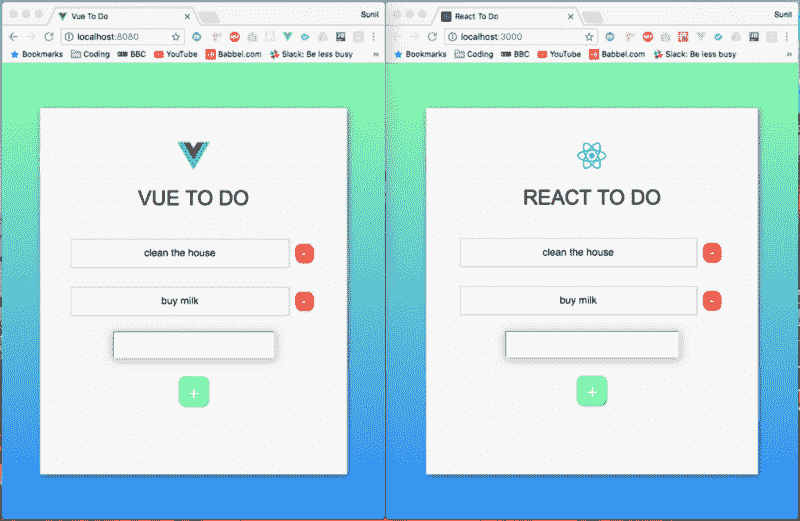
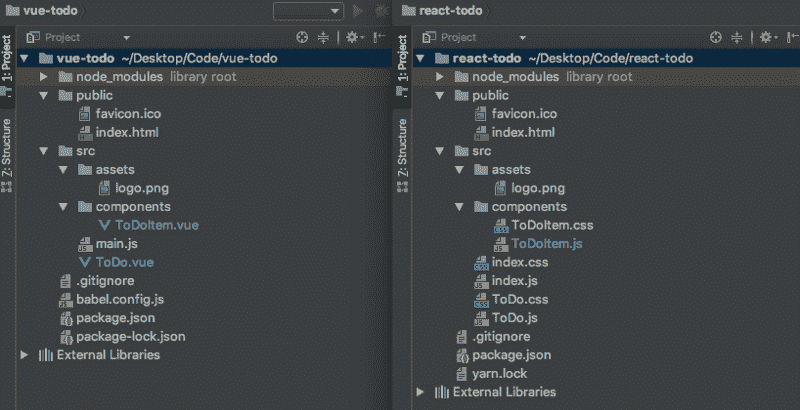
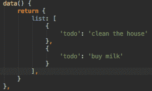
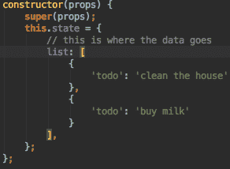

# 我在 React 和 Vue 中创建了相同的应用程序。以下是不同之处。

> 原文：<https://www.freecodecamp.org/news/i-created-the-same-app-in-react-and-vue-here-are-the-differences-67e71421df31/>

苏尼尔·桑德胡

# 我在 React 和 Vue 中创建了相同的应用程序。以下是不同之处。

在我目前的工作场所使用过 **Vue** 之后，我对它的工作原理有了一个相当坚实的理解。然而，我很好奇栅栏另一边的草是什么样的——这种情况下的草会有什么反应。

我读了 React 文档，看了几个教程视频，虽然它们都很棒，但我真正想知道的是 React 和 T2 Vue 和 T3 有什么不同。

我说的“不同”并不是指他们是否都有虚拟 DOMS 或者他们如何渲染页面。我希望有人花时间解释代码，并告诉我发生了什么！我想找一篇花时间解释这些差异的文章，以便刚接触过 **Vue** 或 **React** (或整个 Web 开发)的人能够更好地理解两者之间的差异。

但是我找不到任何解决这个问题的方法。所以我意识到我必须自己动手做这个来看看相似和不同之处。在这样做的时候，我想我应该记录下整个过程，这样一篇关于这个问题的文章就会最终存在。


Who wore it better?

我决定尝试构建一个相当标准的待办事项应用程序，允许用户在列表中添加和删除项目。这两款应用都是使用默认的**CLI**构建的( **React** 使用 **create-react-app** ，而 **Vue** 使用 **vue-cli** )。*顺便说一下*CLI 代表命令行界面。？

#### 无论如何，这个介绍已经比我预期的要长了。因此，让我们先来快速了解一下这两款应用的外观:



Vue vs React: The Irresistible Force meets The Immovable Object

两个应用程序的 CSS 代码完全相同，但它们的位置有所不同。记住这一点，接下来让我们看看这两个应用程序的文件结构:



Who wore it better?

你会发现它们的结构也几乎相同。这里唯一的区别是 React 应用有三个 CSS 文件，而 Vue 应用没有。这是因为，在 create-react-app 中，**React 组件将有一个附带的文件来保存其样式，而 Vue CLI 采用一种无所不包的方法，在实际的组件文件**中声明样式。

最终，它们都实现了同样的事情，没有什么可以说你不能继续在 React 或 Vue 中构造不同的 CSS。这实际上是个人偏好的问题——你会从开发社区听到很多关于 CSS 应该如何构造的讨论。现在，我们将遵循两个 CLI 中的结构。

但是在我们继续之前，让我们快速看一下典型的 Vue 组件和 React 组件是什么样子的:


Vue on the left. React on the right

现在，让我们进入本质的细节！

### 我们如何改变数据？

但是首先，我们所说的“变异数据”是什么意思？听起来有点专业，不是吗？它基本上只是意味着改变我们已经存储的数据。所以，如果我们想把一个人的名字从约翰改成马克，我们就要“改变数据”。

这就是 React 和 Vue 的关键区别所在。Vue 本质上创建了一个数据对象，可以自由地更新数据，而 React 创建了一个状态对象，执行更新需要更多的跑腿工作。

现在，React 以很好的理由实现了额外的跑腿工作，我们稍后将对此进行深入探讨。但是首先，让我们来看看来自 Vue 的**数据**对象和来自 React 的**状态**对象:



Vue data object on the left. React state object on the right.

因此，您可以看到，我们将相同的数据传递给了两者，只是它们的标签不同。因此，将初始数据传递到我们的组件中是非常非常相似的。但是正如我们提到的，我们如何着手改变这些数据在不同的框架中是不同的。

假设我们有一个名为`**name: ‘Sunil’**`的数据元素。

在 Vue 中，我们通过调用 **`this.name`** 来引用这个。我们也可以通过调用`**this.name** **= ‘John’**`来更新它。这会把我的名字改成约翰。我不确定我被叫做约翰是什么感觉，但是嘿，事情发生了！？

在 React 中，我们将通过调用`**this.state.name**`来引用相同的数据。现在这里的关键区别是，我们不能简单地写`**this.state.name** = ‘John’`，因为 React 有适当的限制来防止这种容易的、无忧无虑的变异。所以在 React 中，我们会按照`**this.setState({name: ‘John’})**`的思路写一些东西。

虽然这基本上与我们在 Vue 中实现的一样，但额外的编写是存在的，因为 Vue 基本上在默认情况下每当有数据更新时都会组合自己的 setState 版本。

简而言之， **React 需要 setState，然后是其中的更新数据，而 Vue 假设如果您正在更新数据对象**中的值，您会希望这样做。

为什么 React 会为此烦恼，为什么需要 setState？让我们把这个交给 [Revanth Kumar](https://medium.com/@revanth0212) 来解释:

> 这是因为 React 希望在状态发生变化时重新运行某些生命周期挂钩，[如] componentWillReceiveProps、shouldComponentUpdate、componentWillUpdate、render、componentDidUpdate。当您调用 setState 函数时，它会知道状态已经改变。如果您直接改变状态，React 将不得不做更多的工作来跟踪变化以及运行什么生命周期挂钩等等。所以为了简单起见，React 使用 setState。


Bean knew best

现在我们已经有了一些变化，让我们来看看如何在我们的待办事项应用中添加新的项目。

### 我们如何创建新的待办事项？

#### 反应:

```
createNewToDoItem = () => {
    this.setState( ({ list, todo }) => ({
      list: [
          ...list,
        {
          todo
        }
      ],
      todo: ''
    })
  );
};
```

#### React 是怎么做到的？

在 React 中，我们的输入字段有一个名为 **value 的属性。**这个值通过使用几个函数自动更新，这些函数结合在一起创建了一个非常类似于**双向绑定的东西**(如果你以前从未听说过这个，在这之后的*Vue 是如何做的*部分有更详细的解释)。我们通过将一个额外的 **onChange 事件监听器**附加到**输入**字段来创建这种形式的双向绑定。

让我们快速看一下**输入**字段，这样您就可以看到发生了什么:

```
<input type="text" 
       value={this.state.todo} 
       onChange={this.handleInput}/>
```

每当输入字段的值发生变化时，就会运行 handleInput 函数。它通过将状态对象中的 **todo** 设置为输入字段中的内容来更新它。这个函数看起来像这样:

```
handleInput = e => {
  this.setState({
    todo: e.target.value
  });
};
```

现在，每当用户按下页面上的 **+** 按钮来添加新项目时，`**createNewToDoItem**` 函数实际上运行 this.setState 并传递给它一个函数。

这个函数有两个参数，第一个是来自状态对象的整个`**list**` 数组，第二个是`**todo**` (由`**handleInput**`函数更新)。该函数然后返回一个新对象，它包含之前的整个`**list**`，然后在它的末尾添加`**todo**` 。整个列表是通过使用一个 spread 操作符添加的(如果您以前没有见过这个，请使用 Google 这是 ES6 语法)。

最后，我们将`**todo**` 设置为空字符串，这将自动更新**输入**字段中的**值**。

#### Vue:

```
createNewToDoItem() {
    this.list.push(
        {
            'todo': this.todo
        }
    );
    this.todo = '';
}
```

#### Vue 是怎么做到的？

在 Vue 中，我们的**输入**字段有一个句柄叫做 **v-model** 。这允许我们做一些被称为**的双向绑定**。让我们快速查看一下我们的输入字段，然后我们将解释这是怎么回事:

```
<input type="text" v-model="todo"/>
```

V-Model 将这个字段的输入与我们的数据对象 toDoItem 中的一个键联系起来。当页面加载时，我们将`**toDoItem**`设置为空字符串，比如:`**todo: ‘’**`。如果这里已经有了一些数据，比如`**todo: ‘add some text here’**`，我们的输入字段将加载*在这里添加一些文本*已经在输入字段内。

无论如何，回到空字符串，我们在输入字段中输入的任何文本都会绑定到`**todo**`的值。这实际上是双向绑定(输入字段可以更新数据对象，数据对象可以更新输入字段)。

所以回头看看前面的`**createNewToDoItem()**` 代码块，我们看到我们将`**todo**` 的内容推入`**list**` 数组，然后将`**todo**` 更新为空字符串。

### 我们如何从列表中删除？

#### 反应:

```
deleteItem = indexToDelete => {
    this.setState(({ list }) => ({
      list: list.filter((toDo, index) => index !== indexToDelete)
    }));
};
```

#### React 是怎么做到的？

因此，虽然 deleteItem 函数位于 **ToDo.js** 内部，但我可以很容易地在 **ToDoItem.js** 内部引用它，方法是首先将`**deleteItem()**` 函数作为道具传递给`**<ToDoIte**` m/ >:

```
<ToDoItem deleteItem={this.deleteItem.bind(this, key)}/>
```

这将向下传递函数，使其可被孩子访问。在这里你会看到我们还绑定了`**this**`并传递了 key 参数，因为 key 是函数用来区分点击时我们试图删除哪个 **ToDoItem** 的。然后，在 **ToDoItem** 组件中，我们执行以下操作:

```
<div className=”ToDoItem-Delete” onClick={this.props.deleteItem}>-</div>
```

要引用父组件中的函数，我所要做的就是引用`**this.props.deleteItem**`。

#### Vue:

```
onDeleteItem(todo){
  this.list = this.list.filter(item => item !== todo);
}
```

#### Vue 是怎么做到的？

在 Vue 中需要一种稍微不同的方法。我们必须做三件事:

首先，在我们想要调用函数的元素上:

```
<div class=”ToDoItem-Delete” @click=”deleteItem(todo)”>-</div>
```

然后，我们必须创建一个 emit 函数作为子组件内部的方法(在本例中为 **ToDoItem.vue** )，如下所示:

```
deleteItem(todo) {
    this.$emit('delete', todo)
}
```

与此同时，你会注意到当我们在 **ToDo.vue** 内添加 **ToDoItem.vue** 时，我们实际上引用了一个**函数**:

```
<ToDoItem v-for="todo in list" 
          :todo="todo" 
          @delete="onDeleteItem" // <-- this :)
          :key="todo.id" />
```

这就是所谓的**定制事件监听器**。它监听任何使用字符串`‘delete’`触发发射的情况。如果它听到这个，就会触发一个叫做`**onDeleteItem**`的功能。这个函数位于 **ToDo.vue，**中，而不是 **ToDoItem.vue** 中。正如我们前面讨论的，它只是过滤了**`**data**`**对象**中的`**todo**` **数组**，以移除被点击的项目。**

**这里值得注意的是，在 Vue 示例中，我可以简单地在`**@click**`侦听器中编写`**$emit**`部分，如下所示:**

```
`<div class=”ToDoItem-Delete” @click=”$emit(‘delete’, todo)”>-</div>`
```

**这会将步骤数从 3 个减少到 2 个，这完全取决于个人偏好。**

**简而言之，React 中的**子组件将通过** `**this.props**`访问父函数(假设您正在向下传递 props，这是相当标准的做法——您将在其他 React 示例中多次遇到这种情况)。另一方面，在 Vue 中，**你必须从子组件中发出事件，这些事件通常会在父组件**中收集。**

### **我们如何传递事件侦听器？**

#### **反应:**

**简单事件的事件监听器，比如点击事件，非常简单。以下是我们如何为创建新 ToDo 项目的按钮创建 click 事件的示例:**

```
`<div className=”ToDo-Add” onClick={this.createNewToDoItem}>+</div>.`
```

**这里非常简单，看起来很像我们如何用普通的 JS 处理一个内嵌的`onClick`。正如在 Vue 一节中提到的，每当按下 enter 按钮时，设置一个事件监听器来处理它要花一点时间。这实际上需要一个由输入标签处理的`onKeyPress`事件，如下所示:**

```
`<input type=”text” onKeyPress={this.handleKeyPress}/>.`
```

**每当该函数识别出按下了“enter”键时，就会触发`**createNewToDoItem**`函数，如下所示:**

```
`handleKeyPress = (e) => {
  if (e.key === ‘Enter’) {
    this.createNewToDoItem();
  }
};`
```

#### **Vue:**

**在 Vue 中，这是非常直接的。我们简单地使用 **@** 符号，然后是我们想要做的事件监听器的类型。例如，要添加一个点击事件监听器，我们可以编写如下代码:**

```
`<div class=”ToDo-Add” @click=”createNewToDoItem()”>+</div>`
```

**注:`**@click**` 其实是`**v-on:click**`的简写。Vue 事件监听器很酷的一点是，还有一堆东西你可以链接到它们上面，比如`.once`，它可以防止事件监听器被触发不止一次。在编写处理击键的特定事件侦听器时，也有许多快捷方式。**

**我发现，每当按下 enter 按钮时，在 React 中创建一个事件侦听器来创建新的 ToDo 项会花费相当长的时间。在 Vue 中，我可以简单地写下:**

```
`<input type=”text” v-on:keyup.enter=”createNewToDoItem”/>`
```

#### **我们如何将数据传递给子组件？**

#### **反应:**

**在 React 中，我们在创建子组件时将道具传递给子组件。比如:**

```
`<ToDoItem key={key} item={todo} />`
```

**这里我们看到两个道具被传递给了 **ToDoItem** 组件。从这一点开始，我们现在可以通过`**this.props**`在子组件中引用它们。因此，要访问`**item.todo**`道具，我们只需调用`**this.props.item**`。**

#### **Vue:**

**在 Vue 中，我们在创建子组件时将道具传递给子组件。比如:**

```
`<ToDoItem v-for="todo in list" 
            :todo="todo"
            :key="todo.id"
            @delete="onDeleteItem" />`
```

**完成后，我们将它们传递给子组件中的 props 数组，如下所示:`**props: [ ‘todo’ ]**`。然后可以在孩子中通过它们的名字引用它们——因此在我们的例子中是`**‘todo**’`。**

### **我们如何将数据发送回父组件？**

#### **反应:**

**我们首先将函数传递给子组件，在调用子组件的地方将它作为一个道具进行引用。然后，我们通过引用`**this.props.whateverTheFunctionIsCalled**`，以任何方式在子节点上添加函数调用，比如一个`**onClick**`。这将触发父组件中的函数。**

**我们可以在*“如何从列表中删除”一节中看到整个过程的示例。***

#### **Vue:**

**在我们的子组件中，我们只需编写一个函数，将值发送回父函数。在我们的父组件中，我们编写了一个函数来监听何时发出该值，然后触发一个函数调用。我们可以在*“如何从列表中删除”一节中看到整个过程的示例。***

### **我们做到了！？**

**我们已经了解了如何添加、删除和更改数据，如何以 props 的形式将数据从父节点传递到子节点，以及如何以事件侦听器的形式将数据从子节点发送到父节点。**

**当然，React 和 Vue 之间还有许多其他的小差异和怪癖，但是希望本文的内容有助于为理解这两个框架如何处理东西提供一点基础？**

**如果您觉得这很有用，请在社交媒体上分享并发表评论！**

#### **Github 链接到两个应用程序:**

**视图全部:https://github . com/sunil-sandhu/view-全部**

**反应 ToDo:[https://github.com/sunil-sandhu/react-todo](https://github.com/sunil-sandhu/react-todo)**

****这是 freeCodeCamp 与 [Javascript In Plain English](https://medium.com/javascript-in-plain-english) 合作的联合转贴。这篇文章的原始版本可以在这里找到[。](https://medium.com/javascript-in-plain-english/i-created-the-exact-same-app-in-react-and-vue-here-are-the-differences-e9a1ae8077fd)****