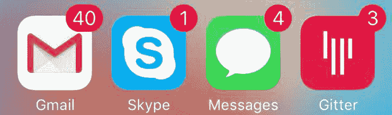

# 我控制时间。

> 原文：<https://www.freecodecamp.org/news/i-hack-time-6d3a32193c9/>

这些年来，我已经成为了某种程度上的时间专家。

我必须这样。

以下是我目前的日常职责:

*   为每月使用自由代码营的 25 万人提供支持
*   监督我们的[开源项目](https://github.com/FreeCodeCamp/freecodecamp)及其课程的扩展
*   编辑你在这个媒体出版物上读到的每一篇文章
*   抚养我的宝贝女儿

Obligatory baby photo: Jocelyn chilling in her running stroller.

我读过几十本关于效率的书，尝试过无数的时间管理策略。这些措施中的大部分都产生了微不足道的效益。

但是我今天跟大家分享的三个习惯是不一样的。多年来，我一直坚持使用这些方法。我把我的成功归功于他们。

最棒的是，你不需要改变生活方式。我并不是在告诉你停止饮酒或者在午休时开始冥想。

你可以立即养成这三个习惯，不需要任何成本。

### 习惯 1:如果你能在 2 分钟或更短的时间内完成某件事，那么现在就去做。

这个“两分钟规则”来自最著名的生产力书籍，大卫·艾伦的[把事情做完](http://amzn.to/2av7fsQ)。

如果有一个任务出现——而且这个任务不超过 2 分钟——那就去做，并且立即去做。

否则，将其添加到您的待办事项列表中。

这样做的原因是，你几乎总能抽出两分钟来处理一些事情。但是要花将近两分钟的时间来停止你正在做的事情，拿出你的手机，给你的待办事项列表添加一个任务，然后继续你正在做的事情。

关于待办事项列表，你绝对应该使用一个。整天在脑子里带着一份任务清单会耗尽你的认知储备。

你的待办事项列表越简单，你就越有可能使用它。在多年尝试新奇的生产力应用程序后，我现在只使用一个基本的文本编辑器，并根据优先级从上到下对项目进行排序。

有一件事你不会在我的任务清单上找到，那就是花不到两分钟的任务。我会立即处理这些问题，所以它们从来不会出现在我的清单上。

### 习惯 2:总是问自己——这种对话可以异步进行吗？

我过去常常在镇上跑来跑去，和人们见面喝咖啡，或者和他们一起坐在他们的办公室里。我一天最多能见十几个人。

没有什么可以替代面对面的交流。面部表情和肢体语言传达了很多信息，你的大脑会下意识地获取这些信息。

但是面对面的会议是昂贵的。你必须在日历上划出时间，通勤到一个公共空间。所有这些投资意味着会议往往会更长:30 分钟的咖啡约会，一小时的午餐，几小时的晚餐聚会。

视频会议解决了通勤问题，但留给你的是安排时间的歌舞表演。电话也有同样的问题，但是保真度更低。

因此，当你通过面对面的会议或视频会议了解某人之后，看看你是否可以将你的通信转移到异步工具:电子邮件、即时消息、GitHub 问题——无论你喜欢什么。

原因如下:

*   你不需要寻找你们都可以见面的时间(处理日历邀请和时区计算)
*   你有更多的时间来研究和自信地回应
*   互动更有效率，因为双方都被迫清楚地陈述自己的想法，你可以切入正题而不显得粗鲁

最重要的是，异步通信允许您将大部分通信批处理到一次会议中。你可以播放一些音乐，在几十个——对我来说是几百个——讨论中即兴演奏，没有从一个有时间限制的会议跳到下一个会议的压力。

自由代码营并不是唯一主要使用异步通信的组织:

*   GitHub 有一个很大程度上远程的团队，在那里异步通信不仅被接受——而且被鼓励。
*   automattic(Wordpress 公司)以通过 Skype 聊天对候选人进行面试而闻名，甚至在没有听到他们声音的情况下就聘用了他们。如果这就是你的工作方式，为什么不这样面试呢？

下次你打算安排一次会面时，问问自己一系列的电子邮件或短信是否足够了。通常会的。这将节省你们的时间和理智。

### 习惯 3:锻炼时听播客和有声读物

多重任务是一个有害的神话。这实际上只是快速的上下文切换，并且[被证明会降低性能](http://jupapadoc.startlogic.com/manuscripts/10498.pdf)。

但随后你会听到人们开玩笑说他们可以“一边走路一边说话”这当然是真的。

你的大脑一直在处理多重任务。它控制你的心率和呼吸。它调节你的荷尔蒙水平。它能防止你从椅子上掉下来。即使它在忙着做这些事情，你仍然可以很好地阅读这个句子。

当你在锻炼时，你的大脑会无意识地处理大部分关于如何移动身体和如何呼吸的决策。这让你的意识可以自由地做其他事情，比如过程语言。

如果你每周花几个小时锻炼——你应该这样做——你也可以利用这段时间听听播客和有声读物。

一周 5 小时乘以一年 50 周等于 250 小时的听力时间。这足以每年吸收大约 25 本书。

如果你以正常速度听的话。大多数播客应用程序让你以两倍的速度听，Audible 的应用程序甚至让你以三倍的速度听有声读物。

这听起来可能太快了。你的大脑真的能这么快处理信息吗？

人类的语言每分钟只有 150 个单词。大多数人每分钟可以阅读大约 300 个单词，大多数书虫每分钟可以阅读超过 450 个单词——相当于三倍速度的有声读物。

所以，是的，可能需要几个小时来适应这种速度，但几乎每个人都可以这样处理信息。

有些书不太适合音频格式，比如有很多代码片段和数学公式的书。但是大多数非小说类书籍在有声书格式下效果很好，并且可以在 Audible 上找到。

如果您还没有注册 Audible，您可以通过此链接免费获得两本有声读物:

[**可听免费试用【数字会员】**](http://amzn.to/2aNn5lq)
[*编辑说明* amzn.to](http://amzn.to/2aNn5lq)

如果你是播客新手，这里有一篇文章涵盖了收听播客的所有最佳工具。它还包括大量值得您花费时间的技术相关播客:

[**新程序员的最佳播客，以及聆听它们的最佳工具**](https://medium.freecodecamp.com/the-best-podcasts-for-new-coders-and-the-best-tools-for-listening-to-them-df393b1c8dc)
[*我对最近自由代码营/CodeNewbie 调查的结果有点惊讶。只有大约 26%的人学习…*medium.freecodecamp.com](https://medium.freecodecamp.com/the-best-podcasts-for-new-coders-and-the-best-tools-for-listening-to-them-df393b1c8dc)

### 最好是你能坚持的习惯

效率极高的人会做各种古怪的事情来节省时间。阿尔伯特·爱因斯坦和史蒂夫·乔布斯每天都穿一模一样的衣服，所以他们不用考虑自己想穿什么。

其他人以生产力的名义做出了巨大的牺牲。我现在正在听埃隆·马斯克的传记。他每周工作 100 个小时，在过去十年中只休过两周假。

我们大多数人都不愿意走这样的极端。但是我们都可以养成更好的习惯，比如我在这里分享的那些。我们所有人都可以利用这些习惯更有效地利用时间。

我们所有人都可以控制时间。

我只写编程和技术。如果你在推特上关注我，我不会浪费你的时间。？